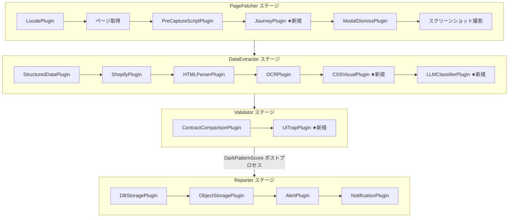
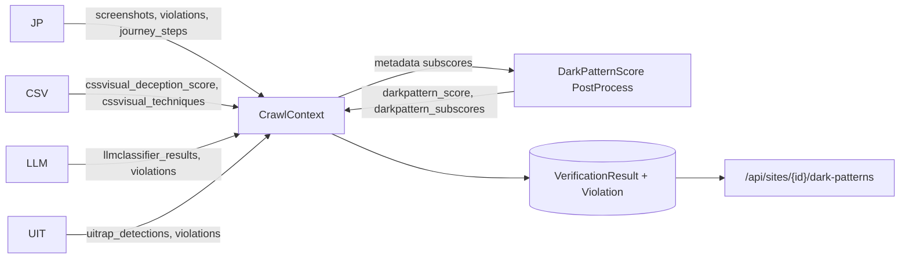

# Design Document: Advanced Dark Pattern Detection

## Overview

本設計は、CrawlPipeline に4つの新規プラグイン（CSSVisualPlugin, LLMClassifierPlugin, JourneyPlugin, UITrapPlugin）を統合し、高度なダークパターン検出機能を実現する。各プラグインは既存の `CrawlPlugin` ABC を継承し、`CrawlContext` を介してデータを受け渡す。

検出結果は **DarkPatternScore**（Max Pooling方式、0-1）として統合され、`VerificationResult` および `Violation` テーブルに永続化される。API エンドポイント（`/dark-patterns`, `/dark-patterns/history`）を通じてフロントエンドに公開する。

### 設計上の重要な制約（CTO Overrides）

| Override | 対象 | 制約内容 |
|----------|------|----------|
| RPC爆発禁止 | CSSVisualPlugin | 単一 `page.evaluate()` で全テキスト要素のスタイルを一括取得。要素ごとの `getComputedStyle` ループは厳禁 |
| Middle-Out Truncation | LLMClassifierPlugin | 上部20% + 下部30% を保持、中間50%を切り捨て。単純な先頭切り捨ては禁止 |
| DOM差分ノイズ排除 | JourneyPlugin | `locator` + `isVisible()` で可視要素のみトラッキング。生HTML差分は禁止 |
| ヒューリスティック・フォールバック | JourneyPlugin | `get_by_role` 等でセレクタ未発見時のフォールバック探索 |
| Max Pooling + ペナルティ | DarkPatternScore | `max(subscores)` 方式。未実行プラグインにはペナルティ 0.15 を加算。加重平均は禁止 |
| Hybrid Rule Engine | DynamicLLMValidatorPlugin | ルール追加は DB 登録のみ（Pythonファイル不要）。LLM as a Judge でコード変更ゼロ拡張 |
| TF-IDF廃止 → Dense Vector | Darksite検出 | `all-MiniLM-L6-v2`（384次元）セマンティック検索。テキストSpinningに無力なTF-IDFは全廃 |
| Fingerprint爆発防止 | ContentFingerprint | `is_canonical_product=True` のみ保存。`max_fingerprints_per_site=50`、TTL 90日 |
| CoT フィールド順序 | LLMJudgeVerdict | reasoning → evidence_text → confidence → compliant の順。結論を最後に出力させ推論精度を最大化 |
| Strict Mode 必須化 | LLMJudgeVerdict | 全フィールド Required、default 値禁止。LLM のフィールド欠落ハルシネーションを防止 |
| Fail-Fast バリデーション | DynamicRuleCreate | `{page_text}` 必須チェック。プロンプト登録時に欠落を即座に検出 |
| 二重挿入禁止 | _build_prompt | `{page_text}` replace 後の末尾追加を禁止。トークン制限突破とコスト2倍を防止 |
| 指数バックオフリトライ | LLM API 呼び出し | 最低3回リトライ（tenacity）。1回のエラーで passed=True を返す偽陰性を防止 |

## Architecture

### パイプラインステージ統合



### データフロー




## Components and Interfaces

### 1. CSSVisualPlugin（DataExtractor ステージ）

`page.evaluate()` 単一RPCでブラウザJS内の全テキスト要素のCSSプロパティを一括計算し、Python側で視覚的欺瞞を判定する。

```python
class CSSVisualPlugin(CrawlPlugin):
    """CSS/視覚階層による欺瞞検出プラグイン。
    
    🚨 CTO Override: 単一 page.evaluate() で全テキスト要素のスタイルを
    一括取得する。要素ごとの getComputedStyle ループは厳禁。
    """

    def should_run(self, ctx: CrawlContext) -> bool:
        """metadata に pagefetcher_page が存在する場合に True"""
        return ctx.metadata.get("pagefetcher_page") is not None

    async def execute(self, ctx: CrawlContext) -> CrawlContext:
        """単一 page.evaluate() でスタイル一括取得 → 欺瞞判定"""
        page = ctx.metadata["pagefetcher_page"]
        # 1回のRPCで全テキスト要素のスタイルをJSON配列として取得
        elements: list[dict] = await page.evaluate(BATCH_STYLE_JS)
        
        techniques = []
        for elem in elements:
            # 低コントラスト検出（閾値: 2.0:1）
            if self._is_low_contrast(elem):
                techniques.append(self._build_technique("low_contrast", elem))
            # フォントサイズ異常検出（主要価格の25%未満）
            if self._is_tiny_font(elem, elements):
                techniques.append(self._build_technique("tiny_font", elem))
            # CSS隠蔽検出
            if self._is_css_hidden(elem):
                techniques.append(self._build_technique("css_hidden", elem))
        
        score = self._calculate_deception_score(techniques)
        ctx.metadata["cssvisual_deception_score"] = score
        ctx.metadata["cssvisual_techniques"] = techniques
        # violations / evidence_records への追加
        self._add_violations(ctx, techniques)
        return ctx

    @staticmethod
    def relative_luminance(r: int, g: int, b: int) -> float:
        """WCAG 2.0 相対輝度計算（sRGBガンマ補正適用）"""
        ...

    @staticmethod
    def contrast_ratio(fg: tuple, bg: tuple) -> float:
        """(L1 + 0.05) / (L2 + 0.05) でコントラスト比算出"""
        ...
```

**BATCH_STYLE_JS** — ブラウザ内で実行されるJavaScript:

```javascript
// 単一 page.evaluate() で全テキスト要素のスタイルを一括計算
() => {
    const results = [];
    const walker = document.createTreeWalker(
        document.body, NodeFilter.SHOW_ELEMENT
    );
    while (walker.nextNode()) {
        const el = walker.currentNode;
        if (el.innerText && el.innerText.trim().length > 0
            && el.children.length === 0) {
            const style = window.getComputedStyle(el);
            results.push({
                selector: /* CSS path */,
                text: el.innerText.trim().substring(0, 200),
                color: style.color,
                backgroundColor: style.backgroundColor,
                fontSize: parseFloat(style.fontSize),
                display: style.display,
                visibility: style.visibility,
                opacity: parseFloat(style.opacity),
                overflow: style.overflow,
                position: style.position,
                left: parseFloat(style.left) || 0,
                top: parseFloat(style.top) || 0,
            });
        }
    }
    return results;
}
```

### 2. LLMClassifierPlugin（DataExtractor ステージ）

```python
class LLMClassifierPlugin(CrawlPlugin):
    """LLMセマンティック分類プラグイン。
    
    🚨 CTO Override: Middle-Out Truncation — 上部20% + 下部30% を保持。
    🚨 CTO Override: CoT フィールド順序 — reasoning → evidence → confidence → compliant。
    🚨 CTO Override: 指数バックオフ3回リトライ必須。
    🚨 CTO Override: 二重挿入（Double Injection）禁止。
    """

    async def execute(self, ctx: CrawlContext) -> CrawlContext:
        text = self._extract_text(ctx)  # HTMLタグパージ済み
        truncated = middle_out_truncate(text, max_tokens)
        
        results = []
        call_count = 0
        for chunk in self._split_chunks(truncated):
            if call_count >= max_calls:
                ctx.metadata["llmclassifier_calls_limited"] = True
                break
            result = await self._call_llm_with_retry(chunk, ctx.screenshots)
            results.append(result)
            call_count += 1
        
        ctx.metadata["llmclassifier_results"] = results
        self._add_violations(ctx, results)
        return ctx


class LLMJudgeVerdict(BaseModel):
    """🚨 CTO Override: Chain of Thought 誘発フィールド順序。
    全フィールド必須（default 値禁止、Strict Mode 対応）。"""
    reasoning: str       # 1. 推論プロセス
    evidence_text: str   # 2. 証拠抽出（なければ '該当なし'）
    confidence: float    # 3. 確信度 (0.0-1.0)
    compliant: bool      # 4. 最終結論


def _build_prompt(template, page_text, contract, url):
    """🚨 CTO Override: 二重挿入禁止。{page_text} replace のみ。"""
    truncated = middle_out_truncate(page_text, max_chars)
    prompt = template
    if "{page_text}" in prompt:
        prompt = prompt.replace("{page_text}", truncated)
    else:
        prompt = f"{prompt}\n\n--- ページコンテンツ ---\n{truncated}"
    prompt = prompt.replace("{contract_terms}", json.dumps(contract))
    prompt = prompt.replace("{site_url}", url)
    return prompt  # 二重挿入排除


def middle_out_truncate(text: str, max_tokens: int) -> str:
    """Middle-Out Truncation アルゴリズム。
    
    上部20%（ヘッダー・価格表示）+ 下部30%（フッター・解約条件）を
    優先保持し、中間50%を切り捨てる。
    切り詰め箇所には '[...中略...]' マーカーを挿入する。
    
    🚨 CTO Override: 単純な先頭切り捨ては厳禁。
    """
    if len(text) <= max_tokens:
        return text
    top_ratio, bottom_ratio = 0.20, 0.30
    top_len = int(max_tokens * top_ratio)
    bottom_len = int(max_tokens * bottom_ratio)
    return text[:top_len] + "\n[...中略...]\n" + text[-bottom_len:]


def strip_html_tags(html: str) -> str:
    """HTMLタグをパージして純粋テキストノードを抽出。
    <script>, <style>, <noscript> は除外。"""
    ...
```

### 3. JourneyPlugin（PageFetcher ステージ）

```python
class JourneyPlugin(CrawlPlugin):
    """ユーザージャーニーキャプチャプラグイン。
    
    🚨 CTO Override 1: locator + isVisible() で可視要素のみトラッキング。
    🚨 CTO Override 2: get_by_role ヒューリスティック・フォールバック。
    """

    def should_run(self, ctx: CrawlContext) -> bool:
        config = (ctx.site.plugin_config or {}).get("JourneyPlugin", {})
        return bool(config.get("journey_script"))

    async def execute(self, ctx: CrawlContext) -> CrawlContext:
        page = ctx.metadata["pagefetcher_page"]
        script = self._parse_journey_script(config)
        
        step_results = []
        for step in script:
            before_snapshot = await self._capture_visible_snapshot(page)
            await self._execute_step(page, step)
            after_snapshot = await self._capture_visible_snapshot(page)
            
            violations = self._evaluate_assertions(
                step, before_snapshot, after_snapshot, page
            )
            step_results.append({...})
            ctx.violations.extend(violations)
        
        ctx.metadata["journey_steps"] = step_results
        return ctx

    async def _capture_visible_snapshot(self, page) -> dict:
        """locator + isVisible() で可視要素のスナップショットを取得。
        生HTML差分は使用しない。"""
        ...

    async def _execute_step(self, page, step: dict) -> None:
        """ステップ実行。セレクタ未発見時は get_by_role フォールバック。"""
        try:
            await page.click(step["selector"])
        except Exception:
            # 🚨 CTO Override: ヒューリスティック・フォールバック
            fallback = self._get_role_fallback(page, step)
            await fallback.click()

    def _get_role_fallback(self, page, step: dict):
        """get_by_role 等でヒューリスティック探索"""
        if step["step"] == "add_to_cart":
            return page.get_by_role(
                "button", name=re.compile("カート|追加|add.*cart", re.IGNORECASE)
            )
        ...


def parse_journey_script(raw: Any) -> list[dict]:
    """JourneyScript JSON をパースしてステップリストに変換。"""
    ...

def serialize_journey_script(steps: list[dict]) -> str:
    """ステップリストを JSON にシリアライズ（ラウンドトリップ対応）。"""
    ...
```

### 4. UITrapPlugin（Validator ステージ）

```python
class UITrapPlugin(CrawlPlugin):
    """UI/UXトラップ検出プラグイン。"""

    # コンファームシェイミングパターン辞書（日本語 + 英語）
    CONFIRMSHAMING_PATTERNS_JA = [
        re.compile(r"^いいえ.*(?:したくない|不要|必要ない)", re.IGNORECASE),
        re.compile(r"(?:チャンスを逃す|後悔|損する)", re.IGNORECASE),
    ]
    CONFIRMSHAMING_PATTERNS_EN = [
        re.compile(r"^no\b.*(?:don'?t want|not interested)", re.IGNORECASE),
        re.compile(r"(?:miss out|regret|lose)", re.IGNORECASE),
    ]

    def should_run(self, ctx: CrawlContext) -> bool:
        return (ctx.html_content is not None
                and ctx.metadata.get("pagefetcher_page") is not None)

    async def execute(self, ctx: CrawlContext) -> CrawlContext:
        page = ctx.metadata["pagefetcher_page"]
        detections = []
        
        # 1. 事前チェック済みチェックボックス検出
        detections.extend(await self._detect_preselected_checkboxes(page))
        # 2. デフォルト定期購入ラジオボタン検出
        detections.extend(await self._detect_default_subscription_radios(page))
        # 3. 解約条件DOM距離検出
        detections.extend(await self._detect_distant_cancellation(page))
        # 4. コンファームシェイミング検出
        detections.extend(await self._detect_confirmshaming(page))
        
        ctx.metadata["uitrap_detections"] = detections
        self._add_violations(ctx, detections)
        return ctx
```

### 5. DarkPatternScore ポストプロセス

```python
def compute_dark_pattern_score(ctx: CrawlContext) -> CrawlContext:
    """Max Pooling + ペナルティベースラインによるスコア算出。
    
    🚨 CTO Override: 加重平均は禁止。
    未実行プラグインにはペナルティベースライン（デフォルト 0.15）を加算。
    """
    penalty = float(os.environ.get("DARK_PATTERN_PENALTY_BASELINE", "0.15"))
    threshold = float(os.environ.get("DARK_PATTERN_SCORE_THRESHOLD", "0.6"))
    
    subscores = {}
    plugin_keys = {
        "css_visual": "cssvisual_deception_score",
        "llm_classifier": "llmclassifier_results",
        "journey": "journey_steps",
        "ui_trap": "uitrap_detections",
    }
    
    executed_plugins = set()
    for stage_info in ctx.metadata.get("pipeline_stages", {}).values():
        executed_plugins.update(stage_info.get("executed_plugins", []))
    
    for key, meta_key in plugin_keys.items():
        if _plugin_was_executed(key, executed_plugins):
            subscores[key] = _extract_subscore(key, ctx.metadata)
        else:
            subscores[key] = penalty  # 未実行ペナルティ
    
    # Max Pooling: 全サブスコアの最大値
    score = max(subscores.values()) if subscores else 0.0
    score = min(max(score, 0.0), 1.0)  # clamp to [0, 1]
    
    ctx.metadata["darkpattern_score"] = score
    ctx.metadata["darkpattern_subscores"] = subscores
    
    if score >= threshold:
        ctx.violations.append({
            "violation_type": "high_dark_pattern_risk",
            "severity": "critical",
            "dark_pattern_category": "high_dark_pattern_risk",
            "score": score,
            "subscores": subscores,
        })
    
    return ctx
```


## Data Models

### VerificationResult テーブル拡張

既存の `VerificationResult` モデルに以下のカラムを追加する。全カラムは nullable で既存レコードに影響しない。

```python
# genai/src/models.py — VerificationResult に追加
class VerificationResult(Base):
    # ... 既存カラム ...
    
    # ダークパターン検出結果（Req 11）
    dark_pattern_score: Mapped[Optional[float]] = mapped_column(
        Float, nullable=True
    )
    dark_pattern_subscores: Mapped[Optional[dict]] = mapped_column(
        JSONB, nullable=True
    )  # {"css_visual": 0.3, "llm_classifier": 0.0, "journey": 0.15, "ui_trap": 0.7}
    dark_pattern_types: Mapped[Optional[dict]] = mapped_column(
        JSONB, nullable=True
    )  # ["sneak_into_basket", "confirmshaming", ...]
```

### Violation テーブル拡張

```python
class Violation(Base):
    # ... 既存カラム ...
    
    # ダークパターンカテゴリ（Req 11.4）
    dark_pattern_category: Mapped[Optional[str]] = mapped_column(
        String(50), nullable=True
    )
    # 有効値: visual_deception, hidden_subscription, sneak_into_basket,
    #         default_subscription, confirmshaming, distant_cancellation_terms,
    #         high_dark_pattern_risk
```

### Alembic マイグレーション

```python
# alembic/versions/xxx_add_dark_pattern_columns.py
def upgrade():
    op.add_column("verification_results",
        sa.Column("dark_pattern_score", sa.Float(), nullable=True))
    op.add_column("verification_results",
        sa.Column("dark_pattern_subscores", JSONB(), nullable=True))
    op.add_column("verification_results",
        sa.Column("dark_pattern_types", JSONB(), nullable=True))
    op.add_column("violations",
        sa.Column("dark_pattern_category", sa.String(50), nullable=True))

def downgrade():
    op.drop_column("violations", "dark_pattern_category")
    op.drop_column("verification_results", "dark_pattern_types")
    op.drop_column("verification_results", "dark_pattern_subscores")
    op.drop_column("verification_results", "dark_pattern_score")
```

### CrawlContext metadata キー規約

各プラグインは以下のプレフィックス付きキーで metadata に書き込む:

| プラグイン | metadata キー | 型 | 説明 |
|-----------|-------------|-----|------|
| CSSVisualPlugin | `cssvisual_deception_score` | `float` | 視覚的欺瞞スコア (0-1) |
| CSSVisualPlugin | `cssvisual_techniques` | `list[dict]` | 検出された欺瞞技法リスト |
| LLMClassifierPlugin | `llmclassifier_results` | `list[dict]` | LLM分類結果リスト |
| LLMClassifierPlugin | `llmclassifier_calls_limited` | `bool` | API呼び出し上限到達フラグ |
| LLMClassifierPlugin | `llmclassifier_token_usage` | `dict` | トークン使用量 |
| JourneyPlugin | `journey_steps` | `list[dict]` | 各ステップの実行結果 |
| JourneyPlugin | `journey_dom_diffs` | `list[dict]` | 可視要素差分 |
| UITrapPlugin | `uitrap_detections` | `list[dict]` | 検出されたUI/UXトラップ |
| DarkPatternScore | `darkpattern_score` | `float` | 統合スコア (0-1) |
| DarkPatternScore | `darkpattern_subscores` | `dict` | サブスコア内訳 |

### API エンドポイント

#### GET /api/sites/{site_id}/dark-patterns

最新のダークパターン検出結果を返却する。

```python
# genai/src/api/dark_patterns.py
router = APIRouter()

class DarkPatternResponse(BaseModel):
    dark_pattern_score: Optional[float]
    subscores: Optional[dict]  # {css_visual, llm_classifier, journey, ui_trap}
    detected_patterns: list[dict]  # [{type, evidence, severity}, ...]
    detected_at: Optional[datetime]

class DarkPatternHistoryResponse(BaseModel):
    results: list[DarkPatternResponse]
    total: int
    limit: int
    offset: int

@router.get("/sites/{site_id}/dark-patterns", response_model=DarkPatternResponse)
async def get_dark_patterns(site_id: int, db: Session = Depends(get_db)):
    site = db.query(MonitoringSite).filter_by(id=site_id).first()
    if not site:
        raise HTTPException(status_code=404, detail="Site not found")
    
    result = (db.query(VerificationResult)
              .filter_by(site_id=site_id)
              .order_by(VerificationResult.created_at.desc())
              .first())
    
    if not result or result.dark_pattern_score is None:
        return DarkPatternResponse(
            dark_pattern_score=None, subscores=None,
            detected_patterns=[], detected_at=None
        )
    
    patterns = _build_detected_patterns(result, db)
    return DarkPatternResponse(
        dark_pattern_score=result.dark_pattern_score,
        subscores=result.dark_pattern_subscores,
        detected_patterns=patterns,
        detected_at=result.created_at,
    )

@router.get("/sites/{site_id}/dark-patterns/history",
            response_model=DarkPatternHistoryResponse)
async def get_dark_pattern_history(
    site_id: int,
    limit: int = 50,
    offset: int = 0,
    db: Session = Depends(get_db),
):
    site = db.query(MonitoringSite).filter_by(id=site_id).first()
    if not site:
        raise HTTPException(status_code=404, detail="Site not found")
    
    query = (db.query(VerificationResult)
             .filter_by(site_id=site_id)
             .filter(VerificationResult.dark_pattern_score.isnot(None))
             .order_by(VerificationResult.created_at.desc()))
    total = query.count()
    results = query.offset(offset).limit(limit).all()
    
    return DarkPatternHistoryResponse(
        results=[_to_response(r, db) for r in results],
        total=total, limit=limit, offset=offset,
    )
```


### 6. DetectionRuleSet — 検出ルール動的拡張エンジン（Req 15）

加盟店の商品特性や契約条件の変更に応じて、コード変更なしに検出項目を追加・変更できるルールエンジン。

```python
# genai/src/pipeline/plugins/detection_rule_engine.py

from __future__ import annotations
import json
import logging
import os
import re
from typing import Any, Callable, Optional

logger = logging.getLogger(__name__)

# dark_pattern_type 有効値リスト（Req 16）
VALID_DARK_PATTERN_TYPES = frozenset({
    "visual_deception",
    "hidden_subscription",
    "sneak_into_basket",
    "default_subscription",
    "confirmshaming",
    "distant_cancellation_terms",
    "hidden_fees",
    "urgency_pattern",
    "price_manipulation",
    "misleading_ui",
    "other",
})


@dataclass
class DetectionRule:
    """個別の検出ルール定義。"""
    rule_id: str
    rule_type: str  # css_selector_exists, text_pattern_match, price_threshold, element_attribute_check, dom_distance, custom_evaluator
    target: str  # 検出対象（CSSセレクタ、テキストパターン等）
    condition: dict  # ルール固有の条件パラメータ
    severity: str  # critical, warning, info
    dark_pattern_category: str  # VALID_DARK_PATTERN_TYPES の値
    enabled: bool = True


def load_detection_rules(
    site_config: Optional[dict] = None,
    global_rules_path: Optional[str] = None,
) -> list[DetectionRule]:
    """グローバルルール + サイト固有ルールをマージして読み込む。

    マージ順序:
    1. DETECTION_RULES_PATH 環境変数のグローバルルール
    2. site.plugin_config["detection_rules"] のサイト固有ルール（上書き）
    """
    ...


def evaluate_rule(
    rule: DetectionRule,
    page: Any,  # Playwright Page (optional)
    html: str,
    ctx_metadata: dict,
) -> Optional[dict]:
    """単一ルールを評価し、違反があれば violation dict を返す。"""
    if not rule.enabled:
        return None

    evaluators = {
        "css_selector_exists": _eval_css_selector,
        "text_pattern_match": _eval_text_pattern,
        "price_threshold": _eval_price_threshold,
        "element_attribute_check": _eval_element_attribute,
        "dom_distance": _eval_dom_distance,
        "custom_evaluator": _eval_custom,
    }
    evaluator = evaluators.get(rule.rule_type)
    if evaluator is None:
        logger.warning("Unknown rule_type: %s", rule.rule_type)
        return None

    return evaluator(rule, page, html, ctx_metadata)


def normalize_dark_pattern_type(raw_type: str) -> str:
    """dark_pattern_type を有効値リストに正規化する（Req 16.2）。"""
    normalized = raw_type.strip().lower().replace(" ", "_").replace("-", "_")
    if normalized in VALID_DARK_PATTERN_TYPES:
        return normalized
    return "other"
```

**DetectionRuleSet JSON 形式例:**

```json
{
  "rules": [
    {
      "rule_id": "subscription_hidden_in_footer",
      "rule_type": "text_pattern_match",
      "target": "footer, .terms, .fine-print",
      "condition": {
        "pattern": "定期購入|自動更新|subscription|recurring",
        "flags": "IGNORECASE"
      },
      "severity": "warning",
      "dark_pattern_category": "hidden_subscription",
      "enabled": true
    },
    {
      "rule_id": "price_exceeds_contract",
      "rule_type": "price_threshold",
      "target": "extracted_data.structured_price_data.variants",
      "condition": {
        "max_price": 10000,
        "currency": "JPY"
      },
      "severity": "critical",
      "dark_pattern_category": "price_manipulation",
      "enabled": true
    },
    {
      "rule_id": "custom_merchant_check",
      "rule_type": "custom_evaluator",
      "target": "src.rules.merchant_specific.evaluate_cosmetics",
      "condition": {},
      "severity": "warning",
      "dark_pattern_category": "misleading_ui",
      "enabled": true
    }
  ]
}
```


## Correctness Properties

*A property is a characteristic or behavior that should hold true across all valid executions of a system — essentially, a formal statement about what the system should do. Properties serve as the bridge between human-readable specifications and machine-verifiable correctness guarantees.*

### Property 1: コントラスト比の範囲不変条件

*For any* 有効なRGBカラーペア (r1,g1,b1) と (r2,g2,b2)（各値 0-255）に対し、WCAG 2.0 準拠の `contrast_ratio()` 関数が返す値は常に 1.0 以上 21.0 以下である。また、sRGBガンマ補正を適用した `relative_luminance()` の値は常に 0.0 以上 1.0 以下である。rgba() 形式のアルファチャネル付き色値に対しても同様の範囲が保証される。

**Validates: Requirements 7.1, 7.2, 7.3, 7.4, 7.5**

### Property 2: 低コントラスト閾値判定の正確性

*For any* テキスト要素の前景色と背景色のペアに対し、`contrast_ratio(fg, bg) < 2.0` が成り立つ場合かつその場合に限り、当該要素は低コントラスト欺瞞として検出される。

**Validates: Requirements 1.4**

### Property 3: フォントサイズ異常検出の正確性

*For any* 条件テキストのフォントサイズ `cond_size` と主要価格表示のフォントサイズ `price_size`（`price_size > 0`）に対し、`cond_size / price_size < 0.25` が成り立つ場合かつその場合に限り、当該要素はフォントサイズ異常として検出される。

**Validates: Requirements 1.5**

### Property 4: CSS隠蔽検出の網羅性

*For any* テキスト要素のCSSプロパティセットに対し、以下のいずれかの条件を満たす場合かつその場合に限り、当該要素はCSS隠蔽として検出される: `left < -9000` のオフスクリーン配置、`opacity == 0`、`fontSize == 0`、親要素の `overflow: hidden` によるクリッピング、`display: none`、`visibility: hidden`。検出された要素は `evidence_records` に追加される。

**Validates: Requirements 1.6, 1.7**

### Property 5: visual_deception_score の範囲不変条件

*For any* 検出された欺瞞技法リスト（空リストを含む）に対し、`_calculate_deception_score()` が返す値は常に 0.0 以上 1.0 以下である。

**Validates: Requirements 1.8**

### Property 6: HTMLタグパージの完全性

*For any* HTML文字列に対し、`strip_html_tags()` の出力には `<script>`, `<style>`, `<noscript>` タグおよびその内容が含まれず、かつ全てのHTMLタグ（`<...>`）が除去されている。元のテキストノードの内容は保持される。

**Validates: Requirements 2.3**

### Property 7: LLM分類結果のラウンドトリップ

*For any* 有効な LLM分類結果オブジェクト `{is_subscription: bool, evidence_text: str, confidence: float, dark_pattern_type: str}` に対し、JSONにシリアライズしてからパースした結果は元のオブジェクトと同等である。

**Validates: Requirements 8.6**

### Property 8: LLM confidence クランプ

*For any* float値 `v` に対し、confidence クランプ処理後の値は常に 0.0 以上 1.0 以下である。`v` が 0.0-1.0 の範囲内の場合は値が変化しない。

**Validates: Requirements 8.5**

### Property 9: LLM JSONブロック抽出

*For any* 有効なJSON文字列 `j` をマークダウンコードブロック（` ```json ... ``` `）に埋め込んだ文字列に対し、JSONブロック抽出関数は元のJSON文字列 `j` と同等のオブジェクトを返す。

**Validates: Requirements 8.3**

### Property 10: LLM confidence 閾値による violations 追加

*For any* LLM分類結果リストに対し、`confidence >= 0.7` かつ `is_subscription == True` を満たす結果のみが `violations` に追加される。条件を満たさない結果は `violations` に追加されない。

**Validates: Requirements 2.14**

### Property 11: LLM API 呼び出し上限

*For any* 正の整数 `max_calls` と任意の入力チャンクリストに対し、LLMClassifierPlugin が実行するAPI呼び出し回数は `max_calls` 以下である。上限到達時は `llmclassifier_calls_limited: True` が metadata に記録される。

**Validates: Requirements 2.10, 2.11, 13.1**

### Property 12: Middle-Out Truncation の保持特性

*For any* テキスト文字列 `text` と正の整数 `max_tokens`（`max_tokens < len(text)`）に対し、`middle_out_truncate(text, max_tokens)` の出力は以下を満たす: (a) 出力の先頭部分は `text` の先頭20%と一致する、(b) 出力の末尾部分は `text` の末尾30%と一致する、(c) 出力に `[...中略...]` マーカーが含まれる。`len(text) <= max_tokens` の場合は元のテキストがそのまま返される。

**Validates: Requirements 13.5**

### Property 13: JourneyScript のラウンドトリップ

*For any* 有効な JourneyScript JSON（ステップ型: `add_to_cart`, `goto_checkout`, `click`, `wait`, `screenshot` とアサーション定義を含む）に対し、`parse_journey_script()` でパースしてから `serialize_journey_script()` でシリアライズし、再度 `parse_journey_script()` でパースした結果は、最初のパース結果と同等のステップリストである。

**Validates: Requirements 3.12**

### Property 14: 金額正規表現マッチの正確性

*For any* テキスト文字列に対し、金額正規表現パターン（`/[¥$€£]\s*[\d,]+/` 等）にマッチする部分文字列のセットは、`no_new_fees` アサーション評価で使用される金額要素検出関数の出力と一致する。

**Validates: Requirements 9.3**

### Property 15: コンファームシェイミングパターンマッチの一貫性

*For any* ボタンテキスト文字列に対し、コンファームシェイミング検出関数は大文字小文字を区別せずにパターンマッチングを行う。すなわち、テキスト `t` がパターンにマッチする場合、`t.upper()` および `t.lower()` も同じパターンにマッチする。日本語パターン（「いいえ」+否定的自己言及、感情的操作）と英語パターン（"No"+否定的自己言及、"miss out"等）の両方が検出対象となる。

**Validates: Requirements 4.8, 4.9, 10.2, 10.3, 10.5**

### Property 16: DOM距離閾値判定

*For any* 定期購入選択要素と解約条件テキストのDOM距離 `d`（非負整数）と閾値 `threshold`（正の整数、デフォルト20）に対し、`d >= threshold` が成り立つ場合かつその場合に限り、`distant_cancellation_terms` 違反が検出される。

**Validates: Requirements 4.7**

### Property 17: DarkPatternScore の Max Pooling + ペナルティ正確性

*For any* 4つのプラグインの実行/未実行状態の組み合わせと、実行済みプラグインのサブスコア（0-1）に対し、`compute_dark_pattern_score()` は以下を満たす: (a) 実行済みプラグインには実際のサブスコアが使用される、(b) 未実行プラグインにはペナルティベースライン（デフォルト0.15）が割り当てられる、(c) 最終スコアは全サブスコア（実行済み+ペナルティ）の最大値である。

**Validates: Requirements 5.2, 5.3**

### Property 18: DarkPatternScore の範囲不変条件

*For any* 4つのサブスコアの組み合わせ（実行済み: 0-1、未実行: ペナルティベースライン）に対し、`compute_dark_pattern_score()` が返す最終スコアは常に 0.0 以上 1.0 以下である。

**Validates: Requirements 5.4**

### Property 19: DarkPatternScore の閾値判定

*For any* DarkPatternScore `score` と閾値 `threshold`（デフォルト0.6）に対し、`score >= threshold` が成り立つ場合かつその場合に限り、`high_dark_pattern_risk` 違反が `violations` に追加される。

**Validates: Requirements 5.7**

### Property 20: 違反レコードの通知連携フォーマット

*For any* 4つの新規プラグインが生成する違反レコードに対し、レコードは `violation_type`, `severity`, `dark_pattern_category` フィールドを含む。`severity` は違反種別に応じて正しい値（`critical`, `warning`, `info`）が設定される: `high_dark_pattern_risk` → `critical`、`sneak_into_basket`/`default_subscription`/`confirmshaming`/`visual_deception` → `warning`、`distant_cancellation_terms` → `info`。

**Validates: Requirements 14.1, 14.2, 14.3, 14.4, 14.5, 14.6**

### Property 21: APIレスポンスの必須フィールド

*For any* 有効な VerificationResult レコード（dark_pattern_score が非null）に対し、`GET /api/sites/{site_id}/dark-patterns` のレスポンスは `dark_pattern_score`（float）、`subscores`（dict）、`detected_patterns`（list）、`detected_at`（datetime）の全フィールドを含む。

**Validates: Requirements 12.2**

### Property 22: ページネーションの正確性

*For any* 正の整数 `limit` と非負整数 `offset`、および任意の件数の VerificationResult レコードに対し、`GET /api/sites/{site_id}/dark-patterns/history` のレスポンスに含まれる `results` の件数は `min(limit, total - offset)` 以下であり、`total` は全レコード数と一致する。

**Validates: Requirements 12.4**

### Property 23: DetectionRuleSet のバリデーションと安全なフォールバック

*For any* DetectionRuleSet JSON に対し、JSON形式が不正な場合はバリデーションエラーがログに記録され、組み込みロジックのみで実行が継続される。有効なルールセットの場合、各ルールの `dark_pattern_category` は `VALID_DARK_PATTERN_TYPES` に含まれる値のみが受け付けられる。

**Validates: Requirements 15.9, 16.5**

### Property 24: DetectionRule 評価の正確性

*For any* 有効な DetectionRule（`enabled: true`）と対象HTML/ページに対し、`evaluate_rule()` は `rule_type` に応じた評価を実行し、条件を満たす場合にのみ violation dict を返す。`enabled: false` のルールは常に `None` を返す。

**Validates: Requirements 15.5, 15.6, 15.10**

### Property 25: dark_pattern_type 正規化の冪等性

*For any* 文字列 `t` に対し、`normalize_dark_pattern_type(t)` の戻り値は `VALID_DARK_PATTERN_TYPES` に含まれる値である。`VALID_DARK_PATTERN_TYPES` に含まれる値を入力した場合、出力は入力と同一である（冪等性）。含まれない値は `"other"` にフォールバックする。

**Validates: Requirements 16.1, 16.2**

### Property 26: グローバルルール + サイト固有ルールのマージ正確性

*For any* グローバルルールセット `G` とサイト固有ルールセット `S` に対し、`load_detection_rules()` は `G` の全ルールを含み、`S` に同一 `rule_id` のルールがある場合は `S` の定義で上書きする。`S` にのみ存在するルールは追加される。

**Validates: Requirements 15.7**


## Error Handling

### プラグインレベルのエラーハンドリング

全4プラグインは既存パイプラインのエラーハンドリング規約に従う:

1. プラグイン内で発生した例外は `ctx.errors` に記録し、パイプラインの実行を中断しない
2. エラーレコード形式: `{"plugin": str, "stage": str, "error": str, "timestamp": str}`
3. 同一ステージ内の後続プラグインは継続実行される

### プラグイン固有のエラーハンドリング

| プラグイン | エラー種別 | 対応 |
|-----------|-----------|------|
| CSSVisualPlugin | `page.evaluate()` 失敗 | errors に記録、deception_score = 0.0 で続行 |
| CSSVisualPlugin | 不正なCSS値（パース不能） | 該当要素をスキップ、errors に記録 |
| LLMClassifierPlugin | LLM API タイムアウト/認証エラー | errors に記録、残りの分析をスキップ |
| LLMClassifierPlugin | レスポンスJSONパース失敗 | errors に記録、該当分析結果をスキップ |
| LLMClassifierPlugin | レート制限到達 | リクエスト遅延後に再開、metadata に記録 |
| JourneyPlugin | ジャーニースクリプトJSON不正 | バリデーションエラーを errors に記録、実行スキップ |
| JourneyPlugin | ステップ実行エラー（要素未検出等） | errors に記録、残りステップをスキップ |
| JourneyPlugin | セレクタ未発見 + フォールバック失敗 | errors に記録、該当ステップをスキップ |
| UITrapPlugin | DOM走査エラー | errors に記録、検出済み結果は保持 |
| DarkPatternScore | サブスコア算出エラー | 該当プラグインを未実行扱い（ペナルティ適用） |

### DarkPatternScore のフォールバック

- 全プラグインがエラーで実行不能の場合: 全サブスコアにペナルティベースライン（0.15）を適用
- 最終スコアは `max(0.15, 0.15, 0.15, 0.15) = 0.15` となり、閾値（0.6）未満のため `high_dark_pattern_risk` 違反は発生しない

## Testing Strategy

### テストフレームワーク

- ユニットテスト: `pytest` + `pytest-asyncio`
- プロパティベーステスト: `hypothesis`（各テスト最低100イテレーション）
- モック: `unittest.mock`（LLM API、Playwright Page）

### プロパティベーステスト

各 Correctness Property に対応する `hypothesis` テストを実装する。各テストには以下のタグコメントを付与する:

```python
# Feature: advanced-dark-pattern-detection, Property {number}: {property_text}
```

テスト対象の純粋関数:

| 関数 | 対応 Property | テスト戦略 |
|------|-------------|-----------|
| `relative_luminance(r, g, b)` | P1 | `st.integers(0, 255)` で RGB 値を生成、戻り値が 0-1 範囲 |
| `contrast_ratio(fg, bg)` | P1 | RGB ペアを生成、戻り値が 1-21 範囲 |
| `_is_low_contrast(elem)` | P2 | コントラスト比 < 2.0 のペアで True を検証 |
| `_is_tiny_font(elem, elems)` | P3 | フォントサイズ比率 < 0.25 で True を検証 |
| `_is_css_hidden(elem)` | P4 | 各隠蔽条件の CSS 値を生成して検出を検証 |
| `_calculate_deception_score(techniques)` | P5 | 任意の techniques リストで 0-1 範囲を検証 |
| `strip_html_tags(html)` | P6 | ランダム HTML でタグ除去を検証 |
| LLM分類結果 serialize/parse | P7 | ラウンドトリップ検証 |
| confidence クランプ | P8 | 任意 float で 0-1 クランプを検証 |
| JSON ブロック抽出 | P9 | コードブロック埋め込み JSON の抽出を検証 |
| violations 追加ロジック | P10 | confidence/is_subscription 条件で violations 追加を検証 |
| API 呼び出しカウント | P11 | 任意チャンク数と上限で呼び出し回数を検証 |
| `middle_out_truncate(text, max_tokens)` | P12 | 先頭20%/末尾30%保持とマーカー挿入を検証 |
| `parse_journey_script` / `serialize_journey_script` | P13 | ラウンドトリップ検証 |
| 金額正規表現マッチ | P14 | 金額パターンを含むテキストで検出を検証 |
| コンファームシェイミング検出 | P15 | 大文字小文字バリエーションで一貫性を検証 |
| DOM 距離閾値判定 | P16 | 任意距離と閾値で判定を検証 |
| `compute_dark_pattern_score()` | P17, P18, P19 | Max Pooling、範囲、閾値を検証 |
| 違反レコード生成 | P20 | severity マッピングの正確性を検証 |
| API レスポンス構築 | P21 | 必須フィールドの存在を検証 |
| ページネーション | P22 | limit/offset による件数制約を検証 |

### ユニットテスト

プロパティテストを補完する具体的なテストケース:

- CSSVisualPlugin: `should_run()` の True/False 条件、`page.evaluate()` モック統合テスト
- LLMClassifierPlugin: 各 LLM プロバイダー（gemini/claude/openai）の設定切り替え、マルチモーダル入力
- JourneyPlugin: 各ステップ型（add_to_cart, goto_checkout 等）の実行、フォールバック機構
- UITrapPlugin: 事前チェック済みチェックボックス検出、デフォルト定期購入ラジオボタン検出
- DarkPatternScore: 全プラグイン実行/一部未実行/全未実行のシナリオ
- API: 404 エラー、空結果、正常レスポンス
- DB マイグレーション: upgrade/downgrade の正常動作

### エッジケーステスト

- JourneyScript JSON 不正形式（3.9）
- ステップ実行中のタイムアウト（3.10）
- LLM API レスポンスが JSON でない場合（8.4）
- 空の HTML コンテンツ
- CSS 値がパース不能な場合
- 全プラグインがエラーで失敗した場合の DarkPatternScore


---

## Requirement 17 追加設計: misleading_font_size 検出

### 概要

購入手続きに必要な重要文言（定期購入・解約・手数料等）がページ全体のフォントサイズと比較して著しく小さく表示されているケースを検出する。CSSVisualPlugin（キーワードベース）と LLMClassifierPlugin（コンテキストベース）の2層で検出する。

### 検出アルゴリズム（CSSVisualPlugin 拡張）

```
1. BATCH_STYLE_JS で全テキスト要素のフォントサイズを一括取得（既存 RPC を再利用）
2. ページ全体フォントサイズの中央値（median）を算出
3. 各要素について:
   a. fontSize < median * MISLEADING_FONT_SIZE_RATIO (デフォルト 0.75) か判定
   b. テキストが重要キーワードを含むか判定（日英両対応）
   c. 両条件を満たす場合 → misleading_font_size 違反として記録
```

### 重要キーワードリスト

| 言語 | キーワード |
|------|-----------|
| 日本語 | 定期、自動更新、自動継続、解約、キャンセル、返金、返品、手数料、縛り、最低利用期間、違約金、特定商取引、重要事項、注意事項、同意、承諾 |
| 英語 | subscription, auto-renew, auto renewal, cancel, cancellation, refund, fee, charge, terms, important, notice, agree, consent, binding |

### 設定パラメータ

| 環境変数 | デフォルト | 説明 |
|---------|-----------|------|
| `MISLEADING_FONT_SIZE_RATIO` | 0.75 | ページ中央値に対するフォントサイズ比率の閾値 |

### 新規追加関数（dark_pattern_utils.py）

| 関数 | 説明 |
|------|------|
| `contains_important_keyword(text)` | テキストが重要キーワードを含むか判定 |
| `compute_median_font_size(elements)` | 全要素のフォントサイズ中央値を算出 |
| `detect_misleading_font_size(elem, median, ratio)` | 要素が misleading_font_size に該当するか判定 |

### LLMClassifierPlugin プロンプト拡張

既存プロンプトに以下を追加:
- 検出対象として `misleading_font_size`（小フォント重要文言）を明示
- `dark_pattern_type` の有効値に `"misleading_font_size"` を追加

### 違反レコード形式

```python
{
    "violation_type": "misleading_font_size",
    "severity": "warning",
    "dark_pattern_category": "misleading_font_size",
    "selector": "small.terms",
    "text": "定期購入の条件が適用されます",
    "evidence": {
        "fontSize": 8.0,
        "medianFontSize": 16.0,
        "ratio": 0.5,
    }
}
```

### 正確性プロパティ（追加）

**Property 27: misleading_font_size 検出の閾値不変条件**
任意の `font_size`、`median`、`ratio` に対して、`detect_misleading_font_size` は `font_size / median < ratio` かつ重要キーワード含有の場合のみ True を返す。

**Validates: Requirements 17.2, 17.5**
