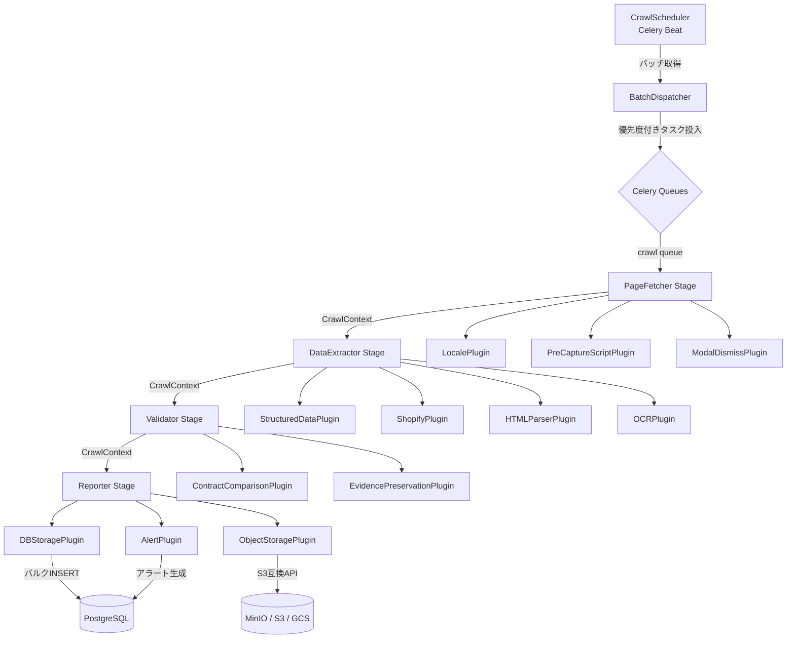
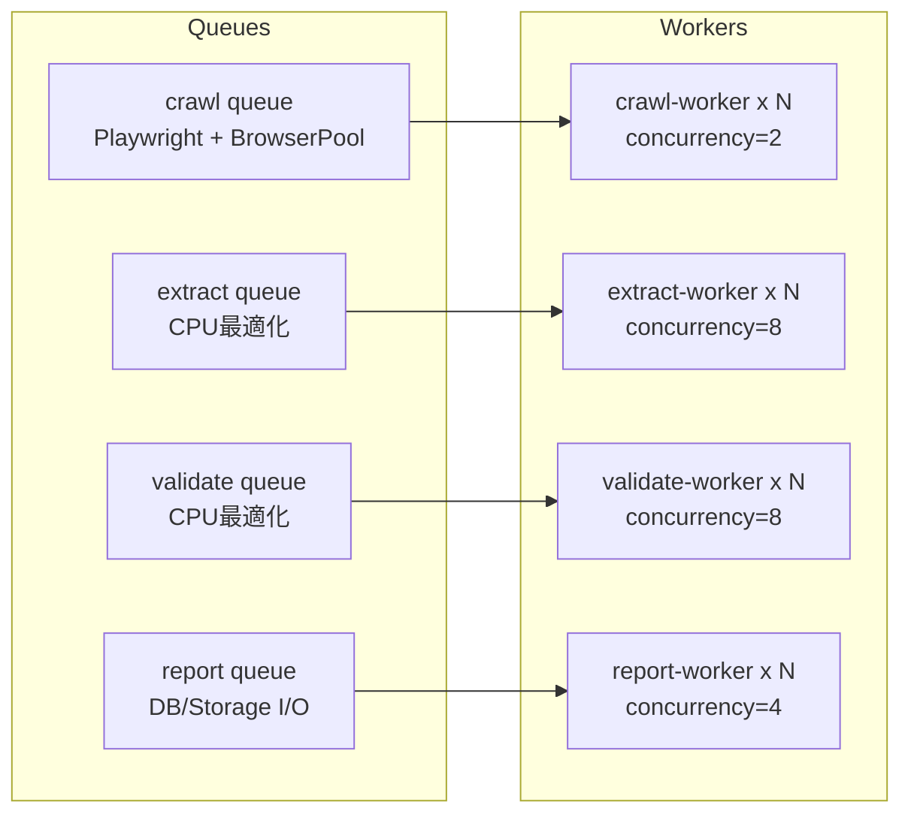
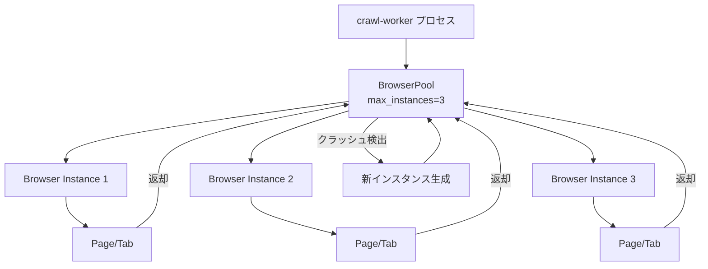
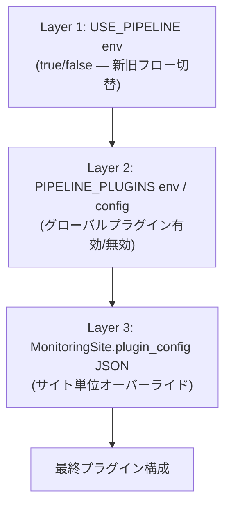
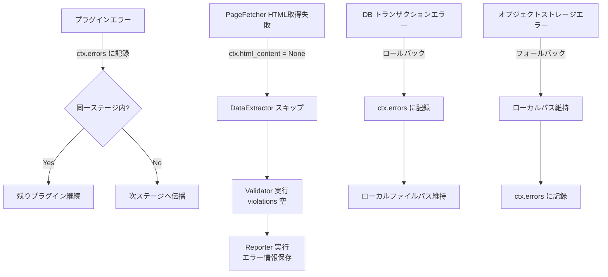

# Design Document: Crawl Pipeline Architecture

## Overview

本設計は、現在の `tasks.py` 内のモノリシックな `_crawl_and_validate_site_async()`（250行超）を、4ステージ構成の `CrawlPipeline` に分解し、プラグインアーキテクチャで拡張可能にする。

### 現状の課題

- `_crawl_and_validate_site_async()` がクロール、スクリーンショット、抽出、検証、DB保存、アラートを1関数で実行
- 新機能追加（ロケール設定、モーダル閉じ、構造化データ抽出等）のたびに関数が肥大化
- ステージ単位のスケーリング不可（ブラウザ操作とCPU処理が同一ワーカー）
- テスト困難（モック対象が多すぎる）

### 設計方針

```
CrawlPipeline
├── Stage 1: PageFetcher    → LocalePlugin, PreCaptureScriptPlugin, ModalDismissPlugin
├── Stage 2: DataExtractor  → StructuredDataPlugin, ShopifyPlugin, HTMLParserPlugin, OCRPlugin
├── Stage 3: Validator      → ContractComparisonPlugin, EvidencePreservationPlugin
└── Stage 4: Reporter       → DBStoragePlugin, ObjectStoragePlugin, AlertPlugin
```

全プラグインは常に登録され、`should_run(ctx)` が実行条件を判定する。スケール対応プラグイン（ObjectStoragePlugin等）は規模閾値で自動有効化される。

### 統合対象

- `crawl-modal-automation` spec → PageFetcher ステージのプラグインとして統合
- `verification-flow-restructure` spec → DataExtractor / Validator / Reporter ステージのプラグインとして統合

## Architecture

### パイプライン実行フロー



### Celery キュー分離



### BrowserPool アーキテクチャ



### プラグイン設定の3層構造



マージロジック: グローバル設定をベースに、サイトの `plugin_config.disabled` でプラグイン無効化、`plugin_config.enabled` で追加有効化、`plugin_config.params` でパラメータ上書き。`PIPELINE_DISABLED_PLUGINS` 環境変数で再デプロイなしの緊急無効化も可能。


## Components and Interfaces

### CrawlContext — パイプライン共有コンテキスト

パイプライン全体で共有されるイミュータブル風データオブジェクト。各プラグインは受け取った `CrawlContext` に処理結果を追記して返却する。

```python
from dataclasses import dataclass, field
from typing import Any, Optional
from datetime import datetime
from src.models import MonitoringSite

@dataclass
class VariantCapture:
    """バリアント別スクリーンショットとメタデータ"""
    variant_name: str
    image_path: str
    captured_at: datetime
    metadata: dict[str, Any] = field(default_factory=dict)

@dataclass
class CrawlContext:
    """パイプライン全体で共有されるコンテキスト"""
    site: MonitoringSite
    url: str
    html_content: Optional[str] = None
    screenshots: list[VariantCapture] = field(default_factory=list)
    extracted_data: dict[str, Any] = field(default_factory=dict)
    violations: list[dict[str, Any]] = field(default_factory=list)
    evidence_records: list[dict[str, Any]] = field(default_factory=list)
    errors: list[dict[str, Any]] = field(default_factory=list)
    metadata: dict[str, Any] = field(default_factory=dict)

    def to_dict(self) -> dict[str, Any]:
        """シリアライズ（ラウンドトリップ対応）"""
        ...

    @classmethod
    def from_dict(cls, data: dict[str, Any]) -> "CrawlContext":
        """デシリアライズ"""
        ...
```

`metadata` はプラグイン間データ受け渡しに使用。各プラグインは `pluginname_key` 形式のプレフィックス付きキーで格納する（例: `structureddata_empty`, `pagefetcher_etag`）。

### CrawlPlugin — プラグイン抽象基底クラス

```python
from abc import ABC, abstractmethod

class CrawlPlugin(ABC):
    """全プラグインの抽象基底クラス"""

    @abstractmethod
    async def execute(self, ctx: CrawlContext) -> CrawlContext:
        """プラグイン処理を実行し、結果を追記したCrawlContextを返却"""
        ...

    @abstractmethod
    def should_run(self, ctx: CrawlContext) -> bool:
        """実行条件を判定。False の場合スキップされる"""
        ...

    @property
    def name(self) -> str:
        return self.__class__.__name__
```

### CrawlPipeline — オーケストレータ

```python
class CrawlPipeline:
    """4ステージパイプラインオーケストレータ"""

    stages: dict[str, list[CrawlPlugin]] = {
        "page_fetcher": [LocalePlugin, PreCaptureScriptPlugin, ModalDismissPlugin],
        "data_extractor": [StructuredDataPlugin, ShopifyPlugin, HTMLParserPlugin, OCRPlugin],
        "validator": [ContractComparisonPlugin, EvidencePreservationPlugin],
        "reporter": [DBStoragePlugin, ObjectStoragePlugin, AlertPlugin],
    }

    def __init__(self, site: MonitoringSite, global_config: dict, site_config: Optional[dict]):
        """グローバル設定 + サイト設定をマージしてプラグイン構成を決定"""
        ...

    async def run(self, ctx: CrawlContext) -> CrawlContext:
        """全ステージを順次実行。各ステージの開始/終了時刻をmetadataに記録"""
        ...

    def _resolve_plugins(self, global_config: dict, site_config: Optional[dict]) -> dict[str, list[CrawlPlugin]]:
        """3層設定マージ: グローバル → サイトオーバーライド → 緊急無効化"""
        ...
```

パイプライン実行ロジック:
1. 各ステージを `page_fetcher` → `data_extractor` → `validator` → `reporter` の順で実行
2. ステージ内の各プラグインに対し `should_run(ctx)` を評価、`True` のプラグインのみ `execute(ctx)` を呼び出す
3. プラグインがエラーを発生させた場合、`ctx.errors` に記録し同一ステージ内の残りプラグインは継続
4. PageFetcher で HTML 取得失敗時は DataExtractor をスキップし Reporter にエラー情報を渡す
5. 各ステージの開始/終了時刻・実行プラグイン名を `ctx.metadata["pipeline_stages"]` に記録

### PageFetcher ステージ — プラグイン群

PageFetcher は特殊なステージで、ブラウザページのライフサイクルを管理する。実行順序は固定:

1. **LocalePlugin** — `locale: "ja-JP"`, `Accept-Language: "ja-JP,ja;q=0.9"`, viewport 1920x1080, deviceScaleFactor 2 を設定。`should_run()` は常に `True`
2. **ページ取得**（ステージ内蔵ロジック）— `page.goto()` + `networkidle` 待機 + DOM安定化。ETag/Last-Modified の条件付きリクエストヘッダー付与（デルタクロール対応）
3. **PreCaptureScriptPlugin** — `site.pre_capture_script` が設定されている場合のみ実行。JSON定義のアクション（`click`, `wait`, `select`, `type`）を逐次実行。`label` 付きアクションはスクリーンショットを取得
4. **ModalDismissPlugin** — モーダル検出（`[role="dialog"]`, `.modal`, `[class*="cookie"]` 等）→ 閉じるボタンクリック → Escape キーフォールバック → 500ms 待機。`should_run()` は常に `True`
5. **スクリーンショット撮影**（ステージ内蔵ロジック）— BrowserPool から取得したページでキャプチャ

### DataExtractor ステージ — プラグイン群

| プラグイン | should_run 条件 | 処理内容 |
|---|---|---|
| StructuredDataPlugin | `html_content` が存在 | JSON-LD, OG, Microdata から価格抽出。優先順位: JSON-LD > Shopify API > Microdata > OG |
| ShopifyPlugin | HTML に `Shopify.shop` or `cdn.shopify.com` | `/products/{handle}.json` から全バリアント価格取得 |
| HTMLParserPlugin | `metadata.structured_data_empty == True` | 既存 PaymentInfoExtractor によるフォールバック抽出 |
| OCRPlugin | `screenshots` が1件以上 | ROI検出 → 切り出し → OCR実行 → evidence_records に追加 |

### Validator ステージ — プラグイン群

| プラグイン | should_run 条件 | 処理内容 |
|---|---|---|
| ContractComparisonPlugin | `extracted_data` に価格情報あり | 全バリアント価格を ContractCondition と比較、差異を violations に追加 |
| EvidencePreservationPlugin | `evidence_records` が1件以上 | evidence_type 分類、フィールド設定、同一 VerificationResult への関連付け |

### Reporter ステージ — プラグイン群

| プラグイン | should_run 条件 | 処理内容 |
|---|---|---|
| DBStoragePlugin | 常に `True` | VerificationResult, EvidenceRecord, Violation をDB保存。閾値ベースで個別/バルクINSERT自動切替 |
| ObjectStoragePlugin | screenshots/evidence に画像パスあり | MinIO SDK で S3互換ストレージにアップロード。パス: `{bucket}/{site_id}/{date}/{filename}` |
| AlertPlugin | `violations` が1件以上 | 違反種別に応じた severity で Alert レコード生成 |

### BrowserPool

```python
import asyncio
from playwright.async_api import Browser, BrowserContext, Page

class BrowserPool:
    """Playwright ブラウザインスタンスプール"""

    def __init__(self, max_instances: int = 3):
        self._max_instances = max_instances
        self._pool: asyncio.Queue[Browser] = asyncio.Queue(maxsize=max_instances)
        self._instances: list[Browser] = []

    async def initialize(self) -> None:
        """プール初期化: max_instances 個のブラウザを起動"""
        ...

    async def acquire(self) -> tuple[Browser, Page]:
        """プールからブラウザを取得し新しいページを生成"""
        ...

    async def release(self, browser: Browser, page: Page) -> None:
        """ページを閉じてブラウザをプールに返却"""
        ...

    async def _handle_crash(self, browser: Browser) -> None:
        """クラッシュしたインスタンスを破棄し新規生成"""
        ...

    async def shutdown(self) -> None:
        """全インスタンスを正常終了"""
        ...
```

- ワーカープロセス起動時に `initialize()` を呼び出し（Celery worker_init シグナル）
- `acquire()` は全インスタンス使用中の場合、返却されるまで `await` で待機
- クラッシュ検出は `browser.is_connected()` チェックで実装

### BatchDispatcher

```python
class BatchDispatcher:
    """サイト群をバッチ分割し優先度付きでCeleryキューに投入"""

    def __init__(self, batch_size: int = 100, max_tasks_per_run: int = 500):
        ...

    def dispatch(self, schedules: list[CrawlSchedule]) -> int:
        """
        スケジュール群を priority 順にソートし Celery タスクとして投入。
        priority マッピング: high=0, normal=5, low=9
        戻り値: 投入タスク数
        """
        ...
```

### CrawlScheduler

```python
class CrawlScheduler:
    """Celery Beat によるスケジュール管理"""

    def run_scheduled_crawls(self) -> int:
        """
        1. next_crawl_at <= now の CrawlSchedule をバッチ取得
        2. USE_PIPELINE 環境変数で新旧フロー切替
        3. BatchDispatcher でタスク投入
        4. next_crawl_at を interval_minutes 分後に更新
        """
        ...
```

### ScheduleTab — フロントエンドコンポーネント

```
ScheduleTab
├── スケジュール情報セクション
│   ├── 優先度セレクトボックス (高/通常/低)
│   ├── クロール間隔 (分) 数値入力
│   ├── 次回クロール予定日時 (読み取り専用) + 「今すぐ実行」ボタン
│   └── デルタクロール情報 (ETag, Last-Modified) 読み取り専用
├── PreCaptureScript エディタ
│   └── JSON テキストエリア (プレースホルダー付き、バリデーション付き)
├── プラグイン設定（上級）セクション [折りたたみ、デフォルト閉じ]
│   ├── プラグイン一覧 (トグルスイッチ + 簡易説明)
│   └── 「デフォルトに戻す」ボタン
└── 「保存」ボタン
```

SiteDetailPanel の `TabType` に `'schedule'` を追加し、5番目のタブとして表示。

```typescript
// ScheduleTab.tsx
interface ScheduleTabProps {
  siteId: number;
}

interface CrawlScheduleData {
  site_id: number;
  priority: 'high' | 'normal' | 'low';
  interval_minutes: number;
  next_crawl_at: string;
  last_etag: string | null;
  last_modified: string | null;
}

interface PluginConfigData {
  disabled: string[];
  enabled: string[];
  params: Record<string, Record<string, any>>;
}
```

### スケジュール管理 API

| メソッド | エンドポイント | 処理 |
|---|---|---|
| GET | `/api/sites/{site_id}/schedule` | CrawlSchedule 取得 |
| POST | `/api/sites/{site_id}/schedule` | CrawlSchedule 新規作成 |
| PUT | `/api/sites/{site_id}/schedule` | CrawlSchedule 更新 |
| PUT | `/api/sites/{site_id}` | MonitoringSite の `pre_capture_script`, `crawl_priority`, `plugin_config` 更新 |

バリデーション: `pre_capture_script` は JSON パース可能であること（422エラー）、存在しない `site_id` は 404 エラー。

### ドメインレートリミッター

```python
class DomainRateLimiter:
    """ドメイン単位のレートリミティング（Redis ベース）"""

    def __init__(self, min_interval_seconds: float = 2.0):
        ...

    async def acquire(self, domain: str) -> None:
        """同一ドメインへのリクエスト間隔を min_interval_seconds 以上に制御。
        制限中は await で待機。"""
        ...
```

Redis の `SETNX` + TTL でドメインごとのロックを実装。


## Data Models

### DB スキーマ変更

#### MonitoringSite 拡張カラム（全て nullable、既存レコードに影響なし）

```python
class MonitoringSite(Base):
    # ... 既存カラム ...

    # 新規カラム (Req 21)
    pre_capture_script = mapped_column(JSON, nullable=True, default=None)      # PreCaptureScript JSON
    crawl_priority = mapped_column(String(20), nullable=False, default='normal')  # 'high' | 'normal' | 'low'
    etag = mapped_column(String(255), nullable=True)                           # デルタクロール用 ETag
    last_modified_header = mapped_column(String(255), nullable=True)           # デルタクロール用 Last-Modified
    plugin_config = mapped_column(JSON, nullable=True, default=None)           # サイト単位プラグイン設定
```

#### VerificationResult 拡張カラム（全て nullable）

```python
class VerificationResult(Base):
    # ... 既存カラム ...

    # 新規カラム (Req 21)
    structured_data = mapped_column(JSONB, nullable=True)              # 構造化データ抽出結果
    structured_data_violations = mapped_column(JSONB, nullable=True)   # 構造化データ違反
    data_source = mapped_column(String(50), nullable=True)             # 'json_ld' | 'shopify_api' | 'microdata' | 'html_fallback'
    structured_data_status = mapped_column(String(50), nullable=True)  # 'found' | 'empty' | 'error'
    evidence_status = mapped_column(String(50), nullable=True)         # 'collected' | 'partial' | 'none'
```

#### EvidenceRecord テーブル（新規）

```python
class EvidenceRecord(Base):
    __tablename__ = "evidence_records"

    id = mapped_column(Integer, primary_key=True, autoincrement=True)
    verification_result_id = mapped_column(Integer, ForeignKey("verification_results.id"), nullable=False)
    variant_name = mapped_column(String(255), nullable=False)
    screenshot_path = mapped_column(String(512), nullable=False)
    roi_image_path = mapped_column(String(512), nullable=True)
    ocr_text = mapped_column(Text, nullable=False)
    ocr_confidence = mapped_column(Float, nullable=False)
    evidence_type = mapped_column(String(50), nullable=False)  # 'price_display' | 'terms_notice' | 'subscription_condition' | 'general'
    created_at = mapped_column(DateTime, nullable=False, default=datetime.utcnow)

    # Relationships
    verification_result = relationship("VerificationResult", backref="evidence_records")

    __table_args__ = (
        Index("ix_evidence_records_verification_result_id", "verification_result_id"),
        Index("ix_evidence_records_evidence_type", "evidence_type"),
    )
```

#### CrawlSchedule テーブル（新規）

```python
class CrawlSchedule(Base):
    __tablename__ = "crawl_schedules"

    id = mapped_column(Integer, primary_key=True, autoincrement=True)
    site_id = mapped_column(Integer, ForeignKey("monitoring_sites.id"), nullable=False, unique=True)
    priority = mapped_column(String(20), nullable=False, default='normal')  # 'high' | 'normal' | 'low'
    next_crawl_at = mapped_column(DateTime, nullable=False)
    interval_minutes = mapped_column(Integer, nullable=False, default=1440)  # デフォルト24時間
    last_etag = mapped_column(String(255), nullable=True)
    last_modified = mapped_column(String(255), nullable=True)

    # Relationships
    site = relationship("MonitoringSite", backref="crawl_schedule")

    __table_args__ = (
        Index("ix_crawl_schedules_next_crawl_at", "next_crawl_at"),
    )
```

### JSON 構造定義

#### plugin_config（MonitoringSite.plugin_config）

```json
{
  "disabled": ["ShopifyPlugin"],
  "enabled": ["CustomPlugin"],
  "params": {
    "OCRPlugin": { "confidence_threshold": 0.8 },
    "StructuredDataPlugin": { "priority_override": ["microdata", "json_ld"] }
  }
}
```

#### PreCaptureScript（MonitoringSite.pre_capture_script）

```json
[
  { "action": "click", "selector": ".lang-ja", "label": "日本語選択" },
  { "action": "wait", "ms": 1000 },
  { "action": "select", "selector": "#variant-select", "value": "option-a", "label": "バリアントA" },
  { "action": "type", "selector": "#search-input", "text": "検索テキスト" }
]
```

各アクションの型定義:
- `action`: `"click"` | `"wait"` | `"select"` | `"type"`（必須）
- `selector`: CSS セレクタ（`click`, `select`, `type` で必須）
- `ms`: 待機ミリ秒（`wait` で必須）
- `value`: 選択値（`select` で必須）
- `text`: 入力テキスト（`type` で必須）
- `label`: バリアント名（オプション、設定時はスクリーンショット取得）

#### StructuredPriceData（CrawlContext.extracted_data 内）

```json
{
  "product_name": "商品名",
  "variants": [
    {
      "variant_name": "デフォルト",
      "price": 1980,
      "compare_at_price": 2980,
      "currency": "JPY",
      "sku": "SKU-001",
      "data_source": "json_ld",
      "options": {}
    },
    {
      "variant_name": "オプションA",
      "price": 2480,
      "compare_at_price": null,
      "currency": "JPY",
      "sku": "SKU-002",
      "data_source": "shopify_api",
      "options": { "option1": "サイズL", "option2": "カラー赤" }
    }
  ],
  "data_sources_used": ["json_ld", "shopify_api"],
  "extraction_timestamp": "2024-01-15T10:30:00Z"
}
```

### Alembic マイグレーション方針

- 全新規カラムは `nullable=True` または `server_default` 付きで追加（既存レコード影響なし）
- `crawl_priority` のみ `server_default='normal'` で NOT NULL
- ダウングレード時は追加カラム・テーブルを `DROP` し既存データを保持
- マイグレーションは単一ファイルで全変更を含む（アトミック適用）

### docker-compose.yml 変更

```yaml
services:
  # ... 既存サービス ...

  # MinIO (ローカル開発用 S3互換ストレージ)
  minio:
    image: minio/minio:latest
    container_name: payment-monitor-minio
    command: server /data --console-address ":9001"
    environment:
      MINIO_ROOT_USER: ${STORAGE_ACCESS_KEY:-minioadmin}
      MINIO_ROOT_PASSWORD: ${STORAGE_SECRET_KEY:-minioadmin}
    volumes:
      - minio_data:/data
    ports:
      - "9000:9000"
      - "9001:9001"
    networks:
      - payment-monitor-network

  # Celery Workers (キュー分離)
  crawl-worker:
    build: { context: ., dockerfile: docker/Dockerfile }
    command: celery -A src.celery_app worker -Q crawl --loglevel=info --concurrency=2
    environment: *celery-env
    volumes: [screenshots_data:/app/screenshots]
    depends_on: [postgres, redis]

  extract-worker:
    build: { context: ., dockerfile: docker/Dockerfile }
    command: celery -A src.celery_app worker -Q extract --loglevel=info --concurrency=8
    environment: *celery-env
    depends_on: [postgres, redis]

  validate-worker:
    build: { context: ., dockerfile: docker/Dockerfile }
    command: celery -A src.celery_app worker -Q validate --loglevel=info --concurrency=8
    environment: *celery-env
    depends_on: [postgres, redis]

  report-worker:
    build: { context: ., dockerfile: docker/Dockerfile }
    command: celery -A src.celery_app worker -Q report --loglevel=info --concurrency=4
    environment: *celery-env
    depends_on: [postgres, redis, minio]

volumes:
  minio_data:
```

`crawl-worker` のみ Playwright + BrowserPool を初期化。`extract-worker`, `validate-worker` は Playwright 不要で CPU 最適化。


## Correctness Properties

*A property is a characteristic or behavior that should hold true across all valid executions of a system — essentially, a formal statement about what the system should do. Properties serve as the bridge between human-readable specifications and machine-verifiable correctness guarantees.*

### Property 1: CrawlContext round-trip serialization

*For any* valid CrawlContext object (with arbitrary site info, html_content, screenshots, extracted_data, violations, evidence_records, errors, and metadata), serializing to dict via `to_dict()` and deserializing via `from_dict()` shall produce an equivalent CrawlContext.

**Validates: Requirements 1.6**

### Property 2: Plugin field preservation

*For any* CrawlPlugin and any CrawlContext with pre-existing data in all fields, executing the plugin shall preserve all fields that the plugin does not explicitly modify — specifically, the set of keys in `extracted_data`, `violations`, `evidence_records`, and `errors` present before execution shall remain present after execution, and their values shall be unchanged.

**Validates: Requirements 1.4**

### Property 3: Plugin metadata key prefixing

*For any* CrawlPlugin execution on any CrawlContext, all new keys added to `metadata` by the plugin shall be prefixed with the plugin's name in lowercase (e.g., `structureddata_`, `pagefetcher_`).

**Validates: Requirements 1.5**

### Property 4: PreCaptureScript round-trip serialization

*For any* valid PreCaptureScript JSON (array of action objects with valid action/selector/ms/value/text/label fields), parsing to an action list and re-serializing to JSON shall produce an equivalent action list.

**Validates: Requirements 5.7**

### Property 5: Pipeline stage execution order

*For any* CrawlPipeline execution, the `metadata["pipeline_stages"]` shall record stages in exactly the order: `page_fetcher`, `data_extractor`, `validator`, `reporter`, and each stage's `start_time` shall be ≤ the next stage's `start_time`.

**Validates: Requirements 2.1, 2.5**

### Property 6: should_run filtering

*For any* CrawlPipeline stage containing N registered plugins where M plugins return `should_run() == True`, exactly M plugins shall have their `execute()` called, and the remaining N-M plugins shall be skipped.

**Validates: Requirements 2.2**

### Property 7: Plugin error isolation within a stage

*For any* pipeline stage with multiple plugins, if one plugin raises an exception, the error shall be recorded in `ctx.errors` and all remaining plugins in the same stage shall still execute.

**Validates: Requirements 2.3**

### Property 8: PageFetcher failure skips DataExtractor

*For any* pipeline execution where the PageFetcher stage fails to populate `html_content` (remains None), the DataExtractor stage shall be skipped entirely (no DataExtractor plugins execute), and the error shall be available in the Reporter stage.

**Validates: Requirements 2.4**

### Property 9: Conditional should_run correctness

*For any* CrawlContext:
- PreCaptureScriptPlugin.should_run() returns True iff `ctx.site.pre_capture_script` is not None
- StructuredDataPlugin.should_run() returns True iff `ctx.html_content` is not None
- ShopifyPlugin.should_run() returns True iff `ctx.html_content` contains "Shopify.shop" or "cdn.shopify.com"
- HTMLParserPlugin.should_run() returns True iff `ctx.metadata.get("structured_data_empty")` is True
- OCRPlugin.should_run() returns True iff `len(ctx.screenshots) >= 1`
- ContractComparisonPlugin.should_run() returns True iff `ctx.extracted_data` contains price information
- EvidencePreservationPlugin.should_run() returns True iff `len(ctx.evidence_records) >= 1`
- ObjectStoragePlugin.should_run() returns True iff screenshots or evidence_records contain image file paths
- AlertPlugin.should_run() returns True iff `len(ctx.violations) >= 1`

**Validates: Requirements 5.1, 6.6, 7.1, 8.1, 9.1, 10.1, 11.1, 13.1, 14.1**

### Property 10: Structured data extraction with source priority

*For any* HTML containing structured price data from multiple sources (JSON-LD, Microdata, Open Graph), the StructuredDataPlugin shall extract prices from all available sources, and when the same product has prices from multiple sources, the adopted price shall follow the priority: JSON-LD > Shopify API > Microdata > Open Graph. Each extracted price shall include a `data_source` field.

**Validates: Requirements 6.1, 6.2, 6.3, 6.4, 6.5**

### Property 11: Contract comparison completeness

*For any* set of variant prices in `extracted_data` and any set of ContractCondition prices, the ContractComparisonPlugin shall compare every variant price against the contract. For each mismatched variant, a violation record containing `variant_name`, `contract_price`, `actual_price`, and `data_source` shall be added to `ctx.violations`. When all variants match, `ctx.metadata` shall contain a "match" indicator.

**Validates: Requirements 10.2, 10.3, 10.4**

### Property 12: Evidence record completeness

*For any* set of evidence_records processed by EvidencePreservationPlugin, each record shall have `evidence_type` classified as one of (`price_display`, `terms_notice`, `subscription_condition`, `general`), and all required fields (`verification_result_id`, `variant_name`, `screenshot_path`, `ocr_text`, `ocr_confidence`, `evidence_type`, `created_at`) shall be non-null. All records from a single pipeline run shall share the same `verification_result_id`.

**Validates: Requirements 11.2, 11.3, 11.4**

### Property 13: Object storage path format

*For any* upload performed by ObjectStoragePlugin, the storage path shall match the format `{bucket}/{site_id}/{date}/{filename}` where `site_id` is the numeric site ID, `date` is in ISO date format, and `filename` is the original filename.

**Validates: Requirements 13.7**

### Property 14: Object storage path replacement

*For any* successful ObjectStoragePlugin execution, all local file paths in `ctx.screenshots[].image_path` and `ctx.evidence_records[].screenshot_path` / `roi_image_path` shall be replaced with storage URLs. On upload failure, local paths shall be preserved unchanged.

**Validates: Requirements 13.5, 13.6**

### Property 15: Alert generation from violations

*For any* set of violations in CrawlContext, the AlertPlugin shall generate exactly one Alert record per violation, with severity set to `"warning"` for price mismatch violations and `"info"` for structured data extraction failures.

**Validates: Requirements 14.2, 14.3**

### Property 16: Threshold-based INSERT strategy selection

*For any* DBStoragePlugin execution, when the total number of records to save (evidence_records + violations) is ≤ the configured threshold (default 10), individual INSERTs shall be used. When the count exceeds the threshold, bulk INSERT shall be used. When the bulk batch exceeds max_size (default 100), it shall be split into ceil(count/max_size) bulk INSERT operations.

**Validates: Requirements 20.1, 20.2, 20.3**

### Property 17: Plugin config 3-layer merge

*For any* global plugin config and any site-level `plugin_config` (with `disabled`, `enabled`, `params` fields), the effective plugin set shall equal: (global enabled plugins) - (site disabled) - (PIPELINE_DISABLED_PLUGINS env) + (site enabled), and plugin parameters shall be global defaults overridden by site `params`. When site `plugin_config` is NULL, the effective config shall equal the global config minus any PIPELINE_DISABLED_PLUGINS.

**Validates: Requirements 22.7, 22.8, 22.9, 22.10, 22.11, 22.12**

### Property 18: USE_PIPELINE flow switching

*For any* value of the `USE_PIPELINE` environment variable, when `true` the CrawlScheduler shall dispatch via the new CrawlPipeline, and when `false` (or unset) it shall dispatch via the legacy `crawl_all_sites` task.

**Validates: Requirements 22.2, 22.3, 22.4**

### Property 19: API backward compatibility with NULL new fields

*For any* VerificationResult where the new fields (`structured_data`, `structured_data_violations`, `data_source`, `structured_data_status`, `evidence_status`) are NULL, the API response shall be valid and structurally compatible with the legacy response format (no errors, no missing required fields).

**Validates: Requirements 22.5, 22.6**

### Property 20: Delta crawl conditional headers

*For any* MonitoringSite, when `etag` is set the PageFetcher shall include `If-None-Match` header, when `last_modified_header` is set it shall include `If-Modified-Since` header, and when neither is set no conditional headers shall be sent. On 304 response, the pipeline shall skip full crawl. On 200 response, new ETag/Last-Modified values shall be saved.

**Validates: Requirements 18.2, 18.3, 18.4, 18.5**

### Property 21: Batch scheduler dispatch correctness

*For any* set of CrawlSchedule records, the CrawlScheduler shall dispatch only those with `next_crawl_at <= now`, sorted by priority, limited to `max_tasks_per_run` (default 500). After dispatch, each dispatched schedule's `next_crawl_at` shall be updated to `now + interval_minutes`.

**Validates: Requirements 19.2, 19.3, 19.4, 19.5**

### Property 22: Priority-to-Celery mapping

*For any* site dispatched by BatchDispatcher, the Celery task priority shall be: 0 for `crawl_priority='high'`, 5 for `'normal'`, 9 for `'low'`.

**Validates: Requirements 17.2**

### Property 23: Domain rate limiting

*For any* sequence of crawl requests to the same domain, the time interval between consecutive requests shall be ≥ the configured minimum interval (default 2 seconds).

**Validates: Requirements 17.3, 17.4**

### Property 24: PreCaptureScript label triggers screenshot

*For any* PreCaptureScript action with a `label` field, executing that action shall add a VariantCapture to `ctx.screenshots` with `variant_name` equal to the label value.

**Validates: Requirements 5.4**

### Property 25: JSON validation at API boundary

*For any* string that is not valid JSON sent as `pre_capture_script` to `PUT /api/sites/{site_id}`, the API shall return HTTP 422. For any non-existent `site_id`, the API shall return HTTP 404.

**Validates: Requirements 26.5, 26.6**

### Property 26: BrowserPool crash recovery

*For any* BrowserPool state where a browser instance crashes (becomes disconnected), the pool shall discard the crashed instance and create a new one, maintaining the configured pool size.

**Validates: Requirements 15.5**

### Property 27: Plugin toggle state reflects effective config

*For any* combination of global plugin config and site-level `plugin_config`, the ScheduleTab toggle switches shall display the effective enabled/disabled state for each plugin. When `plugin_config` is NULL, all toggles shall reflect the global default state.

**Validates: Requirements 24a.3, 24a.4, 24a.6**


## Error Handling

### パイプラインレベルのエラー戦略



### ステージ別エラーハンドリング

| ステージ | エラー種別 | 対応 |
|---|---|---|
| PageFetcher | ブラウザクラッシュ | BrowserPool がインスタンス再生成、タスクリトライ |
| PageFetcher | ページタイムアウト | ctx.errors に記録、html_content = None → DataExtractor スキップ |
| PageFetcher | ModalDismiss 失敗 | ctx.errors に記録、パイプライン継続（モーダルが残る可能性あり） |
| PageFetcher | PreCaptureScript エラー | ctx.errors に記録、残りアクションスキップ、パイプライン継続 |
| PageFetcher | PreCaptureScript JSON不正 | バリデーションエラーを ctx.errors に記録、実行スキップ |
| DataExtractor | JSON-LD パースエラー | ctx.errors に記録、他データソースで継続 |
| DataExtractor | Shopify API 404/拒否 | ctx.errors に記録、パイプライン継続 |
| DataExtractor | OCR 失敗 | ctx.errors に記録、evidence_records に追加しない |
| Validator | 契約条件未設定 | ctx.errors に記録、比較スキップ |
| Reporter | DB バルクINSERT 失敗 | トランザクションロールバック、ctx.errors に記録 |
| Reporter | オブジェクトストレージ接続失敗 | ローカルパス維持（フォールバック）、ctx.errors に記録 |
| Reporter | アラート生成失敗 | ctx.errors に記録、他の Reporter プラグイン継続 |

### プラグイン別エラーハンドリング

各プラグインの `execute()` は try-except で囲まれ、未処理例外は CrawlPipeline のオーケストレータが捕捉する:

```python
# CrawlPipeline 内のプラグイン実行ロジック
for plugin in stage_plugins:
    if plugin.should_run(ctx):
        try:
            ctx = await plugin.execute(ctx)
        except Exception as e:
            ctx.errors.append({
                "plugin": plugin.name,
                "stage": stage_name,
                "error": str(e),
                "timestamp": datetime.utcnow().isoformat(),
            })
            logger.error("Plugin %s failed: %s", plugin.name, e)
```

### レートリミット・リトライ戦略

- ドメインレートリミット到達時: `asyncio.sleep()` で待機後に再開（タスク失敗にしない）
- Celery タスクリトライ: `max_retries=3`, `default_retry_delay=60` で指数バックオフ
- BrowserPool 枯渇時: `acquire()` が `await` で待機（タイムアウト付き、デフォルト 30秒）

### エラーレコード構造

```python
{
    "plugin": "StructuredDataPlugin",
    "stage": "data_extractor",
    "error": "JSON-LD parse error: Expecting value at line 1",
    "timestamp": "2024-01-15T10:30:00Z",
    "severity": "warning",  # "error" | "warning" | "info"
    "recoverable": True
}
```

## Testing Strategy

### テストフレームワーク

- **Property-based testing**: `hypothesis` ライブラリ（Python）
- **Unit testing**: `pytest`
- **Frontend testing**: `vitest` + `@testing-library/react`
- 各プロパティテストは最低 100 イテレーション実行

### Property-Based Tests（Hypothesis）

各テストは設計ドキュメントの Correctness Property を参照するタグ付きコメントを含む。

```python
# テストファイル: tests/test_crawl_pipeline_properties.py
from hypothesis import given, strategies as st, settings

# Feature: crawl-pipeline-architecture, Property 1: CrawlContext round-trip serialization
@settings(max_examples=100)
@given(ctx=crawl_context_strategy())
def test_crawl_context_round_trip(ctx):
    """CrawlContext の to_dict/from_dict ラウンドトリップ"""
    assert CrawlContext.from_dict(ctx.to_dict()) == ctx

# Feature: crawl-pipeline-architecture, Property 4: PreCaptureScript round-trip serialization
@settings(max_examples=100)
@given(script=pre_capture_script_strategy())
def test_pre_capture_script_round_trip(script):
    """PreCaptureScript の parse/serialize ラウンドトリップ"""
    assert serialize(parse(script)) == script

# Feature: crawl-pipeline-architecture, Property 2: Plugin field preservation
@settings(max_examples=100)
@given(ctx=crawl_context_strategy(), plugin=plugin_strategy())
def test_plugin_preserves_existing_fields(ctx, plugin):
    """プラグイン実行が既存フィールドを破壊しない"""
    ...

# Feature: crawl-pipeline-architecture, Property 6: should_run filtering
@settings(max_examples=100)
@given(plugins=st.lists(mock_plugin_strategy(), min_size=1, max_size=10))
def test_should_run_filtering(plugins):
    """should_run() == True のプラグインのみ execute() が呼ばれる"""
    ...

# Feature: crawl-pipeline-architecture, Property 7: Plugin error isolation
@settings(max_examples=100)
@given(error_index=st.integers(min_value=0, max_value=4))
def test_plugin_error_isolation(error_index):
    """1プラグインのエラーが同一ステージ内の他プラグインに影響しない"""
    ...

# Feature: crawl-pipeline-architecture, Property 9: Conditional should_run correctness
@settings(max_examples=100)
@given(ctx=crawl_context_strategy())
def test_conditional_should_run(ctx):
    """各プラグインの should_run() が文書化された条件に従う"""
    ...

# Feature: crawl-pipeline-architecture, Property 10: Structured data source priority
@settings(max_examples=100)
@given(html=multi_source_html_strategy())
def test_structured_data_priority(html):
    """複数データソースの優先順位が JSON-LD > Shopify > Microdata > OG"""
    ...

# Feature: crawl-pipeline-architecture, Property 11: Contract comparison completeness
@settings(max_examples=100)
@given(prices=variant_prices_strategy(), contracts=contract_strategy())
def test_contract_comparison_completeness(prices, contracts):
    """全バリアント価格が契約条件と比較され、不一致は violations に記録"""
    ...

# Feature: crawl-pipeline-architecture, Property 16: Threshold-based INSERT strategy
@settings(max_examples=100)
@given(record_count=st.integers(min_value=0, max_value=500), threshold=st.integers(min_value=1, max_value=50))
def test_threshold_insert_strategy(record_count, threshold):
    """レコード数に応じて個別/バルクINSERTが正しく選択される"""
    ...

# Feature: crawl-pipeline-architecture, Property 17: Plugin config 3-layer merge
@settings(max_examples=100)
@given(global_config=plugin_config_strategy(), site_config=st.one_of(st.none(), plugin_config_strategy()), disabled_env=st.lists(st.text(min_size=1, max_size=30)))
def test_plugin_config_merge(global_config, site_config, disabled_env):
    """3層設定マージが正しく動作する"""
    ...

# Feature: crawl-pipeline-architecture, Property 20: Delta crawl conditional headers
@settings(max_examples=100)
@given(etag=st.one_of(st.none(), st.text(min_size=1)), last_modified=st.one_of(st.none(), st.text(min_size=1)))
def test_delta_crawl_headers(etag, last_modified):
    """ETag/Last-Modified の有無に応じて条件付きヘッダーが正しく設定される"""
    ...

# Feature: crawl-pipeline-architecture, Property 21: Batch scheduler dispatch correctness
@settings(max_examples=100)
@given(schedules=st.lists(crawl_schedule_strategy(), min_size=0, max_size=1000))
def test_scheduler_dispatch(schedules):
    """スケジューラが正しいレコードを優先度順に上限内でディスパッチする"""
    ...

# Feature: crawl-pipeline-architecture, Property 22: Priority-to-Celery mapping
@settings(max_examples=100)
@given(priority=st.sampled_from(['high', 'normal', 'low']))
def test_priority_mapping(priority):
    """crawl_priority が正しい Celery priority 値にマッピングされる"""
    ...

# Feature: crawl-pipeline-architecture, Property 25: JSON validation at API boundary
@settings(max_examples=100)
@given(invalid_json=st.text().filter(lambda s: not _is_valid_json(s)))
def test_api_json_validation(invalid_json):
    """不正JSONが422エラーを返す"""
    ...
```

### Hypothesis カスタムストラテジー

```python
# tests/strategies.py
from hypothesis import strategies as st

def crawl_context_strategy():
    """ランダムな CrawlContext を生成"""
    return st.builds(
        CrawlContext,
        site=monitoring_site_strategy(),
        url=st.from_regex(r'https?://[a-z]+\.[a-z]{2,4}', fullmatch=True),
        html_content=st.one_of(st.none(), st.text(min_size=10, max_size=1000)),
        screenshots=st.lists(variant_capture_strategy(), max_size=5),
        extracted_data=st.dictionaries(st.text(min_size=1, max_size=20), st.text(), max_size=10),
        violations=st.lists(st.dictionaries(st.text(min_size=1, max_size=10), st.text(), max_size=5), max_size=10),
        evidence_records=st.lists(st.dictionaries(st.text(min_size=1, max_size=10), st.text(), max_size=5), max_size=10),
        errors=st.lists(st.dictionaries(st.text(min_size=1, max_size=10), st.text(), max_size=5), max_size=5),
        metadata=st.dictionaries(st.text(min_size=1, max_size=30), st.text(), max_size=10),
    )

def pre_capture_script_strategy():
    """ランダムな PreCaptureScript JSON を生成"""
    action = st.one_of(
        st.fixed_dictionaries({"action": st.just("click"), "selector": st.text(min_size=1, max_size=50)}),
        st.fixed_dictionaries({"action": st.just("wait"), "ms": st.integers(min_value=100, max_value=5000)}),
        st.fixed_dictionaries({"action": st.just("select"), "selector": st.text(min_size=1, max_size=50), "value": st.text(min_size=1, max_size=50)}),
        st.fixed_dictionaries({"action": st.just("type"), "selector": st.text(min_size=1, max_size=50), "text": st.text(min_size=1, max_size=100)}),
    )
    return st.lists(action, min_size=1, max_size=10)

def plugin_config_strategy():
    """ランダムな plugin_config JSON を生成"""
    return st.fixed_dictionaries({
        "disabled": st.lists(st.sampled_from(ALL_PLUGIN_NAMES), max_size=5),
        "enabled": st.lists(st.text(min_size=1, max_size=30), max_size=3),
        "params": st.dictionaries(
            st.sampled_from(ALL_PLUGIN_NAMES),
            st.dictionaries(st.text(min_size=1, max_size=20), st.floats(min_value=0, max_value=1), max_size=3),
            max_size=5,
        ),
    })
```

### Unit Tests

ユニットテストは具体的な例、エッジケース、統合ポイントに焦点を当てる。プロパティテストが広範な入力カバレッジを担当するため、ユニットテストは最小限に抑える。

| テスト対象 | テスト内容 |
|---|---|
| CrawlContext フィールド | 全必須フィールドの存在確認 (Req 1.3) |
| LocalePlugin | locale="ja-JP", Accept-Language ヘッダー, viewport 設定 (Req 3.1-3.4) |
| ModalDismissPlugin | should_run() が常に True (Req 4.7) |
| DBStoragePlugin | should_run() が常に True (Req 12.5) |
| BrowserPool | デフォルトインスタンス数 = 3 (Req 15.1) |
| Celery キュー設定 | 4キュー定義の確認 (Req 16.1, 16.2) |
| MonitoringSite スキーマ | 新規カラムの存在・型・nullable 確認 (Req 21.1-21.10) |
| EvidenceRecord スキーマ | テーブル・カラム・インデックス確認 (Req 21.5-21.6) |
| CrawlSchedule スキーマ | テーブル・カラム・インデックス確認 (Req 21.7-21.8) |
| ScheduleTab レンダリング | 5タブ表示、フォーム要素の存在 (Req 24.1-24.2) |
| ScheduleTab プラグイン設定 | 折りたたみデフォルト閉じ、トグル表示 (Req 24a.1-24a.2) |
| PreCaptureScript エディタ | プレースホルダー表示、空値→null 送信 (Req 25.1-25.5) |
| Schedule API | GET/POST/PUT エンドポイントの正常系 (Req 26.1-26.4) |
| Schedule API | 404 エラー (Req 26.6) |
| docker-compose | MinIO サービス定義の存在 (Req 13.8) |
| ObjectStoragePlugin | 環境変数設定の確認 (Req 13.3, 13.4) |
| DB_BULK_THRESHOLD | 環境変数からの閾値読み込み (Req 20.5) |

### Frontend Tests（vitest）

```typescript
// ScheduleTab.test.tsx
describe('ScheduleTab', () => {
  it('renders schedule form with priority, interval, next crawl time');
  it('renders delta crawl info as read-only');
  it('renders "Run Now" button');
  it('renders plugin settings section collapsed by default');
  it('expands plugin settings on click');
  it('shows all plugins with toggle switches');
  it('shows "Reset to default" button');
  it('renders PreCaptureScript textarea with placeholder');
  it('validates JSON in PreCaptureScript field');
  it('shows validation error for invalid JSON');
  it('submits null when PreCaptureScript is empty');
});
```

### テスト実行設定

```ini
# pytest.ini
[pytest]
markers =
    property: Property-based tests (Hypothesis)
    unit: Unit tests
    integration: Integration tests

# Hypothesis profile
[hypothesis]
max_examples = 100
deadline = 5000
```