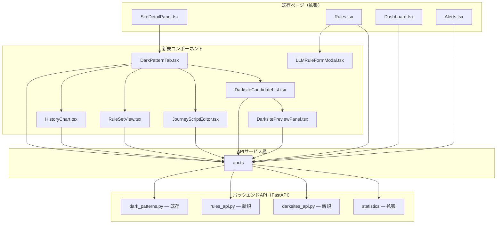
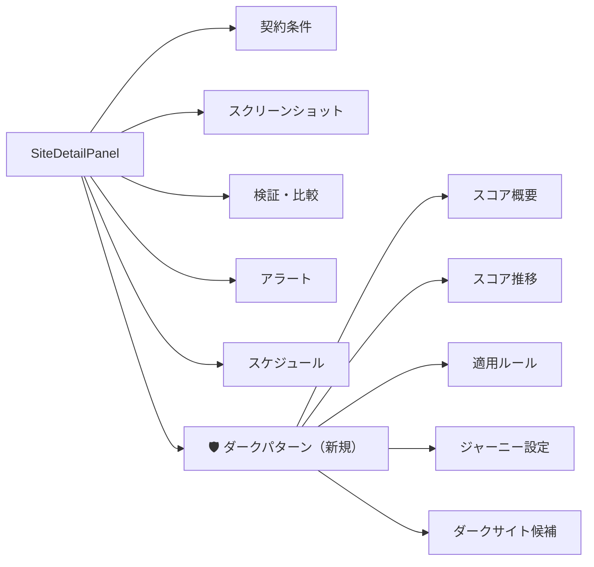
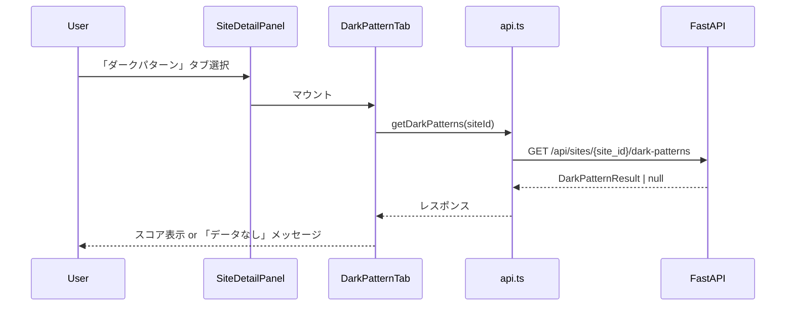

# 設計書: ダークパターン検出フロントエンドUI

## 概要

本設計書は、バックエンドで実装済みのダークパターン検出・スコアリング・LLMルール・ダークサイト候補検出の各機能を、既存のReact + TypeScript フロントエンドに統合するための技術設計を定義する。

対象は9カテゴリ（FR-1〜FR-9）のUI変更・新規コンポーネント作成であり、既存の `SiteDetailPanel`、`Rules`、`Dashboard`、`Alerts` の各ページを拡張する形で実装する。新規ページ追加やサイドバー変更は行わない。

バックエンドCRUD API（動的LLMルール管理、ダークサイト候補取得）が未実装のため、フロントエンドとバックエンドAPIの両方を本設計に含める。

### 技術スタック

- React 18 + TypeScript + Vite
- Chart.js（react-chartjs-2）— Dashboard で使用中
- axios — `api.ts` で使用中
- react-router-dom — `AppLayout.tsx` で使用中
- 既存UIコンポーネント: Card, Badge, Select, Modal, Button, Table, HelpButton, Input, Sidebar

### 設計方針

1. 既存コンポーネントの拡張を優先し、新規ページ追加は行わない
2. `api.ts` に型定義とAPI関数を集約する既存パターンを踏襲
3. バックエンドAPIはFastAPI + SQLAlchemy の既存パターンに従う
4. CTO Override: LLMルールの `prompt_template` には `{page_text}` 必須バリデーションをフロント・バックエンド両方で実施

## アーキテクチャ

### コンポーネント構成図



### SiteDetailPanel タブ構成



### データフロー



## コンポーネントとインターフェース

### 1. DarkPatternTab（FR-1, FR-2, FR-5, FR-7, FR-9 統合）

`SiteDetailPanel.tsx` の6番目のタブとして追加。内部にサブタブを持つ。

```typescript
// components/hierarchy/tabs/DarkPatternTab.tsx
interface DarkPatternTabProps {
  siteId: number;
}

type DarkPatternSubTab = 'score' | 'history' | 'rules' | 'journey' | 'darksites';
```

SiteDetailPanel の `TabType` を拡張:
```typescript
export type TabType = 'contracts' | 'screenshots' | 'verification' | 'alerts' | 'schedule' | 'darkpattern';
```

### 2. ScoreGauge（FR-1 スコア表示）

スコア値に応じた色分けプログレスバー。

```typescript
interface ScoreGaugeProps {
  score: number;       // 0.0〜1.0
  label?: string;
}
// 色分け: 0〜0.3=緑(#22c55e), 0.3〜0.6=黄(#eab308), 0.6〜1.0=赤(#ef4444)
```

### 3. HistoryChart（FR-2 スコア履歴）

Chart.js Line コンポーネントで5本の折れ線グラフを表示。

```typescript
interface HistoryChartProps {
  siteId: number;
}
// 折れ線: 総合スコア, CSS視覚欺瞞, LLM分類, ジャーニー, UIトラップ
// X軸: 検出日時, Y軸: 0.0〜1.0
```

### 4. LLMRuleFormModal（FR-4 ルールCRUD）

動的LLMルールの作成・編集モーダル。

```typescript
interface LLMRuleFormModalProps {
  isOpen: boolean;
  onClose: () => void;
  onSave: () => void;
  editingRule?: DynamicRule | null;  // null = 新規作成
}
```

フォームフィールド:
- `rule_name`: テキスト入力（必須）
- `description`: テキスト入力
- `severity`: Select（critical/warning/info）
- `dark_pattern_category`: Select（DarkPatternCategory enum値）
- `confidence_threshold`: 数値入力（0.0〜1.0）
- `execution_order`: 数値入力（0以上）
- `created_by`: テキスト入力（必須）
- `prompt_template`: textarea（必須、`{page_text}` バリデーション）
- `applicable_categories`: 複数選択チップ
- `applicable_site_ids`: 複数入力チップ

### 5. RuleSetView（FR-5 適用ルール表示）

サイトに適用されるルールセットの読み取り専用表示。

```typescript
interface RuleSetViewProps {
  siteId: number;
}
```

### 6. JourneyScriptEditor（FR-7 ジャーニーエディタ）

```typescript
interface JourneyScriptEditorProps {
  siteId: number;
}

// バリデーション対象コマンド
const VALID_COMMANDS = ['navigate', 'click', 'wait', 'assert_visible', 'assert_not_visible', 'fill', 'scroll'];
```

### 7. DarksiteCandidateList / DarksitePreviewPanel（FR-9）

```typescript
interface DarksiteCandidateListProps {
  siteId: number;
}

interface DarksitePreviewPanelProps {
  candidateId: number;
  onClose: () => void;
}
```

### 8. Rules.tsx 拡張（FR-4）

既存の `Rules.tsx` にタブ切替を追加:
- 「ビルトイン」タブ: 既存の静的ルール5件をそのまま表示
- 「LLMルール」タブ: DB連携のCRUD操作付き動的ルール一覧

### 9. Dashboard.tsx 拡張（FR-8）

既存の `Dashboard.tsx` に以下を追加:
- 統計カード2枚: 「高リスクサイト数」「DP検出数」
- スコア分布横棒グラフ（Chart.js Bar horizontal）
- カテゴリ別検出数横棒グラフ

### 10. Alerts.tsx 拡張（FR-6）

既存の `Alerts.tsx` に以下を追加:
- アラートカードヘッダーに `dark_pattern_category` Badge
- アラートカード内に確信度表示
- フィルターに「ダークパターンカテゴリ」Select

