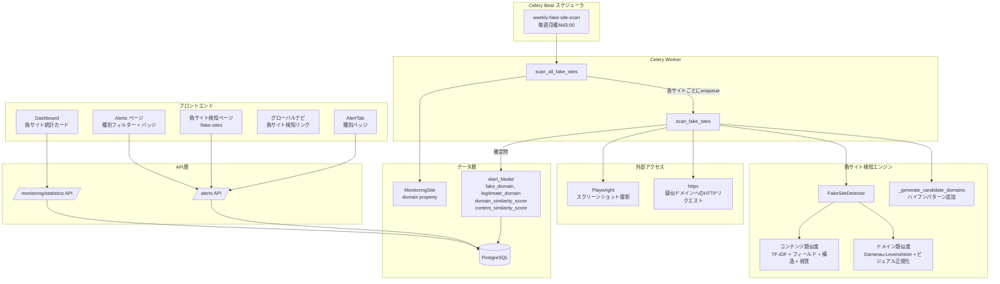
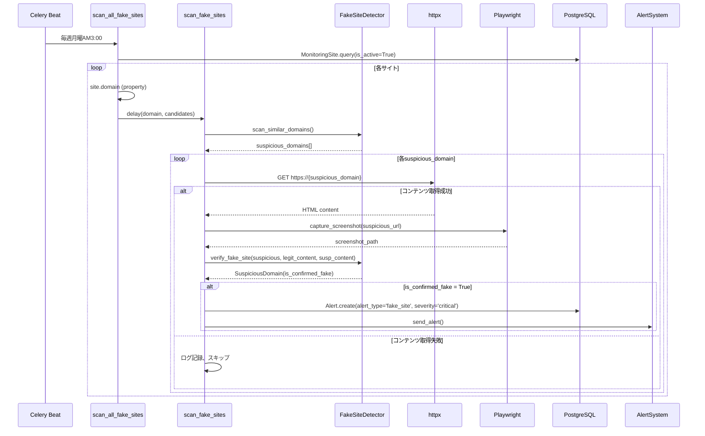

# 技術設計ドキュメント: 偽サイト検知アラート

## Overview

本設計は、偽サイト検知の完全なフロー実装とアラートシステムの統合改善を実現する。現在のシステムでは`FakeSiteDetector`のドメイン類似度チェックは実装済みだが、以下の問題が存在する：

1. `_scan_fake_sites_async`で`verify_fake_site()`が呼ばれておらず、コンテンツ比較による確定判定が動作しない
2. `MonitoringSite`に`domain`フィールドがなく、`scan_all_fake_sites`で`site.domain`参照時にAttributeErrorが発生する
3. `AlertResponse`スキーマにフロントエンドが期待する`site_name`, `violation_type`, `is_resolved`, `site_id`フィールドがない
4. 偽サイトアラート専用のUI（ダッシュボード統計、フィルタリング、専用ページ、TakeDown表示）が未実装
5. ドメイン類似度アルゴリズムがDamerau-Levenshtein距離未対応、ビジュアル類似文字正規化なし
6. TF-IDFにIDF重み付けがなく、コンテンツ類似度の精度が不十分

本設計では、バックエンドの検知フロー接続・モデル拡張・アルゴリズム改善と、フロントエンドのUI統合を段階的に実装する。

### 設計判断

- **MonitoringSiteへのdomainカラム追加ではなく、`@property`で実装**: マイグレーション不要で既存データに影響なし。URLからの動的抽出で常に最新値を返す
- **Alert_Modelに偽サイト専用フィールドを直接追加**: JSONBカラムではなく個別カラムとすることで、クエリ・インデックス・型安全性を確保
- **コンテンツ類似度の加重平均方式**: テキスト(0.4) + フィールド一致(0.3) + 構造(0.15) + 視覚(0.15)の4指標で多角的に判定
- **pHash比較にはimagehashライブラリを使用**: Pillowベースで軽量、既存のスクリーンショット撮影基盤（Playwright）と統合しやすい

## Architecture

### システム構成図



### 処理フロー



## Components and Interfaces

### バックエンド コンポーネント

#### 1. MonitoringSite.domain プロパティ (`genai/src/models.py`)

```python
@property
def domain(self) -> str:
    """URLからドメイン名を抽出する。www.プレフィックスを除去。"""
```

- `urllib.parse.urlparse`でホスト名を抽出
- `www.`プレフィックスを除去
- 空文字列・不正URLの場合は空文字列を返す

#### 2. FakeSiteDetector 改善 (`genai/src/fake_detector.py`)

```python
class FakeSiteDetector:
    # 既存メソッドの改善
    def _damerau_levenshtein_distance(self, s1: str, s2: str) -> int: ...
    def _normalize_visual_chars(self, domain: str) -> str: ...
    def _normalize_domain(self, domain: str) -> str: ...  # 複合TLD対応
    def calculate_domain_similarity(self, domain1: str, domain2: str) -> float: ...  # ハイフン除去比較追加
    
    # 新規メソッド
    def calculate_field_similarity(self, content1: str, content2: str) -> float: ...
    def calculate_structure_similarity(self, html1: str, html2: str) -> float: ...
    def calculate_visual_similarity(self, img_path1: str, img_path2: str) -> float: ...
    def calculate_content_similarity(self, content1: str, content2: str,
                                      img_path1: str | None = None,
                                      img_path2: str | None = None) -> float: ...
```

**ビジュアル類似文字マッピング:**
```python
VISUAL_SIMILAR_CHARS = {
    'rn': 'm', 'vv': 'w', 'cl': 'd', 'nn': 'm',
    'ri': 'n', 'lI': 'd', 'cI': 'd',
}
```

**複合TLDリスト（主要なもの）:**
```python
COMPOUND_TLDS = [
    'co.jp', 'or.jp', 'ne.jp', 'ac.jp', 'go.jp',
    'com.au', 'co.uk', 'co.kr', 'com.br', 'com.cn',
    'co.nz', 'co.in', 'com.tw', 'com.hk',
]
```

#### 3. _generate_candidate_domains 改善 (`genai/src/tasks.py`)

```python
def _generate_candidate_domains(legitimate_domain: str) -> list[str]:
    # 既存パターン + 新規ハイフンパターン
    # - ハイフン追加: "example" -> "ex-ample", "exa-mple" 等
    # - ハイフン削除: "my-shop" -> "myshop"
```

#### 4. scan_fake_sites タスク改善 (`genai/src/tasks.py`)

```python
async def _scan_fake_sites_async(...) -> dict[str, Any]:
    # 1. scan_similar_domains() で類似ドメイン検出
    # 2. 各類似ドメインに対して httpx で GET リクエスト
    # 3. コンテンツ取得成功時: verify_fake_site() 呼び出し
    # 4. コンテンツ取得失敗時: ログ記録してスキップ
    # 5. is_confirmed_fake=True の場合: Alert_Model に保存
```

#### 5. Alert_Model 拡張 (`genai/src/models.py`)

```python
class Alert(Base):
    # 既存フィールド + 新規フィールド
    fake_domain: Mapped[Optional[str]]          # 偽ドメイン名
    legitimate_domain: Mapped[Optional[str]]     # 正規ドメイン名
    domain_similarity_score: Mapped[Optional[float]]   # ドメイン類似度
    content_similarity_score: Mapped[Optional[float]]  # コンテンツ類似度
```

#### 6. AlertResponse スキーマ拡張 (`genai/src/api/schemas.py`)

```python
class AlertResponse(BaseModel):
    # 既存フィールド + 新規フィールド
    site_name: Optional[str] = None
    violation_type: Optional[str] = None
    is_resolved: bool
    site_id: Optional[int] = None
    fake_domain: Optional[str] = None
    legitimate_domain: Optional[str] = None
    domain_similarity_score: Optional[float] = None
    content_similarity_score: Optional[float] = None
```

#### 7. Alerts API 拡張 (`genai/src/api/alerts.py`)

- `list_alerts`にalert_typeフィルターパラメータ追加
- レスポンス構築時にsite_name（MonitoringSite.nameからJOIN）とviolation_type（Violation.violation_typeまたは'fake_site'）を付与

#### 8. Statistics API 拡張 (`genai/src/api/monitoring.py`)

```python
class MonitoringStatistics(BaseModel):
    # 既存フィールド + 新規フィールド
    fake_site_alerts: int                    # 偽サイトアラート総数
    unresolved_fake_site_alerts: int         # 未解決偽サイトアラート数
```

### フロントエンド コンポーネント

#### 1. Alert型拡張 (`genai/frontend/src/services/api.ts`)

```typescript
export interface Alert {
  id: number;
  site_id: number;
  site_name: string;
  severity: 'low' | 'medium' | 'high' | 'critical';
  message: string;
  alert_type: string;          // 追加
  violation_type: string;
  created_at: string;
  is_resolved: boolean;
  fake_domain?: string;        // 追加
  legitimate_domain?: string;  // 追加
  domain_similarity_score?: number;   // 追加
  content_similarity_score?: number;  // 追加
}

export interface Statistics {
  // 既存フィールド + 新規
  fake_site_alerts: number;
  unresolved_fake_site_alerts: number;
}
```

#### 2. Dashboard 偽サイト統計カード (`genai/frontend/src/pages/Dashboard.tsx`)

- 偽サイト検知数カード（`fake_site_alerts`）
- 未解決偽サイトアラート数カード（`unresolved_fake_site_alerts`）

#### 3. Alerts ページ改善 (`genai/frontend/src/pages/Alerts.tsx`)

- アラート種別フィルター（セレクトボックス）: すべて / 契約違反 / 偽サイト
- 偽サイトアラートに赤色「偽サイト」バッジ
- 契約違反アラートに黄色「契約違反」バッジ
- TakeDown対応バナー（未解決偽サイトアラート時）

#### 4. FakeSites ページ新規作成 (`genai/frontend/src/pages/FakeSites.tsx`)

- `/fake-sites`ルートに登録
- alert_type='fake_site'のアラートをフィルタリング表示
- 各アラートに検知ドメイン、類似度スコア、検知日時、対応ステータスを表示

#### 5. AlertTab 改善 (`genai/frontend/src/components/hierarchy/tabs/AlertTab.tsx`)

- 各アラートアイテムにアラート種別バッジ（偽サイト/契約違反）を追加

#### 6. App ナビゲーション更新 (`genai/frontend/src/App.tsx`)

- グローバルナビに「偽サイト検知」リンク追加
- `/fake-sites`ルート登録


## Data Models

### Alert_Model 拡張

```sql
ALTER TABLE alerts ADD COLUMN fake_domain VARCHAR(255) NULL;
ALTER TABLE alerts ADD COLUMN legitimate_domain VARCHAR(255) NULL;
ALTER TABLE alerts ADD COLUMN domain_similarity_score FLOAT NULL;
ALTER TABLE alerts ADD COLUMN content_similarity_score FLOAT NULL;

CREATE INDEX ix_alerts_fake_domain ON alerts(fake_domain);
```

**SQLAlchemy定義:**

```python
class Alert(Base):
    __tablename__ = "alerts"
    
    # 既存フィールド（変更なし）
    id: Mapped[int] = mapped_column(Integer, primary_key=True, autoincrement=True)
    violation_id: Mapped[int] = mapped_column(Integer, ForeignKey("violations.id"), nullable=True)
    alert_type: Mapped[str] = mapped_column(String(50), nullable=False)
    severity: Mapped[str] = mapped_column(String(20), nullable=False)
    message: Mapped[str] = mapped_column(Text, nullable=False)
    is_resolved: Mapped[bool] = mapped_column(Boolean, default=False, nullable=False)
    site_id: Mapped[Optional[int]] = mapped_column(Integer, ForeignKey("monitoring_sites.id"), nullable=True)
    email_sent: Mapped[bool] = mapped_column(Boolean, default=False, nullable=False)
    slack_sent: Mapped[bool] = mapped_column(Boolean, default=False, nullable=False)
    created_at: Mapped[datetime] = mapped_column(DateTime, nullable=False, default=datetime.utcnow)
    old_price: Mapped[Optional[float]] = mapped_column(Float, nullable=True)
    new_price: Mapped[Optional[float]] = mapped_column(Float, nullable=True)
    change_percentage: Mapped[Optional[float]] = mapped_column(Float, nullable=True)
    
    # 新規フィールド（偽サイト検知用）
    fake_domain: Mapped[Optional[str]] = mapped_column(String(255), nullable=True)
    legitimate_domain: Mapped[Optional[str]] = mapped_column(String(255), nullable=True)
    domain_similarity_score: Mapped[Optional[float]] = mapped_column(Float, nullable=True)
    content_similarity_score: Mapped[Optional[float]] = mapped_column(Float, nullable=True)
```

### MonitoringSite domain プロパティ

```python
class MonitoringSite(Base):
    # 既存フィールド（変更なし）
    
    @property
    def domain(self) -> str:
        """URLからドメイン名を抽出する。"""
        if not self.url:
            return ""
        try:
            from urllib.parse import urlparse
            parsed = urlparse(self.url)
            hostname = parsed.hostname or ""
            # www. プレフィックス除去
            if hostname.startswith("www."):
                hostname = hostname[4:]
            return hostname
        except Exception:
            return ""
```

### AlertResponse スキーマ（完全定義）

```python
class AlertResponse(BaseModel):
    id: int
    violation_id: Optional[int] = None
    alert_type: str
    severity: str
    message: str
    email_sent: bool
    slack_sent: bool
    created_at: datetime
    is_resolved: bool
    site_id: Optional[int] = None
    site_name: Optional[str] = None
    violation_type: Optional[str] = None
    old_price: Optional[float] = None
    new_price: Optional[float] = None
    change_percentage: Optional[float] = None
    fake_domain: Optional[str] = None
    legitimate_domain: Optional[str] = None
    domain_similarity_score: Optional[float] = None
    content_similarity_score: Optional[float] = None

    class Config:
        from_attributes = True
```

### MonitoringStatistics スキーマ（拡張）

```python
class MonitoringStatistics(BaseModel):
    total_sites: int
    active_sites: int
    total_violations: int
    high_severity_violations: int
    success_rate: float
    last_crawl: Optional[datetime]
    fake_site_alerts: int                    # 新規
    unresolved_fake_site_alerts: int         # 新規
```

### SuspiciousDomain データクラス（変更なし）

```python
@dataclass
class SuspiciousDomain:
    domain: str
    similarity_score: float
    content_similarity: Optional[float]
    is_confirmed_fake: bool
    legitimate_domain: str
```


## Correctness Properties

*A property is a characteristic or behavior that should hold true across all valid executions of a system—essentially, a formal statement about what the system should do. Properties serve as the bridge between human-readable specifications and machine-verifiable correctness guarantees.*

### Property 1: ドメイン抽出の正確性

*For any* MonitoringSite with a valid URL containing a protocol, the `domain` property shall return the hostname without protocol, port, path, or `www.` prefix. Empty or malformed URLs shall return an empty string.

**Validates: Requirements 1.1, 1.2, 1.3, 1.4**

### Property 2: 確定偽サイトのアラート生成

*For any* SuspiciousDomain where `is_confirmed_fake=True`, the scan_fake_sites タスクが生成するAlertレコードは `alert_type='fake_site'` かつ `severity='critical'` であり、`fake_domain`, `legitimate_domain`, `domain_similarity_score`, `content_similarity_score` が正しく設定されること。

**Validates: Requirements 2.4, 8.1, 8.2, 8.3, 8.4**

### Property 3: API site_name解決

*For any* Alert with a non-null `site_id`, the alerts API response shall include `site_name` equal to the corresponding MonitoringSite's `name` field.

**Validates: Requirements 3.5**

### Property 4: API violation_type解決

*For any* Alert, the alerts API response shall include `violation_type` derived as follows: if `alert_type='fake_site'` then `violation_type='fake_site'`; otherwise if `violation_id` is set, then `violation_type` equals the corresponding Violation's `violation_type` field.

**Validates: Requirements 3.6, 3.7**

### Property 5: 偽サイト統計カウントの正確性

*For any* database state, the statistics API shall return `fake_site_alerts` equal to the count of Alert records where `alert_type='fake_site'`, and `unresolved_fake_site_alerts` equal to the count of Alert records where `alert_type='fake_site'` AND `is_resolved=False`.

**Validates: Requirements 4.3, 4.4**

### Property 6: アラート種別フィルタリング

*For any* list of alerts and any alert type filter selection, the filtered result shall contain only alerts matching the filter criteria: 「偽サイト」フィルターは `alert_type='fake_site'` のみ、「契約違反」フィルターは `alert_type!='fake_site'` のみ、「すべて」は全件を返す。

**Validates: Requirements 5.2, 5.3**

### Property 7: TakeDownバナーの条件付き表示

*For any* alert where `alert_type='fake_site'`, the TakeDown警告バナーは `is_resolved=False` の場合にのみ表示され、`is_resolved=True` の場合は非表示となること。

**Validates: Requirements 7.1, 7.4**

### Property 8: 偽サイトアラート表示の完全性

*For any* fake site alert displayed on the 偽サイト検知ページ, the rendered output shall include the detected fake domain name, similarity score, detection datetime, and resolution status.

**Validates: Requirements 6.4**

### Property 9: Damerau-Levenshtein距離の転置操作

*For any* string and any pair of adjacent characters in that string, swapping those two adjacent characters shall result in a Damerau-Levenshtein distance of exactly 1 from the original string.

**Validates: Requirements 9.1**

### Property 10: ビジュアル類似文字の正規化

*For any* domain string containing visual similar character sequences (`rn`, `vv`, `cl`, `nn`), applying visual normalization shall replace those sequences with their visual equivalents (`m`, `w`, `d`, `m`), and the normalized result shall be idempotent (normalizing twice yields the same result as normalizing once).

**Validates: Requirements 9.2**

### Property 11: ハイフン除去による類似度最大化

*For any* two domains where at least one contains hyphens, the domain similarity score with hyphen-removal comparison shall be greater than or equal to the score without hyphen-removal comparison.

**Validates: Requirements 9.3**

### Property 12: 候補ドメインのハイフンパターン生成

*For any* domain containing hyphens, the generated candidate domains shall include a version with hyphens removed. *For any* domain without hyphens and with length >= 4, the generated candidate domains shall include at least one version with a hyphen inserted.

**Validates: Requirements 9.4**

### Property 13: 複合TLDの正規化

*For any* domain with a known compound TLD (e.g., `.co.jp`, `.com.au`), the `_normalize_domain` method shall correctly separate the domain name from the compound TLD, preserving the full TLD intact.

**Validates: Requirements 9.5**

### Property 14: 重要フィールド一致によるボーナス加算

*For any* two HTML documents where important fields (product name, price, brand) match, the content similarity score shall be greater than or equal to the score computed without the field match bonus.

**Validates: Requirements 10.2**

### Property 15: コンテンツ類似度の加重平均

*For any* set of sub-scores (text_similarity, field_similarity, structure_similarity, visual_similarity), the final content similarity score shall equal `text_similarity * 0.4 + field_similarity * 0.3 + structure_similarity * 0.15 + visual_similarity * 0.15`, and the result shall be in the range [0.0, 1.0].

**Validates: Requirements 10.5**

## Error Handling

### バックエンド

| エラー状況 | 対応 |
|---|---|
| MonitoringSite.url が空/不正 | `domain` プロパティが空文字列を返す。scan_all_fake_sitesはスキップしてログ記録 |
| 疑似ドメインへのHTTPリクエスト失敗（DNS解決失敗、タイムアウト、HTTP 4xx/5xx） | 該当ドメインをスキップ、ログにwarningレベルで記録。他のドメインの処理は継続 |
| Playwright スクリーンショット撮影失敗 | 視覚類似度を0.0として扱い、他の3指標で類似度を計算（重みを再配分: テキスト0.47, フィールド0.35, 構造0.18） |
| imagehash ライブラリ未インストール | ImportErrorをキャッチし、視覚類似度を0.0として扱う |
| verify_fake_site() 内部エラー | 該当ドメインをスキップ、ログにerrorレベルで記録 |
| DB接続エラー（アラート保存時） | Celeryのリトライ機構で最大3回リトライ（exponential backoff） |
| scan_all_fake_sites でサイト一覧取得失敗 | タスク全体をエラーとして記録、次回スケジュール実行を待つ |

### フロントエンド

| エラー状況 | 対応 |
|---|---|
| API レスポンスに新規フィールドが含まれない（後方互換） | Optional フィールドはデフォルト値（null/undefined）で表示。バッジは非表示 |
| Statistics API で fake_site_alerts が返らない | 0として表示、統計カードは「データなし」表示 |
| 偽サイト検知ページでアラート取得失敗 | エラーメッセージ表示、リトライボタン提供 |

## Testing Strategy

### プロパティベーステスト

**ライブラリ:** Python側は `hypothesis`、TypeScript側は `fast-check` を使用する。

**設定:**
- 各プロパティテストは最低100イテレーション実行
- 各テストにはデザインドキュメントのプロパティ番号をタグとして付与
- タグ形式: `Feature: fake-site-detection-alert, Property {number}: {property_text}`

**バックエンド プロパティテスト:**

| プロパティ | テスト内容 | ファイル |
|---|---|---|
| Property 1 | ランダムURL生成 → domain プロパティ → hostname一致検証 | `test_fake_site_properties.py` |
| Property 9 | ランダム文字列 → 隣接文字転置 → DL距離=1検証 | `test_fake_site_properties.py` |
| Property 10 | ビジュアル類似文字含むランダムドメイン → 正規化 → 冪等性検証 | `test_fake_site_properties.py` |
| Property 11 | ハイフン含むランダムドメインペア → 類似度比較 → max検証 | `test_fake_site_properties.py` |
| Property 12 | ランダムドメイン → 候補生成 → ハイフンパターン含有検証 | `test_fake_site_properties.py` |
| Property 13 | 複合TLD付きランダムドメイン → 正規化 → TLD分離検証 | `test_fake_site_properties.py` |
| Property 15 | ランダムサブスコア4つ → 加重平均 → 数値一致検証 | `test_fake_site_properties.py` |

**フロントエンド プロパティテスト:**

| プロパティ | テスト内容 | ファイル |
|---|---|---|
| Property 6 | ランダムアラートリスト → フィルタリング → 結果検証 | `Alerts.test.tsx` |
| Property 7 | ランダム偽サイトアラート → TakeDownバナー表示条件検証 | `FakeSites.test.tsx` |

### ユニットテスト

**バックエンド:**
- `verify_fake_site()` 呼び出しフローの統合テスト（Requirements 2.1, 2.2, 2.3）
- HTTPリクエスト失敗時のスキップ動作（Requirements 2.3）
- AlertResponse スキーマのフィールド存在確認（Requirements 3.1-3.4, 8.5）
- alerts API の site_name/violation_type 解決（Requirements 3.5, 3.6, 3.7）
- statistics API の fake_site_alerts カウント（Requirements 4.3, 4.4）
- IDF重み付けの効果確認（Requirements 10.1）
- DOM構造類似度の範囲検証（Requirements 10.3）
- pHash視覚類似度の同一画像テスト（Requirements 10.4）

**フロントエンド:**
- Dashboard 偽サイト統計カード表示（Requirements 4.1, 4.2）
- Alerts ページ種別フィルターUI存在確認（Requirements 5.1）
- 偽サイト/契約違反バッジ表示（Requirements 5.4, 5.5, 5.6）
- App ナビゲーション「偽サイト検知」リンク存在（Requirements 6.1, 6.2）
- FakeSites ページ一覧表示（Requirements 6.3）
- TakeDown バナー表示（Requirements 7.2, 7.3）
- Alert_Model 新規フィールド存在確認（Requirements 8.1-8.4）
