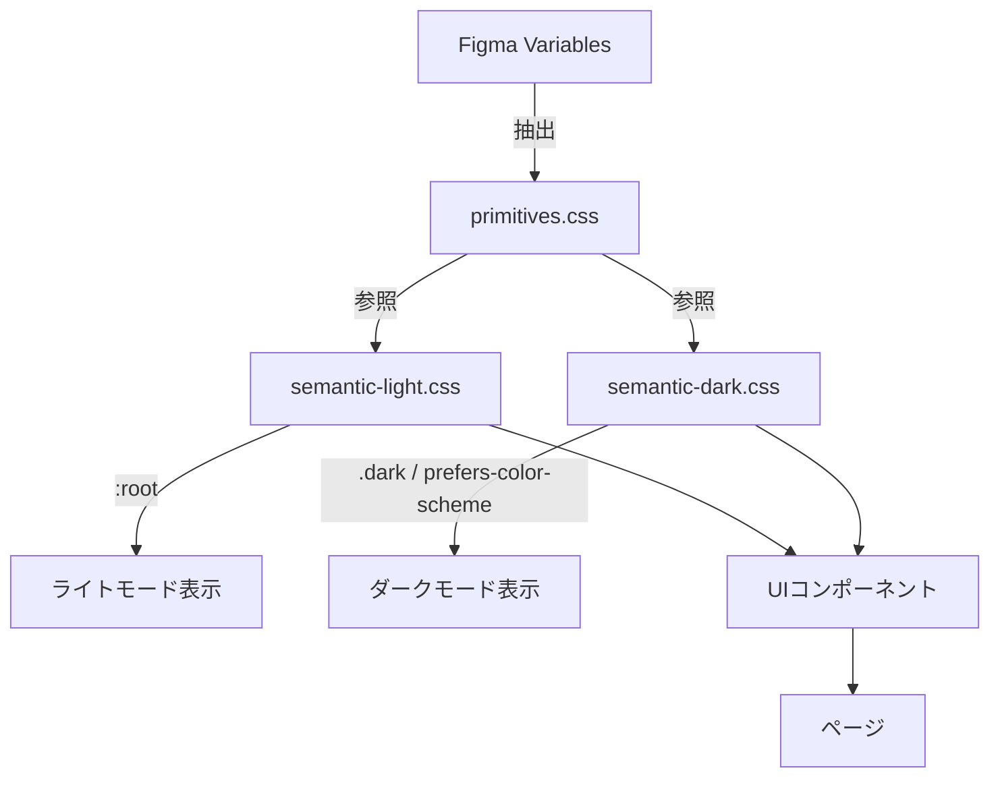

# 設計書: Figma UX改善

## 概要

本設計書は、決済条件監視システムのフロントエンドUIを、Figma SDS（Simple Design System）を基盤としたデザインシステムに移行し、UXを継続的に改善するためのアーキテクチャと実装方針を定義する。

### 現状の課題

- `App.css`に約800行のグローバルCSS（`:root`変数9個、ハードコードされた色値多数）
- コンポーネント間でスタイル定義が重複（`.stat-card`、`.alert-card`、`.rule-card`等が類似パターン）
- レスポンシブ対応が`@media (max-width: 768px)`の1ブレークポイントのみ
- ダークモード未対応
- ナビゲーションが10項目のフラットなトップバーで、モバイル対応なし

### 設計方針

1. Figma SDSのVariables/Styles/Components/Code Connectパターンを参考に、プリミティブ→セマンティックの2層トークン構造を構築
2. 既存のCSS変数ベースのスタイリングを活かし、CSS Custom Propertiesでトークンを実装（CSSフレームワーク不使用の方針を維持）
3. 段階的移行：トークン定義→共通コンポーネント→ページリファクタリングの順で実施

## アーキテクチャ

### ディレクトリ構成

```
genai/frontend/src/
├── tokens/                          # デザイントークン層
│   ├── primitives.css               # プリミティブトークン（色、サイズの生値）
│   ├── semantic-light.css           # ライトモード用セマンティックトークン
│   ├── semantic-dark.css            # ダークモード用セマンティックトークン
│   └── index.css                    # トークンエントリポイント（メディアクエリ統合）
├── components/
│   ├── ui/                          # 共通UIコンポーネント（SDS準拠）
│   │   ├── Button/
│   │   │   ├── Button.tsx
│   │   │   ├── Button.css
│   │   │   └── Button.test.tsx
│   │   ├── Badge/
│   │   ├── Card/
│   │   ├── Table/
│   │   ├── Modal/
│   │   ├── Input/
│   │   ├── Select/
│   │   ├── Sidebar/
│   │   └── ThemeToggle/
│   ├── category/                    # 既存ドメインコンポーネント
│   ├── hierarchy/
│   └── ...（既存コンポーネント）
├── layouts/
│   ├── AppLayout.tsx                # サイドバー+メインコンテンツレイアウト
│   └── AppLayout.css
├── hooks/
│   ├── useTheme.ts                  # テーマ切替フック
│   ├── useMediaQuery.ts             # レスポンシブ判定フック
│   └── useAutoRefresh.ts            # 既存
├── pages/                           # 既存ページ（段階的リファクタリング）
└── figma/
    └── component-mapping.md         # Figma↔コードコンポーネント対応表
```

### トークンアーキテクチャ（2層構造）



**第1層: プリミティブトークン** — 色・サイズの生値。Figma Variablesのプリミティブコレクションに対応。

**第2層: セマンティックトークン** — 用途別の意味を持つ変数。ライト/ダーク各モードで異なるプリミティブ値を参照。


## コンポーネントとインターフェース

### デザイントークンシステム

#### primitives.css

```css
/* 色プリミティブ — Figma SDSのVariablesコレクションに対応 */
:root {
  /* Blue */
  --blue-50: #eff6ff;
  --blue-100: #dbeafe;
  --blue-500: #3b82f6;
  --blue-600: #2563eb;
  --blue-700: #1d4ed8;
  --blue-800: #1e40af;

  /* Gray */
  --gray-50: #f9fafb;
  --gray-100: #f3f4f6;
  --gray-200: #e5e7eb;
  --gray-300: #d1d5db;
  --gray-500: #6b7280;
  --gray-700: #374151;
  --gray-800: #1f2937;
  --gray-900: #111827;

  /* Green */
  --green-50: #f0fdf4;
  --green-100: #d1fae5;
  --green-500: #10b981;
  --green-700: #065f46;

  /* Red */
  --red-50: #fef2f2;
  --red-100: #fee2e2;
  --red-500: #ef4444;
  --red-700: #991b1b;

  /* Yellow/Amber */
  --amber-50: #fffbeb;
  --amber-100: #fef3c7;
  --amber-500: #f59e0b;
  --amber-700: #92400e;

  /* Orange */
  --orange-100: #fed7aa;
  --orange-700: #9a3412;

  /* スペーシング */
  --space-0: 0;
  --space-1: 0.25rem;   /* 4px */
  --space-2: 0.5rem;    /* 8px */
  --space-3: 0.75rem;   /* 12px */
  --space-4: 1rem;      /* 16px */
  --space-5: 1.25rem;   /* 20px */
  --space-6: 1.5rem;    /* 24px */
  --space-8: 2rem;      /* 32px */
  --space-10: 2.5rem;   /* 40px */
  --space-12: 3rem;     /* 48px */

  /* フォントサイズ */
  --font-xs: 0.75rem;    /* 12px */
  --font-sm: 0.8125rem;  /* 13px */
  --font-base: 0.875rem; /* 14px */
  --font-md: 1rem;       /* 16px */
  --font-lg: 1.25rem;    /* 20px */
  --font-xl: 1.5rem;     /* 24px */
  --font-2xl: 2rem;      /* 32px */

  /* ボーダー半径 */
  --radius-sm: 4px;
  --radius-md: 6px;
  --radius-lg: 8px;
  --radius-full: 9999px;

  /* シャドウ */
  --shadow-sm: 0 1px 2px rgba(0, 0, 0, 0.05);
  --shadow-md: 0 1px 3px rgba(0, 0, 0, 0.1);
  --shadow-lg: 0 10px 15px -3px rgba(0, 0, 0, 0.1), 0 4px 6px -2px rgba(0, 0, 0, 0.05);
  --shadow-xl: 0 20px 25px -5px rgba(0, 0, 0, 0.1), 0 10px 10px -5px rgba(0, 0, 0, 0.04);
}
```

#### semantic-light.css

```css
/* ライトモード — セマンティックトークン */
:root, [data-theme="light"] {
  /* 背景 */
  --color-bg-primary: var(--gray-50);
  --color-bg-surface: #ffffff;
  --color-bg-surface-hover: var(--gray-50);
  --color-bg-overlay: rgba(0, 0, 0, 0.5);

  /* テキスト */
  --color-text-primary: var(--gray-900);
  --color-text-secondary: var(--gray-500);
  --color-text-inverse: #ffffff;

  /* ブランド/アクション */
  --color-accent: var(--blue-600);
  --color-accent-hover: var(--blue-700);
  --color-accent-subtle: var(--blue-50);

  /* ステータス */
  --color-success: var(--green-500);
  --color-success-subtle: var(--green-50);
  --color-success-text: var(--green-700);
  --color-warning: var(--amber-500);
  --color-warning-subtle: var(--amber-50);
  --color-warning-text: var(--amber-700);
  --color-danger: var(--red-500);
  --color-danger-subtle: var(--red-50);
  --color-danger-text: var(--red-700);

  /* ボーダー */
  --color-border: var(--gray-200);
  --color-border-focus: var(--blue-600);

  /* ナビゲーション */
  --color-nav-bg: #ffffff;
  --color-nav-active: var(--blue-50);
  --color-nav-text: var(--gray-500);
  --color-nav-text-active: var(--blue-600);
}
```

#### semantic-dark.css

```css
/* ダークモード — セマンティックトークン */
[data-theme="dark"] {
  --color-bg-primary: var(--gray-900);
  --color-bg-surface: var(--gray-800);
  --color-bg-surface-hover: var(--gray-700);
  --color-bg-overlay: rgba(0, 0, 0, 0.7);

  --color-text-primary: var(--gray-50);
  --color-text-secondary: var(--gray-300);
  --color-text-inverse: var(--gray-900);

  --color-accent: var(--blue-500);
  --color-accent-hover: var(--blue-600);
  --color-accent-subtle: rgba(59, 130, 246, 0.15);

  --color-success: var(--green-500);
  --color-success-subtle: rgba(16, 185, 129, 0.15);
  --color-success-text: var(--green-100);
  --color-warning: var(--amber-500);
  --color-warning-subtle: rgba(245, 158, 11, 0.15);
  --color-warning-text: var(--amber-100);
  --color-danger: var(--red-500);
  --color-danger-subtle: rgba(239, 68, 68, 0.15);
  --color-danger-text: var(--red-100);

  --color-border: var(--gray-700);
  --color-border-focus: var(--blue-500);

  --color-nav-bg: var(--gray-800);
  --color-nav-active: rgba(59, 130, 246, 0.15);
  --color-nav-text: var(--gray-300);
  --color-nav-text-active: var(--blue-500);

  /* ダークモード用シャドウ調整 */
  --shadow-sm: 0 1px 2px rgba(0, 0, 0, 0.3);
  --shadow-md: 0 1px 3px rgba(0, 0, 0, 0.4);
  --shadow-lg: 0 10px 15px -3px rgba(0, 0, 0, 0.4);
  --shadow-xl: 0 20px 25px -5px rgba(0, 0, 0, 0.5);
}

/* システム設定によるダークモード自動検出 */
@media (prefers-color-scheme: dark) {
  :root:not([data-theme="light"]) {
    /* semantic-dark.cssと同じ値を適用 */
    --color-bg-primary: var(--gray-900);
    --color-bg-surface: var(--gray-800);
    /* ... 以下同様 */
  }
}
```

#### tokens/index.css（エントリポイント）

```css
@import './primitives.css';
@import './semantic-light.css';
@import './semantic-dark.css';
```

### 共通UIコンポーネント

SDS（Simple Design System）のパターンに準拠し、以下のコンポーネントを提供する。各コンポーネントはセマンティックトークンのみを参照する。

#### Button コンポーネント

```typescript
interface ButtonProps {
  variant: 'primary' | 'secondary' | 'danger' | 'ghost';
  size: 'sm' | 'md' | 'lg';
  disabled?: boolean;
  loading?: boolean;
  children: React.ReactNode;
  onClick?: () => void;
  type?: 'button' | 'submit' | 'reset';
  'aria-label'?: string;
}
```

#### Badge コンポーネント

```typescript
interface BadgeProps {
  variant: 'success' | 'warning' | 'danger' | 'info' | 'neutral';
  size?: 'sm' | 'md';
  children: React.ReactNode;
}
```

既存の`.status-badge`、`.severity-badge`、`.resolved-badge`、`.type-badge`等を統合。

#### Card コンポーネント

```typescript
interface CardProps {
  padding?: 'sm' | 'md' | 'lg';
  borderLeft?: 'success' | 'warning' | 'danger' | 'info';
  hoverable?: boolean;
  children: React.ReactNode;
  className?: string;
}
```

既存の`.stat-card`、`.alert-card`、`.rule-card`、`.contract-card`、`.screenshot-card`を統合。

#### Table コンポーネント

```typescript
interface TableColumn<T> {
  key: string;
  header: string;
  render?: (item: T) => React.ReactNode;
  sortable?: boolean;
}

interface TableProps<T> {
  columns: TableColumn<T>[];
  data: T[];
  mobileLayout?: 'card' | 'scroll';
  emptyMessage?: string;
  'aria-label': string;
}
```

モバイル時にカード形式またはスクロール形式に自動変換。

#### Modal コンポーネント

```typescript
interface ModalProps {
  isOpen: boolean;
  onClose: () => void;
  title: string;
  size?: 'sm' | 'md' | 'lg';
  children: React.ReactNode;
  footer?: React.ReactNode;
}
```

既存の`.modal-overlay`、`.modal-content`パターンを統合。Escapeキーとオーバーレイクリックで閉じる。

#### Input / Select コンポーネント

```typescript
interface InputProps {
  label: string;
  type?: 'text' | 'url' | 'email' | 'search';
  value: string;
  onChange: (value: string) => void;
  error?: string;
  placeholder?: string;
  'aria-describedby'?: string;
}

interface SelectProps {
  label: string;
  value: string;
  onChange: (value: string) => void;
  options: { value: string; label: string }[];
  'aria-label'?: string;
}
```

#### Sidebar コンポーネント

```typescript
interface NavItem {
  path: string;
  label: string;
  icon?: React.ReactNode;
  group: string;
}

interface SidebarProps {
  items: NavItem[];
  groups: { key: string; label: string }[];
  collapsed?: boolean;
  onToggle?: () => void;
}
```

ナビゲーション項目を論理グループ（監視、分析、設定）に分類して表示。

#### ThemeToggle コンポーネント

```typescript
interface ThemeToggleProps {
  'aria-label'?: string;
}
```

ライト/ダーク切替。`useTheme`フックと連携。

### レイアウトシステム

#### AppLayout

```typescript
interface AppLayoutProps {
  children: React.ReactNode;
}
```

サイドバー + メインコンテンツの2カラムレイアウト。768px以下でサイドバーがドロワーに変化。

```
┌──────────────────────────────────────────┐
│ [≡] 決済条件監視システム    [🌙] [User] │  ← ヘッダー
├────────┬─────────────────────────────────┤
│ 監視   │                                 │
│  ダッシュ│     メインコンテンツ            │
│  サイト │                                 │
│  アラート│                                 │
│ 分析   │                                 │
│  階層   │                                 │
│  検証   │                                 │
│ 設定   │                                 │
│  ルール │                                 │
│  契約   │                                 │
└────────┴─────────────────────────────────┘
```

### レスポンシブブレークポイント

```css
/* ブレークポイント定義 */
/* Mobile:  < 768px  — 1カラム、ドロワーナビ */
/* Tablet:  768px - 1024px — 折りたたみサイドバー */
/* Desktop: > 1024px — 展開サイドバー */

@media (max-width: 767px)  { /* mobile */ }
@media (min-width: 768px) and (max-width: 1023px) { /* tablet */ }
@media (min-width: 1024px) { /* desktop */ }
```

### テーマ管理フック

```typescript
// useTheme.ts
type Theme = 'light' | 'dark' | 'system';

interface UseThemeReturn {
  theme: Theme;
  resolvedTheme: 'light' | 'dark';
  setTheme: (theme: Theme) => void;
}
```

- `localStorage`にユーザー選択を保存
- `prefers-color-scheme`メディアクエリでシステム設定を検出
- `document.documentElement`に`data-theme`属性を設定

### Code Connect統合アプローチ

Figma SDSのCode Connectパターンを活用し、FigmaコンポーネントとReactコンポーネントの対応を定義する。

```typescript
// figma/Button.figma.tsx（Code Connect定義例）
import figma from '@figma/code-connect';
import { Button } from '../components/ui/Button/Button';

figma.connect(Button, 'https://figma.com/design/xxx/Button', {
  props: {
    variant: figma.enum('Variant', {
      Primary: 'primary',
      Secondary: 'secondary',
      Danger: 'danger',
    }),
    size: figma.enum('Size', { Small: 'sm', Medium: 'md', Large: 'lg' }),
    label: figma.string('Label'),
    disabled: figma.boolean('Disabled'),
  },
  example: (props) => <Button {...props}>{props.label}</Button>,
});
```

Kiro Figma Powerを使用してFigmaデザインからコンポーネント仕様を取得し、Code Connect定義を生成・更新する。


## データモデル

### トークン定義構造

デザイントークンはCSS Custom Propertiesとして管理される。Figmaからの抽出時に以下のJSON中間形式を経由する。

```typescript
// トークン中間表現（Figma Variables → CSS変換時に使用）
interface DesignToken {
  name: string;           // e.g., "blue-600"
  value: string;          // e.g., "#2563eb"
  type: 'color' | 'spacing' | 'fontSize' | 'borderRadius' | 'shadow';
  layer: 'primitive' | 'semantic';
  mode?: 'light' | 'dark';
}

interface TokenCollection {
  primitives: DesignToken[];
  semanticLight: DesignToken[];
  semanticDark: DesignToken[];
}
```

### ナビゲーション構造

```typescript
interface NavGroup {
  key: string;
  label: string;
  items: NavItem[];
}

// 10個の既存ナビゲーション項目のグループ分類
const navigationGroups: NavGroup[] = [
  {
    key: 'monitoring',
    label: '監視',
    items: [
      { path: '/', label: 'ダッシュボード', group: 'monitoring' },
      { path: '/sites', label: '監視サイト', group: 'monitoring' },
      { path: '/alerts', label: 'アラート', group: 'monitoring' },
      { path: '/fake-sites', label: '偽サイト検知', group: 'monitoring' },
    ],
  },
  {
    key: 'analysis',
    label: '分析',
    items: [
      { path: '/hierarchy', label: '階層型ビュー', group: 'analysis' },
      { path: '/screenshots', label: 'スクリーンショット', group: 'analysis' },
      { path: '/verification', label: '検証・比較', group: 'analysis' },
    ],
  },
  {
    key: 'settings',
    label: '設定',
    items: [
      { path: '/customers', label: '顧客', group: 'settings' },
      { path: '/contracts', label: '契約条件', group: 'settings' },
      { path: '/rules', label: 'チェックルール', group: 'settings' },
    ],
  },
];
```

### テーマ状態

```typescript
interface ThemeState {
  preference: 'light' | 'dark' | 'system';  // ユーザー選択
  resolved: 'light' | 'dark';                // 実際の適用テーマ
}
```

`localStorage`キー: `theme-preference`

### Figma↔コードマッピング

```typescript
interface ComponentMapping {
  figmaNodeId: string;
  figmaName: string;
  codePath: string;          // e.g., "components/ui/Button/Button.tsx"
  codeConnectPath?: string;  // e.g., "figma/Button.figma.tsx"
  lastSynced: string;        // ISO 8601
  status: 'synced' | 'outdated' | 'new';
}
```

### ページリファクタリング戦略

既存ページの移行は以下の優先順で実施する。各ページで共通コンポーネントへの置き換えとトークンベースのスタイリングを適用する。

| 優先度 | ページ | 主な変更内容 |
|--------|--------|-------------|
| 1 | Dashboard | `stat-card` → `Card`、インラインスタイル除去 |
| 2 | Alerts | `alert-card` → `Card` + `Badge`、フィルター → `Select` |
| 3 | FakeSites | `Badge`統合、テーブル → `Table`コンポーネント |
| 4 | Sites | テーブル → `Table`、フィルター → `Input` + `Select` |
| 5 | CrawlResultReview | 専用CSS → トークンベース |
| 6 | Screenshots | グリッド → レスポンシブ`Card`グリッド |
| 7 | Verification | コントロール → `Select`、結果テーブル → `Table` |
| 8 | HierarchyView | アコーディオン → トークンベーススタイル |
| 9 | Contracts | カード → `Card`、モーダル → `Modal` |
| 10 | Rules | カード → `Card`、バッジ → `Badge` |
| 11 | Customers | テーブル → `Table` |

各ページのリファクタリング完了後、既存の機能テストが全て通過することを確認する。


## 正当性プロパティ（Correctness Properties）

*プロパティとは、システムの全ての有効な実行において真であるべき特性や振る舞いのことである。プロパティは、人間が読める仕様と機械が検証可能な正当性保証の橋渡しとなる。*

### Property 1: トークン構造の整合性（Token Structure Integrity）

*For any* セマンティックトークン定義において、その値はプリミティブトークンへの`var()`参照であり、かつ全ての必須カテゴリ（color、spacing、fontSize、borderRadius、shadow）にプリミティブトークンが存在すること。

**Validates: Requirements 1.1, 1.3**

### Property 2: CSSカスケード伝播（CSS Cascade Propagation）

*For any* セマンティックトークンの値変更において、`:root`レベルでトークン値を変更した場合、そのトークンを参照する全てのコンポーネントの算出スタイルに変更が反映されること。

**Validates: Requirements 1.2**

### Property 3: ハードコード値の排除（No Hardcoded Values）

*For any* UIコンポーネントまたはページのCSS宣言において、色（hex、rgb）、スペーシング（px、rem の直値）がCSS Custom Property（`var(--xxx)`）を経由せずに使用されていないこと。

**Validates: Requirements 1.5, 2.2, 3.2**

### Property 4: アクセシビリティ属性の存在（Accessibility Attributes）

*For any* インタラクティブUIコンポーネント（Button、Modal、Select、Input）の任意のprops組み合わせにおいて、レンダリング結果に適切なARIA属性（role、aria-label等）が含まれ、キーボードフォーカスが可能であること。

**Validates: Requirements 2.4**

### Property 5: アクティブページ表示（Active Page Indication）

*For any* 有効なルートパスにおいて、Sidebarコンポーネントをそのパスでレンダリングした場合、対応するナビゲーション項目にアクティブ状態（`aria-current="page"`またはアクティブCSSクラス）が適用されること。

**Validates: Requirements 4.2**

### Property 6: ナビゲーション項目の完全なグループ分類（Navigation Item Grouping）

*For any* ナビゲーション項目において、それは正確に1つのグループに属し、全10項目が漏れなくグループに分類されていること。

**Validates: Requirements 4.3**

### Property 7: キーボードナビゲーション（Keyboard Navigation）

*For any* フォーカスされたナビゲーション項目において、Tabキーで次の項目にフォーカスが移動し、Enterキーでナビゲーションが実行され、Escapeキーでモバイルドロワーが閉じること。

**Validates: Requirements 4.5**

### Property 8: ブレークポイント分類（Breakpoint Classification）

*For any* 正の整数のビューポート幅において、ブレークポイント判定関数が正確に1つのカテゴリ（mobile: <768px、tablet: 768-1023px、desktop: ≥1024px）を返すこと。

**Validates: Requirements 5.1**

### Property 9: タッチターゲットサイズ（Touch Target Size）

*For any* インタラクティブ要素（ボタン、リンク、入力フィールド）において、レンダリングされたサイズが44px×44px以上であること。

**Validates: Requirements 5.3**

### Property 10: テーブルのモバイルレイアウト変換（Table Mobile Layout）

*For any* Tableコンポーネントにおいて、`mobileLayout`プロパティが`'card'`の場合はカード形式でレンダリングされ、`'scroll'`の場合は水平スクロール可能な形式でレンダリングされること。

**Validates: Requirements 5.5**

### Property 11: コンポーネントマッピングの妥当性（Component Mapping Validity）

*For any* コンポーネントマッピングエントリにおいて、figmaName、codePath、statusフィールドが非空であり、statusが'synced'、'outdated'、'new'のいずれかであること。

**Validates: Requirements 6.4**

### Property 12: ダークモードトークン切替（Dark Mode Token Switching）

*For any* セマンティックトークンにおいて、`data-theme="dark"`が設定された場合、解決されるCSS値がライトモードの値と異なり、ダークモード定義の値と一致すること。

**Validates: Requirements 7.1**

### Property 13: テーマ設定のラウンドトリップ（Theme Preference Round-Trip）

*For any* テーマ設定値（'light'、'dark'、'system'）において、`localStorage`に保存した後に読み出した値が元の値と一致すること。

**Validates: Requirements 7.4**

### Property 14: ダークモードWCAGコントラスト比（Dark Mode WCAG Contrast）

*For any* ダークモードのテキスト色と背景色のセマンティックトークンペアにおいて、コントラスト比がWCAG 2.1 AAレベル（4.5:1）以上であること。

**Validates: Requirements 7.5**

## エラーハンドリング

### トークン関連エラー

| エラー状況 | 対応方針 |
|-----------|---------|
| 未定義のCSS変数参照 | CSSのフォールバック値（`var(--token, fallback)`）を使用。リントルールで検出 |
| トークンファイルの読み込み失敗 | ブラウザのCSS解析により、未解決の変数はinitial値にフォールバック |
| 不正なトークン値（例: 色値でない文字列） | CSS解析時に無視され、前の有効な値が維持される |

### テーマ関連エラー

| エラー状況 | 対応方針 |
|-----------|---------|
| localStorage アクセス不可（プライベートブラウジング等） | try-catchでキャッチし、システム設定（`prefers-color-scheme`）にフォールバック |
| 不正なテーマ値がlocalStorageに保存されている | バリデーションで検出し、デフォルト値（'system'）にリセット |
| `prefers-color-scheme`未対応ブラウザ | ライトモードをデフォルトとして使用 |

### ナビゲーション関連エラー

| エラー状況 | 対応方針 |
|-----------|---------|
| 不正なルートパス | React Routerの既存エラーハンドリングを維持 |
| サイドバー状態の不整合 | `useMediaQuery`フックでビューポート変更を監視し、状態を自動修正 |

### コンポーネント関連エラー

| エラー状況 | 対応方針 |
|-----------|---------|
| 必須propsの欠落 | TypeScript型チェックでコンパイル時に検出 |
| 不正なvariant/size値 | TypeScriptのunion型で制限。ランタイムではデフォルト値にフォールバック |

## テスト戦略

### テストフレームワーク

- **ユニットテスト**: Vitest + React Testing Library（既存構成を継続）
- **プロパティベーステスト**: fast-check（既にdevDependenciesに含まれている）
- **ビジュアルリグレッション**: Storybook + Chromatic（将来的に導入検討）

### デュアルテストアプローチ

#### ユニットテスト（具体例・エッジケース）

- 各UIコンポーネントの基本レンダリング確認
- 既存ページのリファクタリング後の機能テスト回帰確認
- テーマ切替UIの操作テスト
- モバイルナビゲーションのドロワー開閉テスト
- `prefers-color-scheme`未対応時のフォールバック動作
- localStorage アクセス不可時のフォールバック動作

#### プロパティベーステスト（普遍的プロパティ）

各プロパティテストは最低100回のイテレーションで実行する。

各テストには以下の形式でタグコメントを付与する:
`Feature: figma-ux-improvement, Property {number}: {property_text}`

| Property | テスト内容 | 生成戦略 |
|----------|-----------|---------|
| 1 | セマンティックトークンがプリミティブを参照 | トークン定義をパースし、全エントリを検証 |
| 2 | ルート変数変更の伝播 | ランダムなトークン名と値を生成し、変更後の算出スタイルを検証 |
| 3 | CSS宣言にハードコード値がない | CSSファイルをパースし、全宣言を検証 |
| 4 | インタラクティブ要素のARIA属性 | ランダムなprops組み合わせでレンダリングし、ARIA属性を検証 |
| 5 | ルートパスとアクティブ状態の対応 | 全ルートパスに対してSidebarをレンダリングし、アクティブ状態を検証 |
| 6 | ナビゲーション項目のグループ分類 | ナビゲーション定義データの全項目を検証 |
| 7 | キーボードイベントの処理 | ランダムなフォーカス位置でキーボードイベントを発火し、結果を検証 |
| 8 | ビューポート幅のブレークポイント分類 | ランダムな正の整数幅を生成し、分類結果を検証 |
| 9 | インタラクティブ要素のサイズ | ランダムなvariant/sizeの組み合わせでレンダリングし、サイズを検証 |
| 10 | Tableのモバイルレイアウト | ランダムなデータとmobileLayout設定でレンダリングし、出力形式を検証 |
| 11 | マッピングエントリの妥当性 | ランダムなマッピングデータを生成し、バリデーション関数を検証 |
| 12 | ダークモードトークン値の切替 | 全セマンティックトークンに対してlight/dark値の差異を検証 |
| 13 | テーマ設定のlocalStorage保存・復元 | ランダムなテーマ値を生成し、保存→読出しのラウンドトリップを検証 |
| 14 | ダークモードのコントラスト比 | 全テキスト/背景トークンペアのコントラスト比を計算し、4.5:1以上を検証 |

### プロパティベーステストの実装方針

- 各正当性プロパティは1つのプロパティベーステストで実装する
- fast-checkライブラリを使用（既存のdevDependenciesに含まれている）
- 各テストは最低100回のイテレーションで実行する
- テストファイルは `genai/frontend/src/tests/` ディレクトリに配置する
- ファイル命名規則: `{feature}.property.test.ts` または `{feature}.property.test.tsx`

