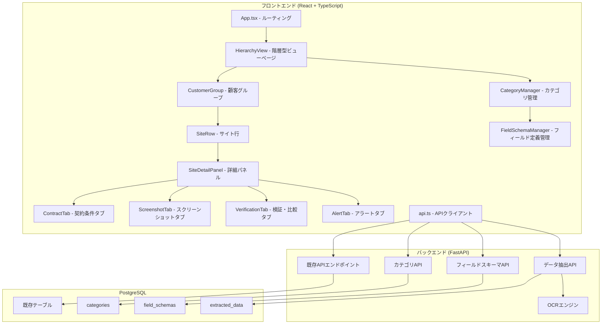
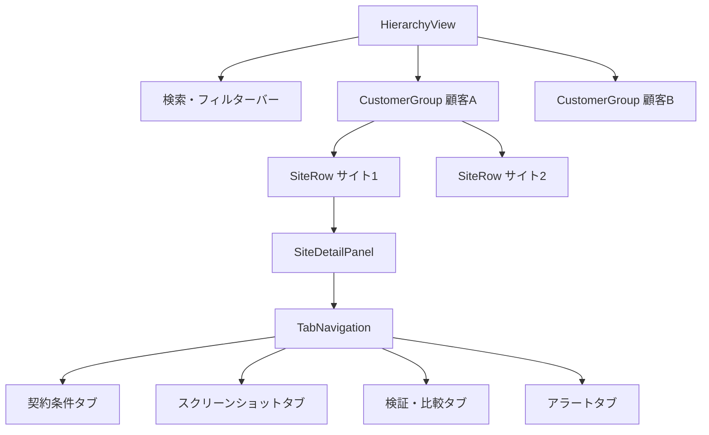
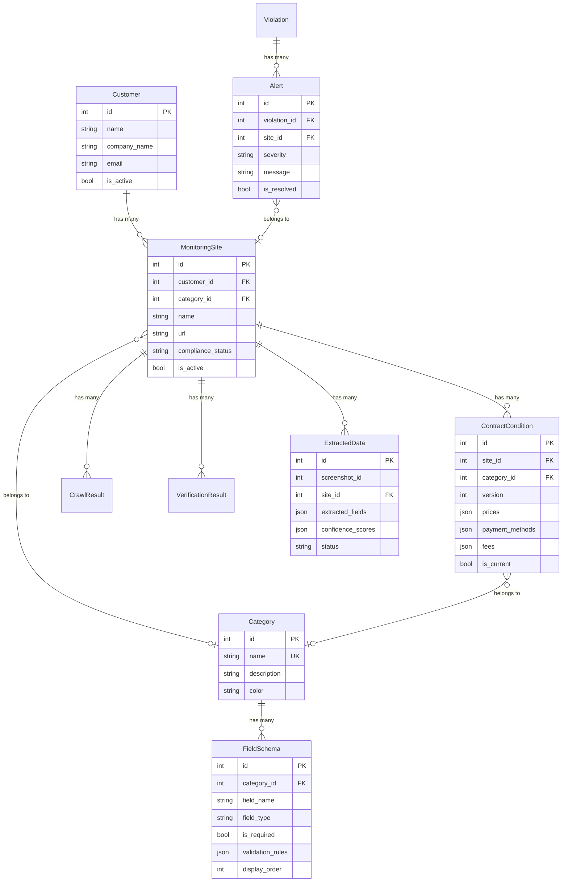

# 設計書: 親子関係UIリストラクチャ (hierarchical-ui-restructure)

## 概要

本設計は、決済条件監視システムのフロントエンドUIを階層型ビューに再構成し、顧客→監視サイト→子エンティティ（契約条件・スクリーンショット・検証比較結果・アラート）の親子関係を一画面で直感的に操作できるようにするものである。

現在のシステムでは、顧客・監視サイト・契約条件・スクリーンショット・検証比較・アラートがそれぞれ独立したページ（`/customers`, `/sites`, `/contracts`, `/screenshots`, `/verification`, `/alerts`）として存在している。本変更により、新規ルート `/hierarchy` に統合的な階層型ビューを追加し、顧客グループ→サイト行→詳細パネル（4タブ）の3階層を一画面で操作可能にする。既存ページはそのまま維持する。

加えて、以下の新機能を導入する:
- 商品・サービスカテゴリの動的管理（Category モデル）
- スクリーンショットからのOCRデータ抽出（ExtractedData モデル）
- カテゴリごとの動的フィールド定義（FieldSchema モデル）

### 設計方針

- 既存のコードベース（FastAPI + React/TypeScript + PostgreSQL）を活用し、最小限の変更で新機能を追加する
- 既存のAPIエンドポイントを可能な限り再利用し、新規エンドポイントは新機能（カテゴリ管理・フィールド定義・データ抽出）に限定する
- フロントエンドは既存の `api.ts` のパターン（axios + 型定義）に従う
- 階層型ビューは新規ページコンポーネントとして追加し、既存ページには影響を与えない

## アーキテクチャ

### システム構成



### 階層型ビューのコンポーネント構成




## コンポーネントとインターフェース

### フロントエンドコンポーネント

#### 1. HierarchyView (`genai/frontend/src/pages/HierarchyView.tsx`)

階層型ビューのメインページコンポーネント。顧客一覧を取得し、検索・フィルター機能を提供する。

```typescript
interface HierarchyViewState {
  customers: CustomerWithSites[];
  searchQuery: string;
  statusFilter: 'all' | 'active' | 'inactive';
  categoryFilter: number | null;
  loading: boolean;
  error: string | null;
}

interface CustomerWithSites extends Customer {
  sites: Site[];
  siteCount: number;
}
```

- 初回マウント時に `GET /api/customers/` と `GET /api/sites/` を呼び出し、顧客ごとにサイトをグルーピング
- 検索フィールドで顧客名・会社名をフィルタリング
- ステータスフィルター（全て/有効/無効）
- カテゴリフィルター

#### 2. CustomerGroup (`genai/frontend/src/components/hierarchy/CustomerGroup.tsx`)

顧客グループの展開/折りたたみコンポーネント。

```typescript
interface CustomerGroupProps {
  customer: CustomerWithSites;
  isExpanded: boolean;
  onToggle: () => void;
}
```

- 顧客名、会社名、ステータス（有効/無効）、配下サイト数を表示
- 展開/折りたたみインジケーター（矢印アイコン）
- 展開時に配下の SiteRow を表示

#### 3. SiteRow (`genai/frontend/src/components/hierarchy/SiteRow.tsx`)

監視サイト行の展開/折りたたみコンポーネント。

```typescript
interface SiteRowProps {
  site: Site;
  customerName: string;
  isExpanded: boolean;
  onToggle: () => void;
  onCrawlComplete?: () => void;
}
```

- サイト名、URL、カテゴリ、コンプライアンスステータス、最終クロール日時、有効/無効を表示
- 「今すぐクロール」ボタンを表示。クリックで `POST /api/crawl/site/{site_id}` を呼び出し、クロールジョブを即座に開始
- クロール実行中はスピナーを表示し、ボタンを無効化
- クロール完了後、最終クロール日時を更新し、差異検出時はアラートを自動生成
- 展開時に SiteDetailPanel を表示

#### 4. SiteDetailPanel (`genai/frontend/src/components/hierarchy/SiteDetailPanel.tsx`)

サイト詳細パネル。4つのタブを持つ。

```typescript
interface SiteDetailPanelProps {
  siteId: number;
  customerName: string;
}

type TabType = 'contracts' | 'screenshots' | 'verification' | 'alerts';
```

- デフォルトで「契約条件」タブを選択
- タブ切り替え時にデータを遅延読み込み

#### 5. ContractTab (`genai/frontend/src/components/hierarchy/tabs/ContractTab.tsx`)

```typescript
interface ContractTabProps {
  siteId: number;
}
```

- `GET /api/contracts/site/{site_id}` から契約条件を取得
- カテゴリ別にグルーピング表示
- データなし時は「契約条件がありません」を表示

#### 6. ScreenshotTab (`genai/frontend/src/components/hierarchy/tabs/ScreenshotTab.tsx`)

```typescript
interface ScreenshotTabProps {
  siteId: number;
}
```

- `GET /api/screenshots/site/{site_id}` からスクリーンショットを取得
- サムネイル表示、タイプ・形式・撮影日時を表示
- 「データ抽出」ボタンで OCR 抽出を実行
- 抽出結果のプレビュー・編集UI

#### 7. VerificationTab (`genai/frontend/src/components/hierarchy/tabs/VerificationTab.tsx`)

```typescript
interface VerificationTabProps {
  siteId: number;
}
```

- `GET /api/verification/results/{site_id}` から検証結果を取得
- ステータス、差異件数、違反件数、実行日時を表示

#### 8. AlertTab (`genai/frontend/src/components/hierarchy/tabs/AlertTab.tsx`)

```typescript
interface AlertTabProps {
  siteId: number;
  customerName: string;
}
```

- 当該サイトに紐づくアラートを取得
- 顧客名、商品ページURL、変更箇所（フィールド名・期待値・実際値）を表示
- 重要度バッジ（緊急/高/中/低）
- 解決済み/未解決フィルター
- 期待値と実際値の並列比較表示

#### 9. CategoryManager (`genai/frontend/src/components/category/CategoryManager.tsx`)

```typescript
interface CategoryManagerProps {
  onCategoryChange?: () => void;
}
```

- カテゴリの一覧表示、新規追加、名前編集、削除
- 名前、説明、色の設定

#### 10. FieldSchemaManager (`genai/frontend/src/components/category/FieldSchemaManager.tsx`)

```typescript
interface FieldSchemaManagerProps {
  categoryId: number;
}
```

- カテゴリごとのフィールドスキーマ管理
- フィールドの追加・編集・削除
- 型選択（テキスト、数値、通貨、パーセンテージ、日付、真偽値、リスト）
- バリデーションルール設定

### バックエンドAPI（新規エンドポイント）

#### カテゴリ管理API (`genai/src/api/categories.py`)

| メソッド | パス | 説明 |
|---------|------|------|
| GET | `/api/categories/` | カテゴリ一覧取得 |
| POST | `/api/categories/` | カテゴリ新規作成 |
| PUT | `/api/categories/{id}` | カテゴリ更新 |
| DELETE | `/api/categories/{id}` | カテゴリ削除（配下を「未分類」に移動） |

#### フィールドスキーマAPI (`genai/src/api/field_schemas.py`)

| メソッド | パス | 説明 |
|---------|------|------|
| GET | `/api/field-schemas/category/{category_id}` | カテゴリのフィールドスキーマ一覧取得 |
| POST | `/api/field-schemas/` | フィールドスキーマ新規作成 |
| PUT | `/api/field-schemas/{id}` | フィールドスキーマ更新 |
| DELETE | `/api/field-schemas/{id}` | フィールドスキーマ削除 |

#### データ抽出API (`genai/src/api/extraction.py`)

| メソッド | パス | 説明 |
|---------|------|------|
| POST | `/api/extraction/extract/{screenshot_id}` | スクリーンショットからOCRデータ抽出（Celeryタスクとして非同期実行） |
| GET | `/api/extraction/status/{job_id}` | データ抽出ジョブのステータス取得 |
| GET | `/api/extraction/results/{screenshot_id}` | 抽出結果取得 |
| PUT | `/api/extraction/results/{id}` | 抽出結果の編集（ユーザー修正） |
| POST | `/api/extraction/suggest-fields/{screenshot_id}` | 抽出データからフィールド候補を提案 |

- `POST /api/extraction/extract/{screenshot_id}` は Celery タスクをキューに投入し、即座に `{"job_id": ..., "status": "pending"}` を返す
- 同一スクリーンショットに対して抽出ジョブが既に実行中の場合は `409 Conflict` を返す（排他制御）
- フロントエンドはジョブIDでポーリングし、完了を検知したら抽出結果を表示する

#### サイトアラートAPI（既存拡張）

| メソッド | パス | 説明 |
|---------|------|------|
| GET | `/api/alerts/site/{site_id}` | サイト別アラート取得（新規追加） |

#### 手動クロールAPI (`genai/src/api/crawl.py`)

| メソッド | パス | 説明 |
|---------|------|------|
| POST | `/api/crawl/site/{site_id}` | 対象サイトの即時クロールジョブを開始。Celeryタスクとして非同期実行し、ジョブIDを返す |
| GET | `/api/crawl/status/{job_id}` | クロールジョブのステータス取得（pending/running/completed/failed） |
| GET | `/api/crawl/results/{site_id}` | サイトのクロール結果履歴取得（取得日時・ステータス・検出差異数を含む） |
| GET | `/api/crawl/results/{site_id}/latest` | サイトの最新クロール結果取得 |

- `POST /api/crawl/site/{site_id}` は Celery タスクをキューに投入し、即座に `{"job_id": ..., "status": "pending"}` を返す
- 同一サイトに対してクロールジョブが既に実行中の場合は `409 Conflict` を返す（排他制御）
- クロールジョブはページクロール＋スクリーンショット取得を非同期で実行する
- クロール完了後、契約条件との差異が検出された場合はアラートを自動生成する
- フロントエンドはジョブIDでポーリングし、完了を検知したらサイト情報を再取得する
- クロール結果にはスクリーンショット・検出差異・ステータスが含まれ、サイト行からリンクで参照可能
- ジョブ完了/失敗時にフロントエンドはトースト通知を表示する

### 既存サイト一覧ページ（Sites.tsx）の変更

既存の `genai/frontend/src/pages/Sites.tsx` に以下を追加:

- 各サイト行の操作列に「今すぐクロール」ボタンを追加
- クロール実行中はスピナー表示＋ボタン無効化
- 同一サイトで既にクロール実行中の場合は「クロールが実行中です」トースト通知を表示
- 最終クロール日時列をクリック可能なリンクに変更し、クリックで最新クロール結果詳細（取得日時・ステータス・検出差異数・スクリーンショット）をモーダルまたは展開パネルで表示
- クロール完了後、サイト一覧を自動リフレッシュ＋トースト通知（成功/失敗）を表示

### 非同期ジョブ管理とUI通知

#### 非同期処理アーキテクチャ

クロール・スクリーンショット取得・データ抽出はすべてCeleryタスクとして非同期実行する:

```
ユーザー操作 → API (POST) → Celeryタスクキュー → ワーカー実行
                ↓                                    ↓
          job_id返却                            完了/失敗
                ↓                                    ↓
          フロントエンド                        DB更新 + アラート生成
          ポーリング開始                              ↓
                ↓                              ステータス更新
          完了検知 → UI更新 + トースト通知
```

#### 排他制御

| 対象 | 排他キー | 方式 | 競合時レスポンス |
|------|---------|------|----------------|
| クロール | `crawl:site:{site_id}` | Redis分散ロック（TTL付き） | 409 Conflict + `{"detail": "クロールが実行中です"}` |
| スクリーンショット取得 | `screenshot:site:{site_id}` | Redis分散ロック（TTL付き） | 409 Conflict + `{"detail": "スクリーンショット取得が実行中です"}` |
| データ抽出 | `extraction:screenshot:{screenshot_id}` | Redis分散ロック（TTL付き） | 409 Conflict + `{"detail": "データ抽出が実行中です"}` |

- ロックはRedisの `SET NX EX` を使用し、TTLでデッドロックを防止
- Celeryタスク完了/失敗時にロックを解放

#### フロントエンドUI通知

- トースト通知コンポーネント（`ToastNotification`）を追加
- ジョブ完了時: 緑色トースト「クロールが完了しました」「データ抽出が完了しました」
- ジョブ失敗時: 赤色トースト「クロールに失敗しました」「データ抽出に失敗しました」
- 排他制御競合時: 黄色トースト「クロールが実行中です」「データ抽出が実行中です」
- トーストは5秒後に自動消去、手動で閉じることも可能

### フロントエンドAPIクライアント拡張 (`genai/frontend/src/services/api.ts`)

既存の `api.ts` に以下の型定義と関数を追加:

```typescript
// 新規型定義
interface Category {
  id: number;
  name: string;
  description: string | null;
  color: string | null;
  created_at: string;
}

interface FieldSchema {
  id: number;
  category_id: number;
  field_name: string;
  field_type: 'text' | 'number' | 'currency' | 'percentage' | 'date' | 'boolean' | 'list';
  is_required: boolean;
  validation_rules: Record<string, any> | null;
  display_order: number;
  created_at: string;
}

interface ExtractedData {
  id: number;
  screenshot_id: number;
  extracted_fields: Record<string, any>;
  confidence_scores: Record<string, number>;
  status: 'pending' | 'confirmed' | 'rejected';
  created_at: string;
}

interface FieldSuggestion {
  field_name: string;
  field_type: string;
  sample_value: any;
  confidence: number;
}

// 新規API関数
getCategories(): Promise<Category[]>
createCategory(data: CategoryCreate): Promise<Category>
updateCategory(id: number, data: Partial<CategoryCreate>): Promise<Category>
deleteCategory(id: number): Promise<void>

getFieldSchemas(categoryId: number): Promise<FieldSchema[]>
createFieldSchema(data: FieldSchemaCreate): Promise<FieldSchema>
updateFieldSchema(id: number, data: Partial<FieldSchemaCreate>): Promise<FieldSchema>
deleteFieldSchema(id: number): Promise<void>

extractData(screenshotId: number): Promise<ExtractedData>
getExtractedData(screenshotId: number): Promise<ExtractedData | null>
updateExtractedData(id: number, data: Partial<ExtractedData>): Promise<ExtractedData>
suggestFields(screenshotId: number): Promise<FieldSuggestion[]>

getSiteAlerts(siteId: number): Promise<Alert[]>

// 手動クロールAPI関数
triggerCrawl(siteId: number): Promise<{ job_id: string; status: string }>
getCrawlStatus(jobId: string): Promise<{ job_id: string; status: string; result?: CrawlResult }>
getCrawlResults(siteId: number): Promise<CrawlResult[]>
getLatestCrawlResult(siteId: number): Promise<CrawlResult | null>
```

## データモデル

### 既存モデルの変更

#### MonitoringSite - `category_id` カラム追加

```python
# genai/src/models.py - MonitoringSite に追加
category_id: Mapped[Optional[int]] = mapped_column(
    Integer, ForeignKey("categories.id"), nullable=True
)
category: Mapped[Optional["Category"]] = relationship("Category", back_populates="sites")
```

- `category_id` は nullable（未分類を許容）
- カテゴリ削除時は `category_id` を NULL に設定（「未分類」扱い）

#### ContractCondition - `category_id` カラム追加

```python
# genai/src/models.py - ContractCondition に追加
category_id: Mapped[Optional[int]] = mapped_column(
    Integer, ForeignKey("categories.id"), nullable=True
)
category: Mapped[Optional["Category"]] = relationship("Category")
```

#### Alert - `is_resolved` カラム追加、`site_id` 直接参照追加

```python
# genai/src/models.py - Alert に追加
is_resolved: Mapped[bool] = mapped_column(Boolean, default=False, nullable=False)
site_id: Mapped[Optional[int]] = mapped_column(
    Integer, ForeignKey("monitoring_sites.id"), nullable=True
)
```

- 既存の `violation_id` 経由でサイトを辿れるが、サイト別アラート取得の効率化のため `site_id` を直接追加
- `is_resolved` はアラートの解決状態管理用

### 新規モデル

#### Category (`categories` テーブル)

```python
class Category(Base):
    __tablename__ = "categories"

    id: Mapped[int] = mapped_column(Integer, primary_key=True, autoincrement=True)
    name: Mapped[str] = mapped_column(String(255), nullable=False, unique=True)
    description: Mapped[Optional[str]] = mapped_column(Text, nullable=True)
    color: Mapped[Optional[str]] = mapped_column(String(7), nullable=True)  # HEXカラーコード
    created_at: Mapped[datetime] = mapped_column(DateTime, nullable=False, default=datetime.utcnow)
    updated_at: Mapped[datetime] = mapped_column(DateTime, nullable=False, default=datetime.utcnow, onupdate=datetime.utcnow)

    # Relationships
    sites: Mapped[List["MonitoringSite"]] = relationship("MonitoringSite", back_populates="category")
    field_schemas: Mapped[List["FieldSchema"]] = relationship("FieldSchema", back_populates="category", cascade="all, delete-orphan")
```

#### FieldSchema (`field_schemas` テーブル)

```python
class FieldSchema(Base):
    __tablename__ = "field_schemas"

    id: Mapped[int] = mapped_column(Integer, primary_key=True, autoincrement=True)
    category_id: Mapped[int] = mapped_column(Integer, ForeignKey("categories.id"), nullable=False)
    field_name: Mapped[str] = mapped_column(String(255), nullable=False)
    field_type: Mapped[str] = mapped_column(String(50), nullable=False)  # text, number, currency, percentage, date, boolean, list
    is_required: Mapped[bool] = mapped_column(Boolean, default=False, nullable=False)
    validation_rules: Mapped[Optional[dict]] = mapped_column(JSONB, nullable=True)  # {min, max, pattern, options}
    display_order: Mapped[int] = mapped_column(Integer, default=0, nullable=False)
    created_at: Mapped[datetime] = mapped_column(DateTime, nullable=False, default=datetime.utcnow)
    updated_at: Mapped[datetime] = mapped_column(DateTime, nullable=False, default=datetime.utcnow, onupdate=datetime.utcnow)

    # Relationships
    category: Mapped["Category"] = relationship("Category", back_populates="field_schemas")

    __table_args__ = (
        Index("ix_field_schemas_category_id", "category_id"),
        UniqueConstraint("category_id", "field_name", name="uq_field_schema_category_field"),
    )
```

`field_type` の許容値:
| 型 | 説明 | validation_rules の例 |
|---|---|---|
| `text` | テキスト | `{"pattern": "^[A-Z].*", "max_length": 100}` |
| `number` | 数値 | `{"min": 0, "max": 10000}` |
| `currency` | 通貨 | `{"min": 0, "currency_code": "JPY"}` |
| `percentage` | パーセンテージ | `{"min": 0, "max": 100}` |
| `date` | 日付 | `{"format": "YYYY-MM-DD"}` |
| `boolean` | 真偽値 | なし |
| `list` | リスト（選択肢） | `{"options": ["visa", "mastercard", "amex"]}` |

#### ExtractedData (`extracted_data` テーブル)

```python
class ExtractedData(Base):
    __tablename__ = "extracted_data"

    id: Mapped[int] = mapped_column(Integer, primary_key=True, autoincrement=True)
    screenshot_id: Mapped[int] = mapped_column(Integer, nullable=False)
    site_id: Mapped[int] = mapped_column(Integer, ForeignKey("monitoring_sites.id"), nullable=False)
    extracted_fields: Mapped[dict] = mapped_column(JSONB, nullable=False)  # {"field_name": value, ...}
    confidence_scores: Mapped[dict] = mapped_column(JSONB, nullable=False)  # {"field_name": 0.95, ...}
    status: Mapped[str] = mapped_column(String(20), default="pending", nullable=False)  # pending, confirmed, rejected
    created_at: Mapped[datetime] = mapped_column(DateTime, nullable=False, default=datetime.utcnow)

    __table_args__ = (
        Index("ix_extracted_data_screenshot_id", "screenshot_id"),
        Index("ix_extracted_data_site_id", "site_id"),
    )
```

### ER図



## 正当性プロパティ (Correctness Properties)

*プロパティとは、システムのすべての有効な実行において真であるべき特性や振る舞いのことである。プロパティは、人間が読める仕様と機械的に検証可能な正当性保証の橋渡しとなる。*

### Property 1: 顧客別サイトグルーピングの正確性

*任意の*顧客リストとサイトリストに対して、グルーピング関数を適用した場合、各グループ内のすべてのサイトの `customer_id` はそのグループの顧客の `id` と一致し、かつすべてのサイトがいずれかのグループに含まれること。

**Validates: Requirements 1.1**

### Property 2: 展開/折りたたみの状態往復

*任意の*顧客グループまたはサイト行に対して、折りたたみ状態から展開操作を行い、続けて折りたたみ操作を行った場合、子要素は非表示状態に戻ること（展開→折りたたみの往復で元の状態に復帰する）。

**Validates: Requirements 1.4, 1.5, 2.3, 2.6**

### Property 3: 検索・フィルターの正確性

*任意の*検索クエリ（顧客名・会社名）、ステータスフィルター（全て/有効/無効）、カテゴリフィルターの組み合わせに対して、表示される顧客グループはすべてのフィルター条件を満たすこと。具体的には、検索クエリが顧客名または会社名に部分一致し、ステータスフィルターが一致し、カテゴリフィルターが配下サイトのカテゴリに一致すること。

**Validates: Requirements 1.6, 1.7, 7.5**

### Property 4: タブ選択によるAPI呼び出しの正確性

*任意の*サイトIDとタブ種別（契約条件/スクリーンショット/検証・比較/アラート）に対して、タブを選択した場合、対応する正しいAPIエンドポイントが正しい `site_id` パラメータで呼び出されること。

**Validates: Requirements 3.1, 4.1, 5.1, 6.1**

### Property 5: デフォルトタブ選択

*任意の*サイト詳細パネルが表示された場合、初期状態でアクティブなタブは「契約条件」であること。

**Validates: Requirements 2.5**

### Property 6: 契約条件のカテゴリ別グルーピング

*任意の*契約条件リストに対して、カテゴリ別グルーピング関数を適用した場合、各グループ内のすべての契約条件の `category_id` はそのグループのカテゴリIDと一致すること。

**Validates: Requirements 3.3**

### Property 7: アラート表示の完全性

*任意の*アラートデータ（違反情報を含む）に対して、レンダリング結果には顧客名、商品ページURL、変更箇所（フィールド名・期待値・実際値）、重要度バッジ、検出日時、および期待値と実際値の比較表示がすべて含まれること。

**Validates: Requirements 6.2, 6.3, 6.4, 6.6**

### Property 8: アラートの解決状態フィルタリング

*任意の*解決済み/未解決が混在するアラートリストに対して、解決状態フィルターを適用した場合、表示されるアラートはすべてフィルター条件に一致すること。

**Validates: Requirements 6.5**

### Property 9: カテゴリCRUDの往復

*任意の*有効なカテゴリデータに対して、作成→取得の操作を行った場合、取得したカテゴリの名前・説明・色は作成時のデータと一致すること。

**Validates: Requirements 7.1**

### Property 10: カテゴリ削除時の未分類移動

*任意の*カテゴリに属するサイトおよび契約条件が存在する場合、当該カテゴリを削除した後、それらのサイトおよび契約条件の `category_id` は NULL（未分類）になること。

**Validates: Requirements 7.4**

### Property 11: カテゴリ追加の即時反映

*任意の*新規カテゴリが作成された場合、カテゴリ一覧APIの結果に当該カテゴリが含まれ、サイトおよび契約条件の分類先として選択可能であること。

**Validates: Requirements 7.3**

### Property 12: フィールドスキーマCRUDの往復

*任意の*有効なフィールドスキーマデータ（カテゴリID、フィールド名、フィールド型）に対して、作成→取得の操作を行った場合、取得したフィールドスキーマのフィールド名・型・バリデーションルールは作成時のデータと一致すること。

**Validates: Requirements 8.1, 8.5**

### Property 13: フィールド型の網羅性

*任意の*サポート対象フィールド型（text, number, currency, percentage, date, boolean, list）に対して、その型でフィールドスキーマを作成した場合、作成が成功し、取得時に正しい型が返されること。

**Validates: Requirements 8.2**

### Property 14: フィールド候補提案の正確性

*任意の*抽出データ（extracted_fields）に対して、フィールド候補提案関数を適用した場合、抽出データの各フィールドに対応する候補が生成され、各候補にはフィールド名、推定型、サンプル値、信頼度が含まれること。

**Validates: Requirements 8.3**

### Property 15: フィールド候補承認によるスキーマ追加

*任意の*フィールド候補を承認した場合、該当カテゴリのフィールドスキーマ一覧に当該フィールドが追加されていること。

**Validates: Requirements 8.4**

### Property 16: フィールドバリデーションルールの適用

*任意の*バリデーションルール（必須/任意、最小値/最大値、正規表現パターン）が設定されたフィールドスキーマに対して、ルールに違反する値はバリデーションエラーとなり、ルールに適合する値はバリデーションを通過すること。

**Validates: Requirements 8.7**

### Property 17: ローディング状態の表示

*任意の*コンポーネント（階層型ビュー、タブコンテンツ、データ抽出）がデータ取得中（loading=true）の場合、ローディングインジケーターが表示されること。

**Validates: Requirements 9.1, 9.2, 9.3**

### Property 18: エラー状態の表示

*任意の*APIリクエストが失敗した場合、該当領域内にエラーメッセージが表示されること。

**Validates: Requirements 9.4**

## エラーハンドリング

### フロントエンド

| エラー種別 | 対応 |
|-----------|------|
| API通信エラー（ネットワーク障害） | 該当コンポーネント内にエラーメッセージを表示。リトライボタンを提供 |
| API 4xx エラー（バリデーション等） | エラーメッセージをユーザーに表示。フォーム入力エラーの場合はフィールド単位でエラー表示 |
| API 5xx エラー（サーバーエラー） | 「サーバーエラーが発生しました。しばらくしてから再度お試しください」を表示 |
| OCRデータ抽出失敗 | 「データ抽出に失敗しました」を表示。手動入力へのフォールバックを提供 |
| カテゴリ削除時の確認 | 配下にサイト/契約条件がある場合、確認ダイアログを表示（「未分類に移動されます」） |

### バックエンド

| エラー種別 | HTTPステータス | 対応 |
|-----------|--------------|------|
| カテゴリ名重複 | 409 Conflict | `{"detail": "同名のカテゴリが既に存在します"}` |
| 存在しないカテゴリID | 404 Not Found | `{"detail": "カテゴリが見つかりません"}` |
| フィールドスキーマ重複（同一カテゴリ内） | 409 Conflict | `{"detail": "同一カテゴリ内に同名のフィールドが既に存在します"}` |
| 不正なフィールド型 | 422 Unprocessable Entity | `{"detail": "サポートされていないフィールド型です"}` |
| OCR処理タイムアウト | 504 Gateway Timeout | `{"detail": "データ抽出がタイムアウトしました"}` |
| スクリーンショット未存在 | 404 Not Found | `{"detail": "スクリーンショットが見つかりません"}` |

## テスト戦略

### テストアプローチ

本機能では、ユニットテストとプロパティベーステストの二重アプローチを採用する。

- **ユニットテスト**: 具体的な例、エッジケース、エラー条件の検証
- **プロパティベーステスト**: すべての入力に対して成立すべき普遍的なプロパティの検証

両者は補完的であり、包括的なカバレッジのために両方が必要である。

### プロパティベーステスト

**ライブラリ**:
- バックエンド（Python）: `hypothesis`
- フロントエンド（TypeScript）: `fast-check`

**設定**:
- 各プロパティテストは最低100回のイテレーションを実行
- 各テストには設計書のプロパティへの参照コメントを付与
- タグ形式: `Feature: hierarchical-ui-restructure, Property {number}: {property_text}`
- 各正当性プロパティは1つのプロパティベーステストで実装する

### ユニットテスト

**バックエンド（pytest）**:
- カテゴリCRUD APIの正常系・異常系
- フィールドスキーマCRUD APIの正常系・異常系
- データ抽出APIの正常系・異常系
- カテゴリ削除時の未分類移動ロジック
- フィールドバリデーションルールの適用
- エッジケース: 空データ、不正な型、重複名

**フロントエンド（vitest + React Testing Library）**:
- HierarchyView の初期レンダリング
- CustomerGroup の展開/折りたたみ
- SiteRow の展開/折りたたみ
- SiteDetailPanel のタブ切り替え
- 各タブの空データ表示（「契約条件がありません」等）
- CategoryManager のCRUD操作
- FieldSchemaManager のCRUD操作
- ローディング状態の表示
- エラー状態の表示

### テスト対象のプロパティマッピング

| プロパティ | テスト種別 | テスト対象 |
|-----------|-----------|-----------|
| Property 1 | プロパティテスト | グルーピング関数（フロントエンド） |
| Property 2 | プロパティテスト | 展開/折りたたみ状態管理（フロントエンド） |
| Property 3 | プロパティテスト | フィルタリング関数（フロントエンド） |
| Property 4 | プロパティテスト | タブ→APIマッピング（フロントエンド） |
| Property 5 | プロパティテスト | デフォルトタブ状態（フロントエンド） |
| Property 6 | プロパティテスト | カテゴリ別グルーピング関数（フロントエンド） |
| Property 7 | プロパティテスト | アラートレンダリング関数（フロントエンド） |
| Property 8 | プロパティテスト | アラートフィルタリング関数（フロントエンド） |
| Property 9 | プロパティテスト | カテゴリCRUD API（バックエンド） |
| Property 10 | プロパティテスト | カテゴリ削除ロジック（バックエンド） |
| Property 11 | プロパティテスト | カテゴリ作成→一覧取得（バックエンド） |
| Property 12 | プロパティテスト | フィールドスキーマCRUD API（バックエンド） |
| Property 13 | プロパティテスト | フィールド型バリデーション（バックエンド） |
| Property 14 | プロパティテスト | フィールド候補提案関数（バックエンド） |
| Property 15 | プロパティテスト | フィールド候補承認→スキーマ追加（バックエンド） |
| Property 16 | プロパティテスト | バリデーションルール適用（バックエンド） |
| Property 17 | プロパティテスト | ローディング状態表示（フロントエンド） |
| Property 18 | プロパティテスト | エラー状態表示（フロントエンド） |
