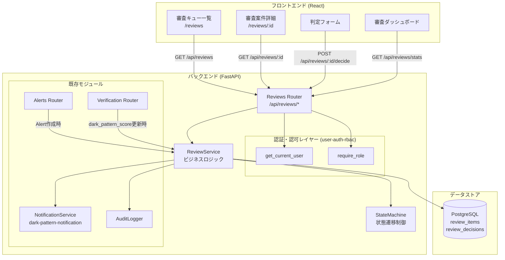
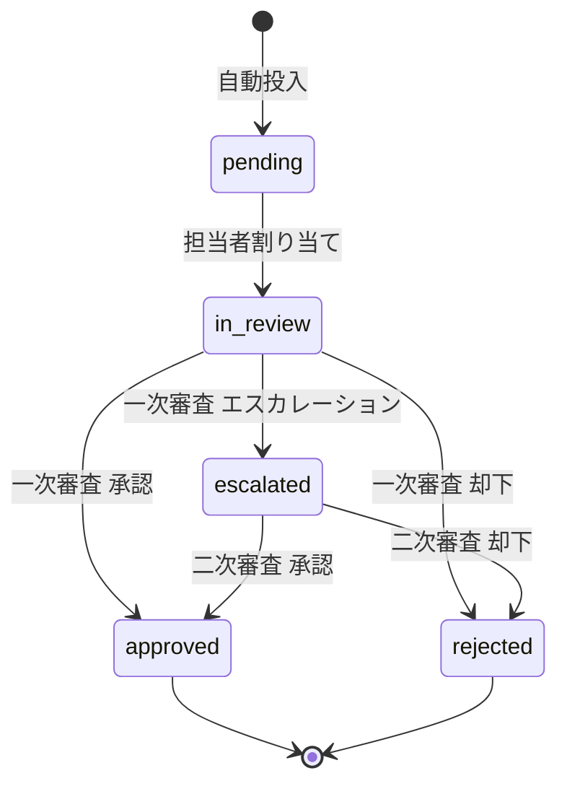
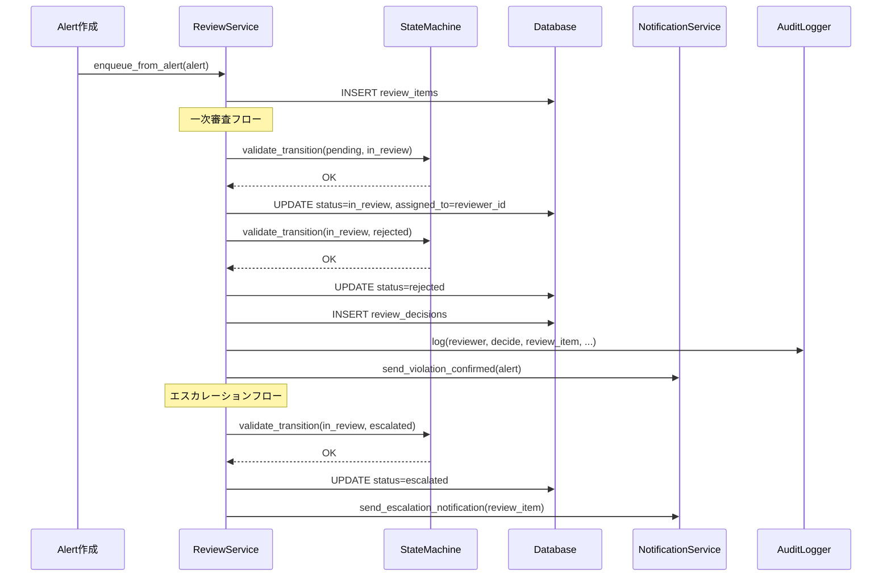

# 設計書: 手動審査ワークフロー (manual-review-workflow)

## 概要

本設計書は、決済条件監視システム（Payment Compliance Monitor）に手動審査ワークフローを導入するための技術設計を定義する。

現状のシステムは自動検出（契約違反・ダークパターン・偽サイト）の結果をアラートとして表示するのみで、人間による審査判定プロセスが存在しない。本設計では、自動検出でNGとなった案件を審査キューに自動投入し、一次審査（reviewer）→ 二次審査（admin）の二段階承認フローを経て最終判定を行う仕組みを実現する。

### 技術スタック

- バックエンド: FastAPI + SQLAlchemy（同期） + PostgreSQL + Redis（既存）
- フロントエンド: React + TypeScript + Vite + react-router-dom + axios
- 認証: user-auth-rbac spec（JWT + RBAC: admin / reviewer / viewer）
- テスト: pytest + Hypothesis（プロパティベーステスト）

### 設計判断の根拠

- **状態遷移マシンを純粋関数として実装**: 状態遷移ロジックをビジネスロジック層から分離し、テスタビリティを確保する。遷移テーブルを dict で定義し、許可された遷移のみを受け付ける。
- **ReviewService をサービス層として分離**: API ルーターから審査ビジネスロジックを分離し、自動投入フック・通知連携・監査ログ記録を一元管理する。
- **審査キュー自動投入はイベントフック方式**: Alert 作成時・VerificationResult 更新時に ReviewService のメソッドを呼び出す。Celery タスクではなく同期呼び出しとし、トランザクション整合性を確保する。
- **統合ビューは JOIN クエリで実装**: 審査案件詳細で Alert + Violation + VerificationResult + MonitoringSite を1回のクエリで取得し、N+1 問題を回避する。
- **フロントエンドは既存コンポーネント（Card, Badge, Select）を再利用**: 審査キュー一覧・審査詳細画面で既存の UI コンポーネントを活用し、一貫した UX を維持する。

## アーキテクチャ

### 全体構成



### 状態遷移図



### 審査フロー シーケンス図



## コンポーネントとインターフェース

### 1. ReviewStateMachine（純粋関数）

```python
# src/review/state_machine.py

VALID_TRANSITIONS: dict[str, set[str]] = {
    "pending": {"in_review"},
    "in_review": {"approved", "rejected", "escalated"},
    "escalated": {"approved", "rejected"},
    "approved": set(),   # 最終状態
    "rejected": set(),   # 最終状態
}

ALL_STATUSES = {"pending", "in_review", "approved", "rejected", "escalated"}

def validate_transition(current_status: str, new_status: str) -> bool:
    """状態遷移が許可されているか検証する。"""
    return new_status in VALID_TRANSITIONS.get(current_status, set())

def get_allowed_transitions(current_status: str) -> set[str]:
    """現在のステータスから遷移可能なステータスの集合を返す。"""
    return VALID_TRANSITIONS.get(current_status, set())

def is_terminal_state(status: str) -> bool:
    """最終状態（approved/rejected）かどうかを返す。"""
    return status in {"approved", "rejected"}
```

### 2. ReviewService（ビジネスロジック層）

```python
# src/review/service.py

class ReviewService:
    def __init__(self, db: Session):
        self.db = db
        self.audit_logger = AuditLogger(db)

    # --- 自動投入 ---
    def enqueue_from_alert(self, alert: Alert) -> ReviewItem | None:
        """Alert から ReviewItem を作成してキューに投入する。
        重複チェック・priority 自動設定を行う。"""
        ...

    def enqueue_from_dark_pattern(
        self, site_id: int, alert: Alert, score: float
    ) -> ReviewItem | None:
        """ダークパターン検出時に ReviewItem を作成する。"""
        ...

    # --- 一次審査 ---
    def assign_reviewer(
        self, review_item_id: int, reviewer_id: int, username: str
    ) -> ReviewItem:
        """審査案件に担当者を割り当て、status を in_review に遷移する。"""
        ...

    def decide_primary(
        self, review_item_id: int, decision: str, comment: str,
        reviewer_id: int, username: str
    ) -> ReviewDecision:
        """一次審査判定を実行する。approved/rejected/escalated。"""
        ...

    # --- 二次審査 ---
    def decide_secondary(
        self, review_item_id: int, decision: str, comment: str,
        reviewer_id: int, username: str
    ) -> ReviewDecision:
        """二次審査判定を実行する。approved/rejected のみ。"""
        ...

    # --- クエリ ---
    def list_reviews(
        self, status: str | None, priority: str | None,
        review_type: str | None, assigned_to: int | None,
        limit: int, offset: int
    ) -> tuple[list[ReviewItem], int]:
        """フィルタリング・ソート・ページネーション付き一覧取得。"""
        ...

    def get_review_detail(self, review_item_id: int) -> dict:
        """統合ビュー: Alert + Violation + VerificationResult + Site + Decisions。"""
        ...

    def get_stats(self) -> dict:
        """審査統計情報を返す。"""
        ...

    def get_escalated_reviews(
        self, limit: int, offset: int
    ) -> tuple[list[ReviewItem], int]:
        """エスカレーション案件一覧を返す。"""
        ...
```

### 3. Reviews Router（API エンドポイント）

```python
# src/api/reviews.py

router = APIRouter()

# 審査キュー一覧
@router.get("/")
async def list_reviews(
    status: str | None = None,
    priority: str | None = None,
    review_type: str | None = None,
    assigned_to: int | None = None,
    limit: int = Query(20, ge=1, le=100),
    offset: int = Query(0, ge=0),
    db: Session = Depends(get_db),
    current_user = Depends(require_role(["reviewer", "admin"])),
) -> PaginatedReviewResponse: ...

# 審査統計
@router.get("/stats")
async def get_review_stats(
    db: Session = Depends(get_db),
    current_user = Depends(require_role(["viewer", "reviewer", "admin"])),
) -> ReviewStatsResponse: ...

# エスカレーション案件一覧
@router.get("/escalated")
async def list_escalated_reviews(
    limit: int = Query(20, ge=1, le=100),
    offset: int = Query(0, ge=0),
    db: Session = Depends(get_db),
    current_user = Depends(require_role(["admin"])),
) -> PaginatedReviewResponse: ...

# 審査案件詳細
@router.get("/{review_id}")
async def get_review_detail(
    review_id: int,
    db: Session = Depends(get_db),
    current_user = Depends(require_role(["reviewer", "admin"])),
) -> ReviewDetailResponse: ...

# 担当者割り当て
@router.post("/{review_id}/assign")
async def assign_reviewer(
    review_id: int,
    body: AssignReviewerRequest,
    db: Session = Depends(get_db),
    current_user = Depends(require_role(["reviewer", "admin"])),
) -> ReviewItemResponse: ...

# 一次審査判定
@router.post("/{review_id}/decide")
async def decide_primary(
    review_id: int,
    body: ReviewDecisionRequest,
    db: Session = Depends(get_db),
    current_user = Depends(require_role(["reviewer", "admin"])),
) -> ReviewDecisionResponse: ...

# 二次審査判定
@router.post("/{review_id}/final-decide")
async def decide_secondary(
    review_id: int,
    body: ReviewDecisionRequest,
    db: Session = Depends(get_db),
    current_user = Depends(require_role(["admin"])),
) -> ReviewDecisionResponse: ...

# 判定履歴
@router.get("/{review_id}/decisions")
async def get_decisions(
    review_id: int,
    db: Session = Depends(get_db),
    current_user = Depends(require_role(["reviewer", "admin"])),
) -> list[ReviewDecisionResponse]: ...
```

### 4. API スキーマ

```python
# src/api/schemas.py に追加

class ReviewItemResponse(BaseModel):
    id: int
    alert_id: int
    site_id: int
    review_type: str  # "violation" | "dark_pattern" | "fake_site"
    status: str       # "pending" | "in_review" | "approved" | "rejected" | "escalated"
    priority: str     # "critical" | "high" | "medium" | "low"
    assigned_to: int | None
    created_at: datetime
    updated_at: datetime

class PaginatedReviewResponse(BaseModel):
    items: list[ReviewItemResponse]
    total: int
    limit: int
    offset: int

class ReviewDecisionRequest(BaseModel):
    decision: str     # "approved" | "rejected" | "escalated"(一次のみ)
    comment: str = Field(..., min_length=1)

class AssignReviewerRequest(BaseModel):
    reviewer_id: int

class ReviewDecisionResponse(BaseModel):
    id: int
    review_item_id: int
    reviewer_id: int
    decision: str
    comment: str
    review_stage: str  # "primary" | "secondary"
    decided_at: datetime

class ReviewDetailResponse(BaseModel):
    review_item: ReviewItemResponse
    alert: AlertDetailInReview
    violation: ViolationDetailInReview | None
    dark_pattern: DarkPatternDetailInReview | None
    fake_site: FakeSiteDetailInReview | None
    site: SiteBasicInfo
    decisions: list[ReviewDecisionResponse]

class AlertDetailInReview(BaseModel):
    id: int
    severity: str
    message: str
    alert_type: str
    created_at: datetime

class ViolationDetailInReview(BaseModel):
    id: int
    violation_type: str
    expected_value: dict
    actual_value: dict

class DarkPatternDetailInReview(BaseModel):
    dark_pattern_score: float | None
    dark_pattern_types: dict | None

class FakeSiteDetailInReview(BaseModel):
    fake_domain: str | None
    domain_similarity_score: float | None
    content_similarity_score: float | None

class SiteBasicInfo(BaseModel):
    id: int
    name: str
    url: str

class ReviewStatsResponse(BaseModel):
    by_status: dict[str, int]       # {"pending": 5, "in_review": 3, ...}
    by_priority: dict[str, int]     # pending のみ: {"critical": 2, "high": 1, ...}
    by_review_type: dict[str, int]  # pending のみ: {"violation": 3, ...}
```

### 5. フロントエンド コンポーネント

```
genai/frontend/src/
├── pages/
│   ├── Reviews.tsx          # 審査キュー一覧ページ
│   ├── ReviewDetail.tsx     # 審査案件詳細 + 判定フォーム
│   └── ReviewDashboard.tsx  # 審査ダッシュボード（統計）
├── services/
│   └── api.ts               # 審査 API クライアント関数を追加
└── types/
    └── review.ts            # 審査関連の型定義
```

フロントエンドは既存の `Card`, `Badge`, `Select` コンポーネントを再利用し、`AppLayout.tsx` のナビゲーションに「審査」グループを追加する。

## データモデル

### ReviewItem テーブル

```python
class ReviewItem(Base):
    """審査キュー内の個別案件。"""
    __tablename__ = "review_items"

    id: Mapped[int] = mapped_column(Integer, primary_key=True, autoincrement=True)
    alert_id: Mapped[int] = mapped_column(
        Integer, ForeignKey("alerts.id"), nullable=False
    )
    site_id: Mapped[int] = mapped_column(
        Integer, ForeignKey("monitoring_sites.id"), nullable=False
    )
    review_type: Mapped[str] = mapped_column(
        String(20), nullable=False
    )  # "violation", "dark_pattern", "fake_site"
    status: Mapped[str] = mapped_column(
        String(20), nullable=False, default="pending"
    )  # "pending", "in_review", "approved", "rejected", "escalated"
    priority: Mapped[str] = mapped_column(
        String(20), nullable=False
    )  # "critical", "high", "medium", "low"
    assigned_to: Mapped[Optional[int]] = mapped_column(Integer, nullable=True)
    created_at: Mapped[datetime] = mapped_column(
        DateTime, nullable=False, default=datetime.utcnow
    )
    updated_at: Mapped[datetime] = mapped_column(
        DateTime, nullable=False, default=datetime.utcnow, onupdate=datetime.utcnow
    )

    # Relationships
    alert: Mapped["Alert"] = relationship("Alert")
    site: Mapped["MonitoringSite"] = relationship("MonitoringSite")
    decisions: Mapped[list["ReviewDecision"]] = relationship(
        "ReviewDecision", back_populates="review_item", cascade="all, delete-orphan"
    )

    __table_args__ = (
        Index("ix_review_items_status", "status"),
        Index("ix_review_items_priority", "priority"),
        Index("ix_review_items_alert_id", "alert_id", unique=True),
        Index("ix_review_items_site_id", "site_id"),
        Index("ix_review_items_assigned_to", "assigned_to"),
        Index("ix_review_items_status_priority_created",
              "status", "priority", "created_at"),
    )
```

### ReviewDecision テーブル

```python
class ReviewDecision(Base):
    """審査判定の記録。"""
    __tablename__ = "review_decisions"

    id: Mapped[int] = mapped_column(Integer, primary_key=True, autoincrement=True)
    review_item_id: Mapped[int] = mapped_column(
        Integer, ForeignKey("review_items.id"), nullable=False
    )
    reviewer_id: Mapped[int] = mapped_column(Integer, nullable=False)
    decision: Mapped[str] = mapped_column(
        String(20), nullable=False
    )  # "approved", "rejected", "escalated"
    comment: Mapped[str] = mapped_column(Text, nullable=False)
    review_stage: Mapped[str] = mapped_column(
        String(20), nullable=False
    )  # "primary", "secondary"
    decided_at: Mapped[datetime] = mapped_column(
        DateTime, nullable=False, default=datetime.utcnow
    )

    # Relationships
    review_item: Mapped["ReviewItem"] = relationship(
        "ReviewItem", back_populates="decisions"
    )

    __table_args__ = (
        Index("ix_review_decisions_review_item_id", "review_item_id"),
        Index("ix_review_decisions_reviewer_id", "reviewer_id"),
    )
```

### Priority マッピング（Alert severity → ReviewItem priority）

```python
SEVERITY_TO_PRIORITY: dict[str, str] = {
    "critical": "critical",
    "high": "high",
    "medium": "medium",
    "low": "low",
}
```

fake_site タイプの Alert は severity に関わらず priority を "critical" に上書きする。

### Alembic マイグレーション

ファイル名: `p1q2r3s4t5u6_add_review_items_and_decisions.py`

```python
def upgrade():
    op.create_table("review_items", ...)
    op.create_table("review_decisions", ...)

def downgrade():
    op.drop_table("review_decisions")
    op.drop_table("review_items")
```

