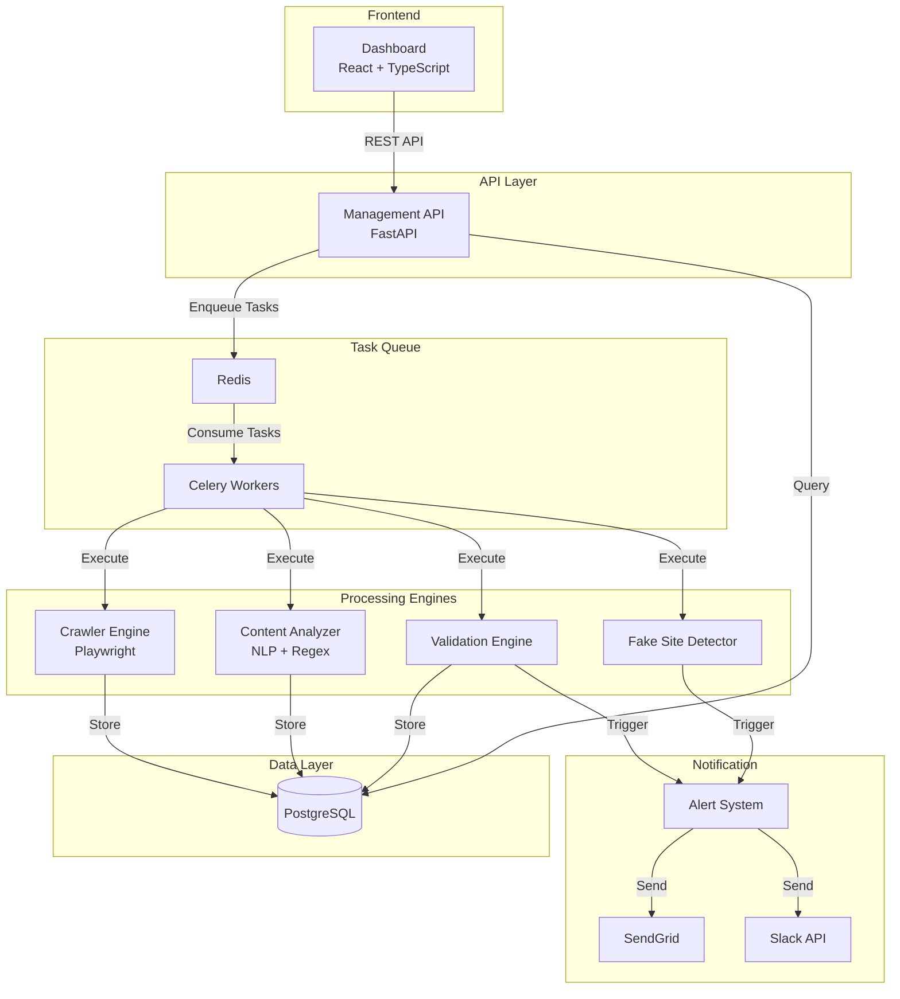

# Design Document

## Overview

決済条件監視・検証システムは、マイクロサービスアーキテクチャに基づいた非同期処理システムです。Pythonをベースとし、Playwright によるブラウザ自動化、FastAPI による REST API、Celery による非同期タスク処理、PostgreSQL によるデータ永続化を組み合わせて実装します。

システムは以下の主要コンポーネントで構成されます：
- クローリングエンジン（非同期タスク）
- コンテンツ解析エンジン（NLP + パターンマッチング）
- 検証エンジン（ルールベース比較）
- 擬似サイト検出エンジン（ドメイン類似度 + コンテンツ類似度）
- アラートシステム（マルチチャネル通知）
- 管理 API（FastAPI）
- ダッシュボード（React + TypeScript）

## Architecture

### System Architecture



### Technology Stack

- **Language**: Python 3.11+
- **Web Framework**: FastAPI 0.104+
- **Crawler**: Playwright 1.40+ (headless browser automation)
- **Task Queue**: Celery 5.3+ with Redis 7.2+ as broker
- **Database**: PostgreSQL 15+ with asyncpg driver
- **ORM**: SQLAlchemy 2.0+ (async mode)
- **Notifications**: SendGrid API, Slack SDK
- **Frontend**: React 18+ with TypeScript 5+
- **Containerization**: Docker, Docker Compose
- **Testing**: pytest, pytest-asyncio, Hypothesis (property-based testing)

## Components and Interfaces

### 1. Crawler Engine

**Responsibility**: ECサイトをクローリングし、HTML コンテンツを取得する

**Interface**:
```python
class CrawlerEngine:
    async def crawl_site(
        self,
        site_id: int,
        url: str,
        rate_limit_seconds: int = 10
    ) -> CrawlResult:
        """指定されたURLをクローリングし、結果を返す"""
        pass
```

### 2. Content Analyzer

**Responsibility**: HTML から決済情報を抽出・構造化する

**Interface**:
```python
class ContentAnalyzer:
    async def extract_payment_info(
        self,
        html_content: str,
        extraction_rules: dict[str, Any]
    ) -> PaymentInfo:
        """HTMLから決済情報を抽出"""
        pass
```

### 3. Validation Engine

**Responsibility**: 抽出した決済情報を契約条件と照合し、違反を検出する

**Interface**:
```python
class ValidationEngine:
    async def validate_payment_info(
        self,
        payment_info: PaymentInfo,
        contract_conditions: ContractConditions
    ) -> ValidationResult:
        """決済情報を契約条件と照合"""
        pass
```

### 4. Fake Site Detector

**Responsibility**: 類似ドメインと擬似サイトを検出する

**Interface**:
```python
class FakeSiteDetector:
    async def scan_similar_domains(
        self,
        legitimate_domain: str,
        similarity_threshold: float = 0.8
    ) -> list[SuspiciousDomain]:
        """類似ドメインをスキャン"""
        pass
```

### 5. Alert System

**Responsibility**: 違反検知時にマルチチャネルで通知を配信する

**Interface**:
```python
class AlertSystem:
    async def send_alert(
        self,
        violation: Violation,
        site_info: MonitoringSite,
        notification_config: NotificationConfig
    ) -> AlertResult:
        """違反アラートを送信"""
        pass
```

## Data Models

### Database Schema

```sql
-- 監視対象サイト
CREATE TABLE monitoring_sites (
    id SERIAL PRIMARY KEY,
    company_name VARCHAR(255) NOT NULL,
    domain VARCHAR(255) NOT NULL UNIQUE,
    target_url TEXT NOT NULL,
    is_active BOOLEAN DEFAULT TRUE,
    created_at TIMESTAMP NOT NULL DEFAULT NOW()
);

-- 契約条件
CREATE TABLE contract_conditions (
    id SERIAL PRIMARY KEY,
    site_id INTEGER NOT NULL REFERENCES monitoring_sites(id),
    version INTEGER NOT NULL DEFAULT 1,
    prices JSONB NOT NULL,
    payment_methods JSONB NOT NULL,
    fees JSONB NOT NULL,
    subscription_terms JSONB,
    is_current BOOLEAN DEFAULT TRUE,
    created_at TIMESTAMP NOT NULL DEFAULT NOW()
);

-- クローリング結果
CREATE TABLE crawl_results (
    id SERIAL PRIMARY KEY,
    site_id INTEGER NOT NULL REFERENCES monitoring_sites(id),
    url TEXT NOT NULL,
    html_content TEXT NOT NULL,
    status_code INTEGER NOT NULL,
    crawled_at TIMESTAMP NOT NULL DEFAULT NOW()
);

-- 違反
CREATE TABLE violations (
    id SERIAL PRIMARY KEY,
    validation_result_id INTEGER NOT NULL,
    violation_type VARCHAR(50) NOT NULL,
    severity VARCHAR(20) NOT NULL,
    field_name VARCHAR(100) NOT NULL,
    expected_value JSONB NOT NULL,
    actual_value JSONB NOT NULL,
    detected_at TIMESTAMP NOT NULL DEFAULT NOW()
);

-- アラート
CREATE TABLE alerts (
    id SERIAL PRIMARY KEY,
    violation_id INTEGER REFERENCES violations(id),
    alert_type VARCHAR(50) NOT NULL,
    severity VARCHAR(20) NOT NULL,
    message TEXT NOT NULL,
    email_sent BOOLEAN DEFAULT FALSE,
    slack_sent BOOLEAN DEFAULT FALSE,
    created_at TIMESTAMP NOT NULL DEFAULT NOW()
);
```

## Correctness Properties

*プロパティとは、システムのすべての有効な実行において真であるべき特性や動作のことです。プロパティは、人間が読める仕様と機械で検証可能な正確性保証の橋渡しとなります。*

### Property 1: Daily crawling execution
*For any* set of registered monitoring targets, the scheduler should create crawling tasks for all active sites on a daily basis.
**Validates: Requirements 1.1**

### Property 2: Rate limit compliance
*For any* sequence of crawl requests to the same domain, the time interval between consecutive requests should be at least 10 seconds.
**Validates: Requirements 1.3, 9.3**

### Property 3: Robots.txt compliance
*For any* site with robots.txt directives, the crawler should only access paths that are allowed by the directives.
**Validates: Requirements 1.4, 9.4**

### Property 4: Retry with exponential backoff
*For any* failed crawling task, the system should retry up to 3 times with exponentially increasing wait times between retries.
**Validates: Requirements 1.5**

### Property 5: Crawl result persistence
*For any* successful crawl operation, querying the database immediately after should return the stored HTML content and metadata.
**Validates: Requirements 1.6**

### Property 6: Contract condition violation detection
*For any* payment information that differs from contract conditions, the validator should flag it as a violation with the specific field and values.
**Validates: Requirements 3.2, 3.3, 3.4, 3.5**

### Property 7: Validation result persistence
*For any* completed validation, querying the database should return the validation result with all detected violations.
**Validates: Requirements 3.6**

### Property 8: Alert triggering on violation
*For any* detected violation, the validator should trigger the alert system, resulting in an alert record being created.
**Validates: Requirements 3.7**

### Property 9: Domain similarity calculation
*For any* pair of domain strings, the similarity score should be between 0.0 and 1.0, and should be symmetric.
**Validates: Requirements 4.2**

### Property 10: Encryption round-trip
*For any* sensitive contract data, encrypting then decrypting should produce the original value.
**Validates: Requirements 7.4**

## Error Handling

### Crawling Errors
- Network timeouts: Retry with exponential backoff
- HTTP 4xx errors: Log and alert administrator
- HTTP 5xx errors: Retry up to 3 times

### Extraction Errors
- Missing required fields: Mark as incomplete, continue with available data
- Malformed HTML: Use lenient parser, attempt best-effort extraction

### Validation Errors
- Missing contract conditions: Skip validation, alert administrator
- Data type mismatches: Attempt coercion, log error if fails

### Alert Errors
- Email delivery failure: Retry up to 3 times, log failure
- Slack API failure: Retry up to 3 times, fall back to email

## Testing Strategy

### Unit Testing
- Framework: pytest with pytest-asyncio
- Minimum 80% code coverage
- Test individual components in isolation
- Test edge cases and error handling

### Property-Based Testing
- Framework: Hypothesis for Python
- Minimum 100 iterations per property test
- Tag each test with feature name and property number
- Test universal properties across all inputs

### Integration Testing
- Test component interactions
- Test complete workflows (crawl → extract → validate → alert)
- Use Docker Compose for test environment

### Performance Testing
- Load test with 100 concurrent sites
- Measure API response times (target: < 1 second)
- Use Locust for load testing
