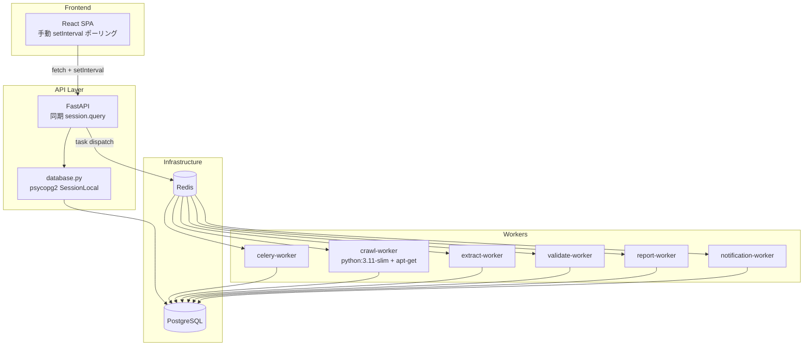
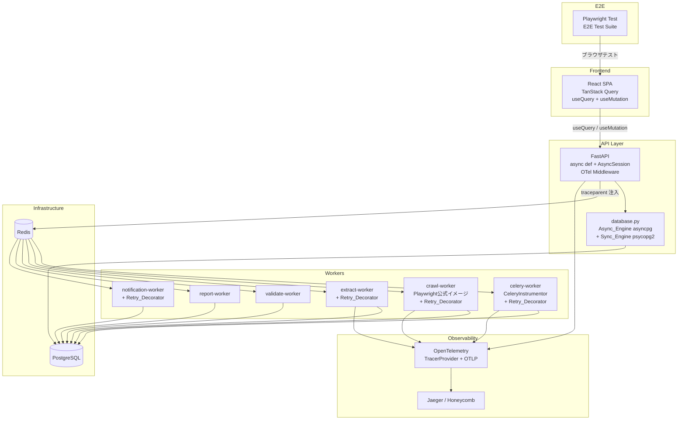
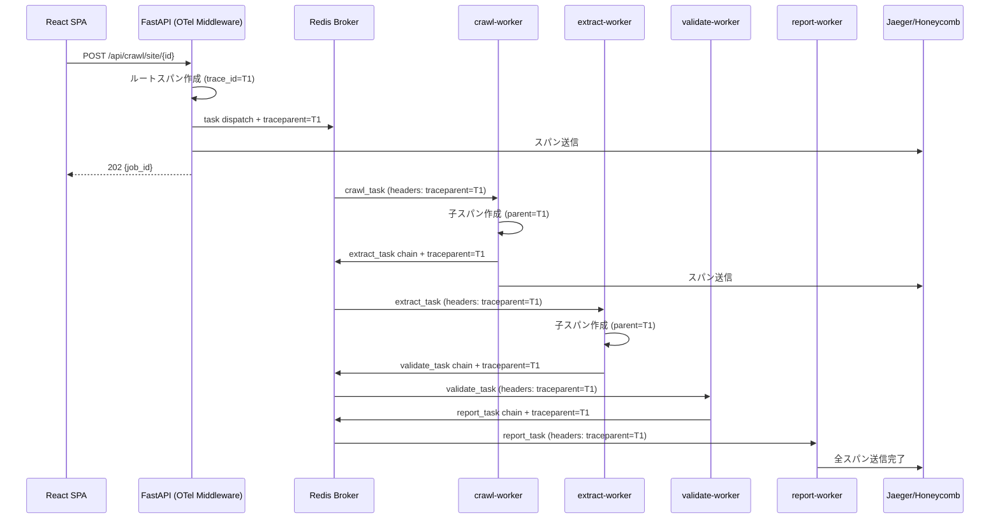
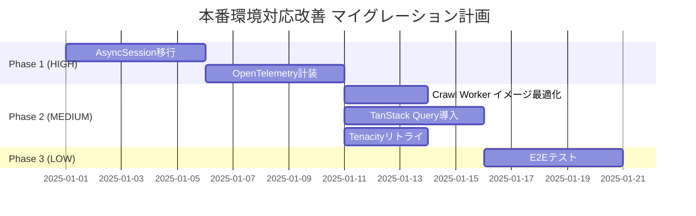

# 設計書: 本番環境対応改善 (production-readiness-improvements)

## 概要

本設計書は、決済条件監視システム（Payment Compliance Monitor）の本番環境対応に向けた6領域の技術改善を定義する。現行システムは同期型DBアクセスのFastAPI、手動状態管理のReactフロントエンド、リトライ機構なしのCeleryパイプライン、手動Playwright依存管理のDockerfileで構成されている。

本改善は以下の6領域を段階的に実施する:

1. **AsyncSession移行** — `asyncpg` + `async_sessionmaker` によるAPIレイヤーのノンブロッキングDB操作
2. **OpenTelemetry計装** — FastAPI → Celeryパイプライン全体の分散トレーシング
3. **Crawl Workerベースイメージ最適化** — Playwright公式イメージへの移行
4. **TanStack Query導入** — 宣言的データ取得とキャッシュ管理
5. **Tenacityリトライ** — 統一的な指数バックオフリトライ機構
6. **E2Eテスト** — Playwright Testによるクリティカルワークフロー検証

### 設計方針

- **APIレイヤー優先**: Celeryワーカーは同期のまま維持し、FastAPIエンドポイントのみ非同期化する
- **段階的移行**: 各領域を独立してデプロイ可能にし、破壊的変更を回避する
- **既存互換性**: Alembicマイグレーションは `psycopg2` を継続使用する

## アーキテクチャ

### 現行アーキテクチャ



### 改善後アーキテクチャ




### トレース伝搬フロー



## コンポーネントとインターフェース

### 1. AsyncSession移行 (優先度: HIGH)

#### 変更対象ファイル
- `src/database.py` — Async_Engine + `async_sessionmaker` 追加
- `src/api/*.py` — 全ルートハンドラの `async def` 化
- `src/review/service.py` — AsyncSession対応
- `alembic/env.py` — Sync_Engine 明示使用

#### database.py 新インターフェース

```python
# src/database.py — 改善後

from sqlalchemy import create_engine
from sqlalchemy.ext.asyncio import create_async_engine, async_sessionmaker, AsyncSession
from sqlalchemy.orm import sessionmaker, Session

# 同期URL (Alembic + _create_initial_admin 用)
SYNC_DATABASE_URL = derive_sync_url(DATABASE_URL)  # postgresql+psycopg2://...

# 非同期URL (FastAPI エンドポイント用)
ASYNC_DATABASE_URL = derive_async_url(DATABASE_URL)  # postgresql+asyncpg://...

# 同期エンジン (既存互換)
engine = create_engine(SYNC_DATABASE_URL, echo=False, poolclass=NullPool)
SessionLocal = sessionmaker(bind=engine, autocommit=False, autoflush=False)

# 非同期エンジン (新規)
async_engine = create_async_engine(ASYNC_DATABASE_URL, echo=False)
AsyncSessionLocal = async_sessionmaker(bind=async_engine, expire_on_commit=False)

# 既存の同期依存関数 (Alembic用に保持)
def get_db() -> Generator[Session, None, None]: ...

# 新規の非同期依存関数（参照系の無駄なコミットを回避）
async def get_async_db() -> AsyncGenerator[AsyncSession, None]:
    async with AsyncSessionLocal() as session:
        try:
            yield session
        except Exception:
            await session.rollback()
            raise
        finally:
            await session.close()
```

> **設計判断: 自動コミットの廃止**
>
> 依存関数内での自動 `commit()` は廃止する。理由: GET リクエスト（参照系API）の終了時にも
> 毎回DBへコミット処理が送信され、無駄なネットワークラウンドトリップが発生するため。
> データの追加・更新・削除を行う Service 層のメソッド内、あるいは対象の API エンドポイント
> （POST/PUT/DELETE）内で、明示的に `await session.commit()` を呼び出すアプローチとする。

#### 明示的コミットパターン

```python
# 参照系 (GET) — コミット不要
async def get_sites(db: AsyncSession = Depends(get_async_db)):
    result = await db.execute(select(MonitoringSite).where(...))
    return result.scalars().all()
    # → セッションは close() のみ。commit() は呼ばれない

# 更新系 (POST/PUT/DELETE) — Service層で明示的にコミット
async def create_site(site: SiteCreate, db: AsyncSession = Depends(get_async_db)):
    new_site = MonitoringSite(**site.dict())
    db.add(new_site)
    await db.commit()       # ← 明示的コミット
    await db.refresh(new_site)
    return new_site
```

#### URL導出ロジック

```python
def derive_async_url(url: str) -> str:
    """DATABASE_URL から asyncpg 用URLを導出する"""
    if "+psycopg2" in url:
        return url.replace("postgresql+psycopg2://", "postgresql+asyncpg://")
    if "+asyncpg" in url:
        return url  # そのまま
    # ドライバサフィックスなし
    return url.replace("postgresql://", "postgresql+asyncpg://", 1)

def derive_sync_url(url: str) -> str:
    """DATABASE_URL から psycopg2 用URLを導出する"""
    if "+asyncpg" in url:
        return url.replace("postgresql+asyncpg://", "postgresql+psycopg2://")
    if "+psycopg2" in url:
        return url  # そのまま
    return url.replace("postgresql://", "postgresql+psycopg2://", 1)
```

#### クエリ移行パターン

```python
# Before (同期)
def get_sites(db: Session = Depends(get_db)):
    sites = db.query(MonitoringSite).filter(MonitoringSite.is_active == True).all()
    return sites

# After (非同期 2.0スタイル)
async def get_sites(db: AsyncSession = Depends(get_async_db)):
    result = await db.execute(
        select(MonitoringSite).where(MonitoringSite.is_active == True)
    )
    sites = result.scalars().all()
    return sites
```

#### 注意事項
- `_create_initial_admin` はライフスパン起動時に `SessionLocal`（同期）を継続使用する
- Celeryワーカーは同期セッションを継続使用する（本フェーズではasync化しない）
- `alembic/env.py` は `engine`（Sync_Engine）を排他的に使用する

### 2. OpenTelemetry計装 (優先度: HIGH)

#### 新規ファイル
- `src/core/telemetry.py` — TracerProvider初期化 + 計装セットアップ

#### telemetry.py インターフェース

```python
# src/core/telemetry.py

def init_telemetry(service_name: str = "payment-compliance-api") -> None:
    """OpenTelemetry TracerProvider を初期化する。
    
    環境変数:
        OTEL_ENABLED: "true" (デフォルト) / "false"
        OTEL_EXPORTER_OTLP_ENDPOINT: OTLPエンドポイント (デフォルト: http://localhost:4317)
        OTEL_SERVICE_NAME: サービス名 (デフォルト: payment-compliance-api)
    """

def instrument_fastapi(app: FastAPI) -> None:
    """FastAPI + SQLAlchemy + HTTPX を計装する"""

def instrument_celery(service_name: str) -> None:
    """Celery + コンテキスト伝搬を計装する"""

def inject_trace_context(headers: dict) -> dict:
    """現在のスパンコンテキストをCeleryタスクヘッダーに注入する"""

def extract_trace_context(headers: dict) -> Context:
    """Celeryタスクヘッダーからスパンコンテキストを抽出する"""
```

#### Celeryコンテキスト伝搬

```python
# タスクディスパッチ時 (API側)
from src.core.telemetry import inject_trace_context

headers = inject_trace_context({})
celery_app.send_task(
    "src.pipeline_tasks.crawl_task",
    args=[site_id],
    headers=headers,
    queue="crawl",
)

# タスク受信時 (ワーカー側)
# CeleryInstrumentor が自動的にヘッダーからコンテキストを抽出し、
# 親トレースにリンクされた子スパンを作成する
```

#### 各ワーカーのサービス名設定

| コンテナ | OTEL_SERVICE_NAME |
|---------|-------------------|
| api | `payment-compliance-api` |
| crawl-worker | `payment-compliance-crawl-worker` |
| extract-worker | `payment-compliance-extract-worker` |
| validate-worker | `payment-compliance-validate-worker` |
| report-worker | `payment-compliance-report-worker` |
| notification-worker | `payment-compliance-notification-worker` |

### 3. Crawl Worker ベースイメージ最適化 (優先度: MEDIUM)

#### 変更対象ファイル
- `docker/Dockerfile.crawl` — 新規作成（crawl-worker専用）
- `docker-compose.yml` — crawl-worker の `dockerfile` 参照変更

#### Dockerfile.crawl 設計

```dockerfile
# ---- Builder Stage ----
FROM python:3.11-slim AS builder
WORKDIR /app
RUN apt-get update && apt-get install -y gcc postgresql-client && rm -rf /var/lib/apt/lists/*
COPY requirements.txt .
RUN pip install --no-cache-dir --prefix=/install -r requirements.txt

# ---- Runtime Stage (Playwright公式イメージ) ----
FROM mcr.microsoft.com/playwright/python:v1.40.0-jammy AS production
WORKDIR /app

# Playwright_Image にプリインストール済み:
# - Chromium, Firefox, WebKit
# - libnss3, libatk, libcups, libdrm, libdbus, libxkbcommon 等
# - fonts-liberation, xdg-utils

# 追加パッケージ: Tesseract OCR + CJKフォント
RUN apt-get update && apt-get install -y --no-install-recommends \
    postgresql-client \
    tesseract-ocr tesseract-ocr-jpn \
    fonts-noto-cjk \
    && rm -rf /var/lib/apt/lists/*

COPY --from=builder /install /usr/local
COPY src/ ./src/
COPY alembic/ ./alembic/
COPY alembic.ini .
COPY docker/entrypoint.sh /entrypoint.sh
RUN chmod +x /entrypoint.sh
RUN mkdir -p /app/screenshots

# playwright install chromium は不要（プリインストール済み）
# libnss3 等の apt-get も不要（プリインストール済み）

EXPOSE 8000
ENTRYPOINT ["/entrypoint.sh"]
CMD ["celery", "-A", "src.celery_app", "worker", "-Q", "crawl", "--loglevel=info", "--concurrency=2"]
```

#### 既存 Dockerfile への影響
- `docker/Dockerfile` は変更なし（API + crawl以外のワーカー用）
- `docker-compose.yml` の `crawl-worker` サービスのみ `dockerfile: docker/Dockerfile.crawl` に変更

### 4. TanStack Query導入 (優先度: MEDIUM)

#### 新規ファイル
- `frontend/src/lib/queryClient.ts` — QueryClient設定
- `frontend/src/hooks/queries/useSites.ts` — サイト関連フック
- `frontend/src/hooks/queries/useAlerts.ts` — アラート関連フック
- `frontend/src/hooks/queries/useReviews.ts` — 審査関連フック
- `frontend/src/hooks/queries/useStatistics.ts` — 統計関連フック
- `frontend/src/hooks/queries/useCategories.ts` — カテゴリ関連フック

#### QueryClient設定

```typescript
// frontend/src/lib/queryClient.ts
import { QueryClient } from '@tanstack/react-query';

export const queryClient = new QueryClient({
  defaultOptions: {
    queries: {
      staleTime: 30 * 1000,      // 30秒
      gcTime: 5 * 60 * 1000,     // 5分
      retry: 1,
      refetchOnWindowFocus: false,
    },
  },
});
```

#### クエリフック例

```typescript
// frontend/src/hooks/queries/useSites.ts
import { useQuery, useMutation, useQueryClient } from '@tanstack/react-query';
import { getSites, createSite, updateSite, deleteSite } from '../../services/api';

export const siteKeys = {
  all: ['sites'] as const,
  detail: (id: number) => ['sites', id] as const,
};

export function useSites() {
  return useQuery({
    queryKey: siteKeys.all,
    queryFn: getSites,
  });
}

export function useCreateSite() {
  const queryClient = useQueryClient();
  return useMutation({
    mutationFn: createSite,
    onSuccess: () => {
      queryClient.invalidateQueries({ queryKey: siteKeys.all });
    },
  });
}
```

#### ポーリング置換パターン

```typescript
// Before: setInterval ベース
useEffect(() => {
  const interval = setInterval(() => fetchDashboard(), 30000);
  return () => clearInterval(interval);
}, []);

// After: TanStack Query refetchInterval
const { data } = useQuery({
  queryKey: ['statistics'],
  queryFn: getStatistics,
  refetchInterval: 30_000,
});

// Celeryタスクステータスポーリング
const { data: taskStatus } = useQuery({
  queryKey: ['crawl-status', jobId],
  queryFn: () => getCrawlStatus(jobId),
  refetchInterval: (query) => {
    const status = query.state.data?.status;
    return status === 'PENDING' || status === 'STARTED' ? 2000 : false;
  },
});
```

> **設計判断: Celeryタスク完了時のキャッシュ無効化タイミング**
>
> Celeryパイプラインが絡む操作（クロール実行、審査キュー投入等）では、APIが `202 Accepted`
> を返した直後にキャッシュを無効化しても、ワーカーがDB更新を完了していないため古いデータが
> 表示される問題がある。ミューテーションの `onSuccess` ではなく、タスクステータスポーリングが
> `SUCCESS` を返したタイミングで `invalidateQueries` を発火させる。

```typescript
// Celeryタスクを伴う操作のキャッシュ無効化パターン
function useCrawlWithInvalidation(siteId: number) {
  const queryClient = useQueryClient();
  const [jobId, setJobId] = useState<string | null>(null);

  // 1. クロール開始ミューテーション（onSuccess でキャッシュ無効化しない）
  const triggerCrawl = useMutation({
    mutationFn: () => triggerSiteCrawl(siteId),
    onSuccess: (data) => {
      setJobId(data.job_id);
      // ここでは invalidateQueries しない
    },
  });

  // 2. タスクステータスポーリング（SUCCESS 時にキャッシュ無効化）
  useQuery({
    queryKey: ['crawl-status', jobId],
    queryFn: () => getCrawlStatus(jobId!),
    enabled: !!jobId,
    refetchInterval: (query) => {
      const status = query.state.data?.status;
      if (status === 'SUCCESS') {
        // ワーカーがDB更新を完了した後にキャッシュ無効化
        queryClient.invalidateQueries({ queryKey: siteKeys.all });
        queryClient.invalidateQueries({ queryKey: ['alerts'] });
        return false; // ポーリング停止
      }
      return status === 'PENDING' || status === 'STARTED' ? 2000 : false;
    },
  });

  return { triggerCrawl, jobId };
}
```

### 5. Tenacityリトライ (優先度: MEDIUM)

#### 新規ファイル
- `src/core/retry.py` — 統一リトライデコレータ定義

#### retry.py インターフェース

```python
# src/core/retry.py
import logging
from typing import Callable, Optional, Tuple, Type

from tenacity import (
    retry,
    stop_after_attempt,
    wait_exponential,
    wait_random,
    before_sleep_log,
    retry_if_exception_type,
    retry_if_result,
)

logger = logging.getLogger(__name__)

def with_retry(
    *,
    max_attempts: int = 3,
    min_wait: float = 1.0,
    max_wait: float = 10.0,
    multiplier: float = 2.0,
    max_jitter: float = 1.0,
    retry_on: Tuple[Type[Exception], ...] = (Exception,),
    retry_if: Optional[Callable] = None,
) -> retry:
    """統一リトライデコレータを生成する。
    
    指数バックオフ + ランダムジッター + WARNINGログ出力。
    
    Args:
        max_attempts: 最大リトライ回数 (デフォルト: 3)
        min_wait: 最小待機時間 秒 (デフォルト: 1.0)
        max_wait: 最大待機時間 秒 (デフォルト: 10.0)
        multiplier: バックオフ倍率 (デフォルト: 2.0)
        max_jitter: 最大ジッター 秒 (デフォルト: 1.0)
        retry_on: リトライ対象の例外型タプル
        retry_if: カスタムリトライ条件コーラブル
    """
    conditions = retry_if_exception_type(retry_on)
    if retry_if is not None:
        conditions = conditions | retry_if_result(retry_if)

    return retry(
        stop=stop_after_attempt(max_attempts),
        wait=wait_exponential(multiplier=multiplier, min=min_wait, max=max_wait)
             + wait_random(0, max_jitter),
        retry=conditions,
        before_sleep=before_sleep_log(logger, logging.WARNING),
        reraise=True,
    )
```

#### 適用箇所

| 適用先 | リトライ対象例外 | 備考 |
|--------|-----------------|------|
| LLM API呼び出し | HTTP 429, HTTP 5xx | OpenAI/Anthropic |
| Slack webhook | `ConnectionError`, HTTP 5xx | notification-worker |
| メール送信 | `ConnectionError`, `SMTPException` | notification-worker |
| 外部HTTP (`httpx`) | `ConnectError`, `TimeoutException`, HTTP 5xx | 全ワーカー |
| Playwrightスクリーンショット | `playwright.async_api.TimeoutError` | crawl-worker |

#### 非リトライ対象（重要）
- HTTP 4xx クライアントエラー（400, 401, 403, 404）
- バリデーションエラー（`ValidationError`）
- ビジネスロジックエラー

### 6. E2Eテスト (優先度: LOW)

#### 新規ファイル構成

```
genai/e2e/
├── playwright.config.ts
├── global-setup.ts
├── auth/
│   ├── admin.json          # admin セッション状態
│   ├── reviewer.json       # reviewer セッション状態
│   └── viewer.json         # viewer セッション状態
├── tests/
│   ├── login.spec.ts
│   ├── site-management.spec.ts
│   ├── alerts.spec.ts
│   ├── review-workflow.spec.ts
│   ├── crawl-trigger.spec.ts
│   └── rbac.spec.ts
└── .github/
    └── workflows/
        └── e2e.yml
```

#### playwright.config.ts 設計

```typescript
import { defineConfig } from '@playwright/test';

export default defineConfig({
  testDir: './tests',
  timeout: 30_000,
  retries: 1,
  use: {
    baseURL: process.env.E2E_BASE_URL || 'http://localhost:5173',
    viewport: { width: 1280, height: 720 },
    screenshot: 'only-on-failure',
    trace: 'on-first-retry',
    video: 'on-first-retry',
  },
  outputDir: 'test-results/',
  projects: [
    { name: 'chromium', use: { browserName: 'chromium' } },
  ],
  globalSetup: './global-setup.ts',
});
```

#### Flakiness（不安定さ）対策

> **設計判断: テストデータ競合の防止**
>
> 異なるテストケースが同一DBレコード（サイト情報や審査キュー）を操作すると、
> 並列実行時に予期せぬ失敗（Flaky test）が発生する。以下の2つの対策を併用する。

1. **固有テストデータの生成**: 各テスト実行前にランダムなサイト名（例: `test-site-${Date.now()}`）を生成し、テスト終了後にクリーンアップする

```typescript
// tests/helpers/test-data.ts
export function uniqueSiteName() {
  return `e2e-site-${Date.now()}-${Math.random().toString(36).slice(2, 7)}`;
}

// tests/site-management.spec.ts
test.afterEach(async ({ request }) => {
  // テストで作成したサイトをAPI経由で削除
  if (createdSiteId) {
    await request.delete(`/api/sites/${createdSiteId}`);
  }
});
```

2. **重要フローの直列実行保証**: 審査ワークフローなど状態遷移を伴うテストは `test.describe.configure({ mode: 'serial' })` で直列実行を保証する

```typescript
// tests/review-workflow.spec.ts
test.describe('審査ワークフロー', () => {
  test.describe.configure({ mode: 'serial' });

  test('案件を担当者に割り当て', async ({ page }) => { ... });
  test('一次審査判定を送信', async ({ page }) => { ... });
  test('エスカレーション案件の二次審査', async ({ page }) => { ... });
});
```


## データモデル

### 既存モデルへの変更

本改善では新規データモデルの追加は不要。既存モデルはそのまま維持し、アクセスパターンのみ変更する。

#### SQLAlchemy モデルアクセスパターンの変更

| 操作 | Before (同期) | After (非同期) |
|------|--------------|---------------|
| 単一取得 | `db.query(Model).filter(...).first()` | `(await db.execute(select(Model).where(...))).scalar_one_or_none()` |
| 一覧取得 | `db.query(Model).all()` | `(await db.execute(select(Model))).scalars().all()` |
| カウント | `db.query(Model).count()` | `(await db.execute(select(func.count(Model.id)))).scalar()` |
| 追加 | `db.add(obj); db.commit()` | `db.add(obj); await db.commit()` |
| 更新 | `obj.field = val; db.commit()` | `obj.field = val; await db.commit()` |
| リフレッシュ | `db.refresh(obj)` | `await db.refresh(obj)` |

### OpenTelemetry 設定データ

環境変数ベースの設定（DBモデル不要）:

| 環境変数 | デフォルト値 | 説明 |
|---------|------------|------|
| `OTEL_ENABLED` | `true` | OpenTelemetry有効/無効 |
| `OTEL_EXPORTER_OTLP_ENDPOINT` | `http://localhost:4317` | OTLPエクスポーターエンドポイント |
| `OTEL_SERVICE_NAME` | `payment-compliance-api` | サービス名リソース属性 |

### TanStack Query キャッシュキー設計

| クエリキー | エンドポイント | staleTime | refetchInterval |
|-----------|--------------|-----------|-----------------|
| `['sites']` | `GET /api/sites/` | 30s (デフォルト) | — |
| `['sites', id]` | `GET /api/sites/{id}` | 30s | — |
| `['alerts']` | `GET /api/alerts/` | 30s | — |
| `['statistics']` | `GET /api/monitoring/statistics` | 30s | 30,000ms |
| `['reviews', params]` | `GET /api/reviews/` | 30s | — |
| `['review-stats']` | `GET /api/reviews/stats` | 30s | — |
| `['categories']` | `GET /api/categories/` | 30s | — |
| `['crawl-status', jobId]` | `GET /api/crawl/status/{id}` | 0 | 2,000ms (PENDING/STARTED時) |

### ミューテーション → キャッシュ無効化マッピング

| ミューテーション | 無効化対象キー | 無効化タイミング |
|----------------|--------------|----------------|
| `createSite` | `['sites']` | `onSuccess` 即時 |
| `updateSite` | `['sites']`, `['sites', id]` | `onSuccess` 即時 |
| `deleteSite` | `['sites']` | `onSuccess` 即時 |
| `decidePrimary` | `['reviews']`, `['review-stats']` | `onSuccess` 即時 |
| `decideSecondary` | `['reviews']`, `['review-stats']` | `onSuccess` 即時 |
| `assignReviewer` | `['reviews']` | `onSuccess` 即時 |
| `createCategory` | `['categories']` | `onSuccess` 即時 |
| `triggerCrawl` | `['sites']`, `['alerts']` | タスクステータス `SUCCESS` 時（ポーリング経由） |
| `triggerVerification` | `['sites']`, `['reviews']` | タスクステータス `SUCCESS` 時（ポーリング経由） |

> **注意**: Celeryタスクを伴う操作（`triggerCrawl`, `triggerVerification` 等）は、
> `onSuccess`（202 Accepted 受信時）ではなく、タスクステータスポーリングが `SUCCESS` を
> 返したタイミングでキャッシュを無効化する。これにより、ワーカーがDB更新を完了する前に
> 古いデータが表示される問題を防ぐ。


## 正当性プロパティ

*プロパティとは、システムの全ての有効な実行において真であるべき特性や振る舞いのことである。プロパティは人間が読める仕様と機械的に検証可能な正当性保証の橋渡しとなる。*

### Property 1: データベースURL導出の往復一貫性

*任意の* 有効なPostgreSQL接続URL（`postgresql://`、`postgresql+psycopg2://`、`postgresql+asyncpg://` のいずれかのプレフィックスを持つ）に対して、`derive_async_url` は常に `postgresql+asyncpg://` プレフィックスのURLを生成し、`derive_sync_url` は常に `postgresql+psycopg2://` プレフィックスのURLを生成する。さらに、ホスト名、ポート、データベース名、認証情報はいずれの変換でも保持される。

**Validates: Requirements 1.1, 1.5, 1.6, 3.2**

### Property 2: 非同期セッション依存関数のロールバック・クローズ保証

*任意の* データベース操作シーケンスに対して、`get_async_db` は以下を保証する: 例外が発生した場合は `rollback` が呼ばれ、いずれの場合も `close` が呼ばれる。コミットは依存関数内では行わず、呼び出し元（Service層/エンドポイント）が明示的に実行する。

**Validates: Requirements 1.3**

### Property 3: OpenTelemetryトレースコンテキストの注入・抽出往復

*任意の* 有効なトレースコンテキスト（ランダムな trace_id と span_id）に対して、`inject_trace_context` でヘッダーに注入した後、`extract_trace_context` で抽出すると、元の trace_id と span_id が復元される。

**Validates: Requirements 6.2, 6.3**

### Property 4: リトライデコレータのバックオフ時間境界

*任意の* リトライ試行番号 n（1 ≤ n ≤ max_attempts）に対して、実際の待機時間は `[min_wait * multiplier^(n-1), min(min_wait * multiplier^(n-1), max_wait) + max_jitter]` の範囲内に収まる。

**Validates: Requirements 10.1, 10.3**

### Property 5: リトライデコレータの最大試行回数遵守

*任意の* 常に失敗する関数と *任意の* `max_attempts` 設定に対して、デコレータは関数を正確に `max_attempts` 回呼び出した後、元の例外を `RetryError` 経由で発生させる。

**Validates: Requirements 10.2, 11.5**

### Property 6: 非リトライ対象例外の即時伝搬

*任意の* `retry_on` に含まれない例外型に対して、リトライデコレータはリトライせずに即座に例外を発生させる。関数は正確に1回だけ呼び出される。

**Validates: Requirements 10.5**

### Property 7: タスクステータスポーリング間隔の条件分岐

*任意の* Celeryタスクステータス文字列に対して、ステータスが `PENDING` または `STARTED` の場合は `refetchInterval` が `2000` を返し、それ以外の終端ステータス（`SUCCESS`、`FAILURE`、`REVOKED`）の場合は `false` を返す。

**Validates: Requirements 9.5**

### Property 8: ミューテーション成功時のキャッシュ無効化完全性

*任意の* ミューテーション操作に対して、成功時に無効化されるクエリキーの集合は、そのミューテーションが影響するリソースの読み取りクエリキーを全て含む。

**Validates: Requirements 9.3**

## エラーハンドリング

### AsyncSession移行

| エラーケース | ハンドリング |
|------------|------------|
| `asyncpg` 接続失敗 | `get_async_db` が例外をキャッチし、ロールバック後にセッションをクローズ。FastAPIの例外ハンドラが500を返す |
| DATABASE_URL 形式不正 | `derive_async_url` / `derive_sync_url` が `ValueError` を発生。起動時に検出 |
| 同期/非同期セッション混在 | Celeryワーカーは `SessionLocal`（同期）のみ使用。APIレイヤーは `AsyncSessionLocal` のみ使用。混在を防ぐ |

### OpenTelemetry

| エラーケース | ハンドリング |
|------------|------------|
| OTLPエクスポーター接続失敗 | `BatchSpanProcessor` がスパンをドロップ。アプリケーション動作に影響なし |
| `OTEL_ENABLED=false` | `init_telemetry` が早期リターン。NoOp TracerProvider が使用される |
| Celeryヘッダーに traceparent なし | `extract_trace_context` が新規ルートスパンを作成。トレースは分断されるが動作は継続 |

### Tenacityリトライ

| エラーケース | ハンドリング |
|------------|------------|
| 全リトライ試行失敗 | `RetryError` が発生し、元の例外をラップ。呼び出し元で適切にハンドリング |
| 非一時的エラー（4xx） | `retry_on` に含まれないため即座に発生。リトライなし |
| リトライ中のタイムアウト | `task_soft_time_limit` がリトライループを中断。Celeryが `SoftTimeLimitExceeded` を発生 |

### TanStack Query

| エラーケース | ハンドリング |
|------------|------------|
| API呼び出し失敗 | `useQuery` の `retry: 1` で1回リトライ。失敗時は `error` 状態をコンポーネントに伝搬 |
| キャッシュ無効化失敗 | TanStack Query が自動的にバックグラウンドで再取得を試行 |
| ネットワーク切断 | `refetchOnReconnect` でネットワーク復帰時に自動再取得 |

### E2Eテスト

| エラーケース | ハンドリング |
|------------|------------|
| テスト失敗 | スクリーンショット + トレースを `test-results/` に保存。GitHub Actionsアーティファクトとしてアップロード |
| アプリケーション起動失敗 | `docker-compose up` のヘルスチェックで検出。テスト実行前に失敗 |
| 認証状態の期限切れ | `global-setup.ts` が各テスト実行前に新規認証状態を生成 |

## テスト戦略

### テストアプローチ

本機能は6つの独立した改善領域で構成されるため、テスト戦略は領域ごとに最適なアプローチを採用する。

#### プロパティベーステスト（Hypothesis）

以下の領域はプロパティベーステストに適している:

- **URL導出ロジック** (`derive_async_url`, `derive_sync_url`) — 純粋関数、入力空間が広い
- **リトライデコレータ** (`with_retry`) — バックオフ計算、試行回数、例外フィルタリング
- **トレースコンテキスト伝搬** (`inject_trace_context`, `extract_trace_context`) — 往復プロパティ
- **セッション依存関数** (`get_async_db`) — コミット/ロールバック保証

テストライブラリ: **Hypothesis** (Python, 既に `requirements.txt` に含まれている)
フロントエンド: **fast-check** (TypeScript, ポーリング間隔・キャッシュ無効化ロジック用)

設定:
- 最小100イテレーション/プロパティ
- 各テストにプロパティ番号をタグ付け
- タグ形式: `Feature: production-readiness-improvements, Property {N}: {property_text}`

#### ユニットテスト

- OpenTelemetry初期化の設定検証
- TanStack Query フックの基本動作
- E2E設定ファイルの構造検証

#### 統合テスト

- Celeryパイプライン全体のトレース伝搬
- リトライデコレータの実際のHTTPエラーハンドリング
- AsyncSession経由のDB操作

#### E2Eテスト（Playwright Test）

- ログイン → ダッシュボード → サイト管理 → アラート → 審査の重要フロー
- RBAC検証（admin/reviewer/viewer の3ロール）
- 各テストは独立し、可変状態を共有しない

### マイグレーション戦略（段階的アプローチ）



#### Phase 1: APIサバイバビリティ（HIGH優先度）
1. `src/database.py` に Async_Engine + `get_async_db` を追加（既存の同期エンジンは保持）
2. 全APIルートハンドラを `async def` + `Async_Session` に移行
3. OpenTelemetry初期化 + FastAPI/SQLAlchemy/HTTPX計装
4. Celeryコンテキスト伝搬設定

#### Phase 2: 信頼性・効率性（MEDIUM優先度）
5. `docker/Dockerfile.crawl` 作成、`docker-compose.yml` 更新
6. TanStack Query導入、既存 `setInterval` 置換
7. `src/core/retry.py` 作成、全外部呼び出しに適用

#### Phase 3: 品質保証（LOW優先度）
8. E2Eテストプロジェクトセットアップ
9. 重要ワークフロー + RBACテスト実装
10. GitHub Actions CI統合

### リスク軽減策

| 領域 | リスク | 軽減策 |
|------|--------|--------|
| AsyncSession | Celeryワーカーでの非同期セッション誤使用 | Celeryワーカーは本フェーズでは同期のまま維持。`get_db` を削除せず保持 |
| AsyncSession | Alembicマイグレーション破損 | `alembic/env.py` は `Sync_Engine` を排他使用。`derive_sync_url` で常にpsycopg2 URLを保証 |
| OpenTelemetry | Celeryチェーンでのコンテキスト消失 | `CeleryInstrumentor` の明示的設定 + 統合テストで検証 |
| Crawl Worker | 他ワーカーへのイメージ変更波及 | `Dockerfile.crawl` はcrawl-worker専用。他ワーカーは `Dockerfile` を継続使用 |
| TanStack Query | キャッシュ過剰無効化 | ターゲットクエリキー無効化を使用。ワイルドカード無効化を避ける |
| Tenacity | 非一時的エラーへのリトライ | `retry_on` で明示的に一時的エラーのみ指定。4xxクライアントエラーは除外 |
| E2E | テスト間の状態共有 | 各テストは独立。ロール別の認証状態ファイルを使用 |
| E2E | テストデータ競合（Flakiness） | 固有テストデータ生成 + afterEach クリーンアップ。状態遷移テストは `serial` モードで直列実行 |
