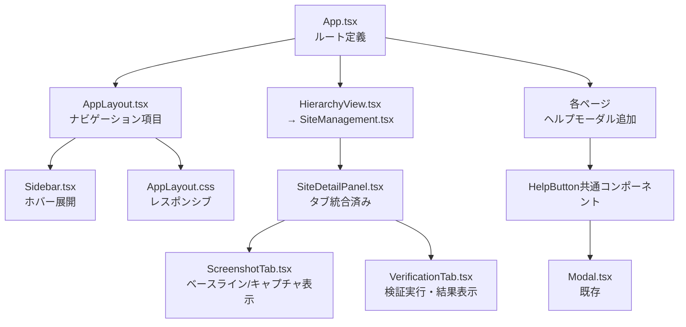

# Design Document: screenshot-integration-rename

## Overview

本設計は、決済条件監視システムのフロントエンドUIを再構築するための6つの要件を実装する。主な変更は以下の通り：

1. 「階層型ビュー」→「サイト管理」へのリネームとルート変更（`/hierarchy` → `/site-management`）
2. スクリーンショット管理ページをSiteDetailPanelのタブに統合
3. 検証・比較ページをSiteDetailPanelのタブに統合
4. サイドバーナビゲーション構造の更新（不要項目の削除）
5. タブレット幅でのサイドバーホバー展開
6. 全9ページへのヘルプモーダル追加

変更対象は純粋にフロントエンド（React + TypeScript）であり、バックエンドAPIの変更は不要。

## Architecture

### 変更の影響範囲



### 設計方針

- **リネーム**: `HierarchyView.tsx` を `SiteManagement.tsx` にリネームし、ページタイトルとルートを変更。旧ルートからのリダイレクトを設定。
- **ページ統合**: Screenshots.tsx と Verification.tsx の独立ページは残すが、ルートアクセス時は `/site-management` にリダイレクト。ScreenshotTab と VerificationTab は既にSiteDetailPanel内に存在するため、機能拡充のみ。
- **ナビゲーション**: `navigationItems` 配列から「スクリーンショット」「検証・比較」を削除し、「階層型ビュー」を「サイト管理」に変更。「分析」グループが空になるため、「サイト管理」を「分析」グループに残す。
- **サイドバーホバー**: Sidebar コンポーネントに `onMouseEnter`/`onMouseLeave` ハンドラを追加し、タブレット幅で一時展開を実現。AppLayout が hover 状態を管理。
- **ヘルプモーダル**: 共通の `HelpButton` コンポーネントを作成し、各ページのヘッダーに配置。既存の Alerts ページの `severity-help-btn` パターンを標準化。

## Components and Interfaces

### 1. HelpButton（新規共通コンポーネント）

```typescript
// genai/frontend/src/components/ui/HelpButton/HelpButton.tsx
export interface HelpButtonProps {
  title: string;        // モーダルタイトル
  children: ReactNode;  // モーダル内のヘルプコンテンツ
}
```

各ページのヘッダー `<h1>` の横に配置する「?」ボタン。クリックで Modal を開き、ページ固有のヘルプコンテンツを表示する。`aria-label="ヘルプを表示"` を設定。

### 2. Sidebar（既存コンポーネント拡張）

```typescript
// 既存の SidebarProps に追加
export interface SidebarProps {
  items: NavItem[];
  groups: { key: string; label: string }[];
  collapsed?: boolean;
  onToggle?: () => void;
  hoverExpanded?: boolean;  // 新規: ホバーによる一時展開状態
}
```

`hoverExpanded` が `true` の場合、`collapsed` が `true` でもラベルを表示する。CSSクラス `sidebar--hover-expanded` を追加。

### 3. AppLayout（既存コンポーネント変更）

- `navigationItems` から `/screenshots` と `/verification` を削除
- `/hierarchy` → `/site-management` に変更、ラベルを「サイト管理」に変更
- タブレット幅でのホバー状態管理（`isHoverExpanded` state）を追加
- `onMouseEnter`/`onMouseLeave` を sidebar wrapper に設定

### 4. App.tsx（ルート変更）

- `/hierarchy` → `/site-management` にメインルート変更
- `/hierarchy`, `/screenshots`, `/verification` からのリダイレクトルート追加
- `HierarchyView` インポートを `SiteManagement` に変更

### 5. SiteManagement.tsx（リネーム）

- `HierarchyView.tsx` → `SiteManagement.tsx` にファイルリネーム
- ページタイトル `<h1>` を「サイト管理」に変更
- HelpButton を追加

### 6. ScreenshotTab（既存コンポーネント拡充）

- ベースラインスクリーンショット（`screenshot_type === 'baseline'`）と最新モニタリングキャプチャを分離表示
- 再キャプチャボタンと再アップロードボタンを追加
- キャプチャ/アップロードモーダルからスクリーンショットタイプセレクターを除外

### 7. VerificationTab（既存コンポーネント拡充）

- サイトセレクターを非表示（siteId は props から受け取り済み）
- 「検証実行」ボタンを追加
- 比較テーブル（HTML値、OCR値、ステータス）の表示
- 差異リスト（重要度バッジ付き）の表示
- 履歴一覧の表示
- CSV エクスポートボタンを追加

## Data Models

### NavigationItem の変更

```typescript
// 変更前
const navigationItems: NavItem[] = [
  { path: '/hierarchy', label: '階層型ビュー', group: 'analysis' },
  { path: '/screenshots', label: 'スクリーンショット', group: 'analysis' },
  { path: '/verification', label: '検証・比較', group: 'analysis' },
  // ...
];

// 変更後
const navigationItems: NavItem[] = [
  { path: '/site-management', label: 'サイト管理', group: 'analysis' },
  // screenshots と verification は削除
  // ...
];
```

### ルート設定の変更

```typescript
// 変更後のルート構成
<Route path="/site-management" element={<SiteManagement />} />
<Route path="/hierarchy" element={<Navigate to="/site-management" replace />} />
<Route path="/screenshots" element={<Navigate to="/site-management" replace />} />
<Route path="/verification" element={<Navigate to="/site-management" replace />} />
```

### HelpContent 型

```typescript
// ヘルプコンテンツは各ページ内でJSXとして直接記述する
// 共通の型定義は不要（HelpButton が children を受け取る）
```

### Sidebar CSS 状態

```
sidebar                    → 通常展開（desktop）
sidebar--collapsed         → 折りたたみ（tablet）
sidebar--collapsed sidebar--hover-expanded → ホバー一時展開（tablet hover）
```

ホバー展開時は `position: absolute` + `z-index` でメインコンテンツの上に重ねて表示し、レイアウトシフトを防ぐ。


## Correctness Properties

*A property is a characteristic or behavior that should hold true across all valid executions of a system—essentially, a formal statement about what the system should do. Properties serve as the bridge between human-readable specifications and machine-verifiable correctness guarantees.*

### Property 1: Breakpoint classification is consistent

*For any* viewport width (positive integer), `classifyBreakpoint(width)` shall return `'mobile'` if width < 768, `'tablet'` if 768 ≤ width ≤ 1023, and `'desktop'` if width ≥ 1024. The three ranges are exhaustive and mutually exclusive.

**Validates: Requirements 5.1, 5.4, 5.5**

### Property 2: No empty navigation groups are rendered

*For any* set of navigation items and group definitions, the Sidebar component shall not render a group element for groups that contain zero items after filtering.

**Validates: Requirements 4.4**

### Property 3: Verification results display all required fields

*For any* verification result with a completed status, the rendered VerificationTab output shall contain the HTML value, OCR value, and status indicator for each comparison entry.

**Validates: Requirements 3.3**

### Property 4: Discrepancies are displayed with severity badges

*For any* verification result that contains one or more discrepancies, the rendered VerificationTab output shall display each discrepancy with its corresponding severity badge.

**Validates: Requirements 3.4**

### Property 5: Help button presence, accessibility, and modal behavior

*For any* page in the set {Dashboard, Sites, Alerts, FakeSites, SiteManagement, CrawlResultReview, Contracts, Rules, Customers}, the page shall render a help button with `aria-label="ヘルプを表示"`, and clicking that button shall open a Modal containing non-empty help content.

**Validates: Requirements 6.1, 6.2, 6.4**

### Property 6: Baseline screenshot invariant (one per site)

*For any* site, after any sequence of re-capture or re-upload operations, the ScreenshotTab shall display exactly one baseline screenshot, replacing the previous one.

**Validates: Requirements 2.5**

## Error Handling

### ルーティングエラー
- 旧ルート（`/hierarchy`, `/screenshots`, `/verification`）へのアクセスは `<Navigate replace>` で `/site-management` にリダイレクト。404は発生しない。

### API エラー
- ScreenshotTab: スクリーンショット取得失敗時は既存のエラー表示（`tab-error` クラス）を使用
- VerificationTab: 検証実行失敗時はエラーメッセージを表示。検証結果取得失敗時は既存のエラー表示を使用
- CSV エクスポート失敗時はユーザーにエラーメッセージを表示

### ヘルプモーダル
- HelpButton は状態管理のみでAPI呼び出しなし。エラーは発生しない。
- Modal の Escape キーハンドリングは既存実装で対応済み。

### サイドバーホバー
- mouseenter/mouseleave イベントの競合を防ぐため、状態は単純な boolean で管理。
- タッチデバイスでは mouseenter が発火しない場合があるが、タブレット幅ではタッチ操作時にハンバーガーメニューにフォールバックしない（768px以上ではサイドバーが常に表示）。ホバーが使えない場合でもアイコンは表示されるため、ナビゲーションは可能。

## Testing Strategy

### テストフレームワーク
- **ユニットテスト**: Vitest + React Testing Library
- **プロパティベーステスト**: Vitest + fast-check
- **テスト実行コマンド**: `npx vitest run`（`genai/frontend` ディレクトリ）

### ユニットテスト

具体的な例やエッジケースを検証する：

- **ルーティング**: `/site-management` でSiteManagementページが表示されること、`/hierarchy` → `/site-management` リダイレクト、`/screenshots` → `/site-management` リダイレクト、`/verification` → `/site-management` リダイレクト
- **ナビゲーション項目**: 「サイト管理」が存在し `/site-management` パスを持つこと、「スクリーンショット」「検証・比較」が存在しないこと
- **ページタイトル**: SiteManagement ページの `<h1>` が「サイト管理」であること
- **サイドバーホバー**: mouseenter で展開、mouseleave で折りたたみ、メインコンテンツのレイアウトシフトなし
- **ヘルプモーダル**: 各ページで「?」ボタンクリック → モーダル表示 → 閉じるボタン/Escape で閉じる
- **ScreenshotTab**: ベースラインと最新キャプチャの表示、再キャプチャ/再アップロードボタンの存在、タイプセレクターの非表示
- **VerificationTab**: 検証実行ボタンの存在、比較テーブル表示、差異リスト表示、CSV エクスポートボタンの存在、サイトセレクターの非表示

### プロパティベーステスト

各テストは最低100回のイテレーションで実行する。各テストにはデザインドキュメントのプロパティ番号をコメントで参照する。

タグフォーマット: **Feature: screenshot-integration-rename, Property {number}: {property_text}**

- **Property 1 テスト**: ランダムな正の整数幅を生成し、`classifyBreakpoint` の戻り値が正しいブレークポイントカテゴリであることを検証
- **Property 2 テスト**: ランダムなナビゲーション項目とグループを生成し、Sidebar レンダリング後に空グループの DOM 要素が存在しないことを検証
- **Property 3 テスト**: ランダムな検証結果データを生成し、VerificationTab レンダリング後にHTML値・OCR値・ステータスが表示されていることを検証
- **Property 4 テスト**: ランダムな差異データ（1件以上）を含む検証結果を生成し、各差異の重要度バッジが表示されていることを検証
- **Property 5 テスト**: 9ページのリストからランダムにページを選択し、ヘルプボタンの存在・aria-label・モーダル表示を検証
- **Property 6 テスト**: ランダムなサイトIDとスクリーンショットデータを生成し、ベースラインが常に1枚であることを検証

各プロパティベーステストは1つのプロパティに対して1つのテスト関数で実装する。
