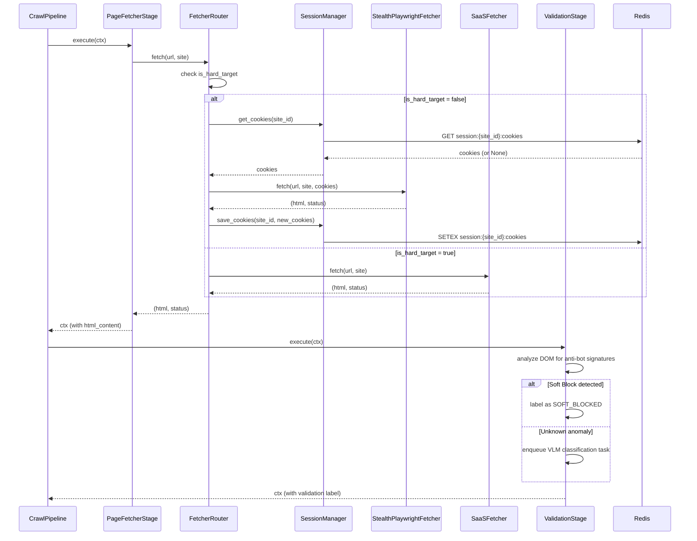

# Design Document: Stealth Browser Hardening

## Overview

Stealth Browser Hardening は、Payment Compliance Monitor のクローリング基盤をボット検出対策で段階的に強化する機能である。Phase 1（実装済み）では `StealthBrowserFactory` と `ScrapingConfig` による Playwright 一元化を完了。本設計は Phase 2〜4 の未実装部分をカバーする。

**Phase 2**: Redis ベースの `SessionManager` で分散 Cookie/Session 管理を実現。redis-py の分散ロックでログインスタンピードを防止し、ステートレスワーカーの水平スケールを可能にする。

**Phase 2.5**: `ValidationStage`（CrawlPlugin）で HTTP 200 の裏に隠れた Soft Block を DOM 分析で検知。未知のブロック画面は Vision-LLM（Gemini/Claude Vision）でゼロショット分類し、高品質な教師データを蓄積する。

**Phase 3**: `PageFetcher` Protocol による抽象化と `FetcherRouter` による戦略選択。`SaaSFetcher`（ZenRows/ScraperAPI）で高難度ターゲットを外部委譲。SaaS 全滅時は `SAAS_BLOCKED` で停止し、Playwright フォールバックを禁止する（自殺的フォールバック禁止）。

**Phase 4**: Redis テレメトリ + Epsilon-Greedy Multi-Armed Bandit で動的ルーティング適応。サイト単位の成功率低下を検知し、複数の Arm を探索して最適戦略に自律的に切り替える。

### Design Decisions

| 決定事項 | 選択 | 理由 |
|---|---|---|
| PageFetcher 抽象化 | Python Protocol（構造的部分型） | 継承結合を回避。duck typing で SaaS/Playwright を透過的に切り替え |
| Session ストレージ | Redis（既存インフラ） | docker-compose.yml で定義済み。新規依存なし |
| 分散ロック | redis-py `Lock` + token 追跡 | Celery ワーカー間で安全なログイン排他制御。TTL でデッドロック防止。Cookie 保存前に lock.locked() で再確認 |
| テレメトリ格納 | Redis Sorted Set + TTL | 時系列クエリに最適。24h 自動 expire でストレージ管理不要 |
| バンディットアルゴリズム | Epsilon-Greedy + Sliding Window (N=100) | 非定常環境に対応。累積カウンターではなく直近100件の結果のみで勝率を計算 |
| Soft Block 検知 | CrawlPlugin（validator ステージ）+ Text-to-Tag Ratio | 既存パイプラインに自然に統合。SPA の偽陽性を Text-to-Tag Ratio で防止 |
| VLM フォールバック | 非同期 Celery タスク + pHash キャッシュ | パイプラインをブロックしない。DOM 構造ハッシュで類似画面の VLM 呼び出しをショートサーキット |
| SaaS 障害時 | SAAS_BLOCKED + アラート（Playwright フォールバック禁止） | IP BAN リスク回避。Req 13 準拠 |
| SaaS リトライ | base_delay=5s + Jitter(0-3s) + soft_time_limit=180s | Worker Exhaustion 防止。数学的制約: 最大待機170s < 180s |

## Architecture

### System Architecture Diagram

```mermaid
graph TB
    subgraph "Crawl Pipeline"
        PFS[PageFetcherStage]
        FR[FetcherRouter]
        SPF[StealthPlaywrightFetcher]
        SF[SaaSFetcher]
        SM[SessionManager]
        VS[ValidationStage]
        VLM[VLM Labeler Task]
    end

    subgraph "Redis"
        RC[Cookies<br/>session:{site_id}:cookies]
        RL[Login Lock<br/>login_lock:{site_id}]
        RT[Telemetry<br/>telemetry:{site_id}:results]
        RB[Bandit State<br/>bandit:{site_id}:arm:*]
    end

    subgraph "External"
        ZR[ZenRows API]
        SA[ScraperAPI]
        GV[Gemini/Claude Vision API]
    end

    subgraph "Adaptive Engine"
        AE[AdaptiveEvasionEngine]
        TC[TelemetryCollector]
    end

    PFS --> FR
    FR -->|is_hard_target=false| SPF
    FR -->|is_hard_target=true| SF
    FR -->|Exploration Mode| AE
    SPF --> SM
    SM --> RC
    SM --> RL
    SF --> ZR
    SF --> SA
    PFS --> VS
    VS -->|Unknown block| VLM
    VLM --> GV
    TC --> RT
    AE --> RB
    AE --> FR
```

### Request Flow (Phase 3)




## Components and Interfaces

### 1. SessionManager (Phase 2)

Redis を中央 Cookie ストレージとして使用するセッション管理クラス。ステートレスワーカー間でログインセッションを共有する。

```python
# genai/src/pipeline/session_manager.py

from __future__ import annotations
import json
import logging
from typing import Any, Optional
import redis.asyncio as aioredis

logger = logging.getLogger(__name__)

# Redis key formats
COOKIE_KEY = "session:{site_id}:cookies"
LOGIN_LOCK_KEY = "login_lock:{site_id}"
SESSION_STATUS_KEY = "session:{site_id}:status"

DEFAULT_COOKIE_TTL = 3600  # 1 hour
LOGIN_LOCK_TTL = 120  # 2 minutes


class SessionManager:
    """Redis ベースの分散 Cookie/Session 管理。

    - Cookie の保存・取得・TTL 管理
    - 分散ロックによるログイン排他制御
    - セッション期限切れ検知とログインタスクのエンキュー
    """

    def __init__(
        self,
        redis_client: aioredis.Redis,
        cookie_ttl: int = DEFAULT_COOKIE_TTL,
    ) -> None:
        self._redis = redis_client
        self._cookie_ttl = cookie_ttl
        self._active_locks: dict[int, Any] = {}  # site_id → Lock instance

    async def get_cookies(self, site_id: int) -> Optional[list[dict[str, Any]]]:
        """Redis から site_id の Cookie を取得する。"""
        key = COOKIE_KEY.format(site_id=site_id)
        data = await self._redis.get(key)
        if data is None:
            return None
        return json.loads(data)

    async def save_cookies(
        self, site_id: int, cookies: list[dict[str, Any]]
    ) -> None:
        """Cookie を Redis に保存（TTL 付き）。"""
        key = COOKIE_KEY.format(site_id=site_id)
        await self._redis.setex(key, self._cookie_ttl, json.dumps(cookies))

    async def delete_cookies(self, site_id: int) -> None:
        """site_id の Cookie を削除する。"""
        key = COOKIE_KEY.format(site_id=site_id)
        await self._redis.delete(key)

    def is_expired_response(self, status_code: int) -> bool:
        """HTTP ステータスからセッション期限切れを判定する。"""
        return status_code in (401, 403)

    async def acquire_login_lock(self, site_id: int) -> bool:
        """分散ロックを取得する。取得成功で True。

        🚨 CTO Review Fix: ロック TTL(120s) < Celery タスクの実行時間の場合、
        ロックが自然消滅して Cookie 保存競合が発生するリスクがある。
        対策: ロック取得時に lock token を保持し、Cookie 保存直前に
        lock.locked() で再確認する。Redlock は単一 Redis では不要だが、
        マルチ Redis 構成に移行する場合は検討する。
        """
        lock_key = LOGIN_LOCK_KEY.format(site_id=site_id)
        # redis-py Lock: non-blocking acquire with token tracking
        lock = self._redis.lock(lock_key, timeout=LOGIN_LOCK_TTL)
        acquired = await lock.acquire(blocking=False)
        if acquired:
            self._active_locks[site_id] = lock
        return acquired

    async def release_login_lock(self, site_id: int) -> None:
        """分散ロックを解放する。"""
        lock = self._active_locks.pop(site_id, None)
        if lock:
            try:
                await lock.release()
            except Exception:
                pass  # Lock already expired or not held

    async def verify_lock_held(self, site_id: int) -> bool:
        """Cookie 保存前にロックがまだ保持されているか確認する。

        🚨 CTO Review Fix: ロック TTL 超過による競合防止。
        """
        lock = self._active_locks.get(site_id)
        if lock is None:
            return False
        return await lock.locked()

    async def mark_login_failed(self, site_id: int) -> None:
        """セッションステータスを login_failed に設定する。"""
        key = SESSION_STATUS_KEY.format(site_id=site_id)
        await self._redis.setex(key, self._cookie_ttl, "login_failed")

    async def get_session_status(self, site_id: int) -> Optional[str]:
        """セッションステータスを取得する。"""
        key = SESSION_STATUS_KEY.format(site_id=site_id)
        return await self._redis.get(key)
```

### 2. PageFetcher Protocol (Phase 3)

Playwright と SaaS の両方を抽象化する構造的部分型プロトコル。

```python
# genai/src/pipeline/fetcher_protocol.py

from __future__ import annotations
from dataclasses import dataclass
from typing import Protocol, runtime_checkable

from src.models import MonitoringSite


@dataclass
class FetchResult:
    """フェッチ結果。"""
    html: str
    status_code: int
    headers: dict[str, str]


@runtime_checkable
class PageFetcher(Protocol):
    """ページ取得の抽象インターフェース（構造的部分型）。"""

    async def fetch(self, url: str, site: MonitoringSite) -> FetchResult:
        """URL からページを取得する。"""
        ...
```

### 3. StealthPlaywrightFetcher (Phase 3)

既存の `StealthBrowserFactory` + `BrowserPool` を使用する PageFetcher 実装。

```python
# genai/src/pipeline/stealth_playwright_fetcher.py

from __future__ import annotations
from typing import Any, Optional

from src.pipeline.fetcher_protocol import FetchResult, PageFetcher
from src.pipeline.browser_pool import BrowserPool
from src.pipeline.session_manager import SessionManager
from src.models import MonitoringSite


class StealthPlaywrightFetcher:
    """Playwright ベースの PageFetcher 実装。

    BrowserPool からブラウザを取得し、SessionManager で Cookie を注入する。
    """

    def __init__(
        self,
        browser_pool: BrowserPool,
        session_manager: Optional[SessionManager] = None,
    ) -> None:
        self._pool = browser_pool
        self._session_manager = session_manager

    async def fetch(self, url: str, site: MonitoringSite) -> FetchResult:
        """Playwright でページを取得する。"""
        browser, page = await self._pool.acquire()
        try:
            # Cookie injection
            if self._session_manager:
                cookies = await self._session_manager.get_cookies(site.id)
                if cookies:
                    await page.context.add_cookies(cookies)

            response = await page.goto(url, wait_until="networkidle", timeout=30000)
            status = response.status if response else 0
            html = await page.content()
            headers = dict(response.headers) if response else {}

            # Cookie persistence
            if self._session_manager and status == 200:
                new_cookies = await page.context.cookies()
                await self._session_manager.save_cookies(site.id, new_cookies)

            return FetchResult(html=html, status_code=status, headers=headers)
        finally:
            await self._pool.release(browser, page)
```

### 4. SaaSFetcher (Phase 3)

ZenRows / ScraperAPI を使用する PageFetcher 実装。

```python
# genai/src/pipeline/saas_fetcher.py

from __future__ import annotations
import logging
from typing import Optional

import httpx

from src.pipeline.fetcher_protocol import FetchResult
from src.models import MonitoringSite
from src.scraping_config import ScrapingConfig

logger = logging.getLogger(__name__)

# Provider endpoint templates
PROVIDER_ENDPOINTS = {
    "zenrows": "https://api.zenrows.com/v1/",
    "scraperapi": "https://api.scraperapi.com/",
}


class SaaSFetcher:
    """SaaS API ベースの PageFetcher 実装。

    ZenRows または ScraperAPI にリクエストを委譲する。
    """

    def __init__(
        self,
        api_key: str,
        provider: str = "zenrows",
        timeout: float = 60.0,
    ) -> None:
        self._api_key = api_key
        self._provider = provider
        self._timeout = timeout
        self._endpoint = PROVIDER_ENDPOINTS[provider]

    async def fetch(self, url: str, site: MonitoringSite) -> FetchResult:
        """SaaS API 経由でページを取得する。"""
        params = self._build_params(url)
        async with httpx.AsyncClient(timeout=self._timeout) as client:
            response = await client.get(self._endpoint, params=params)
            return FetchResult(
                html=response.text,
                status_code=response.status_code,
                headers=dict(response.headers),
            )

    def _build_params(self, url: str) -> dict[str, str]:
        """プロバイダ固有のリクエストパラメータを構築する。"""
        if self._provider == "zenrows":
            return {"apikey": self._api_key, "url": url, "js_render": "true"}
        elif self._provider == "scraperapi":
            return {"api_key": self._api_key, "url": url, "render": "true"}
        raise ValueError(f"Unknown provider: {self._provider}")
```

### 5. FetcherRouter (Phase 3)

ターゲット難易度に基づきリクエストを適切なフェッチャーにルーティングする。

```python
# genai/src/pipeline/fetcher_router.py

from __future__ import annotations
import asyncio
import logging
from typing import Optional

from src.pipeline.fetcher_protocol import FetchResult, PageFetcher
from src.models import MonitoringSite

logger = logging.getLogger(__name__)

# Retry configuration for SaaS failures
# 🚨 CTO Review Fix: base_delay=30 caused 930s total wait (Worker Exhaustion).
# New: base_delay=5 + jitter → max total wait ≈ 5+10+20+40+80 = 155s + jitter.
# Celery soft_time_limit=180s ensures the task is killed before exhaustion.
SAAS_BASE_DELAY = 5  # seconds (was 30 — reduced to prevent worker exhaustion)
SAAS_MAX_RETRIES = 5
SAAS_JITTER_MAX = 3.0  # random jitter added to each delay to decorrelate retries
RETRYABLE_STATUS_CODES = {429, 500, 502, 503, 504}
# Mathematical constraint: sum(base * 2^n for n in 0..4) + 5*jitter_max < soft_time_limit
# 155 + 15 = 170 < 180 ✓


class FetcherRouter:
    """ターゲット難易度ベースのフェッチャールーター。

    - is_hard_target=False → StealthPlaywrightFetcher
    - is_hard_target=True → SaaSFetcher (with retry + failsafe)
    - Exploration Mode → Epsilon-Greedy Bandit (Phase 4)
    """

    def __init__(
        self,
        playwright_fetcher: PageFetcher,
        saas_fetcher: Optional[PageFetcher] = None,
        bandit_engine: Optional[Any] = None,  # Phase 4
    ) -> None:
        self._playwright = playwright_fetcher
        self._saas = saas_fetcher
        self._bandit = bandit_engine

    async def fetch(self, url: str, site: MonitoringSite) -> FetchResult:
        """サイトの難易度に基づきフェッチャーを選択して実行する。"""
        is_hard = getattr(site, "is_hard_target", False)

        # Phase 4: Exploration Mode check
        if self._bandit and await self._bandit.is_exploring(site.id):
            return await self._bandit.fetch_with_exploration(url, site)

        if is_hard and self._saas:
            return await self._fetch_with_saas_retry(url, site)
        return await self._playwright.fetch(url, site)

    async def _fetch_with_saas_retry(
        self, url: str, site: MonitoringSite
    ) -> FetchResult:
        """SaaS フェッチャーで指数バックオフ + Jitter リトライ。全滅時は SAAS_BLOCKED。

        🚨 CTO Review Fix: Jitter 付きバックオフで Worker Exhaustion を防止。
        最大待機時間: sum(5*2^n for n=0..4) + 5*3.0 = 155+15 = 170s < soft_time_limit(180s)
        """
        import random
        last_error: Optional[Exception] = None

        for attempt in range(SAAS_MAX_RETRIES):
            try:
                result = await self._saas.fetch(url, site)

                # Non-retryable client error (4xx except 429)
                if 400 <= result.status_code < 500 and result.status_code != 429:
                    logger.error(
                        "SaaS non-retryable error %d for site %d",
                        result.status_code, site.id,
                    )
                    raise SaaSBlockedError(site.id, result.status_code)

                # Retryable error
                if result.status_code in RETRYABLE_STATUS_CODES:
                    delay = SAAS_BASE_DELAY * (2 ** attempt) + random.uniform(0, SAAS_JITTER_MAX)
                    logger.warning(
                        "SaaS retry %d/%d for site %d (status=%d, delay=%.1fs)",
                        attempt + 1, SAAS_MAX_RETRIES, site.id,
                        result.status_code, delay,
                    )
                    await asyncio.sleep(delay)
                    continue

                return result

            except SaaSBlockedError:
                raise
            except Exception as e:
                last_error = e
                delay = SAAS_BASE_DELAY * (2 ** attempt) + random.uniform(0, SAAS_JITTER_MAX)
                logger.warning(
                    "SaaS error retry %d/%d for site %d: %s (delay=%ds)",
                    attempt + 1, SAAS_MAX_RETRIES, site.id, e, delay,
                )
                await asyncio.sleep(delay)

        # All retries exhausted — SAAS_BLOCKED (NO Playwright fallback)
        raise SaaSBlockedError(site.id, 0, last_error)


class SaaSBlockedError(Exception):
    """SaaS API が全リトライ失敗した場合のエラー。Playwright フォールバック禁止。"""

    def __init__(
        self, site_id: int, status_code: int, cause: Optional[Exception] = None
    ) -> None:
        self.site_id = site_id
        self.status_code = status_code
        self.cause = cause
        super().__init__(
            f"SAAS_BLOCKED: site_id={site_id}, status={status_code}, cause={cause}"
        )
```

### 6. ValidationStage (Phase 2.5)

DOM 分析で Soft Block を検知する CrawlPlugin。

```python
# genai/src/pipeline/plugins/validation_stage.py

from __future__ import annotations
import json
import logging
import os
from typing import Any

from src.pipeline.context import CrawlContext
from src.pipeline.plugin import CrawlPlugin

logger = logging.getLogger(__name__)

# Default anti-bot signature patterns
DEFAULT_SIGNATURES = [
    {"name": "cloudflare_challenge", "selector": "#challenge-running", "type": "css"},
    {"name": "cloudflare_ray", "header": "cf-ray", "type": "header"},
    {"name": "perimeterx", "cookie_prefix": "_px", "type": "cookie"},
    {"name": "datadome", "cookie_prefix": "datadome", "type": "cookie"},
    {"name": "akamai_bot_manager", "selector": "#ak-challenge", "type": "css"},
    {"name": "captcha_generic", "selector": "[class*='captcha']", "type": "css"},
]

MIN_BODY_SIZE_BYTES = 1024  # 1KB threshold for DOM anomaly


class ValidationStage(CrawlPlugin):
    """Soft Block 検知プラグイン。

    HTTP 200 の裏に隠れた CAPTCHA/アクセス拒否を DOM 分析で検知する。
    未知のブロックは VLM 分類タスクをエンキューする。

    🚨 CTO Review Fix: VLM 呼び出し前に pHash キャッシュをチェックし、
    過去24h以内に NORMAL と判定された類似画面はショートサーキットする。
    """

    def __init__(self, signatures: list[dict[str, Any]] | None = None) -> None:
        env_sigs = os.getenv("ANTIBOT_SIGNATURES_JSON")
        if env_sigs:
            self._signatures = json.loads(env_sigs)
        elif signatures:
            self._signatures = signatures
        else:
            self._signatures = DEFAULT_SIGNATURES

    def should_run(self, ctx: CrawlContext) -> bool:
        return ctx.html_content is not None

    async def execute(self, ctx: CrawlContext) -> CrawlContext:
        html = ctx.html_content or ""
        headers = ctx.metadata.get("response_headers", {})

        # Check known anti-bot signatures
        matched = self._check_signatures(html, headers, ctx)
        if matched:
            ctx.metadata["validation_label"] = "SOFT_BLOCKED"
            ctx.metadata["validation_matched_signatures"] = matched
            self._log_telemetry(ctx, "SOFT_BLOCKED")
            return ctx

        # Check DOM anomaly: body < 1KB OR low text-to-tag ratio (SPA detection)
        # 🚨 CTO Review Fix: MIN_BODY_SIZE alone is dangerous for SPAs.
        # Added text-to-tag ratio check to avoid false positives on JS-heavy pages.
        body_bytes = len(html.encode("utf-8"))
        tag_count = html.count("<")
        text_length = len(html.replace("<", "").replace(">", "").strip())
        text_to_tag_ratio = text_length / max(tag_count, 1)

        is_dom_anomaly = (
            body_bytes < MIN_BODY_SIZE_BYTES
            or (tag_count > 10 and text_to_tag_ratio < 5.0)  # Very low text content
        )

        if is_dom_anomaly:
            ctx.metadata["validation_label"] = "SOFT_BLOCKED"
            ctx.metadata["validation_anomaly"] = {
                "body_bytes": body_bytes,
                "tag_count": tag_count,
                "text_to_tag_ratio": round(text_to_tag_ratio, 2),
            }
            # 🚨 CTO Review Fix: pHash cache check before VLM call
            # Compute DOM structure hash and check Redis cache.
            # If a similar page was classified as NORMAL within 24h, skip VLM.
            dom_hash = self._compute_dom_hash(html)
            if not self._is_cached_normal(dom_hash):
                self._enqueue_vlm_classification(ctx, dom_hash)
            else:
                ctx.metadata["validation_label"] = "NORMAL"
                ctx.metadata["validation_vlm_cache_hit"] = True
            self._log_telemetry(ctx, ctx.metadata["validation_label"])
            return ctx

        ctx.metadata["validation_label"] = "SUCCESS"
        self._log_telemetry(ctx, "SUCCESS")
        return ctx

    def _check_signatures(
        self, html: str, headers: dict, ctx: CrawlContext
    ) -> list[str]:
        """既知の anti-bot シグネチャをチェックする。"""
        matched = []
        for sig in self._signatures:
            if sig["type"] == "css" and sig.get("selector", "") in html:
                matched.append(sig["name"])
            elif sig["type"] == "header" and sig.get("header", "") in headers:
                matched.append(sig["name"])
            elif sig["type"] == "cookie":
                cookies = ctx.metadata.get("response_cookies", [])
                prefix = sig.get("cookie_prefix", "")
                if any(c.get("name", "").startswith(prefix) for c in cookies):
                    matched.append(sig["name"])
        return matched

    def _enqueue_vlm_classification(self, ctx: CrawlContext, dom_hash: str = "") -> None:
        """VLM 分類タスクをエンキューする（非同期 Celery タスク）。"""
        ctx.metadata["validation_vlm_requested"] = True
        ctx.metadata["validation_dom_hash"] = dom_hash

    def _compute_dom_hash(self, html: str) -> str:
        """DOM 構造のハッシュを計算する（pHash の簡易版）。

        🚨 CTO Review Fix: VLM 破産トラップ防止。
        タグ構造のみをハッシュ化し、テキスト内容の変化（A/Bテスト等）を無視する。
        """
        import hashlib
        import re
        # Extract tag structure only (strip text content)
        tags_only = re.sub(r">[^<]+<", "><", html)
        tags_only = re.sub(r"\s+", " ", tags_only).strip()
        return hashlib.sha256(tags_only.encode()).hexdigest()[:16]

    def _is_cached_normal(self, dom_hash: str) -> bool:
        """Redis キャッシュで過去24h以内に NORMAL と判定された類似画面かチェック。

        🚨 CTO Review Fix: VLM 呼び出しのショートサーキット。
        Redis key: vlm_cache:{dom_hash} → "NORMAL" (TTL: 86400s)
        """
        # NOTE: 実装時は Redis クライアントを DI で注入する
        # ここでは設計意図のみ記述
        return False  # デフォルトはキャッシュミス（VLM を呼ぶ）

    def _log_telemetry(self, ctx: CrawlContext, label: str) -> None:
        """テレメトリデータを ctx.metadata に記録する。"""
        ctx.metadata["validation_telemetry"] = {
            "label": label,
            "site_id": ctx.site.id,
            "url": ctx.url,
        }
```

### 7. TelemetryCollector (Phase 4)

Redis Sorted Set にフェッチテレメトリを記録する。

```python
# genai/src/pipeline/telemetry_collector.py

from __future__ import annotations
import json
import time
from typing import Any, Optional
import redis.asyncio as aioredis

TELEMETRY_KEY = "telemetry:{site_id}:results"
TELEMETRY_TTL = 86400  # 24 hours


class TelemetryCollector:
    """Redis ベースのフェッチテレメトリ収集。

    Sorted Set (score=timestamp) で時系列データを格納。
    """

    def __init__(self, redis_client: aioredis.Redis, ttl: int = TELEMETRY_TTL) -> None:
        self._redis = redis_client
        self._ttl = ttl

    async def record(self, site_id: int, entry: dict[str, Any]) -> None:
        """テレメトリエントリを記録する。"""
        key = TELEMETRY_KEY.format(site_id=site_id)
        now = time.time()
        entry["timestamp"] = now
        await self._redis.zadd(key, {json.dumps(entry): now})
        await self._redis.expire(key, self._ttl)
        # Prune entries older than TTL
        cutoff = now - self._ttl
        await self._redis.zremrangebyscore(key, "-inf", cutoff)

    async def get_success_rate(
        self, site_id: int, window_seconds: int = 3600
    ) -> dict[str, Any]:
        """直近 window_seconds の成功率を計算する。"""
        key = TELEMETRY_KEY.format(site_id=site_id)
        now = time.time()
        cutoff = now - window_seconds
        entries_raw = await self._redis.zrangebyscore(key, cutoff, "+inf")
        entries = [json.loads(e) for e in entries_raw]

        total = len(entries)
        if total == 0:
            return {"success_rate": 1.0, "total": 0, "breakdown": {}}

        successes = sum(1 for e in entries if e.get("status_code") == 200)
        breakdown: dict[str, int] = {}
        for e in entries:
            label = e.get("label", str(e.get("status_code", "unknown")))
            breakdown[label] = breakdown.get(label, 0) + 1

        return {
            "success_rate": successes / total,
            "total": total,
            "successes": successes,
            "breakdown": breakdown,
        }
```

### 8. AdaptiveEvasionEngine (Phase 4)

Epsilon-Greedy Multi-Armed Bandit による動的ルーティング。

```python
# genai/src/pipeline/adaptive_evasion.py

from __future__ import annotations
import json
import logging
import random
from typing import Any, Optional
import redis.asyncio as aioredis

from src.pipeline.fetcher_protocol import FetchResult, PageFetcher
from src.models import MonitoringSite

logger = logging.getLogger(__name__)

BANDIT_KEY_PREFIX = "bandit:{site_id}"
EXPLORATION_FLAG_KEY = "bandit:{site_id}:exploring"

# 🚨 CTO Review Fix: Sliding Window for non-stationary environments.
# Only the latest N outcomes are considered for each arm.
# This ensures the bandit adapts when bot detection changes.
SLIDING_WINDOW_SIZE = 100  # Keep last 100 trials per arm

# Arm IDs
ARM_PLAYWRIGHT_PROXY_A = "playwright_proxy_a"
ARM_PLAYWRIGHT_PROXY_B = "playwright_proxy_b"
ARM_SAAS_ZENROWS = "saas_zenrows"
ARM_SAAS_SCRAPERAPI = "saas_scraperapi"

ALL_ARMS = [ARM_PLAYWRIGHT_PROXY_A, ARM_PLAYWRIGHT_PROXY_B, ARM_SAAS_ZENROWS, ARM_SAAS_SCRAPERAPI]
SAAS_ARMS = {ARM_SAAS_ZENROWS, ARM_SAAS_SCRAPERAPI}
PLAYWRIGHT_ARMS = {ARM_PLAYWRIGHT_PROXY_A, ARM_PLAYWRIGHT_PROXY_B}


class AdaptiveEvasionEngine:
    """Epsilon-Greedy バンディットによる適応型フェッチ戦略選択。

    - サイト単位で Arm の成功率を Redis に追跡
    - Exploration Mode: epsilon 確率でランダム Arm を選択
    - 十分な試行後、最良 Arm を winning strategy として固定
    - Req 13 準拠: hard target で SaaS 全滅時は Playwright フォールバック禁止
    """

    def __init__(
        self,
        redis_client: aioredis.Redis,
        fetchers: dict[str, PageFetcher],
        epsilon: float = 0.2,
        min_trials: int = 20,
        success_threshold: float = 0.8,
    ) -> None:
        self._redis = redis_client
        self._fetchers = fetchers
        self._epsilon = epsilon
        self._min_trials = min_trials
        self._success_threshold = success_threshold

    async def is_exploring(self, site_id: int) -> bool:
        """サイトが Exploration Mode かどうかを確認する。"""
        key = EXPLORATION_FLAG_KEY.format(site_id=site_id)
        return await self._redis.exists(key) > 0

    async def enter_exploration(self, site_id: int) -> None:
        """Exploration Mode に入る。"""
        key = EXPLORATION_FLAG_KEY.format(site_id=site_id)
        await self._redis.set(key, "1")

    async def exit_exploration(self, site_id: int) -> None:
        """Exploration Mode を終了する。"""
        key = EXPLORATION_FLAG_KEY.format(site_id=site_id)
        await self._redis.delete(key)

    async def select_arm(self, site_id: int, is_hard_target: bool) -> str:
        """Epsilon-Greedy で Arm を選択する。

        Req 13 準拠: is_hard_target=True の場合、Playwright Arm は選択不可。
        """
        available_arms = list(ALL_ARMS)
        if is_hard_target:
            available_arms = [a for a in available_arms if a in SAAS_ARMS]

        if not available_arms:
            raise RuntimeError("No available arms for hard target (SAAS_BLOCKED)")

        # Epsilon-Greedy: explore with probability epsilon
        if random.random() < self._epsilon:
            return random.choice(available_arms)

        # Exploit: pick arm with highest success rate
        best_arm = available_arms[0]
        best_rate = -1.0
        for arm in available_arms:
            rate = await self._get_arm_success_rate(site_id, arm)
            if rate > best_rate:
                best_rate = rate
                best_arm = arm
        return best_arm

    async def record_outcome(
        self, site_id: int, arm_id: str, success: bool
    ) -> None:
        """Arm の試行結果を Sliding Window で記録する。

        🚨 CTO Review Fix: 累積カウンター（INCR）を廃止。
        Redis List で直近 N 回（SLIDING_WINDOW_SIZE）の結果のみ保持する。
        非定常環境（ボット対策の変更）に対応するため、古いデータは自動的に捨てる。
        """
        prefix = BANDIT_KEY_PREFIX.format(site_id=site_id)
        results_key = f"{prefix}:arm:{arm_id}:results"
        # Push 1 (success) or 0 (failure) to the left of the list
        await self._redis.lpush(results_key, "1" if success else "0")
        # Trim to keep only the latest SLIDING_WINDOW_SIZE entries
        await self._redis.ltrim(results_key, 0, SLIDING_WINDOW_SIZE - 1)

    async def check_convergence(self, site_id: int, is_hard_target: bool) -> Optional[str]:
        """十分な試行が蓄積されたら winning strategy を返す。"""
        available_arms = list(ALL_ARMS)
        if is_hard_target:
            available_arms = [a for a in available_arms if a in SAAS_ARMS]

        for arm in available_arms:
            trials = await self._get_arm_trials(site_id, arm)
            if trials < self._min_trials:
                return None  # Not enough data yet

        # All arms have enough trials — pick the best
        best_arm = None
        best_rate = -1.0
        for arm in available_arms:
            rate = await self._get_arm_success_rate(site_id, arm)
            if rate > best_rate:
                best_rate = rate
                best_arm = arm
        return best_arm

    async def _get_arm_success_rate(self, site_id: int, arm_id: str) -> float:
        """Sliding Window 内の成功率を計算する。"""
        prefix = BANDIT_KEY_PREFIX.format(site_id=site_id)
        results_key = f"{prefix}:arm:{arm_id}:results"
        results = await self._redis.lrange(results_key, 0, SLIDING_WINDOW_SIZE - 1)
        if not results:
            return 0.0
        successes = sum(1 for r in results if r == b"1" or r == "1")
        return successes / len(results)

    async def _get_arm_trials(self, site_id: int, arm_id: str) -> int:
        """Sliding Window 内の試行回数を返す。"""
        prefix = BANDIT_KEY_PREFIX.format(site_id=site_id)
        results_key = f"{prefix}:arm:{arm_id}:results"
        return await self._redis.llen(results_key)
```

### 9. ScrapingConfig 拡張 (Phase 2〜4)

既存の `ScrapingConfig` に Phase 2〜4 の設定フィールドを追加する。

```python
# genai/src/scraping_config.py に追加するフィールド

class ScrapingConfig(BaseSettings):
    # ... existing fields ...

    # Phase 3: SaaS API
    saas_api_key: Optional[SecretStr] = None
    saas_provider: str = "zenrows"  # "zenrows" | "scraperapi"

    # Phase 2.5: VLM
    vlm_api_key: Optional[SecretStr] = None
    vlm_provider: str = "gemini"  # "gemini" | "claude"
    vlm_rate_limit_per_site_hour: int = 5

    # Phase 2.5: Anti-bot signatures
    antibot_signatures_json: Optional[str] = None

    # Phase 4: Adaptive evasion
    adaptive_success_threshold: float = 0.8
    adaptive_epsilon: float = 0.2
    adaptive_min_trials: int = 20
```

## Data Models

### DB Schema Changes

#### MonitoringSite 拡張 (Phase 3)

```python
# genai/src/models.py — MonitoringSite に追加

class MonitoringSite(Base):
    # ... existing columns ...

    # Phase 3: Hard target flag for SaaS routing
    is_hard_target: Mapped[bool] = mapped_column(
        Boolean, default=False, nullable=False, server_default="false"
    )
```

Alembic マイグレーション:
```sql
ALTER TABLE monitoring_sites ADD COLUMN is_hard_target BOOLEAN NOT NULL DEFAULT false;
```

### Redis Data Structures

Phase 2〜4 で使用する Redis キー設計:

| Key Pattern | Type | TTL | Phase | 用途 |
|---|---|---|---|---|
| `session:{site_id}:cookies` | String (JSON) | 3600s | 2 | Cookie ストレージ |
| `session:{site_id}:status` | String | 3600s | 2 | セッションステータス |
| `login_lock:{site_id}` | String (Lock) | 120s | 2 | ログイン排他ロック |
| `vlm_cache:{dom_hash}` | String | 86400s | 2.5 | VLM 分類キャッシュ（pHash ショートサーキット） |
| `telemetry:{site_id}:results` | Sorted Set | 86400s | 4 | フェッチテレメトリ |
| `bandit:{site_id}:exploring` | String | — | 4 | Exploration Mode フラグ |
| `bandit:{site_id}:arm:{arm_id}:results` | List | — | 4 | Arm 試行結果（Sliding Window, 直近100件） |

### Telemetry Entry Schema (Redis Sorted Set member)

```json
{
  "timestamp": 1711234567.89,
  "site_id": 42,
  "url": "https://example.com/products",
  "status_code": 200,
  "response_time_ms": 1234,
  "label": "SUCCESS",
  "proxy_asn": "AS12345",
  "user_agent": "Mozilla/5.0 ...",
  "viewport": "1920x1080",
  "antibot_headers": {"cf-ray": "abc123"},
  "arm_id": "playwright_proxy_a"
}
```

### Fetch Outcome Labels

| Label | 意味 | Phase |
|---|---|---|
| `SUCCESS` | 正常取得 | 2.5 |
| `SOFT_BLOCKED` | HTTP 200 だが anti-bot シグネチャ検出 | 2.5 |
| `HARD_BLOCKED` | HTTP 403/429 | 2.5 |
| `SAAS_BLOCKED` | SaaS API 全リトライ失敗 | 3 |
| `CAPTCHA_CHALLENGE` | VLM 分類: CAPTCHA | 2.5 |
| `ACCESS_DENIED` | VLM 分類: アクセス拒否 | 2.5 |
| `CONTENT_CHANGED` | VLM 分類: コンテンツ変更 | 2.5 |
| `NORMAL` | VLM 分類: 正常ページ | 2.5 |
| `UNKNOWN_BLOCK` | VLM API エラー時のフォールバック | 2.5 |


## Correctness Properties

*A property is a characteristic or behavior that should hold true across all valid executions of a system — essentially, a formal statement about what the system should do. Properties serve as the bridge between human-readable specifications and machine-verifiable correctness guarantees.*

### Property 1: Factory configuration propagation

*For any* `ScrapingConfig` with a given user_agent, viewport pool, and proxy URL, a `StealthBrowserFactory` using that config SHALL produce contexts where the User-Agent matches the configured string, the viewport is a member of the pool, and the proxy dict matches the configured URL (or is None when unconfigured).

**Validates: Requirements 1.2, 1.3, 3.3**

### Property 2: Jitter delay is within configured bounds

*For any* `ScrapingConfig` with `scraping_jitter_min` ≤ `scraping_jitter_max`, calling `get_jitter()` SHALL return a value `d` such that `scraping_jitter_min ≤ d ≤ scraping_jitter_max`.

**Validates: Requirements 2.1**

### Property 3: Cookie storage round-trip

*For any* `site_id` (positive integer) and *any* list of cookie dicts, calling `SessionManager.save_cookies(site_id, cookies)` then `SessionManager.get_cookies(site_id)` SHALL return a list equal to the original cookies.

**Validates: Requirements 6.1, 9.3**

### Property 4: Cookie TTL expiry

*For any* `site_id` and cookie list, after `save_cookies` with TTL=T seconds, calling `get_cookies` after T seconds have elapsed SHALL return `None`.

**Validates: Requirements 6.4**

### Property 5: Expired session detection

*For any* HTTP status code, `SessionManager.is_expired_response(status_code)` SHALL return `True` if and only if `status_code ∈ {401, 403}`.

**Validates: Requirements 7.1**

### Property 6: Distributed lock mutual exclusion

*For any* `site_id`, if `acquire_login_lock(site_id)` returns `True`, then a second concurrent call to `acquire_login_lock(site_id)` SHALL return `False` (lock is held).

**Validates: Requirements 8.1, 8.2**

### Property 7: Distributed lock release round-trip

*For any* `site_id`, after `acquire_login_lock` → `release_login_lock`, a subsequent `acquire_login_lock` SHALL return `True` (lock is available again).

**Validates: Requirements 8.3, 8.4**

### Property 8: FetcherRouter routes by is_hard_target

*For any* `MonitoringSite`, the `FetcherRouter` SHALL route to `SaaSFetcher` if and only if `site.is_hard_target` is `True`, and to `StealthPlaywrightFetcher` otherwise.

**Validates: Requirements 11.1, 11.2, 11.3**

### Property 9: SaaSFetcher builds correct provider params

*For any* provider in `{"zenrows", "scraperapi"}` and *any* non-empty API key string and URL, `SaaSFetcher._build_params(url)` SHALL include the API key and the target URL in the returned dict.

**Validates: Requirements 12.2, 12.5**

### Property 10: SaaS retry classification

*For any* HTTP status code returned by SaaS, the `FetcherRouter` SHALL retry if and only if the status code is in `{429, 500, 502, 503, 504}`. For any 4xx status code not equal to 429, the router SHALL fail immediately without retry.

**Validates: Requirements 13.1, 13.4**

### Property 11: Suicide fallback prohibition (SAAS_BLOCKED)

*For any* `MonitoringSite` with `is_hard_target=True`, if the `SaaSFetcher` fails on all retry attempts, the `FetcherRouter` SHALL raise `SaaSBlockedError` and SHALL NOT invoke `StealthPlaywrightFetcher`.

**Validates: Requirements 13.2**

### Property 12: Soft Block detection via DOM analysis

*For any* HTML content that contains a known anti-bot CSS selector (e.g., `#challenge-running`, `[class*='captcha']`) OR has a body size < 1KB, the `ValidationStage` SHALL label the fetch as `SOFT_BLOCKED`.

**Validates: Requirements 15.2, 15.3**

### Property 13: Telemetry entry completeness

*For any* recorded telemetry entry, it SHALL contain the fields: `timestamp`, `site_id`, `url`, `status_code`, `response_time_ms`, `label`, `user_agent`, and `viewport`.

**Validates: Requirements 15.4, 17.1**

### Property 14: Telemetry storage round-trip

*For any* `site_id` and telemetry entry dict, calling `TelemetryCollector.record(site_id, entry)` then `get_success_rate(site_id)` SHALL include that entry in the calculation (total ≥ 1).

**Validates: Requirements 17.2**

### Property 15: Success rate calculation correctness

*For any* list of telemetry entries with known `status_code` values, `TelemetryCollector.get_success_rate()` SHALL return `success_rate` equal to `(count of entries with status_code=200) / (total entries)`.

**Validates: Requirements 17.3**

### Property 16: Anomaly detection triggers exploration

*For any* `site_id` whose trailing 1-hour success rate is below `adaptive_success_threshold`, the `AdaptiveEvasionEngine` SHALL enter Exploration Mode for that site.

**Validates: Requirements 17.4, 18.1**

### Property 17: Epsilon-Greedy arm selection distribution

*For any* site in Exploration Mode with epsilon=1.0, arm selection over many trials SHALL approximate a uniform distribution across available arms. With epsilon=0.0, selection SHALL always return the arm with the highest observed success rate.

**Validates: Requirements 18.2**

### Property 18: Arm outcome tracking round-trip

*For any* `site_id`, `arm_id`, and sequence of `record_outcome` calls with known success/failure values, the arm's recorded `trials` SHALL equal the total call count and `successes` SHALL equal the count of `success=True` calls.

**Validates: Requirements 18.3**

### Property 19: Bandit convergence selects best arm

*For any* set of arms where each arm has ≥ `min_trials` recorded outcomes, `check_convergence` SHALL return the `arm_id` with the highest success rate, and `is_exploring` SHALL return `False` after convergence.

**Validates: Requirements 18.4, 18.6**

### Property 20: Continuous adaptation re-exploration

*For any* site with a winning strategy whose success rate subsequently drops below `adaptive_success_threshold`, the engine SHALL re-enter Exploration Mode.

**Validates: Requirements 18.7**

### Property 21: Bandit respects suicide fallback prohibition

*For any* `MonitoringSite` with `is_hard_target=True` in Exploration Mode, `select_arm` SHALL only return SaaS arms (`saas_zenrows`, `saas_scraperapi`). Playwright arms SHALL never be selected for hard targets.

**Validates: Requirements 18.8, 13.2**

### Property 22: VLM classification label mapping

*For any* VLM API response with classification in `{CAPTCHA_CHALLENGE, ACCESS_DENIED, CONTENT_CHANGED, NORMAL}`, the system SHALL update the fetch outcome label to match the VLM classification exactly.

**Validates: Requirements 16.3**

### Property 23: VLM rate limiting per site

*For any* `site_id`, the system SHALL not exceed `vlm_rate_limit_per_site_hour` VLM API calls within a 1-hour window.

**Validates: Requirements 16.6**


## Error Handling

### Phase 2: SessionManager

| エラー | 対応 | 影響 |
|---|---|---|
| Redis 接続失敗 | Cookie なしでクロール続行。ログ出力 | セッション再利用不可（機能劣化） |
| Cookie デシリアライズ失敗 | 破損 Cookie を削除。ログ出力 | 新規セッションで再開 |
| ログインタスク 3 回失敗 | `login_failed` ステータス設定。アラート発報 | 該当サイトのクロール一時停止 |
| 分散ロック取得失敗 | ログインタスクをスキップ。既存ログイン完了を待機 | 重複ログイン防止 |
| ロック TTL 超過 | Redis が自動解放。新規ログイン試行を許可 | デッドロック防止 |

### Phase 2.5: ValidationStage

| エラー | 対応 | 影響 |
|---|---|---|
| DOM 解析例外 | `UNKNOWN_BLOCK` ラベル設定。パイプライン続行 | 保守的判定（偽陽性許容） |
| VLM API タイムアウト | `UNKNOWN_BLOCK` ラベル設定。ログ出力 | 手動レビュー対象に追加 |
| VLM API レート制限超過 | VLM 呼び出しスキップ。`UNKNOWN_BLOCK` 設定 | コスト制御優先 |
| VLM 分類結果が想定外 | `UNKNOWN_BLOCK` にフォールバック | 安全側に倒す |

### Phase 3: FetcherRouter / SaaSFetcher

| エラー | 対応 | 影響 |
|---|---|---|
| SaaS API 429 (Rate Limited) | 指数バックオフリトライ（base=30s, max=5回） | 一時的遅延 |
| SaaS API 5xx | 指数バックオフリトライ | 一時的遅延 |
| SaaS API 4xx (非429) | 即座に失敗。リトライなし | `SaaSBlockedError` |
| SaaS 全リトライ失敗（hard target） | `SAAS_BLOCKED` + クリティカルアラート。**Playwright フォールバック禁止** | サイトクロール停止 |
| SaaS 全リトライ失敗（non-hard target） | N/A（non-hard target は SaaS を使用しない） | — |
| httpx 接続エラー | リトライ対象として処理 | 一時的遅延 |

### Phase 4: AdaptiveEvasionEngine

| エラー | 対応 | 影響 |
|---|---|---|
| Redis 接続失敗 | Exploration Mode 無効化。静的ルーティングにフォールバック | 適応機能劣化 |
| 全 Arm 失敗（hard target） | `SAAS_BLOCKED`。Playwright フォールバック禁止（Req 13） | サイトクロール停止 |
| Bandit 状態破損 | Redis キーをリセット。Exploration Mode 再開 | 一時的な探索効率低下 |
| 成功率計算でゼロ除算 | total=0 の場合 success_rate=1.0 を返す | 新規サイトは正常扱い |

## Testing Strategy

### Property-Based Testing

ライブラリ: **Hypothesis** (Python)

各プロパティテストは最低 100 イテレーション実行する。各テストにはデザインドキュメントのプロパティ番号をタグとしてコメントに記載する。

タグフォーマット: `Feature: stealth-browser-hardening, Property {number}: {property_text}`

テストファイル: `genai/tests/test_stealth_hardening_properties.py`

#### Property Test 実装方針

| Property | テスト戦略 | Generator |
|---|---|---|
| P1: Factory config propagation | ScrapingConfig を生成し、factory の出力を検証 | `st.text()` for UA, `st.sampled_from(VIEWPORT_POOL)`, `st.optional(st.urls())` |
| P2: Jitter bounds | min/max ペアを生成し、get_jitter() の範囲を検証 | `st.floats(min_value=0.1, max_value=10.0)` |
| P3: Cookie round-trip | site_id + cookie list を生成し、save→get の等価性を検証 | `st.integers(min_value=1)`, `st.lists(st.fixed_dictionaries({...}))` |
| P4: Cookie TTL | 短い TTL で save し、sleep 後に get が None を検証 | Redis testcontainer |
| P5: Expired session | HTTP status code を生成し、is_expired_response の結果を検証 | `st.integers(min_value=100, max_value=599)` |
| P6: Lock mutual exclusion | site_id を生成し、二重 acquire の排他性を検証 | `st.integers(min_value=1)` |
| P7: Lock release round-trip | acquire→release→acquire の成功を検証 | `st.integers(min_value=1)` |
| P8: Router routing | is_hard_target を生成し、ルーティング先を検証 | `st.booleans()` |
| P9: SaaS params | provider + key + URL を生成し、params 内容を検証 | `st.sampled_from(["zenrows", "scraperapi"])`, `st.text(min_size=1)` |
| P10: Retry classification | status code を生成し、リトライ判定を検証 | `st.integers(min_value=400, max_value=599)` |
| P11: Suicide fallback prohibition | hard target + SaaS 全失敗をシミュレートし、Playwright 未呼出を検証 | Mock fetchers |
| P12: Soft Block detection | HTML に signature を注入し、SOFT_BLOCKED ラベルを検証 | `st.text()` + signature injection |
| P13: Telemetry completeness | telemetry entry を生成し、必須フィールド存在を検証 | `st.fixed_dictionaries({...})` |
| P14: Telemetry round-trip | entry を record し、get_success_rate の total ≥ 1 を検証 | Redis testcontainer |
| P15: Success rate calculation | status_code リストを生成し、計算結果を検証 | `st.lists(st.sampled_from([200, 403, 429, 503]))` |
| P16: Anomaly → exploration | 低成功率データを生成し、exploration mode 遷移を検証 | `st.floats()` for threshold |
| P17: Epsilon-Greedy distribution | epsilon=0.0/1.0 で arm 選択分布を検証 | Statistical test |
| P18: Arm tracking round-trip | outcome シーケンスを生成し、trials/successes カウントを検証 | `st.lists(st.booleans())` |
| P19: Convergence | 各 arm に十分な試行を生成し、最良 arm 選択を検証 | `st.lists(st.floats(0, 1))` per arm |
| P20: Re-exploration | winning arm の成功率低下をシミュレートし、再探索を検証 | Stateful test |
| P21: Hard target arm restriction | is_hard_target=True で select_arm が SaaS のみ返すことを検証 | `st.booleans()` |
| P22: VLM label mapping | VLM 分類結果を生成し、ラベル更新を検証 | `st.sampled_from([...])` |
| P23: VLM rate limit | 連続 VLM 呼び出しを生成し、制限超過を検証 | `st.integers()` for call count |

### Unit Testing

テストファイル: `genai/tests/test_stealth_hardening.py`

| テスト対象 | テスト内容 |
|---|---|
| SessionManager | Cookie CRUD、TTL 動作、login_failed マーキング |
| ValidationStage | 各 signature パターンの検出、DOM anomaly 検出 |
| SaaSFetcher | ZenRows/ScraperAPI パラメータ構築 |
| FetcherRouter | ルーティング判定、リトライロジック、SAAS_BLOCKED |
| TelemetryCollector | Redis Sorted Set 操作、成功率計算 |
| AdaptiveEvasionEngine | Arm 選択、収束判定、Req 13 制約 |
| ScrapingConfig | 新規フィールドの環境変数読み込み |
| MonitoringSite.is_hard_target | デフォルト値、マイグレーション |

### Integration Testing

- Redis testcontainer を使用した SessionManager + TelemetryCollector の結合テスト
- Mock SaaS API を使用した FetcherRouter のエンドツーエンドリトライテスト
- ValidationStage + VLM タスクの非同期フロー検証
