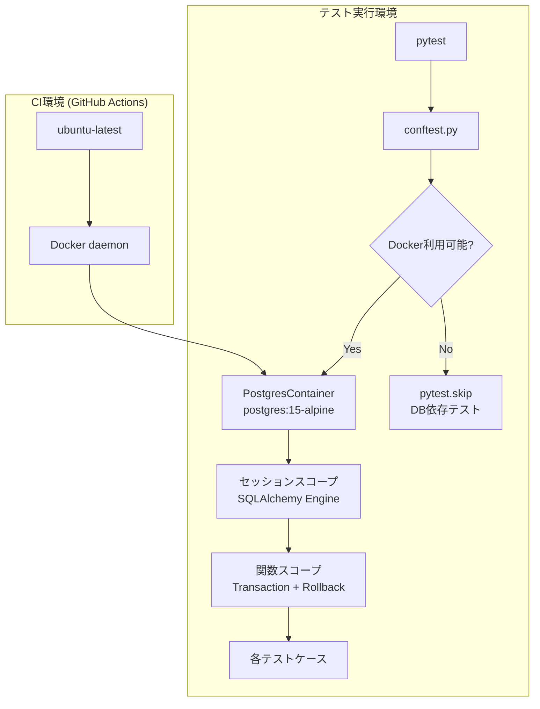
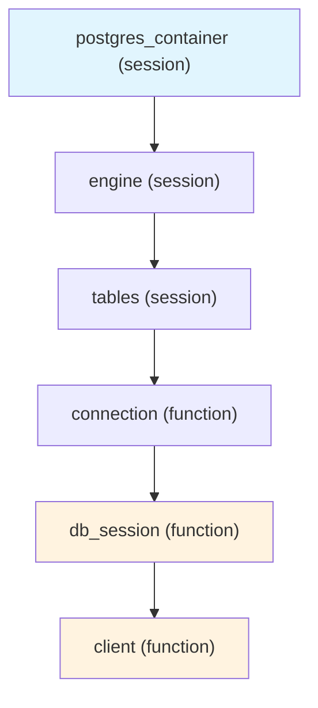
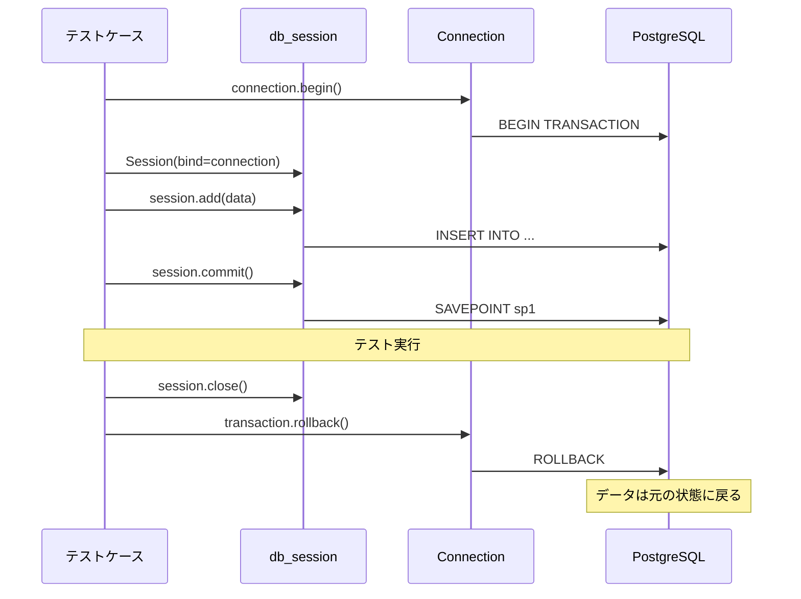

# 設計書: testcontainers-migration

## 概要

本設計は、バックエンドテストのデータベース基盤をSQLiteインメモリDBからtestcontainers-python（PostgreSQL）へ移行するものである。現在、テストスイート（446件）はSQLiteで実行されているが、本番環境のPostgreSQLとの差異（JSONB型の妥協、server_defaultの動作差異、タイムスタンプ精度差異）により、テストの信頼性が低下している。

testcontainers-pythonを導入することで、以下を実現する：
- 本番同等のPostgreSQL 15上で全テストを実行
- JSONB型の完全復元（4フィールド）
- トランザクションロールバックによるテスト間データ分離
- Docker未利用環境での適切なスキップ処理

### 現状の課題

1. **conftest.py**: asyncpg URLパターンを使用しているが、アプリはpsycopg2-binary（同期ドライバ）を使用。PostgreSQL未検出時にSQLiteへフォールバック
2. **テストファイル**: 6つ以上のテストファイルがローカルにSQLiteインメモリDBを定義（test_e2e.py, test_audit.py, test_extracted_data_api.py, test_backend_integration.py, test_visual_confirmation_api.py, test_verification_model.py）
3. **models.py**: MonitoringSite.pre_capture_script, MonitoringSite.plugin_config, VerificationResult.structured_data, VerificationResult.structured_data_violationsの4フィールドがJSON型（SQLite互換のため）
4. **CI**: GitHub Actionsのservicesセクションで別途PostgreSQLコンテナを起動しており、testcontainersと二重管理になる

## アーキテクチャ

### 全体構成



### フィクスチャ階層



### 設計判断

1. **testcontainersをCIでも使用**: GitHub Actionsのservicesセクションを削除し、testcontainersに統一する。理由：ローカルとCIで同一のコンテナ管理ロジックを使用することで、環境差異を排除する
2. **同期ドライバ（psycopg2）を使用**: アプリケーションがpsycopg2-binaryを使用しているため、テストも同期ドライバで統一する。asyncpg/aiosqliteへの依存を排除する
3. **Base.metadata.create_all()を使用**: テスト用スキーマ作成にはAlembicマイグレーションではなくcreate_all()を使用する。Alembicマイグレーション検証は別途オプションのフィクスチャで提供する

## コンポーネントとインターフェース

### 1. conftest.py（新設計）

```python
# genai/tests/conftest.py

import os
import subprocess
import pytest
from hypothesis import settings as hypothesis_settings, HealthCheck
from sqlalchemy import create_engine, event
from sqlalchemy.orm import sessionmaker, Session
from testcontainers.postgres import PostgresContainer
from fastapi.testclient import TestClient

from src.models import Base
from src.database import get_db
from src.main import app

# Hypothesis設定
hypothesis_settings.register_profile(
    "ci", max_examples=100, suppress_health_check=[HealthCheck.too_slow]
)
hypothesis_settings.register_profile("default", max_examples=100)
hypothesis_settings.load_profile(os.getenv("HYPOTHESIS_PROFILE", "default"))


def _is_docker_available() -> bool:
    """Dockerデーモンの利用可否を判定する。"""
    try:
        result = subprocess.run(
            ["docker", "info"],
            capture_output=True, timeout=5
        )
        return result.returncode == 0
    except (FileNotFoundError, subprocess.TimeoutExpired):
        return False


DOCKER_AVAILABLE = _is_docker_available()

# Docker未利用環境でのスキップマーカー
requires_docker = pytest.mark.skipif(
    not DOCKER_AVAILABLE,
    reason="Docker is not available"
)


@pytest.fixture(scope="session")
def postgres_container():
    """セッションスコープでPostgreSQLコンテナを起動・管理する。"""
    if not DOCKER_AVAILABLE:
        pytest.skip("Docker is not available")
    
    with PostgresContainer("postgres:15-alpine") as container:
        yield container


@pytest.fixture(scope="session")
def engine(postgres_container):
    """セッションスコープでSQLAlchemyエンジンを作成する。"""
    url = postgres_container.get_connection_url()
    # testcontainersはpsycopg2ドライバURLを返す
    eng = create_engine(url, echo=False)
    yield eng
    eng.dispose()


@pytest.fixture(scope="session")
def tables(engine):
    """セッションスコープでテーブルを作成する。"""
    Base.metadata.create_all(bind=engine)
    yield
    Base.metadata.drop_all(bind=engine)


@pytest.fixture
def db_session(engine, tables):
    """関数スコープでトランザクションロールバック付きセッションを提供する。"""
    connection = engine.connect()
    transaction = connection.begin()
    session = Session(bind=connection)
    
    # ネストされたトランザクション（SAVEPOINT）のサポート
    @event.listens_for(session, "after_transaction_end")
    def restart_savepoint(session, transaction):
        if transaction.nested and not transaction._parent.nested:
            session.begin_nested()
    
    yield session
    
    session.close()
    transaction.rollback()
    connection.close()


@pytest.fixture
def client(db_session):
    """FastAPI TestClientにdb_sessionを注入する。"""
    def override_get_db():
        yield db_session
    
    app.dependency_overrides[get_db] = override_get_db
    with TestClient(app) as c:
        yield c
    app.dependency_overrides.clear()
```

### 2. models.py（JSONB復元）

変更対象の4フィールド：

| モデル | フィールド | 変更前 | 変更後 |
|--------|-----------|--------|--------|
| MonitoringSite | pre_capture_script | `JSON` | `JSONB` |
| MonitoringSite | plugin_config | `JSON` | `JSONB` |
| VerificationResult | structured_data | `JSON` | `JSONB` |
| VerificationResult | structured_data_violations | `JSON` | `JSONB` |

既にJSONBを使用しているフィールド（変更不要）：
- VerificationResult.html_data, ocr_data, html_violations, ocr_violations, discrepancies

### 3. Alembicマイグレーション（JSON→JSONB）

```python
# genai/alembic/versions/xxxx_convert_json_to_jsonb.py

def upgrade():
    # MonitoringSite
    op.alter_column('monitoring_sites', 'pre_capture_script',
                    type_=postgresql.JSONB, existing_type=sa.JSON)
    op.alter_column('monitoring_sites', 'plugin_config',
                    type_=postgresql.JSONB, existing_type=sa.JSON)
    # VerificationResult
    op.alter_column('verification_results', 'structured_data',
                    type_=postgresql.JSONB, existing_type=sa.JSON)
    op.alter_column('verification_results', 'structured_data_violations',
                    type_=postgresql.JSONB, existing_type=sa.JSON)

def downgrade():
    # 逆変換
    op.alter_column('monitoring_sites', 'pre_capture_script',
                    type_=sa.JSON, existing_type=postgresql.JSONB)
    op.alter_column('monitoring_sites', 'plugin_config',
                    type_=sa.JSON, existing_type=postgresql.JSONB)
    op.alter_column('verification_results', 'structured_data',
                    type_=sa.JSON, existing_type=postgresql.JSONB)
    op.alter_column('verification_results', 'structured_data_violations',
                    type_=sa.JSON, existing_type=postgresql.JSONB)
```

### 4. Alembicマイグレーション検証フィクスチャ（オプション）

```python
@pytest.fixture(scope="session")
def verify_alembic_migrations(postgres_container):
    """Alembic upgrade headがPostgresContainer上で正常に完了することを検証する。"""
    url = postgres_container.get_connection_url()
    from alembic.config import Config
    from alembic import command
    
    alembic_cfg = Config("alembic.ini")
    alembic_cfg.set_main_option("sqlalchemy.url", url)
    command.upgrade(alembic_cfg, "head")
```

### 5. CI/CDパイプライン変更

```yaml
# genai/.github/workflows/pr.yml
jobs:
  test-backend:
    runs-on: ubuntu-latest
    services:
      # PostgreSQLサービスを削除（testcontainersが管理）
      redis:
        image: redis:7.2-alpine
        ports:
          - "6379:6379"
        options: --health-cmd "redis-cli ping" --health-interval 10s --health-timeout 5s --health-retries 5
    steps:
      - uses: actions/checkout@v4
      - uses: actions/setup-python@v5
        with:
          python-version: "3.11"
      - uses: actions/cache@v4
        with:
          path: ~/.cache/pip
          key: pip-${{ hashFiles('requirements.txt') }}
      - run: pip install -r requirements.txt
      - run: pytest --cov=src --cov-report=xml tests/
        env:
          # DATABASE_URLを削除（testcontainersが自動設定）
          REDIS_URL: redis://localhost:6379/0
          SECRET_KEY: test-secret-key-for-ci
```

### 6. requirements.txt変更

追加：
- `testcontainers[postgres]>=4.0.0`

削除対象の確認：
- `asyncpg==0.29.0` — テスト用途のみであれば削除候補（アプリがpsycopg2を使用）
- `pytest-asyncio==0.21.1` — 非同期テストが不要になれば削除候補

保持：
- `psycopg2-binary==2.9.9`（既存、変更不要）

## データモデル

### JSONB型復元の詳細

PostgreSQLのJSONB型はJSON型と比較して以下の利点がある：
- GINインデックスによる高速なJSONパスクエリ
- `@>`, `?`, `?|`, `?&` 演算子のサポート
- 重複キーの自動排除と正規化

#### MonitoringSiteモデル

```python
# 変更前
pre_capture_script: Mapped[Optional[dict]] = mapped_column(JSON, nullable=True, default=None)
plugin_config: Mapped[Optional[dict]] = mapped_column(JSON, nullable=True, default=None)

# 変更後
pre_capture_script: Mapped[Optional[dict]] = mapped_column(JSONB, nullable=True, default=None)
plugin_config: Mapped[Optional[dict]] = mapped_column(JSONB, nullable=True, default=None)
```

#### VerificationResultモデル

```python
# 変更前
structured_data: Mapped[Optional[dict]] = mapped_column(JSON, nullable=True)
structured_data_violations: Mapped[Optional[dict]] = mapped_column(JSON, nullable=True)

# 変更後
structured_data: Mapped[Optional[dict]] = mapped_column(JSONB, nullable=True)
structured_data_violations: Mapped[Optional[dict]] = mapped_column(JSONB, nullable=True)
```

### トランザクション分離のデータフロー




## 正当性プロパティ（Correctness Properties）

*プロパティとは、システムの全ての有効な実行において真であるべき特性や振る舞いのことである。プロパティは、人間が読める仕様と機械が検証可能な正当性保証の橋渡しとなる。*

### Property 1: トランザクションロールバックによるデータ分離

*For any* SQLAlchemyモデルインスタンスとそのフィールド値の組み合わせにおいて、トランザクション内でデータを挿入しコミットした後、そのトランザクションをロールバックした場合、データベースにはそのデータが存在しないこと。

**Validates: Requirements 2.1, 2.2, 2.3**

### Property 2: ネストされたトランザクション（SAVEPOINT）の正常動作

*For any* トランザクション内でのネストされたトランザクション（SAVEPOINT）操作において、内側のトランザクションをコミットした後でも、外側のトランザクションをロールバックすれば全てのデータが元の状態に戻ること。

**Validates: Requirements 2.4**

### Property 3: server_defaultの正常適用

*For any* server_defaultが定義されたモデルフィールドにおいて、そのフィールドを指定せずにレコードを挿入した場合、PostgreSQLがデフォルト値を正しく設定し、取得時にそのデフォルト値が返されること。

**Validates: Requirements 10.3**

### Property 4: タイムスタンプ精度のラウンドトリップ

*For any* マイクロ秒精度を持つdatetimeオブジェクトにおいて、PostgreSQLに保存し再取得した場合、マイクロ秒精度が保持されること（SQLiteの秒精度への切り捨てが発生しないこと）。

**Validates: Requirements 10.4**

### Property 5: JSONBデータのラウンドトリップ

*For any* 有効なJSON構造（ネストされた辞書、リスト、文字列、数値、ブール値、null）において、JSONBフィールドに保存し再取得した場合、元のデータと等価なデータが返されること。

**Validates: Requirements 3.1, 3.2, 3.3, 3.4**

## エラーハンドリング

### Docker未利用環境

| エラー状況 | 対応 |
|-----------|------|
| `docker info` がFileNotFoundError | `DOCKER_AVAILABLE = False`、DB依存テストをスキップ |
| `docker info` がタイムアウト（5秒） | `DOCKER_AVAILABLE = False`、DB依存テストをスキップ |
| `docker info` が非ゼロ終了コード | `DOCKER_AVAILABLE = False`、DB依存テストをスキップ |

### コンテナ起動失敗

| エラー状況 | 対応 |
|-----------|------|
| PostgresContainerの起動タイムアウト | testcontainersのデフォルトタイムアウト（120秒）で例外発生、テストセッション中断 |
| ポートバインド失敗 | testcontainersがランダムポートを使用するため通常発生しない |
| イメージプル失敗 | DockerException発生、テストセッション中断 |

### Alembicマイグレーション失敗

| エラー状況 | 対応 |
|-----------|------|
| マイグレーションスクリプトのSQL構文エラー | `alembic.util.exc.CommandError`を捕捉し、失敗したリビジョンとエラー詳細を表示してテスト中断 |
| 依存リビジョンの欠落 | Alembicが自動検出し、エラーメッセージを表示 |

### トランザクション関連

| エラー状況 | 対応 |
|-----------|------|
| テスト中の未処理例外 | フィクスチャのfinalizerでrollback()が実行され、コネクションがクリーンアップされる |
| コネクションプール枯渇 | セッションスコープのエンジンで管理、各テストは1コネクションを使用しrollback後に返却 |

## テスト戦略

### テストフレームワーク構成

- **テストフレームワーク**: pytest 7.4.3
- **プロパティベーステスト**: Hypothesis 6.92.1（既存インストール済み）
- **各プロパティテスト**: 最低100イテレーション（Hypothesisプロファイルで設定済み）

### ユニットテスト

ユニットテストは具体的な例、エッジケース、エラー条件の検証に使用する：

1. **コンテナ起動検証**: PostgresContainerが起動し、接続URLが`postgresql`で始まることを確認
2. **テーブル作成検証**: Base.metadata.create_all()後に全テーブルが存在することを確認
3. **JSONB型検証**: 4つの対象フィールドのカラム型がJSONBであることをメタデータから確認（3.1-3.4）
4. **インデックス存在検証**: 全定義済みインデックスがPostgreSQLに存在することを確認（10.5）
5. **Docker未利用時のスキップ検証**: Docker未利用環境でDB依存テストがスキップされ、理由が「Docker is not available」であることを確認（9.1, 9.2）
6. **Alembicマイグレーション検証**: `upgrade head`がPostgresContainer上で正常完了することを確認（7.1, 7.3）
7. **Alembicエラーハンドリング検証**: マイグレーション失敗時にエラーメッセージが表示されることを確認（7.2）

### プロパティベーステスト

各正当性プロパティに対して1つのプロパティベーステストを実装する。各テストにはデザインドキュメントのプロパティ番号を参照するタグを付与する。

| プロパティ | テスト内容 | タグ |
|-----------|-----------|------|
| Property 1 | ランダムなモデルデータを生成し、挿入→ロールバック→存在確認 | `Feature: testcontainers-migration, Property 1: Transaction rollback data isolation` |
| Property 2 | ランダムなデータでネストトランザクション→内側コミット→外側ロールバック→存在確認 | `Feature: testcontainers-migration, Property 2: Nested transaction (SAVEPOINT) support` |
| Property 3 | server_defaultを持つフィールドを未指定で挿入→取得→デフォルト値確認 | `Feature: testcontainers-migration, Property 3: server_default correctness` |
| Property 4 | ランダムなマイクロ秒精度datetimeを生成→保存→取得→精度比較 | `Feature: testcontainers-migration, Property 4: Timestamp precision round-trip` |
| Property 5 | ランダムなJSON構造を生成→JSONBフィールドに保存→取得→等価性確認 | `Feature: testcontainers-migration, Property 5: JSONB data round-trip` |

### テスト実行

```bash
# 全テスト実行（Docker必須）
cd genai && pytest tests/

# プロパティテストのみ実行
cd genai && pytest tests/test_testcontainers_properties.py

# Alembicマイグレーション検証付き
cd genai && pytest tests/ --run-alembic-check
```
