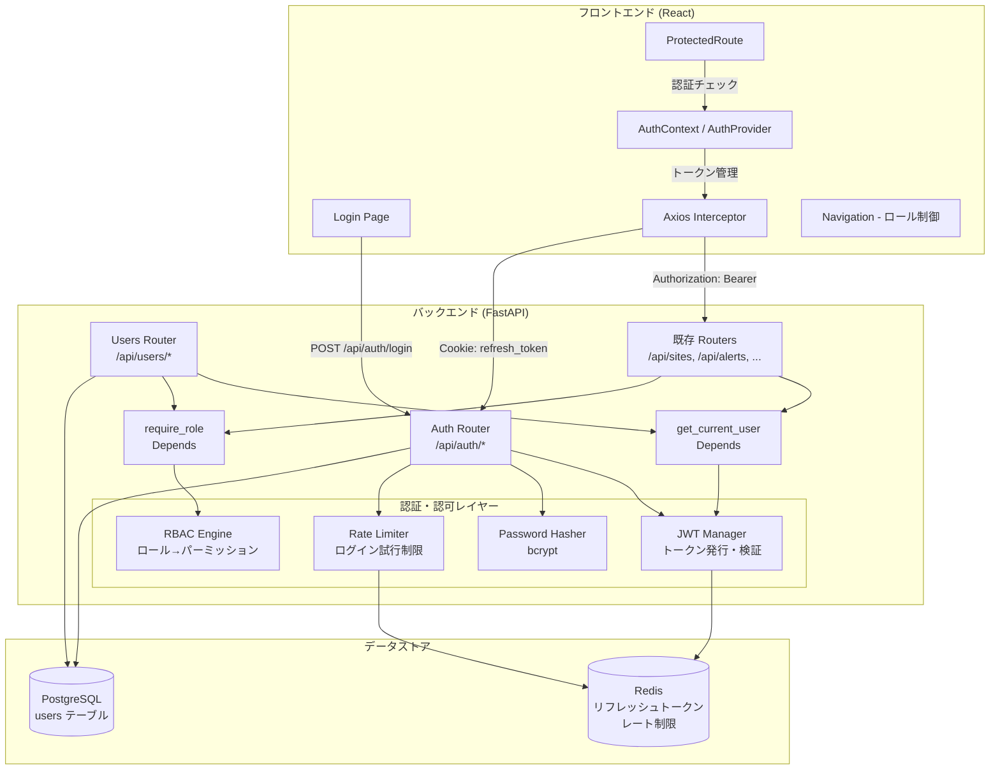
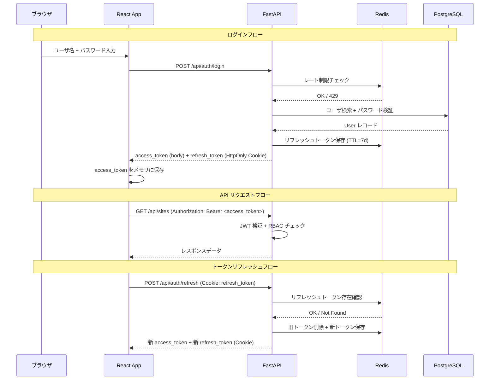
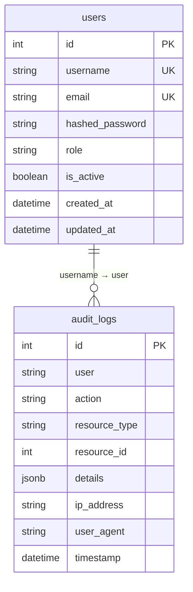
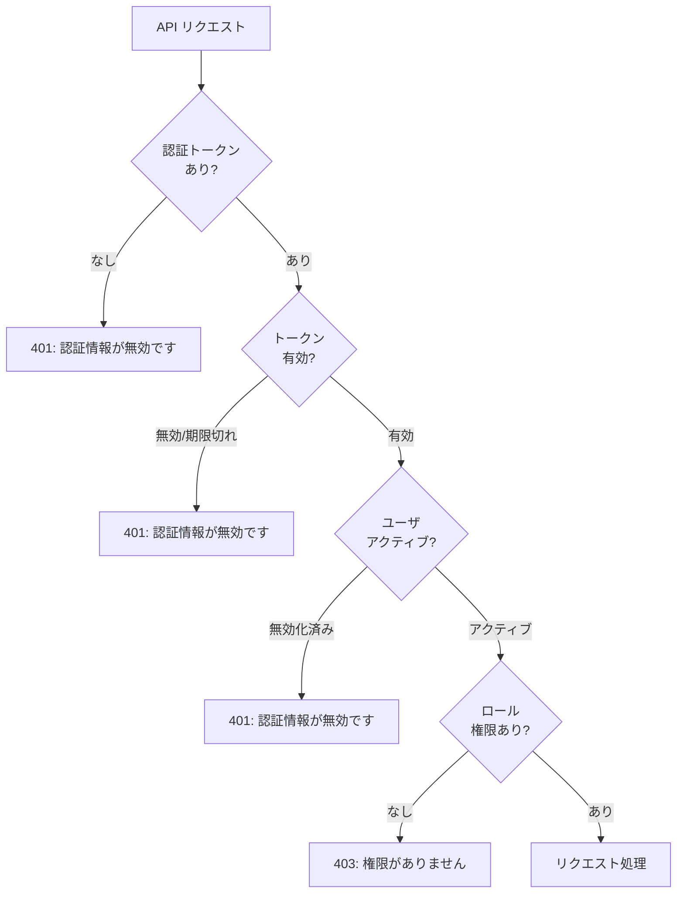

# 設計書: ユーザ管理・権限管理 (user-auth-rbac)

## 概要

本設計書は、決済条件監視システム（Payment Compliance Monitor）にユーザ認証・ユーザ管理・ロールベースアクセス制御（RBAC）を導入するための技術設計を定義する。

現状のシステムは `X-API-Key` ヘッダーによる単一キー認証のみで、個別ユーザの識別・権限制御・セッション管理が存在しない。本設計では、JWT ベースの認証、Redis によるセッション管理、3段階のロール（admin / reviewer / viewer）による RBAC を実装し、既存の全 API エンドポイントおよびフロントエンドに統合する。

### 技術スタック

- バックエンド: FastAPI + SQLAlchemy（同期） + PostgreSQL + Redis
- フロントエンド: React + TypeScript + Vite + react-router-dom + axios
- 認証ライブラリ: PyJWT（JWT 発行・検証）、passlib[bcrypt]（パスワードハッシュ）
- テスト: pytest + Hypothesis（プロパティベーステスト）

### 設計判断の根拠

- **PyJWT を選択（python-jose ではなく）**: python-jose はメンテナンスが停滞しており、PyJWT はアクティブにメンテナンスされている。HS256 アルゴリズムのみ使用するため PyJWT で十分。
- **同期 SQLAlchemy を維持**: 既存コードベースが同期セッション（`SessionLocal`, `get_db`）を使用しているため、一貫性を保つ。
- **リフレッシュトークンを HttpOnly Cookie に保存**: XSS 攻撃からの保護。アクセストークンはメモリ内のみで管理。
- **Redis でリフレッシュトークンをホワイトリスト管理**: ログアウト時の即座の無効化とユーザ無効化時の全セッション破棄を実現。

## アーキテクチャ

### 全体構成



### 認証フロー




## コンポーネントとインターフェース

### 1. バックエンド認証モジュール (`genai/src/auth/`)

#### 1.1 JWT Manager (`genai/src/auth/jwt.py`)

トークンの発行・検証を担当する。

```python
# インターフェース
def create_access_token(user_id: int, username: str, role: str) -> str: ...
def create_refresh_token(user_id: int) -> str: ...
def decode_access_token(token: str) -> dict: ...  # {"sub": user_id, "username": ..., "role": ...}
def decode_refresh_token(token: str) -> dict: ...  # {"sub": user_id, "jti": ...}
```

- アクセストークン: HS256, 有効期限 30 分, ペイロードに `sub`(user_id), `username`, `role` を含む
- リフレッシュトークン: HS256, 有効期限 7 日, ペイロードに `sub`(user_id), `jti`(一意ID) を含む
- `JWT_SECRET_KEY` 環境変数を使用（既に `.env.example` に定義済み）

#### 1.2 Password Hasher (`genai/src/auth/password.py`)

```python
def hash_password(plain_password: str) -> str: ...
def verify_password(plain_password: str, hashed_password: str) -> bool: ...
def validate_password_policy(password: str) -> list[str]: ...  # 違反リスト（空なら合格）
```

- `passlib.context.CryptContext(schemes=["bcrypt"])` を使用
- ポリシー: 8文字以上、英大文字・英小文字・数字を各1文字以上

#### 1.3 RBAC Engine (`genai/src/auth/rbac.py`)

```python
# ロール定義
class Role(str, Enum):
    ADMIN = "admin"
    REVIEWER = "reviewer"
    VIEWER = "viewer"

# パーミッションマッピング（定数として管理）
ROLE_PERMISSIONS: dict[Role, dict] = {
    Role.ADMIN: {"*": ["*"]},  # 全エンドポイント全メソッド
    Role.REVIEWER: {
        "/api/sites/*": ["GET"],
        "/api/alerts/*": ["GET"],
        "/api/monitoring/*": ["GET"],
        "/api/verification/*": ["GET", "POST"],  # 手動審査
        "/api/extracted-data/*": ["GET"],
        "/api/crawl/*": ["GET"],
        "/api/categories/*": ["GET"],
        "/api/customers/*": ["GET"],
        "/api/contracts/*": ["GET"],
        "/api/screenshots/*": ["GET"],
        "/api/audit-logs/*": ["GET"],
        "/api/dark-patterns/*": ["GET"],
    },
    Role.VIEWER: {
        "/api/*": ["GET"],  # 全エンドポイント GET のみ
    },
}

def check_permission(role: Role, path: str, method: str) -> bool: ...
```

#### 1.4 Rate Limiter (`genai/src/auth/rate_limit.py`)

```python
async def check_login_rate_limit(username: str, redis: Redis) -> tuple[bool, int]:
    """
    Returns: (allowed: bool, retry_after_seconds: int)
    Redis key: "login_attempts:{username}"
    制限: 5分間に10回まで
    """
```

#### 1.5 Session Manager (`genai/src/auth/session.py`)

```python
async def store_refresh_token(user_id: int, jti: str, ttl_seconds: int, redis: Redis) -> None: ...
async def validate_refresh_token(user_id: int, jti: str, redis: Redis) -> bool: ...
async def revoke_refresh_token(user_id: int, jti: str, redis: Redis) -> None: ...
async def revoke_all_user_tokens(user_id: int, redis: Redis) -> None: ...
```

- Redis キー: `refresh_token:{user_id}:{jti}` → value: `"1"`, TTL: 7日
- ユーザ全トークン削除: `refresh_token:{user_id}:*` パターンで SCAN + DELETE

### 2. FastAPI 依存関数 (`genai/src/auth/dependencies.py`)

```python
def get_redis() -> Generator[Redis, None, None]: ...

def get_current_user(
    token: str = Depends(oauth2_scheme),
    db: Session = Depends(get_db),
) -> User: ...
# Authorization ヘッダーから JWT を検証し、User オブジェクトを返す
# 無効トークン → HTTPException(401)
# 無効化ユーザ → HTTPException(401)

def require_role(*roles: Role):
    """ロールチェック用の依存関数ファクトリ"""
    def dependency(current_user: User = Depends(get_current_user)) -> User:
        if current_user.role not in [r.value for r in roles]:
            raise HTTPException(403, "権限がありません")
        return current_user
    return dependency

# 移行期間中の互換依存関数
def get_current_user_or_api_key(
    request: Request,
    db: Session = Depends(get_db),
) -> Optional[User]: ...
# JWT があれば JWT 認証、なければ X-API-Key 認証にフォールバック
```

### 3. API ルーター

#### 3.1 Auth Router (`genai/src/api/auth.py`)

| エンドポイント | メソッド | 説明 | 認証 |
|---|---|---|---|
| `/api/auth/login` | POST | ログイン（トークン発行） | 不要 |
| `/api/auth/refresh` | POST | トークンリフレッシュ | Cookie |
| `/api/auth/logout` | POST | ログアウト（トークン無効化） | JWT |
| `/api/auth/me` | GET | 現在のユーザ情報取得 | JWT |

#### 3.2 Users Router (`genai/src/api/users.py`)

| エンドポイント | メソッド | 説明 | 必要ロール |
|---|---|---|---|
| `/api/users` | POST | ユーザ作成 | admin |
| `/api/users` | GET | ユーザ一覧 | admin |
| `/api/users/{id}` | GET | ユーザ詳細 | admin |
| `/api/users/{id}` | PUT | ユーザ更新 | admin |
| `/api/users/{id}/deactivate` | POST | ユーザ無効化 | admin |

### 4. フロントエンドコンポーネント

#### 4.1 AuthContext (`genai/frontend/src/contexts/AuthContext.tsx`)

```typescript
interface AuthState {
  user: { id: number; username: string; role: string } | null;
  accessToken: string | null;
  isAuthenticated: boolean;
  isLoading: boolean;
}

interface AuthContextType extends AuthState {
  login: (username: string, password: string) => Promise<void>;
  logout: () => Promise<void>;
  refreshToken: () => Promise<string | null>;
  hasRole: (...roles: string[]) => boolean;
}
```

- `accessToken` はステート（メモリ）に保持、`refreshToken` は HttpOnly Cookie（JS からアクセス不可）
- アプリ起動時に `/api/auth/refresh` を呼び出してセッション復元を試行

#### 4.2 ProtectedRoute (`genai/frontend/src/components/ProtectedRoute.tsx`)

```typescript
interface ProtectedRouteProps {
  children: React.ReactNode;
  requiredRoles?: string[];  // 省略時は認証のみチェック
}
```

- 未認証 → `/login` にリダイレクト
- ロール不足 → 403 ページ表示

#### 4.3 Axios Interceptor（`genai/frontend/src/services/api.ts` 拡張）

- リクエストインターセプター: `Authorization: Bearer <accessToken>` ヘッダーを自動付与
- レスポンスインターセプター: 401 レスポンス時に自動リフレッシュ → リトライ
- リフレッシュ失敗時: AuthContext の `logout` を呼び出し、ログインページへリダイレクト

#### 4.4 Login Page (`genai/frontend/src/pages/Login.tsx`)

- ユーザ名・パスワード入力フォーム
- エラーメッセージ表示（認証失敗、レート制限）
- ログイン成功後、元のページまたはダッシュボードにリダイレクト

#### 4.5 ナビゲーション制御（`AppLayout.tsx` 拡張）

- `AuthContext` の `user.role` に基づいてメニュー項目をフィルタリング
- admin のみ「ユーザ管理」メニューを表示
- viewer は書き込み操作の UI コンポーネント（作成・編集・削除ボタン）を非表示

### 5. 既存 API ルーターへの認証統合

既存の全ルーター（16個）に `Depends(get_current_user)` を追加する方式:

```python
# 方式: 各ルーターのエンドポイントに依存関数を追加
# 例: genai/src/api/sites.py
@router.get("/")
async def get_sites(
    db: Session = Depends(get_db),
    current_user: User = Depends(get_current_user),  # 追加
):
    ...

@router.post("/")
async def create_site(
    ...,
    current_user: User = Depends(require_role(Role.ADMIN, Role.REVIEWER)),  # 書き込み操作
):
    ...
```

移行期間中は `get_current_user_or_api_key` を使用し、JWT と X-API-Key の両方をサポートする。

### 6. 監査ログ統合

既存の `AuditLog.user` フィールド（String 型）に認証済みユーザの `username` を記録する。

```python
# 監査ログ記録ヘルパー
def create_audit_log(
    db: Session,
    user: User,  # 認証済みユーザ
    action: str,
    resource_type: str,
    resource_id: int,
    details: dict = None,
    request: Request = None,
):
    log = AuditLog(
        user=user.username,
        action=action,
        resource_type=resource_type,
        resource_id=resource_id,
        details=details,
        ip_address=request.client.host if request else None,
        user_agent=request.headers.get("user-agent") if request else None,
    )
    db.add(log)
```

### 7. Alembic マイグレーション

```python
# alembic/versions/xxxx_add_users_table.py
def upgrade():
    op.create_table(
        "users",
        sa.Column("id", sa.Integer, primary_key=True, autoincrement=True),
        sa.Column("username", sa.String(150), nullable=False),
        sa.Column("email", sa.String(255), nullable=False),
        sa.Column("hashed_password", sa.String(255), nullable=False),
        sa.Column("role", sa.String(20), nullable=False, server_default="viewer"),
        sa.Column("is_active", sa.Boolean, nullable=False, server_default="true"),
        sa.Column("created_at", sa.DateTime, nullable=False, server_default=sa.func.now()),
        sa.Column("updated_at", sa.DateTime, nullable=False, server_default=sa.func.now()),
        sa.UniqueConstraint("username", name="uq_users_username"),
        sa.UniqueConstraint("email", name="uq_users_email"),
    )
    op.create_index("ix_users_role", "users", ["role"])
    op.create_index("ix_users_is_active", "users", ["is_active"])
```

### 8. 初期セットアップ（lifespan イベント）

```python
# genai/src/main.py の lifespan 拡張
@asynccontextmanager
async def lifespan(app: FastAPI):
    print("Starting Payment Compliance Monitor API...")
    # 初期 admin ユーザ作成
    _create_initial_admin()
    yield
    print("Shutting down Payment Compliance Monitor API...")

def _create_initial_admin():
    db = SessionLocal()
    try:
        user_count = db.query(User).count()
        if user_count == 0:
            username = os.getenv("ADMIN_USERNAME", "admin")
            password = os.getenv("ADMIN_PASSWORD")
            if not password:
                password = secrets.token_urlsafe(16)
                logger.warning(f"ADMIN_PASSWORD not set. Generated password: {password}")
            
            admin = User(
                username=username,
                email=f"{username}@localhost",
                hashed_password=hash_password(password),
                role="admin",
            )
            db.add(admin)
            db.flush()
            
            # 監査ログ記録
            log = AuditLog(
                user="system",
                action="create",
                resource_type="user",
                resource_id=admin.id,
                details={"username": username, "role": "admin", "reason": "initial_setup"},
            )
            db.add(log)
            db.commit()
            logger.info(f"Initial admin user '{username}' created.")
    except IntegrityError:
        # 複数ワーカー同時起動時の Race Condition 対策
        # 別ワーカーが先に作成済みの場合は無視する
        db.rollback()
        logger.info("Initial admin user already exists (created by another worker).")
    finally:
        db.close()
```

## データモデル

### User モデル（新規）

```python
class User(Base):
    __tablename__ = "users"

    id: Mapped[int] = mapped_column(Integer, primary_key=True, autoincrement=True)
    username: Mapped[str] = mapped_column(String(150), nullable=False, unique=True)
    email: Mapped[str] = mapped_column(String(255), nullable=False, unique=True)
    hashed_password: Mapped[str] = mapped_column(String(255), nullable=False)
    role: Mapped[str] = mapped_column(String(20), nullable=False, default="viewer")
    is_active: Mapped[bool] = mapped_column(Boolean, nullable=False, default=True)
    created_at: Mapped[datetime] = mapped_column(DateTime, nullable=False, default=datetime.utcnow)
    updated_at: Mapped[datetime] = mapped_column(DateTime, nullable=False, default=datetime.utcnow, onupdate=datetime.utcnow)

    __table_args__ = (
        Index("ix_users_role", "role"),
        Index("ix_users_is_active", "is_active"),
    )
```

### Pydantic スキーマ

```python
# リクエスト
class LoginRequest(BaseModel):
    username: str
    password: str

class UserCreate(BaseModel):
    username: str = Field(min_length=3, max_length=150)
    email: EmailStr
    password: str = Field(min_length=8)
    role: Literal["admin", "reviewer", "viewer"] = "viewer"

class UserUpdate(BaseModel):
    email: Optional[EmailStr] = None
    role: Optional[Literal["admin", "reviewer", "viewer"]] = None
    is_active: Optional[bool] = None

# レスポンス（hashed_password を除外）
class UserResponse(BaseModel):
    id: int
    username: str
    email: str
    role: str
    is_active: bool
    created_at: datetime
    updated_at: datetime
    model_config = ConfigDict(from_attributes=True)

class TokenResponse(BaseModel):
    access_token: str
    token_type: str = "bearer"

class MeResponse(BaseModel):
    id: int
    username: str
    role: str
```

### Redis データ構造

| キー | 値 | TTL | 用途 |
|---|---|---|---|
| `refresh_token:{user_id}:{jti}` | `"1"` | 7日 | リフレッシュトークンホワイトリスト |
| `login_attempts:{username}` | 試行回数（整数） | 5分 | ログインレート制限 |

### ER 図



`users` テーブルと既存の `audit_logs` テーブルは外部キー制約ではなく、`username` 文字列による論理的な関連とする（既存データとの後方互換性を維持するため）。

## 正当性プロパティ (Correctness Properties)

*プロパティとは、システムの全ての有効な実行において成立すべき特性や振る舞いのことである。人間が読める仕様と機械的に検証可能な正当性保証の橋渡しとなる形式的な記述である。*

### Property 1: パスワードハッシュのラウンドトリップ

*任意の* 平文パスワードに対して、`hash_password` でハッシュ化した後 `verify_password` で検証すると、常に `True` を返す。また、ハッシュ値は元の平文パスワードと一致しない。

**Validates: Requirements 1.6, 1.7**

### Property 2: ロール値のバリデーション

*任意の* 文字列に対して、`"admin"`, `"reviewer"`, `"viewer"` のいずれかであれば User の role として受け入れられ、それ以外の文字列は拒否される。

**Validates: Requirements 1.4**

### Property 3: ユーザ名・メールアドレスの一意性

*任意の* 既存ユーザと同一の username または email を持つユーザ作成リクエストに対して、システムは HTTP 409 を返し、既存データは変更されない。

**Validates: Requirements 1.2, 1.3, 5.6, 5.7**

### Property 4: パスワードポリシーバリデーション

*任意の* 文字列に対して、`validate_password_policy` は以下を正しく判定する: 8文字未満なら長さ違反を報告し、英大文字が含まれなければ大文字違反を報告し、英小文字が含まれなければ小文字違反を報告し、数字が含まれなければ数字違反を報告する。全条件を満たす文字列に対しては空の違反リストを返す。

**Validates: Requirements 9.1, 9.2, 9.3**

### Property 5: トークン有効期限の設定

*任意の* ユーザに対して発行されたアクセストークンの `exp` クレームは発行時刻から 30 分後であり、リフレッシュトークンの `exp` クレームは発行時刻から 7 日後である。

**Validates: Requirements 2.5, 2.6**

### Property 6: 有効な認証情報によるトークン発行

*任意の* アクティブなユーザと正しいパスワードの組み合わせに対して、ログインエンドポイントは有効な JWT アクセストークンとリフレッシュトークンを返し、アクセストークンのペイロードにはユーザの `id`, `username`, `role` が含まれる。

**Validates: Requirements 2.1**

### Property 7: 無効な認証情報に対する汎用エラー

*任意の* 無効なユーザ名・パスワードの組み合わせに対して（ユーザ名が存在しない場合も、パスワードが間違っている場合も）、ログインエンドポイントは同一のエラーメッセージを含む HTTP 401 を返す。

**Validates: Requirements 2.2, 2.3**

### Property 8: 無効化ユーザのログイン拒否

*任意の* `is_active=False` のユーザに対して、正しいパスワードを送信してもログインは拒否され、HTTP 401 が返される。

**Validates: Requirements 2.9**

### Property 9: ログアウトによるトークン無効化（ラウンドトリップ）

*任意の* 認証済みセッションに対して、ログアウト実行後にそのリフレッシュトークンを使用したリフレッシュリクエストは失敗する（HTTP 401）。

**Validates: Requirements 2.4, 3.2**

### Property 10: ユーザ無効化による全セッション破棄

*任意の* ユーザが複数のリフレッシュトークンを持つ場合、そのユーザを無効化すると、全てのリフレッシュトークンが Redis から削除され、いずれのトークンでもリフレッシュが失敗する。

**Validates: Requirements 3.3**

### Property 11: リフレッシュトークンの Redis 保存と TTL 一致

*任意の* 発行されたリフレッシュトークンに対して、Redis に対応するキーが存在し、その TTL はトークンの有効期限（7日）と一致する（±数秒の誤差を許容）。

**Validates: Requirements 3.1, 3.4**

### Property 12: RBAC パーミッションチェックの正当性

*任意の* ロール、エンドポイントパス、HTTP メソッドの組み合わせに対して、`check_permission` は以下を満たす: admin は常に `True`、viewer は GET メソッドのみ `True`、reviewer は定義された許可エンドポイント・メソッドの組み合わせのみ `True`。

**Validates: Requirements 4.2, 4.3, 4.4, 4.5**

### Property 13: ユーザ一覧レスポンスからのパスワードハッシュ除外

*任意の* ユーザ一覧・詳細レスポンスに対して、レスポンスボディに `hashed_password` フィールドが含まれない。

**Validates: Requirements 5.9**

### Property 14: 未認証リクエストの拒否

*任意の* 保護対象エンドポイント（`/health` と `/api/auth/*` を除く全エンドポイント）に対して、認証トークンなし、または無効・期限切れトークンでのリクエストは HTTP 401 を返す。

**Validates: Requirements 6.1, 6.2, 6.3**

### Property 15: リフレッシュトークンによるアクセストークン更新

*任意の* 有効なリフレッシュトークンに対して、リフレッシュエンドポイントは新しい有効なアクセストークンを返す。無効または期限切れのリフレッシュトークンに対しては HTTP 401 を返す。

**Validates: Requirements 2.7, 2.8**

### Property 16: 書き込み操作の監査ログ記録

*任意の* 認証済みユーザによる書き込み操作（POST, PUT, DELETE）に対して、操作後に AuditLog テーブルに該当ユーザの `username`、アクション、対象リソースを含むエントリが作成される。

**Validates: Requirements 7.1, 7.2**

### Property 17: 認証イベントの監査ログ記録

*任意の* ログイン試行（成功・失敗を問わず）に対して、AuditLog に認証イベントが記録される。

**Validates: Requirements 7.4**

### Property 18: ログインレート制限

*任意の* ユーザ名に対して、5分間に10回のログイン失敗後、11回目のログイン試行は HTTP 429 を返し、レスポンスに残り待機時間が含まれる。

**Validates: Requirements 9.4, 9.5**

## エラーハンドリング

### HTTP ステータスコード一覧

| ステータス | 状況 | レスポンスボディ |
|---|---|---|
| 401 Unauthorized | トークンなし / 無効トークン / 期限切れトークン / 認証失敗 | `{"detail": "認証情報が無効です"}` |
| 403 Forbidden | ロール権限不足 | `{"detail": "権限がありません"}` |
| 409 Conflict | ユーザ名またはメールアドレスの重複 | `{"detail": "このユーザ名は既に使用されています"}` |
| 422 Unprocessable Entity | パスワードポリシー違反 / バリデーションエラー | `{"detail": [{"msg": "パスワードは8文字以上...", ...}]}` |
| 429 Too Many Requests | ログインレート制限超過 | `{"detail": "ログイン試行回数の上限に達しました", "retry_after": 180}` |

### セキュリティ考慮事項

1. **ユーザ名列挙防止**: ログイン失敗時のエラーメッセージは、ユーザ名が存在しない場合もパスワードが間違っている場合も同一のメッセージを返す
2. **タイミング攻撃対策**: ユーザが存在しない場合でもダミーのパスワード検証を実行し、レスポンス時間の差異を最小化する
3. **JWT シークレット管理**: `JWT_SECRET_KEY` は環境変数から読み取り、コードにハードコードしない
4. **CORS 設定**: 本番環境では `CORS_ORIGINS` を明示的に設定し、`*` を使用しない
5. **HttpOnly Cookie**: リフレッシュトークンは `HttpOnly`, `Secure`（本番）, `SameSite=Strict` 属性で設定（CSRF 対策として `SameSite=Strict` を採用。クロスサイトからの POST /api/auth/refresh リクエストを完全にブロックする）
6. **ログアウト時の Cookie 明示的破棄**: `/api/auth/logout` レスポンスで `Set-Cookie: refresh_token=; Max-Age=0; HttpOnly; Secure; SameSite=Strict` を返し、ブラウザ側の Cookie を確実に無効化する
7. **アクセストークン無効化のタイムラグ許容**: ユーザ無効化・ロール変更時、既存アクセストークンは最大30分間有効なまま残る。即時キックが必要な場合は `get_current_user` 内で Redis の `user_revoked:{user_id}` キーをチェックする拡張が可能だが、現時点では30分のタイムラグを許容する設計判断とする
8. **ユーザ名の不変性（Immutable）**: `UserUpdate` スキーマに `username` フィールドを含めない。AuditLog との論理的紐付けが `username` 文字列ベースのため、ユーザ名変更を許可すると監査ログの追跡性が破壊される。将来的にユーザ名変更が必要になった場合は、AuditLog に `user_id` 外部キーを追加するマイグレーションが前提となる

### エラー処理フロー



## テスト戦略

### テストフレームワーク

- **ユニットテスト**: pytest
- **プロパティベーステスト**: Hypothesis（Python）
- **フロントエンドテスト**: Vitest + React Testing Library

### プロパティベーステスト設定

- ライブラリ: `hypothesis` (Python)
- 各プロパティテストは最低 100 イテレーション実行
- 各テストにはデザインドキュメントのプロパティ番号をタグとしてコメントに記載
- タグ形式: `# Feature: user-auth-rbac, Property {number}: {property_text}`

### テスト分類

#### プロパティベーステスト（Hypothesis）

以下のプロパティは Hypothesis を使用してランダム入力で検証する:

| Property | テスト内容 | ジェネレータ |
|---|---|---|
| P1 | パスワードハッシュ ラウンドトリップ | `st.text(min_size=1, max_size=128)` |
| P2 | ロール値バリデーション | `st.text()` |
| P4 | パスワードポリシーバリデーション | `st.text(min_size=0, max_size=256)` |
| P5 | トークン有効期限 | `st.integers(min_value=1), st.text(min_size=3)` |
| P7 | 汎用エラーメッセージ | `st.text(min_size=1)` (ユーザ名), `st.text(min_size=1)` (パスワード) |
| P12 | RBAC パーミッションチェック | `st.sampled_from(Role)`, `st.text()` (パス), `st.sampled_from(["GET","POST","PUT","DELETE"])` |
| P18 | レート制限 | `st.text(min_size=1, max_size=50)` (ユーザ名) |

#### ユニットテスト

以下は具体的な例やエッジケースとしてユニットテストで検証する:

- P3: ユーザ名・メールの重複作成（DB 統合テスト）
- P6: 有効な認証情報でのトークン発行（API 統合テスト）
- P8: 無効化ユーザのログイン拒否（API 統合テスト）
- P9: ログアウト後のトークン無効化（Redis 統合テスト）
- P10: ユーザ無効化による全セッション破棄（Redis 統合テスト）
- P11: Redis TTL 一致確認（Redis 統合テスト）
- P13: レスポンスからのパスワードハッシュ除外（API テスト）
- P14: 未認証リクエストの 401 レスポンス（API テスト）
- P15: リフレッシュトークンによる更新（API 統合テスト）
- P16: 書き込み操作の監査ログ記録（DB 統合テスト）
- P17: 認証イベントの監査ログ記録（DB 統合テスト）
- 初期 admin ユーザ作成（要件 10 全体）
- 自分自身の無効化拒否（要件 5.8 エッジケース）
- ADMIN_PASSWORD 未設定時のランダムパスワード生成（要件 10.4 エッジケース）

#### フロントエンドテスト（Vitest）

- ログインフォームの表示とバリデーション
- 未認証時のリダイレクト
- ロールに基づくナビゲーション表示制御
- Axios インターセプターによる自動リフレッシュ
- viewer ロールでの書き込み UI 非表示

### テストディレクトリ構成

```
genai/tests/
├── test_auth_password.py          # P1, P4 (Hypothesis)
├── test_auth_jwt.py               # P2, P5 (Hypothesis)
├── test_auth_rbac.py              # P12 (Hypothesis)
├── test_auth_rate_limit.py        # P18 (Hypothesis)
├── test_auth_login.py             # P6, P7, P8 (ユニット + Hypothesis)
├── test_auth_session.py           # P9, P10, P11 (ユニット)
├── test_auth_users_api.py         # P3, P13 (ユニット)
├── test_auth_integration.py       # P14, P15, P16, P17 (統合テスト)
└── test_auth_initial_setup.py     # 要件 10 (ユニット)

genai/frontend/src/__tests__/
├── AuthContext.test.tsx
├── ProtectedRoute.test.tsx
├── Login.test.tsx
└── api-interceptor.test.ts
```
