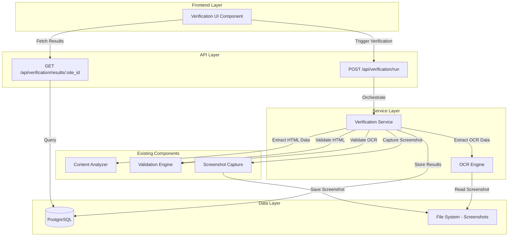

# Design Document: Verification and Comparison System

## Overview

The Verification and Comparison System extends the payment compliance monitor to detect discrepancies between HTML-extracted payment data and image-embedded payment data. This system addresses the critical security concern where payment websites may display different information visually (in images or rendered content) than what appears in the HTML source code, potentially hiding unauthorized charges or misleading payment terms.

### Key Capabilities

- **Multi-Source Data Extraction**: Extracts payment information from both HTML source code and screenshot images using OCR
- **Discrepancy Detection**: Identifies differences between HTML-extracted and OCR-extracted payment data
- **Dual Validation**: Validates both data sources against contract conditions to catch violations from any source
- **Historical Tracking**: Stores verification results with full audit trail for compliance monitoring
- **Visual Comparison UI**: Provides side-by-side comparison of HTML data, OCR data, and contract conditions

### Design Goals

1. **Accuracy**: Minimize false positives in discrepancy detection while catching genuine differences
2. **Performance**: Complete verification within 15 seconds for standard payment pages
3. **Reliability**: Handle OCR failures gracefully with partial results and clear error reporting
4. **Integration**: Seamlessly integrate with existing analyzer, validator, and screenshot components
5. **Maintainability**: Use established OCR libraries rather than custom implementations

## Architecture

### High-Level Architecture



### Component Responsibilities

**Verification Service** (`verification_service.py`)
- Orchestrates the complete verification workflow
- Coordinates data extraction from multiple sources
- Performs comparison between HTML and OCR data
- Manages validation against contract conditions
- Stores verification results in database

**OCR Engine** (`ocr_engine.py`)
- Extracts text from screenshot images (PNG/PDF)
- Returns text with confidence scores
- Handles OCR failures with descriptive errors
- Supports multiple OCR backends (pytesseract primary)

**Verification API** (`api/verification.py`)
- Exposes REST endpoints for triggering verification
- Handles asynchronous verification execution
- Returns verification results with pagination
- Manages verification job status

**Verification UI** (`frontend/src/pages/Verification.tsx`)
- Provides site selection and verification triggering
- Displays comparison table with three-column layout
- Shows discrepancies and violations with color coding
- Supports historical result viewing and export

## Components and Interfaces

### 1. OCR Engine

**File**: `genai/src/ocr_engine.py`

**Purpose**: Extract text from screenshot images using OCR technology.

**Technology Choice**: **pytesseract** (Python wrapper for Tesseract OCR)
- Mature, well-maintained library with extensive language support
- Good accuracy for printed text in payment pages
- Provides confidence scores for extracted text
- Free and open-source
- Easy installation via pip

**Alternative Considered**: EasyOCR - More accurate but slower and requires GPU for optimal performance

**Interface**:

```python
@dataclass
class OCRRegion:
    """Represents a region of extracted text."""
    text: str
    confidence: float  # 0.0 to 1.0
    bbox: tuple[int, int, int, int]  # (x, y, width, height)

@dataclass
class OCRResult:
    """Result of OCR extraction."""
    full_text: str
    regions: list[OCRRegion]
    average_confidence: float
    success: bool
    error_message: Optional[str] = None

class OCREngine:
    """Extracts text from images using Tesseract OCR."""
    
    def __init__(self, language: str = 'eng+jpn'):
        """Initialize OCR engine with language support."""
        pass
    
    def extract_text(self, image_path: Path) -> OCRResult:
        """
        Extract text from an image file.
        
        Args:
            image_path: Path to PNG or PDF file
            
        Returns:
            OCRResult with extracted text and confidence scores
        """
        pass
    
    def extract_text_from_pdf(self, pdf_path: Path) -> OCRResult:
        """Extract text from PDF by converting to images first."""
        pass
```

### 2. Verification Service

**File**: `genai/src/verification_service.py`

**Purpose**: Orchestrate multi-source verification workflow.

**Interface**:

```python
@dataclass
class Discrepancy:
    """Represents a difference between HTML and OCR data."""
    field_name: str
    html_value: Any
    ocr_value: Any
    difference_type: str  # 'missing', 'mismatch', 'extra'
    severity: str  # 'low', 'medium', 'high'

@dataclass
class VerificationData:
    """Complete verification data from all sources."""
    html_payment_info: PaymentInfo
    ocr_payment_info: PaymentInfo
    html_validation: ValidationResult
    ocr_validation: ValidationResult
    discrepancies: list[Discrepancy]
    screenshot_path: str
    ocr_confidence: float
    status: str  # 'success', 'partial_failure', 'failure'
    error_message: Optional[str] = None

class VerificationService:
    """Orchestrates verification workflow."""
    
    def __init__(
        self,
        content_analyzer: ContentAnalyzer,
        validation_engine: ValidationEngine,
        ocr_engine: OCREngine,
        screenshot_capture: ScreenshotCapture,
        db_session: Session
    ):
        """Initialize with required dependencies."""
        pass
    
    async def run_verification(self, site_id: int) -> VerificationData:
        """
        Run complete verification for a site.
        
        Steps:
        1. Fetch site and contract from database
        2. Extract HTML data using ContentAnalyzer
        3. Capture screenshot using ScreenshotCapture
        4. Extract OCR data from screenshot
        5. Compare HTML and OCR data
        6. Validate both against contract
        7. Store results in database
        
        Args:
            site_id: Site to verify
            
        Returns:
            VerificationData with all results
        """
        pass
    
    def _compare_payment_data(
        self,
        html_data: PaymentInfo,
        ocr_data: PaymentInfo
    ) -> list[Discrepancy]:
        """Compare HTML and OCR payment data field by field."""
        pass
    
    def _extract_payment_from_ocr(self, ocr_text: str) -> PaymentInfo:
        """
        Extract payment information from OCR text.
        Uses same patterns as ContentAnalyzer.
        """
        pass
```

### 3. Database Models

**File**: `genai/src/models.py` (additions)

**New Model**: `VerificationResult`

```python
class VerificationResult(Base):
    """
    Verification result model.
    
    Stores complete verification data including HTML extraction,
    OCR extraction, discrepancies, and violations.
    """
    __tablename__ = "verification_results"
    
    id: Mapped[int] = mapped_column(Integer, primary_key=True, autoincrement=True)
    site_id: Mapped[int] = mapped_column(
        Integer, ForeignKey("monitoring_sites.id"), nullable=False
    )
    
    # Extracted data
    html_data: Mapped[dict] = mapped_column(JSONB, nullable=False)
    ocr_data: Mapped[dict] = mapped_column(JSONB, nullable=False)
    
    # Validation results
    html_violations: Mapped[dict] = mapped_column(JSONB, nullable=False)
    ocr_violations: Mapped[dict] = mapped_column(JSONB, nullable=False)
    
    # Comparison results
    discrepancies: Mapped[dict] = mapped_column(JSONB, nullable=False)
    
    # Metadata
    screenshot_path: Mapped[str] = mapped_column(Text, nullable=False)
    ocr_confidence: Mapped[float] = mapped_column(Float, nullable=False)
    status: Mapped[str] = mapped_column(String(50), nullable=False)
    error_message: Mapped[Optional[str]] = mapped_column(Text, nullable=True)
    
    # Timestamps
    created_at: Mapped[datetime] = mapped_column(
        DateTime, nullable=False, default=datetime.utcnow
    )
    
    # Relationships
    site: Mapped["MonitoringSite"] = relationship("MonitoringSite")
    
    # Indexes
    __table_args__ = (
        Index("ix_verification_results_site_id", "site_id"),
        Index("ix_verification_results_created_at", "created_at"),
        Index("ix_verification_results_status", "status"),
        Index("ix_verification_results_site_created", "site_id", "created_at"),
    )
```

### 4. API Endpoints

**File**: `genai/src/api/verification.py`

**Endpoints**:

```python
@router.post("/run", status_code=status.HTTP_202_ACCEPTED)
async def trigger_verification(
    site_id: int,
    background_tasks: BackgroundTasks,
    db: Session = Depends(get_db)
) -> dict:
    """
    Trigger verification for a site.
    
    Returns:
        {
            "job_id": "verification_result_id",
            "status": "processing",
            "message": "Verification started"
        }
    """
    pass

@router.get("/results/{site_id}")
async def get_verification_results(
    site_id: int,
    limit: int = 1,
    offset: int = 0,
    db: Session = Depends(get_db)
) -> dict:
    """
    Get verification results for a site.
    
    Returns:
        {
            "results": [VerificationResult],
            "total": int,
            "limit": int,
            "offset": int
        }
    """
    pass

@router.get("/status/{job_id}")
async def get_verification_status(
    job_id: int,
    db: Session = Depends(get_db)
) -> dict:
    """
    Get status of a verification job.
    
    Returns:
        {
            "job_id": int,
            "status": "processing" | "completed" | "failed",
            "result": VerificationResult | null
        }
    """
    pass
```

**Request/Response Schemas**:

```python
class VerificationTriggerRequest(BaseModel):
    site_id: int
    screenshot_resolution: Optional[tuple[int, int]] = None
    ocr_language: Optional[str] = "eng+jpn"

class DiscrepancyResponse(BaseModel):
    field_name: str
    html_value: Any
    ocr_value: Any
    difference_type: str
    severity: str

class ViolationResponse(BaseModel):
    violation_type: str
    severity: str
    field_name: str
    expected_value: Any
    actual_value: Any
    message: str
    data_source: str  # 'html' or 'ocr'

class VerificationResultResponse(BaseModel):
    id: int
    site_id: int
    site_name: str
    html_data: dict
    ocr_data: dict
    discrepancies: list[DiscrepancyResponse]
    html_violations: list[ViolationResponse]
    ocr_violations: list[ViolationResponse]
    screenshot_path: str
    ocr_confidence: float
    status: str
    error_message: Optional[str]
    created_at: datetime
```

### 5. Frontend Component

**File**: `genai/frontend/src/pages/Verification.tsx`

**Component Structure**:

```typescript
interface VerificationState {
  selectedSiteId: number | null;
  isLoading: boolean;
  currentResult: VerificationResult | null;
  historicalResults: VerificationResult[];
  error: string | null;
}

export default function Verification() {
  // State management
  const [state, setState] = useState<VerificationState>({...});
  
  // Handlers
  const handleRunVerification = async () => {
    // POST /api/verification/run
    // Poll for completion
    // Fetch results
  };
  
  const handleSelectHistoricalResult = (resultId: number) => {
    // Display selected historical result
  };
  
  const handleExportCSV = () => {
    // Export current result to CSV
  };
  
  return (
    <div className="verification-page">
      <SiteSelector onSelect={setSiteId} />
      <VerificationControls onRun={handleRunVerification} />
      <ComparisonTable result={currentResult} />
      <HistoricalResults results={historicalResults} />
    </div>
  );
}
```

**Sub-Components**:

- `SiteSelector`: Dropdown to select monitoring site
- `VerificationControls`: Run button with loading state
- `ComparisonTable`: Three-column table (HTML | OCR | Contract)
- `HistoricalResults`: List of previous verification runs

## Data Models

### PaymentInfo (Existing)

Used for both HTML and OCR extracted data:

```python
@dataclass
class PaymentInfo:
    prices: dict[str, Any]  # {currency: [amounts]}
    payment_methods: list[str]
    fees: dict[str, Any]  # {percentage: [...], fixed: [...]}
    subscription_terms: Optional[dict[str, Any]]
    is_complete: bool
```

### Discrepancy

Represents differences between HTML and OCR data:

```python
@dataclass
class Discrepancy:
    field_name: str  # e.g., "prices.USD", "payment_methods"
    html_value: Any
    ocr_value: Any
    difference_type: str  # 'missing', 'mismatch', 'extra'
    severity: str  # 'low', 'medium', 'high'
```

**Difference Types**:
- `missing`: Field present in HTML but not in OCR (or vice versa)
- `mismatch`: Field present in both but with different values
- `extra`: Field present in OCR but not expected

**Severity Levels**:
- `high`: Price differences, unauthorized payment methods
- `medium`: Fee differences, subscription term mismatches
- `low`: Minor formatting differences, OCR artifacts

### VerificationResult (Database Model)

Complete verification result stored in database:

```python
{
    "id": 123,
    "site_id": 45,
    "html_data": {
        "prices": {"USD": [29.99]},
        "payment_methods": ["credit_card"],
        "fees": {"percentage": [3.0]},
        "subscription_terms": {"has_commitment": true}
    },
    "ocr_data": {
        "prices": {"USD": [29.99, 39.99]},  # Extra price found!
        "payment_methods": ["credit_card"],
        "fees": {"percentage": [3.0]},
        "subscription_terms": {"has_commitment": true}
    },
    "discrepancies": [
        {
            "field_name": "prices.USD",
            "html_value": [29.99],
            "ocr_value": [29.99, 39.99],
            "difference_type": "mismatch",
            "severity": "high"
        }
    ],
    "html_violations": [],
    "ocr_violations": [
        {
            "violation_type": "price",
            "severity": "high",
            "field_name": "prices.USD",
            "expected_value": [29.99],
            "actual_value": [29.99, 39.99],
            "message": "Unexpected additional price found in OCR",
            "data_source": "ocr"
        }
    ],
    "screenshot_path": "screenshots/site_45_verification_20240115_143022.png",
    "ocr_confidence": 0.92,
    "status": "success",
    "error_message": null,
    "created_at": "2024-01-15T14:30:25Z"
}
```

## API Specifications

### POST /api/verification/run

**Purpose**: Trigger verification for a specific site

**Request**:
```json
{
  "site_id": 45,
  "screenshot_resolution": [1920, 1080],  // optional
  "ocr_language": "eng+jpn"  // optional
}
```

**Response** (202 Accepted):
```json
{
  "job_id": 123,
  "status": "processing",
  "message": "Verification started for site 45"
}
```

**Error Responses**:
- 404: Site not found
- 409: Verification already running for this site
- 500: Internal server error

### GET /api/verification/results/{site_id}

**Purpose**: Retrieve verification results for a site

**Query Parameters**:
- `limit`: Number of results to return (default: 1)
- `offset`: Pagination offset (default: 0)

**Response** (200 OK):
```json
{
  "results": [
    {
      "id": 123,
      "site_id": 45,
      "site_name": "Example Payment Site",
      "html_data": {...},
      "ocr_data": {...},
      "discrepancies": [...],
      "html_violations": [...],
      "ocr_violations": [...],
      "screenshot_path": "screenshots/...",
      "ocr_confidence": 0.92,
      "status": "success",
      "error_message": null,
      "created_at": "2024-01-15T14:30:25Z"
    }
  ],
  "total": 15,
  "limit": 1,
  "offset": 0
}
```

**Error Responses**:
- 404: No results found for site
- 500: Internal server error

### GET /api/verification/status/{job_id}

**Purpose**: Check status of a verification job

**Response** (200 OK):
```json
{
  "job_id": 123,
  "status": "completed",
  "result": {
    "id": 123,
    "site_id": 45,
    ...
  }
}
```

**Status Values**:
- `processing`: Verification in progress
- `completed`: Verification finished successfully
- `failed`: Verification failed with error


## Correctness Properties

*A property is a characteristic or behavior that should hold true across all valid executions of a system—essentially, a formal statement about what the system should do. Properties serve as the bridge between human-readable specifications and machine-verifiable correctness guarantees.*

### Property Reflection

After analyzing all acceptance criteria, I identified several areas where properties can be consolidated:

**Consolidation Decisions**:
1. Properties 3.1, 3.2, 3.3 (workflow steps) can be combined into a single "complete workflow execution" property
2. Properties 2.1-2.4 (extraction capabilities) can be tested through the comparison property since they use the same analyzer
3. Properties 4.1, 4.2 (validation invocation) are subsumed by properties 4.3-4.5 which verify validation results
4. Properties 5.2, 5.3, 5.4 (result structure) can be combined into a single "complete result storage" property
5. UI properties (8.x, 9.x, 10.x) are mostly examples of specific interactions rather than universal properties

### Property 1: OCR Text Extraction Success

*For any* valid screenshot file (PNG or PDF), when the OCR engine processes it, the result should have success=True and contain extracted text (which may be empty for blank images).

**Validates: Requirements 1.1, 1.4**

### Property 2: OCR Error Handling

*For any* invalid or corrupted image file, when the OCR engine attempts to process it, the result should have success=False and include a descriptive error message.

**Validates: Requirements 1.2**

### Property 3: OCR Confidence Scores

*For any* successful OCR extraction, the result should include confidence scores for each text region and an average confidence score between 0.0 and 1.0.

**Validates: Requirements 1.3**

### Property 4: Extraction Pattern Consistency

*For any* text content, whether extracted from HTML or OCR, when processed through the payment extraction logic, identical text should produce identical PaymentInfo results.

**Validates: Requirements 2.1, 2.2, 2.3, 2.4**

### Property 5: Graceful Missing Data Handling

*For any* text content without payment information, when the extraction service processes it, the result should return a PaymentInfo object with null/empty values for missing fields without raising errors.

**Validates: Requirements 2.5**

### Property 6: Complete Verification Workflow

*For any* valid site with a URL and contract conditions, when verification runs, the service should execute all workflow steps: HTML extraction, screenshot capture, OCR extraction, comparison, and validation.

**Validates: Requirements 3.1, 3.2, 3.3**

### Property 7: Field-by-Field Comparison

*For any* two PaymentInfo objects (HTML and OCR data), when the comparison function processes them, it should compare all fields: prices, payment_methods, fees, and subscription_terms.

**Validates: Requirements 3.4**

### Property 8: Discrepancy Detection

*For any* two PaymentInfo objects with differing field values, when the comparison function processes them, it should generate a Discrepancy for each field that differs.

**Validates: Requirements 3.5**

### Property 9: Discrepancy Structure Completeness

*For any* generated Discrepancy, it should include field_name, html_value, ocr_value, difference_type, and severity fields.

**Validates: Requirements 3.6**

### Property 10: Dual Source Validation

*For any* verification run, when both HTML and OCR data are extracted, the validation engine should be invoked for both data sources against the contract conditions.

**Validates: Requirements 4.1, 4.2**

### Property 11: Violation Source Attribution

*For any* detected violation, the violation record should include a data_source field indicating whether it came from HTML or OCR extraction.

**Validates: Requirements 4.3**

### Property 12: Violation Structure Completeness

*For any* detected violation, it should include violation_type, severity, field_name, expected_value, actual_value, message, and data_source fields.

**Validates: Requirements 4.4**

### Property 13: Independent Violation Recording

*For any* verification where both HTML and OCR data violate the same contract condition with different values, two separate violation records should be created, one for each data source.

**Validates: Requirements 4.5**

### Property 14: Verification Result Persistence

*For any* completed verification (success or failure), a VerificationResult record should be stored in the database with a unique ID and timestamp.

**Validates: Requirements 5.1**

### Property 15: Complete Result Storage

*For any* stored VerificationResult, it should include site_id, timestamp, html_data, ocr_data, discrepancies, violations, screenshot_path, ocr_confidence, and status fields.

**Validates: Requirements 5.2, 5.3, 5.4**

### Property 16: Error Message Storage

*For any* verification that fails completely (status='failure'), the VerificationResult should include a non-null error_message field describing the failure.

**Validates: Requirements 5.5**

### Property 17: API Verification Trigger

*For any* POST request to /api/verification/run with a valid site_id, the API should return a 202 status code and initiate a verification job.

**Validates: Requirements 6.1, 6.2**

### Property 18: API Site Validation

*For any* POST request to /api/verification/run with a non-existent site_id, the API should return a 404 status code with an error message.

**Validates: Requirements 6.3**

### Property 19: API Concurrency Control

*For any* site with an active verification job, when a new POST request to /api/verification/run is made for the same site, the API should return a 409 status code.

**Validates: Requirements 6.4**

### Property 20: API Optional Parameters

*For any* POST request to /api/verification/run, the API should accept optional parameters (screenshot_resolution, ocr_language) and use them in the verification process.

**Validates: Requirements 6.5**

### Property 21: API Results Retrieval

*For any* GET request to /api/verification/results/{site_id} where results exist, the API should return a 200 status with the most recent VerificationResult in JSON format.

**Validates: Requirements 7.1, 7.2**

### Property 22: API No Results Handling

*For any* GET request to /api/verification/results/{site_id} where no results exist, the API should return a 404 status code.

**Validates: Requirements 7.3**

### Property 23: API Pagination Support

*For any* GET request to /api/verification/results/{site_id} with a limit parameter, the API should return at most that many results and include pagination metadata (total, limit, offset).

**Validates: Requirements 7.4, 7.5**

## Error Handling

### OCR Engine Errors

**Error Scenarios**:
1. **File Not Found**: Screenshot file path is invalid or file doesn't exist
2. **Unsupported Format**: File format is not PNG or PDF
3. **Corrupted File**: File is corrupted and cannot be read
4. **OCR Processing Failure**: Tesseract fails to process the image
5. **Low Confidence**: OCR confidence is below acceptable threshold (< 0.5)

**Handling Strategy**:
- Return OCRResult with success=False and descriptive error_message
- Log error details for debugging
- Continue verification with partial results (HTML-only validation)
- Set verification status to 'partial_failure'

### Screenshot Capture Errors

**Error Scenarios**:
1. **Network Timeout**: Site doesn't respond within timeout period
2. **Invalid URL**: Site URL is malformed or unreachable
3. **Page Load Failure**: Page returns error status code (4xx, 5xx)
4. **Playwright Error**: Browser automation fails

**Handling Strategy**:
- Catch exceptions from screenshot_capture module
- Store error in verification result
- Set verification status to 'failure' if screenshot is critical
- Provide clear error message to user

### Validation Errors

**Error Scenarios**:
1. **Missing Contract**: Site has no contract conditions defined
2. **Invalid Contract Format**: Contract conditions are malformed
3. **Extraction Failure**: Both HTML and OCR extraction fail

**Handling Strategy**:
- Return validation error in verification result
- Set status to 'failure'
- Provide actionable error message (e.g., "Please configure contract conditions")

### API Errors

**Error Scenarios**:
1. **Database Connection Failure**: Cannot connect to PostgreSQL
2. **Concurrent Verification**: Verification already running for site
3. **Invalid Request**: Missing or invalid parameters

**Handling Strategy**:
- Return appropriate HTTP status codes (404, 409, 500)
- Include error details in response body
- Log errors for monitoring
- Use FastAPI exception handlers for consistent error responses

### Error Response Format

All API errors follow this format:

```json
{
  "error": {
    "code": "VERIFICATION_FAILED",
    "message": "Failed to capture screenshot: Network timeout",
    "details": {
      "site_id": 45,
      "url": "https://example.com/payment",
      "timestamp": "2024-01-15T14:30:25Z"
    }
  }
}
```

## Testing Strategy

### Dual Testing Approach

This feature requires both unit tests and property-based tests for comprehensive coverage:

**Unit Tests**: Focus on specific examples, edge cases, and integration points
- Specific OCR test images (blank, text-only, mixed content)
- Known discrepancy scenarios (price mismatch, missing field)
- API endpoint responses with mock data
- UI component rendering with sample results
- Error conditions (file not found, invalid format)

**Property-Based Tests**: Verify universal properties across randomized inputs
- OCR extraction with generated test images
- Payment extraction with randomized text content
- Comparison logic with varied PaymentInfo combinations
- Validation with random contract conditions
- API behavior with random site IDs and parameters

### Property-Based Testing Configuration

**Library Selection**: 
- **Backend (Python)**: `hypothesis` - mature, well-integrated with pytest
- **Frontend (TypeScript)**: `fast-check` - comprehensive property testing for JavaScript/TypeScript

**Test Configuration**:
- Minimum 100 iterations per property test
- Each test tagged with feature name and property number
- Tag format: `# Feature: verification-comparison-system, Property X: [property text]`

**Example Property Test Structure**:

```python
from hypothesis import given, strategies as st
import pytest

# Feature: verification-comparison-system, Property 4: Extraction Pattern Consistency
@given(text_content=st.text(min_size=10, max_size=1000))
def test_extraction_pattern_consistency(text_content):
    """For any text content, identical text should produce identical PaymentInfo."""
    analyzer = ContentAnalyzer()
    
    # Extract from "HTML" source
    html_result = analyzer.extract_payment_info(f"<html><body>{text_content}</body></html>")
    
    # Extract from "OCR" source (same text)
    ocr_result = analyzer.extract_payment_info(text_content)
    
    # Results should be identical
    assert html_result.prices == ocr_result.prices
    assert html_result.payment_methods == ocr_result.payment_methods
    assert html_result.fees == ocr_result.fees
```

### Test Coverage Goals

**Backend**:
- OCR Engine: 90% code coverage
- Verification Service: 85% code coverage
- API Endpoints: 95% code coverage
- Database Models: 100% coverage (simple CRUD)

**Frontend**:
- Verification Component: 80% coverage
- API Integration: 90% coverage
- UI Interactions: 70% coverage (visual elements harder to test)

### Integration Testing

**End-to-End Verification Flow**:
1. Create test site with contract conditions
2. Trigger verification via API
3. Verify database record created
4. Verify screenshot file exists
5. Verify OCR extraction occurred
6. Verify comparison and validation results
7. Verify API returns complete results

**Test Data**:
- Sample payment pages (HTML files)
- Pre-generated screenshots with known content
- Contract conditions covering various scenarios
- Expected discrepancies and violations

### Performance Testing

**Benchmarks**:
- OCR extraction: < 5 seconds for standard payment page
- Complete verification: < 15 seconds end-to-end
- API response time: < 100ms for results retrieval
- Database query time: < 50ms for verification results

**Load Testing**:
- Concurrent verifications: Support 5 simultaneous verifications
- Historical results: Query performance with 1000+ results per site
- API throughput: 50 requests/second for results endpoint

### Manual Testing Checklist

**UI Testing**:
- [ ] Site selector displays all active sites
- [ ] Run verification button triggers API call
- [ ] Loading indicator appears during verification
- [ ] Comparison table displays all three columns
- [ ] Discrepancies highlighted correctly
- [ ] Violations show warning icons
- [ ] Historical results list displays correctly
- [ ] Date range filtering works
- [ ] CSV export downloads correct data
- [ ] Error messages display clearly

**Cross-Browser Testing**:
- [ ] Chrome (latest)
- [ ] Firefox (latest)
- [ ] Safari (latest)
- [ ] Edge (latest)

**Accessibility Testing**:
- [ ] Keyboard navigation works
- [ ] Screen reader compatibility
- [ ] Color contrast meets WCAG AA standards
- [ ] Focus indicators visible

## Implementation Notes

### OCR Library Installation

**pytesseract Requirements**:
```bash
# Ubuntu/Debian
sudo apt-get install tesseract-ocr tesseract-ocr-jpn

# macOS
brew install tesseract tesseract-lang

# Python package
pip install pytesseract Pillow pdf2image
```

**Language Data**:
- English (eng): Default, included with Tesseract
- Japanese (jpn): Required for Japanese payment sites
- Additional languages can be added as needed

### Database Migration

**Migration Script** (Alembic):
```python
def upgrade():
    op.create_table(
        'verification_results',
        sa.Column('id', sa.Integer(), nullable=False),
        sa.Column('site_id', sa.Integer(), nullable=False),
        sa.Column('html_data', postgresql.JSONB(), nullable=False),
        sa.Column('ocr_data', postgresql.JSONB(), nullable=False),
        sa.Column('html_violations', postgresql.JSONB(), nullable=False),
        sa.Column('ocr_violations', postgresql.JSONB(), nullable=False),
        sa.Column('discrepancies', postgresql.JSONB(), nullable=False),
        sa.Column('screenshot_path', sa.Text(), nullable=False),
        sa.Column('ocr_confidence', sa.Float(), nullable=False),
        sa.Column('status', sa.String(50), nullable=False),
        sa.Column('error_message', sa.Text(), nullable=True),
        sa.Column('created_at', sa.DateTime(), nullable=False),
        sa.ForeignKeyConstraint(['site_id'], ['monitoring_sites.id']),
        sa.PrimaryKeyConstraint('id')
    )
    op.create_index('ix_verification_results_site_id', 'verification_results', ['site_id'])
    op.create_index('ix_verification_results_created_at', 'verification_results', ['created_at'])
    op.create_index('ix_verification_results_status', 'verification_results', ['status'])
    op.create_index('ix_verification_results_site_created', 'verification_results', ['site_id', 'created_at'])
```

### Performance Optimization

**OCR Optimization**:
- Use page segmentation mode 3 (fully automatic) for payment pages
- Preprocess images: grayscale conversion, contrast enhancement
- Cache OCR results to avoid reprocessing identical screenshots
- Consider parallel processing for multi-page PDFs

**Database Optimization**:
- Index on (site_id, created_at) for efficient historical queries
- Use JSONB for flexible storage with GIN indexes for field searches
- Implement result pagination to avoid loading large datasets
- Consider archiving old results after 90 days

**API Optimization**:
- Use background tasks for verification execution
- Implement job queue for concurrent verification requests
- Cache recent results with Redis (optional)
- Use database connection pooling

### Security Considerations

**Input Validation**:
- Validate site_id exists before processing
- Sanitize file paths to prevent directory traversal
- Limit screenshot file size (max 10MB)
- Validate image formats before OCR processing

**Data Privacy**:
- Store screenshots with restricted file permissions
- Consider encrypting sensitive payment data in database
- Implement access controls for verification results
- Log all verification access for audit trail

**Rate Limiting**:
- Limit verification requests per site (max 1 per minute)
- Implement API rate limiting (100 requests/hour per client)
- Prevent abuse of OCR resources

### Deployment Considerations

**Dependencies**:
- Tesseract OCR must be installed on server
- Playwright browsers must be installed
- Sufficient disk space for screenshots (estimate 1MB per screenshot)
- PostgreSQL with JSONB support (version 9.4+)

**Environment Variables**:
```bash
TESSERACT_PATH=/usr/bin/tesseract
TESSERACT_LANG=eng+jpn
OCR_CONFIDENCE_THRESHOLD=0.5
SCREENSHOT_DIR=/var/app/screenshots
MAX_VERIFICATION_TIME=30
```

**Monitoring**:
- Track OCR success rate and average confidence
- Monitor verification execution time
- Alert on high failure rates
- Track disk usage for screenshots

## Future Enhancements

### Phase 2 Considerations

**Advanced OCR**:
- Support for EasyOCR as alternative engine
- Multi-language detection and automatic language selection
- OCR result caching and deduplication
- Image preprocessing pipeline (deskew, denoise, enhance)

**Enhanced Comparison**:
- Fuzzy matching for near-identical values (e.g., "$29.99" vs "29.99 USD")
- Semantic comparison (e.g., "monthly" vs "per month")
- Confidence-weighted discrepancy severity
- Machine learning for discrepancy classification

**Reporting**:
- Automated email alerts for high-severity discrepancies
- Weekly compliance summary reports
- Trend analysis across multiple verification runs
- Export to PDF with screenshots and annotations

**UI Improvements**:
- Screenshot viewer with OCR region highlighting
- Interactive discrepancy resolution workflow
- Bulk verification for multiple sites
- Real-time verification progress updates via WebSocket

**Performance**:
- Distributed verification processing with Celery
- GPU acceleration for OCR (EasyOCR)
- Incremental verification (only changed fields)
- Smart screenshot diffing to skip unchanged pages

