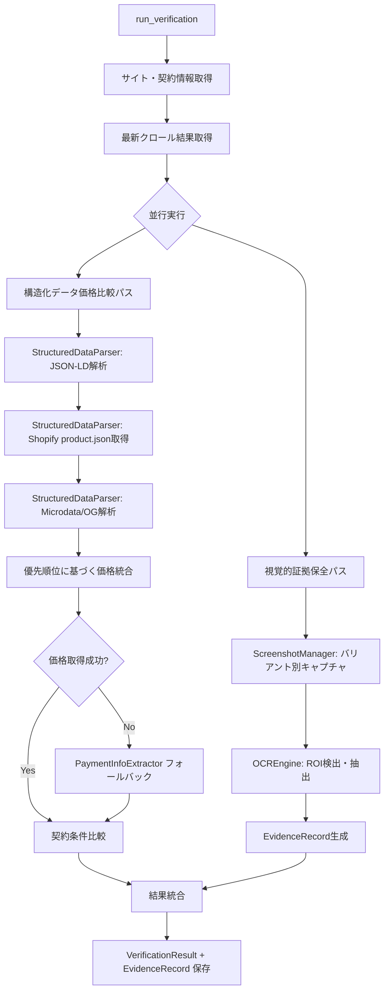
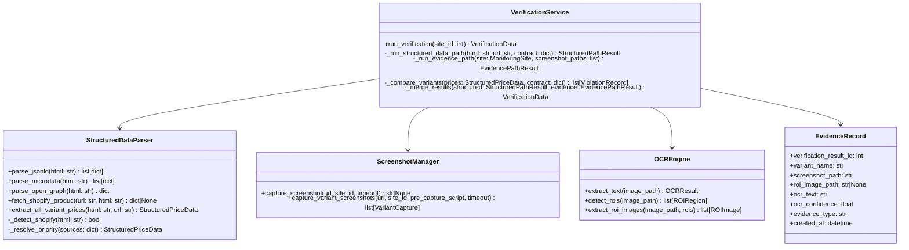

# Design Document: Verification Flow Restructure

## Overview

現在の `VerificationService.run_verification()` は、HTML解析 → スクリーンショット撮影 → OCR → 契約条件比較 という単一パイプラインで動作している。この設計では、Shopify等のバリアント選択で価格が変動するサイトにおいて、スクリーンショット上の表示価格と構造化データの価格が一致せず誤検知が発生する。

本設計では検証フローを2つの独立したパスに分離する:

1. **構造化データ価格比較パス**: JSON-LD、Shopify product.json、Microdata、Open Graph から全バリアント価格を抽出し、契約条件と比較する
2. **視覚的証拠保全パス**: バリアント別スクリーンショット撮影 → ROI抽出 → OCR により、視覚的不正の証拠を保全する

2つのパスは独立して実行され、一方が失敗しても他方は継続する。結果は統合されて `VerificationResult` に保存される。



## Architecture

### 設計方針

- **独立性**: 2つの検証パスは互いに依存せず、一方の失敗が他方に影響しない
- **後方互換性**: 既存の `VerificationResult` フィールドを維持し、新規フィールドは全て nullable
- **フォールバック**: 構造化データが取得できない場合は従来の HTML 解析にフォールバック
- **拡張性**: 新しいデータソースの追加が容易な優先順位ベースの抽出パイプライン

### コンポーネント構成




## Components and Interfaces

### 1. VerificationService（拡張）

`genai/src/verification_service.py` の `run_verification()` を再構築する。

```python
@dataclass
class StructuredPathResult:
    """構造化データ価格比較パスの結果"""
    structured_price_data: dict          # StructuredPriceData の辞書表現
    violations: list[dict]               # バリアント別違反レコード
    data_source: str                     # "json_ld" | "shopify_api" | "microdata" | "open_graph" | "html_fallback"
    status: str                          # "success" | "failure" | "fallback"
    error_message: str | None = None

@dataclass
class EvidencePathResult:
    """視覚的証拠保全パスの結果"""
    evidence_records: list[dict]         # EvidenceRecord の辞書表現リスト
    status: str                          # "success" | "failure" | "partial"
    error_message: str | None = None
```

**主要メソッド変更:**

- `run_verification(site_id)`: 2パス並行実行に変更。`asyncio.gather` で両パスを実行し、`return_exceptions=True` で一方の失敗を許容
- `_run_structured_data_path(html, url, contract)`: 構造化データ抽出 → 優先順位解決 → 契約条件比較
- `_run_evidence_path(site, screenshot_paths)`: バリアント別キャプチャ → ROI検出 → OCR → EvidenceRecord生成
- `_compare_variants(prices, contract)`: 全バリアント価格を契約条件と個別比較
- `_merge_results(structured, evidence)`: 両パスの結果を統合して VerificationData を生成

### 2. StructuredDataParser（拡張）

`genai/src/extractors/structured_data_parser.py` に以下のメソッドを追加する。

```python
@dataclass
class VariantPrice:
    """単一バリアントの価格情報"""
    variant_name: str                    # バリアント名（例: "Sサイズ / 赤"）
    price: float                         # 価格
    compare_at_price: float | None       # 比較価格（セール前価格）
    currency: str                        # 通貨コード
    sku: str | None                      # SKU
    options: dict                        # オプション情報（例: {"size": "S", "color": "赤"}）
    data_source: str                     # "json_ld" | "shopify_api" | "microdata" | "open_graph"

@dataclass
class StructuredPriceData:
    """構造化データから抽出された全バリアント価格情報"""
    product_name: str | None
    variants: list[VariantPrice]
    data_source: str                     # 最終的に採用されたデータソース
    raw_sources: dict                    # 各ソースから取得した生データ
```

**新規メソッド:**

- `parse_open_graph(html: str) -> dict`: `og:price:amount`, `og:price:currency`, `product:price:amount` 等のメタタグを解析
- `fetch_shopify_product(url: str, html: str) -> dict | None`: Shopifyサイト判定後、`/products/{handle}.json` を取得。404/アクセス拒否時は `None` を返却
- `extract_all_variant_prices(html: str, url: str) -> StructuredPriceData`: 全データソースから価格を抽出し、優先順位（JSON-LD > Shopify API > Microdata > Open Graph）で統合
- `_detect_shopify(html: str) -> bool`: HTML内の `Shopify.shop` 変数または `cdn.shopify.com` リソース参照を検出
- `_resolve_priority(sources: dict) -> StructuredPriceData`: 複数ソースの価格を優先順位に基づいて統合

### 3. ScreenshotManager（拡張）

`genai/src/screenshot_manager.py` にバリアント別キャプチャメソッドを追加する。

```python
@dataclass
class VariantCapture:
    """バリアント別キャプチャのメタデータ"""
    variant_name: str                    # バリアント名（ラベルまたは step_N）
    screenshot_path: str                 # キャプチャ画像パス
    step_index: int                      # PreCaptureScript のステップインデックス
```

**新規メソッド:**

- `capture_variant_screenshots(url, site_id, pre_capture_script, timeout) -> list[VariantCapture]`: PreCaptureScript の各ステップ実行後にキャプチャを取得。`label` フィールドがあればバリアント名として使用、なければ `step_N` を使用。途中エラー時は取得済みキャプチャを返却

### 4. OCREngine（拡張）

`genai/src/ocr_engine.py` にROI検出・抽出メソッドを追加する。

```python
@dataclass
class ROIRegion:
    """検出された関心領域"""
    bbox: tuple[int, int, int, int]      # (x, y, width, height)
    region_type: str                     # "price_display" | "terms_notice" | "subscription_condition"
    confidence: float                    # 検出信頼度

@dataclass
class ROIImage:
    """切り出されたROI画像とOCR結果"""
    image_path: str                      # 切り出し画像パス
    region_type: str                     # ROI種別
    ocr_text: str                        # OCR抽出テキスト
    ocr_confidence: float                # OCR信頼度
    bbox: tuple[int, int, int, int]      # 元画像上の位置
```

**新規メソッド:**

- `detect_rois(image_path: Path) -> list[ROIRegion]`: テキストブロックのbbox情報と価格パターン（通貨記号 + 数値）のマッチングでROIを検出。価格表示領域、注意書き領域、定期購入条件領域を識別
- `extract_roi_images(image_path: Path, rois: list[ROIRegion]) -> list[ROIImage]`: 各ROIを個別画像として切り出し、OCRを実行して結果を返却

### 5. 検証結果API（拡張）

`genai/src/api/schemas.py` に以下のスキーマを追加する。

```python
class EvidenceRecordResponse(BaseModel):
    id: int
    verification_result_id: int
    variant_name: str
    screenshot_path: str
    roi_image_path: Optional[str] = None
    ocr_text: str
    ocr_confidence: float
    evidence_type: str
    created_at: datetime

class VerificationResultResponse(BaseModel):
    # 既存フィールド（維持）
    id: int
    site_id: int
    html_data: dict
    ocr_data: dict
    html_violations: dict
    ocr_violations: dict
    discrepancies: dict
    screenshot_path: str
    ocr_confidence: float
    status: str
    error_message: Optional[str] = None
    created_at: datetime
    # 新規フィールド
    structured_data: Optional[dict] = None
    structured_data_violations: Optional[dict] = None
    data_source: Optional[str] = None
    structured_data_status: Optional[str] = None
    evidence_status: Optional[str] = None
    evidence_records: Optional[list[EvidenceRecordResponse]] = None
```

## Data Models

### VerificationResult テーブル拡張

既存テーブルに以下のカラムを追加する（全て nullable）:

| カラム名 | 型 | 説明 |
|---|---|---|
| `structured_data` | JSONB, nullable | 構造化データから抽出した価格情報 |
| `structured_data_violations` | JSONB, nullable | 構造化データベースの契約違反情報 |
| `data_source` | String(50), nullable | 使用したデータソース |
| `structured_data_status` | String(50), nullable | 構造化データ検証パスの成否 |
| `evidence_status` | String(50), nullable | 証拠保全パスの成否 |

### EvidenceRecord テーブル（新規）

| カラム名 | 型 | 説明 |
|---|---|---|
| `id` | Integer, PK | 主キー |
| `verification_result_id` | Integer, FK → verification_results.id | 検証結果への外部キー |
| `variant_name` | String(255) | バリアント名 |
| `screenshot_path` | Text | 元キャプチャ画像パス |
| `roi_image_path` | Text, nullable | 切り出し画像パス |
| `ocr_text` | Text | OCR抽出テキスト |
| `ocr_confidence` | Float | OCR信頼度 |
| `evidence_type` | String(50) | 証拠種別: `price_display`, `terms_notice`, `subscription_condition`, `general` |
| `created_at` | DateTime | タイムスタンプ |

**インデックス:**
- `ix_evidence_records_verification_result_id` on `verification_result_id`
- `ix_evidence_records_evidence_type` on `evidence_type`

### StructuredPriceData（JSON構造）

`VerificationResult.structured_data` に格納されるJSON構造:

```json
{
  "product_name": "商品名",
  "data_source": "json_ld",
  "variants": [
    {
      "variant_name": "Sサイズ / 赤",
      "price": 1980,
      "compare_at_price": 2980,
      "currency": "JPY",
      "sku": "SKU-001",
      "options": {"size": "S", "color": "赤"},
      "data_source": "json_ld"
    }
  ],
  "raw_sources": {
    "json_ld": { ... },
    "shopify_api": { ... }
  }
}
```

### ViolationRecord（JSON構造）

`VerificationResult.structured_data_violations` に格納されるJSON構造:

```json
{
  "violations": [
    {
      "variant_name": "Lサイズ / 青",
      "field": "price",
      "contract_value": 1980,
      "actual_value": 2480,
      "severity": "high",
      "data_source": "json_ld"
    }
  ],
  "summary": {
    "total_variants": 6,
    "matching_variants": 4,
    "violating_variants": 2
  }
}
```

### Alembic マイグレーション

1. `verification_results` テーブルに5つの nullable カラムを追加
2. `evidence_records` テーブルを新規作成（インデックス含む）
3. ダウングレード: `evidence_records` テーブル削除 → `verification_results` の追加カラム削除


## Correctness Properties

*A property is a characteristic or behavior that should hold true across all valid executions of a system—essentially, a formal statement about what the system should do. Properties serve as the bridge between human-readable specifications and machine-verifiable correctness guarantees.*

### Property 1: Path independence (fault isolation)

*For any* verification run, if one of the two paths (structured data or evidence) raises an exception, the other path should still complete and produce a valid result with its own status field populated.

**Validates: Requirements 1.2, 1.3, 1.5**

### Property 2: Result merge completeness

*For any* verification run where both paths succeed, the resulting VerificationResult should contain non-null values for `structured_data`, `structured_data_status`, `evidence_status`, and at least one EvidenceRecord.

**Validates: Requirements 1.1, 1.4**

### Property 3: JSON-LD variant price extraction

*For any* valid HTML containing a JSON-LD `<script type="application/ld+json">` block with a schema.org Product having N Offer entries (N ≥ 1), `extract_all_variant_prices` should return a StructuredPriceData with exactly N variants, each having `data_source = "json_ld"`.

**Validates: Requirements 2.1, 2.4**

### Property 4: Shopify product.json variant extraction

*For any* valid Shopify product.json response containing a `variants` array of length N, the parser should extract exactly N VariantPrice entries, each containing `title`, `price`, `currency`, and `sku` fields.

**Validates: Requirements 2.2, 3.2**

### Property 5: Shopify site detection

*For any* HTML string, `_detect_shopify` returns `True` if and only if the HTML contains `Shopify.shop` or a reference to `cdn.shopify.com`.

**Validates: Requirements 3.4**

### Property 6: Data source priority resolution

*For any* HTML containing price data from multiple sources (JSON-LD, Shopify API, Microdata, Open Graph), the final `data_source` in StructuredPriceData should be the highest-priority source that yielded prices, following the order: JSON-LD > Shopify API > Microdata > Open Graph.

**Validates: Requirements 2.5**

### Property 7: Fallback triggers and records data source

*For any* site whose HTML yields an empty StructuredPriceData from the structured data parser, the VerificationService should invoke PaymentInfoExtractor and the resulting `data_source` field should be `"html_fallback"`.

**Validates: Requirements 4.1, 4.2**

### Property 8: Variant-level contract comparison

*For any* StructuredPriceData with N variant prices and a ContractCondition, the comparison should produce a violation record for each variant whose price does not match the contract, and the total count of violations plus matches should equal N.

**Validates: Requirements 5.1, 5.2, 5.3**

### Property 9: Data source recorded in comparison result

*For any* comparison result (whether from structured data or fallback), the `data_source` field should be non-empty and match one of the valid source identifiers (`json_ld`, `shopify_api`, `microdata`, `open_graph`, `html_fallback`).

**Validates: Requirements 5.4, 2.4**

### Property 10: Variant capture count and metadata

*For any* PreCaptureScript with N steps, `capture_variant_screenshots` should return a list of at most N VariantCapture entries, each with a non-empty `variant_name` and a valid `screenshot_path`.

**Validates: Requirements 6.1, 6.2, 6.3**

### Property 11: Variant name from label or index

*For any* PreCaptureScript action, if the action has a `label` field, the resulting VariantCapture's `variant_name` should equal that label; otherwise it should equal `step_{index+1}`.

**Validates: Requirements 12.2, 12.3**

### Property 12: PreCaptureScript round-trip serialization

*For any* valid PreCaptureScript JSON array (with optional `label` fields), parsing the JSON into an action list and re-serializing to JSON should produce a semantically equivalent JSON array.

**Validates: Requirements 12.4**

### Property 13: EvidenceRecord linkage invariant

*For any* single verification run that produces K evidence records, all K records should share the same `verification_result_id`, and each should have a valid `evidence_type` from the set {`price_display`, `terms_notice`, `subscription_condition`, `general`}.

**Validates: Requirements 8.2, 8.3**

### Property 14: Backward compatibility of VerificationResult

*For any* VerificationResult where the new fields (`structured_data`, `structured_data_violations`, `data_source`, `structured_data_status`, `evidence_status`) are NULL, serializing it to an API response should produce a valid response that includes all legacy fields (`html_data`, `ocr_data`, `html_violations`, `ocr_violations`, `discrepancies`) unchanged, with new fields as `null`.

**Validates: Requirements 9.6, 10.1, 10.2, 11.5**

### Property 15: API response includes all new fields

*For any* VerificationResult with non-null new fields, the API response should include `structured_data`, `structured_data_violations`, `data_source`, `structured_data_status`, `evidence_status`, and `evidence_records` as non-null values.

**Validates: Requirements 11.1, 11.2, 11.3, 11.4**

## Error Handling

### 構造化データ価格比較パス

| エラー状況 | 対応 |
|---|---|
| JSON-LD パースエラー | ログ記録、他のデータソースで継続 |
| Shopify product.json 404/403 | ログ記録、他のデータソースにフォールバック |
| Shopify product.json タイムアウト | ログ記録、他のデータソースにフォールバック |
| 全データソースから価格取得不可 | PaymentInfoExtractor にフォールバック、`data_source = "html_fallback"` |
| PaymentInfoExtractor も失敗 | `structured_data_status = "failure"`、エラーメッセージ記録 |

### 視覚的証拠保全パス

| エラー状況 | 対応 |
|---|---|
| バリアント別キャプチャ途中エラー | ログ記録、取得済みキャプチャで継続 |
| ROI検出失敗 | 画像全体に対して従来のOCR処理を実行 |
| ROI画像切り出し失敗 | ログ記録、該当ROIをスキップして継続 |
| OCR処理失敗 | `evidence_status = "failure"`、エラーメッセージ記録 |

### 統合レベル

| エラー状況 | 対応 |
|---|---|
| サイト未検出 | `status = "failure"`、即座にリターン |
| 契約条件未設定 | `status = "failure"`、即座にリターン |
| クロール結果なし | `status = "failure"`、即座にリターン |
| 両パスとも失敗 | `status = "failure"`、両パスのエラーメッセージを結合 |
| 一方のパスのみ失敗 | `status = "partial_failure"`、成功パスの結果を保持 |
| DB保存失敗 | ロールバック、`status = "failure"` |

## Testing Strategy

### プロパティベーステスト

ライブラリ: **Hypothesis** (Python)

各プロパティテストは最低100イテレーション実行する。テストには以下のタグ形式でコメントを付与する:

```
# Feature: verification-flow-restructure, Property {number}: {property_text}
```

**テスト対象プロパティ:**

1. **Property 1 (Path independence)**: StructuredDataParser と OCREngine のモックを使い、一方を例外送出に設定。他方の結果が正常に返却されることを検証
2. **Property 3 (JSON-LD extraction)**: ランダムな Product/Offer JSON-LD を生成し、抽出されるバリアント数と data_source を検証
3. **Property 4 (Shopify variant extraction)**: ランダムな Shopify product.json を生成し、バリアントフィールドの抽出を検証
4. **Property 5 (Shopify detection)**: ランダムなHTML文字列に Shopify マーカーを挿入/除去し、検出結果を検証
5. **Property 6 (Priority resolution)**: 複数ソースからのランダム価格データを生成し、優先順位の正しさを検証
6. **Property 8 (Variant comparison)**: ランダムなバリアント価格と契約条件を生成し、違反数 + 一致数 = 全バリアント数を検証
7. **Property 11 (Variant name from label)**: ランダムな PreCaptureScript アクション（label あり/なし）を生成し、variant_name の正しさを検証
8. **Property 12 (Round-trip serialization)**: ランダムな PreCaptureScript JSON を生成し、パース → シリアライズのラウンドトリップを検証
9. **Property 13 (EvidenceRecord linkage)**: ランダムな検証結果を生成し、全 EvidenceRecord の verification_result_id 一致を検証
10. **Property 14 (Backward compatibility)**: 新規フィールドが NULL の VerificationResult を生成し、APIレスポンスの後方互換性を検証

### ユニットテスト

プロパティテストを補完する具体的なテストケース:

- **フォールバック動作**: 構造化データなしのHTMLで PaymentInfoExtractor が呼ばれることを検証（Property 7）
- **空のPreCaptureScript**: PreCaptureScript 未設定時にデフォルト1回キャプチャを検証（Req 6.4）
- **ROI未検出時のフォールバック**: ROIなし画像で全体OCRが実行されることを検証（Req 7.4）
- **Shopify 404レスポンス**: product.json が404の場合のフォールバック動作を検証（Req 3.3）
- **バリアントキャプチャ途中エラー**: 3ステップ中2ステップ目でエラー時、1ステップ目のキャプチャが返却されることを検証（Req 6.5）
- **マイグレーション**: upgrade/downgrade の正常動作を検証（Req 10.3, 10.4）
- **API レスポンス完全性**: 新規フィールド付き VerificationResult のAPIレスポンスに全フィールドが含まれることを検証（Property 15）


---

## Requirement 13 追加設計: OCR スマート・リトライ

### 概要

OCR 信頼度が 0% の場合、JSレンダリング遅延によりスクリーンショットが正しく取得できていないと仮定し、待機後にスクリーンショットを再取得して OCR を1回だけリトライする。

### アルゴリズム

```
1. 通常の OCR 実行
2. IF ocr_confidence == 0.0:
   a. await asyncio.sleep(5)  # JSレンダリング完了を待つ
   b. スクリーンショットを再取得（screenshot_type="verification_retry"）
   c. 再取得画像に対して OCR を実行
   d. IF retry_confidence > 0.0:
        元の結果をリトライ結果で上書き
      ELSE:
        元の結果を維持（リトライ失敗）
3. リトライ中のエラーは全て無視（元の結果を維持）
```

### 設計判断

- リトライは1回のみ（無限ループ防止）
- 待機時間は5秒固定（Shopify等のJSレンダリングに十分な時間）
- リトライ失敗時は元の結果を維持（データ損失なし）
- 構造化データ優先処理（Shopify product.json / JSON-LD）が成功している場合、OCR 0% でも価格比較は正常に動作する

### 実装箇所

`genai/src/verification_service.py` の `_run_evidence_path()` メソッド末尾に追加。


## Requirement 14 追加設計: OCR 失敗時の審査キュー自動投入

### 概要

スマート・リトライ後もOCR信頼度が0%のままの案件を、manual-review-workflow の審査キューに自動投入する。これにより、自動処理で解決できない案件が人間のレビューに確実に回される。

### 処理フロー

```
run_verification_v2() 完了後:
  IF ocr_confidence == 0.0 AND evidence_records が存在:
    1. Alert を生成（alert_type="ocr_failure", severity="medium"）
    2. ReviewService.enqueue_from_alert(alert) で審査キューに投入
    3. エラー時は無視（検証結果に影響させない）
```

### 連携先

- `genai/src/review/service.py` の `ReviewService.enqueue_from_alert()`
- 既存の severity → priority マッピング（medium → medium）で ReviewItem が作成される
- 審査キュー UI（`/reviews`）に表示される

### 設計判断

- 審査キュー投入は try-except でラップし、失敗しても検証結果の保存は成功させる
- alert_type="ocr_failure" は新しいアラート種別（既存の "violation" / "fake_site" に追加）
- severity="medium" により、critical/high のアラートより優先度は低いが確実にキューに入る
