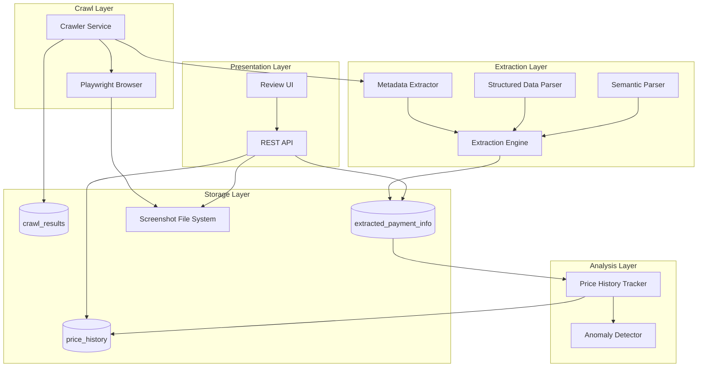

# Design Document: クロールデータ取得・抽出機能の改善

## Overview

本設計は、既存のWebクロールシステムに対して、スクリーンショット自動取得、構造化データ抽出、メタデータ取得、抽出データの永続化、レビューUI、価格履歴追跡機能を追加するものです。

### 設計目標

1. **視覚的証拠の保持**: スクリーンショットを自動取得し、抽出データの検証可能性を向上
2. **抽出精度の向上**: 正規表現ベースから構造化データ解析とセマンティックHTML解析への移行
3. **データの永続化**: 抽出された支払い情報をデータベースに保存し、時系列分析を可能に
4. **レビュー効率化**: スクリーンショットと抽出データを並べて表示するUIで検証作業を効率化
5. **異常検知**: 価格変動を自動追跡し、急激な変化をアラート通知

### 主要コンポーネント

- **Screenshot Manager**: Playwrightを使用したスクリーンショット取得・保存
- **Metadata Extractor**: HTMLメタタグ、OGタグからのメタデータ抽出
- **Structured Data Parser**: JSON-LD、Microdataの解析
- **Semantic Parser**: セマンティックHTML要素の解析
- **Extraction Engine**: 複数のパーサーを統合し、信頼度スコアを計算
- **Payment Info Store**: 抽出データの永続化層
- **Review UI**: React/TypeScriptベースのレビューインターフェース
- **Price History Tracker**: 価格変動の記録と異常検知

## Architecture

### システムアーキテクチャ図



### データフロー

1. **クロールフェーズ**:
   - Crawlerがターゲットサイトにアクセス
   - PlaywrightでHTMLとスクリーンショットを取得
   - crawl_resultsテーブルにHTML、スクリーンショットパス、メタデータを保存

2. **抽出フェーズ**:
   - Metadata ExtractorがHTMLからメタタグを抽出
   - Structured Data ParserがJSON-LD/Microdataを解析
   - Semantic ParserがセマンティックHTML要素を解析
   - Extraction Engineが各パーサーの結果を統合し、信頼度スコアを計算
   - extracted_payment_infoテーブルに抽出データを保存

3. **分析フェーズ**:
   - Price History Trackerが価格変動を記録
   - Anomaly Detectorが異常値を検出しアラートを生成

4. **レビューフェーズ**:
   - Review UIがAPIを通じてデータを取得
   - スクリーンショットと抽出データを並べて表示
   - レビュアーが修正・承認を実施

### 技術スタック

- **バックエンド**: Python 3.11+, FastAPI, SQLAlchemy
- **ブラウザ自動化**: Playwright
- **データベース**: PostgreSQL 14+ (JSONB型を使用)
- **フロントエンド**: React 18+, TypeScript, Recharts (グラフ表示)
- **画像処理**: Pillow (スクリーンショット圧縮)
- **HTML解析**: BeautifulSoup4, lxml
- **構造化データ解析**: extruct (JSON-LD, Microdata対応)

## Components and Interfaces

### 1. Screenshot Manager

#### 責務
- Playwrightを使用したフルページスクリーンショットの取得
- スクリーンショットの圧縮と保存
- ファイル名の生成とパス管理
- ストレージ容量の監視と古いファイルの削除

#### インターフェース

```python
class ScreenshotManager:
    async def capture_screenshot(
        self,
        url: str,
        site_id: int,
        timeout: int = 10
    ) -> Optional[str]:
        """
        スクリーンショットを取得し、ファイルパスを返す
        
        Args:
            url: 取得対象のURL
            site_id: サイトID
            timeout: タイムアウト秒数
            
        Returns:
            保存されたスクリーンショットのファイルパス、失敗時はNone
        """
        pass
    
    def compress_screenshot(
        self,
        image_path: str,
        max_size_mb: float = 5.0
    ) -> None:
        """
        スクリーンショットを圧縮
        
        Args:
            image_path: 画像ファイルパス
            max_size_mb: 最大ファイルサイズ(MB)
        """
        pass
    
    def cleanup_old_screenshots(
        self,
        retention_days: int = 90
    ) -> int:
        """
        古いスクリーンショットを削除
        
        Args:
            retention_days: 保持日数
            
        Returns:
            削除されたファイル数
        """
        pass
    
    def get_storage_usage(self) -> dict:
        """
        ストレージ使用状況を取得
        
        Returns:
            使用量、割り当て量、使用率を含む辞書
        """
        pass
```

#### 実装詳細

- **ディレクトリ構造**: `screenshots/{year}/{month}/{site_id}/{timestamp}_{site_id}.png`
- **圧縮アルゴリズム**: PNG最適化、品質80%
- **非同期処理**: スクリーンショット取得はHTML取得と並行実行
- **エラーハンドリング**: タイムアウト時はログ記録して継続
- **ストレージ監視**: 使用率80%超過時にアラート生成

### 2. Metadata Extractor

#### 責務
- HTMLからメタタグ情報を抽出
- Open Graphタグの解析
- ページタイトルと説明文の取得

#### インターフェース

```python
class MetadataExtractor:
    def extract_metadata(self, html: str) -> dict:
        """
        HTMLからメタデータを抽出
        
        Args:
            html: HTML文字列
            
        Returns:
            メタデータを含む辞書
            {
                "title": str,
                "description": str,
                "og_title": str,
                "og_description": str,
                "og_image": str,
                "og_url": str,
                "language": str
            }
        """
        pass
```

#### 実装詳細

- **パーサー**: BeautifulSoup4を使用
- **フォールバック**: OGタグがない場合は通常のメタタグを使用
- **言語検出**: `<html lang="...">` または `<meta http-equiv="content-language">`から取得
- **エラーハンドリング**: 各フィールドが存在しない場合はnullを設定

### 3. Structured Data Parser

#### 責務
- JSON-LD形式の構造化データを解析
- Microdata形式の構造化データを解析
- Schema.org Product/Offerスキーマの抽出

#### インターフェース

```python
class StructuredDataParser:
    def parse_jsonld(self, html: str) -> List[dict]:
        """
        JSON-LDを解析
        
        Args:
            html: HTML文字列
            
        Returns:
            JSON-LDオブジェクトのリスト
        """
        pass
    
    def parse_microdata(self, html: str) -> List[dict]:
        """
        Microdataを解析
        
        Args:
            html: HTML文字列
            
        Returns:
            Microdataオブジェクトのリスト
        """
        pass
    
    def extract_product_info(self, structured_data: List[dict]) -> dict:
        """
        構造化データから商品情報を抽出
        
        Args:
            structured_data: 構造化データのリスト
            
        Returns:
            商品情報を含む辞書
            {
                "name": str,
                "description": str,
                "sku": str,
                "price": float,
                "currency": str,
                "availability": str
            }
        """
        pass
```

#### 実装詳細

- **ライブラリ**: extractライブラリを使用
- **優先順位**: JSON-LD > Microdata > HTML解析
- **信頼度スコア**: 構造化データから抽出した場合は0.9以上
- **スキーマ対応**: Schema.org Product, Offer, AggregateOfferに対応

### 4. Semantic Parser

#### 責務
- セマンティックHTML要素の解析
- 価格情報の抽出（data-price属性、itemprop="price"など）
- 支払い方法情報の抽出
- 手数料情報の抽出

#### インターフェース

```python
class SemanticParser:
    def extract_prices(self, html: str) -> List[dict]:
        """
        価格情報を抽出
        
        Args:
            html: HTML文字列
            
        Returns:
            価格情報のリスト
            [
                {
                    "amount": float,
                    "currency": str,
                    "price_type": str,
                    "context": str
                }
            ]
        """
        pass
    
    def extract_payment_methods(self, html: str) -> List[dict]:
        """
        支払い方法を抽出
        
        Args:
            html: HTML文字列
            
        Returns:
            支払い方法のリスト
        """
        pass
    
    def extract_fees(self, html: str) -> List[dict]:
        """
        手数料情報を抽出
        
        Args:
            html: HTML文字列
            
        Returns:
            手数料情報のリスト
        """
        pass
```

#### 実装詳細

- **セレクター**: CSS/XPathセレクターで価格要素を特定
- **パターンマッチング**: 多言語対応の価格パターン（¥1,000、$10.00、€9.99など）
- **コンテキスト抽出**: 価格の周辺テキストから商品名や条件を抽出
- **信頼度スコア**: セマンティック要素から抽出した場合は0.7-0.8

### 5. Extraction Engine

#### 責務
- 複数のパーサーを統合
- 信頼度スコアの計算
- 商品と価格の関連付け
- 抽出結果の正規化

#### インターフェース

```python
class ExtractionEngine:
    def __init__(
        self,
        metadata_extractor: MetadataExtractor,
        structured_parser: StructuredDataParser,
        semantic_parser: SemanticParser
    ):
        pass
    
    async def extract_payment_info(
        self,
        html: str,
        url: str
    ) -> dict:
        """
        支払い情報を抽出
        
        Args:
            html: HTML文字列
            url: ページURL
            
        Returns:
            抽出された支払い情報
            {
                "product_info": dict,
                "price_info": List[dict],
                "payment_methods": List[dict],
                "fees": List[dict],
                "metadata": dict,
                "confidence_scores": dict,
                "overall_confidence": float
            }
        """
        pass
    
    def calculate_confidence_score(
        self,
        extraction_source: str,
        field_name: str,
        value: Any
    ) -> float:
        """
        信頼度スコアを計算
        
        Args:
            extraction_source: 抽出元（structured_data, semantic_html, regex）
            field_name: フィールド名
            value: 抽出された値
            
        Returns:
            0.0-1.0の信頼度スコア
        """
        pass
```

#### 実装詳細

- **抽出戦略**: 構造化データ → セマンティックHTML → 正規表現の順で試行
- **信頼度計算**:
  - 構造化データ: 0.85-0.95
  - セマンティックHTML: 0.65-0.80
  - 正規表現: 0.40-0.60
- **総合信頼度**: 各フィールドの信頼度の加重平均
- **重複排除**: 同じ商品・価格が複数ソースから抽出された場合は最高信頼度のものを採用

### 6. Payment Info Store

#### 責務
- 抽出データのデータベース永続化
- 価格履歴の記録
- データの検索・取得

#### インターフェース

```python
class PaymentInfoStore:
    async def save_extracted_info(
        self,
        crawl_result_id: int,
        site_id: int,
        extracted_data: dict
    ) -> int:
        """
        抽出データを保存
        
        Args:
            crawl_result_id: クロール結果ID
            site_id: サイトID
            extracted_data: 抽出データ
            
        Returns:
            保存されたレコードのID
        """
        pass
    
    async def get_extracted_info(
        self,
        crawl_result_id: int
    ) -> Optional[dict]:
        """
        抽出データを取得
        
        Args:
            crawl_result_id: クロール結果ID
            
        Returns:
            抽出データ、存在しない場合はNone
        """
        pass
    
    async def update_extracted_info(
        self,
        id: int,
        updates: dict,
        user: str
    ) -> bool:
        """
        抽出データを更新（手動修正）
        
        Args:
            id: レコードID
            updates: 更新内容
            user: 更新ユーザー
            
        Returns:
            成功時True
        """
        pass
```

### 7. Price History Tracker

#### 責務
- 価格変動の記録
- 異常値の検出
- アラートの生成

#### インターフェース

```python
class PriceHistoryTracker:
    async def record_price(
        self,
        site_id: int,
        product_identifier: str,
        price: float,
        currency: str,
        timestamp: datetime
    ) -> None:
        """
        価格を記録
        
        Args:
            site_id: サイトID
            product_identifier: 商品識別子
            price: 価格
            currency: 通貨
            timestamp: タイムスタンプ
        """
        pass
    
    async def detect_anomalies(
        self,
        site_id: int,
        product_identifier: str
    ) -> List[dict]:
        """
        異常値を検出
        
        Args:
            site_id: サイトID
            product_identifier: 商品識別子
            
        Returns:
            検出された異常のリスト
        """
        pass
    
    async def get_price_history(
        self,
        site_id: int,
        product_identifier: str,
        start_date: Optional[datetime] = None,
        end_date: Optional[datetime] = None
    ) -> List[dict]:
        """
        価格履歴を取得
        
        Args:
            site_id: サイトID
            product_identifier: 商品識別子
            start_date: 開始日時
            end_date: 終了日時
            
        Returns:
            価格履歴のリスト
        """
        pass
```

#### 実装詳細

- **異常検出ルール**:
  - 20%以上の価格変動
  - 価格がゼロになった場合
  - 新商品の出現
  - 商品の消失
- **アラート生成**: alertsテーブルに記録
- **商品識別**: site_id + product_name + SKUの組み合わせ

### 8. Review UI Components

#### 8.1 CrawlResultReviewPanel

```typescript
interface CrawlResultReviewPanelProps {
  crawlResultId: number;
}

interface ExtractedPaymentInfo {
  id: number;
  product_info: ProductInfo;
  price_info: PriceInfo[];
  payment_methods: PaymentMethod[];
  fees: FeeInfo[];
  confidence_scores: Record<string, number>;
  overall_confidence: number;
  status: 'pending' | 'approved' | 'rejected';
}

const CrawlResultReviewPanel: React.FC<CrawlResultReviewPanelProps> = ({
  crawlResultId
}) => {
  // スクリーンショットと抽出データを並べて表示
  // 信頼度スコアを色分けして表示
  // 編集・承認・却下機能を提供
};
```

#### 8.2 PriceHistoryChart

```typescript
interface PriceHistoryChartProps {
  siteId: number;
  productIdentifier: string;
  dateRange?: { start: Date; end: Date };
}

const PriceHistoryChart: React.FC<PriceHistoryChartProps> = ({
  siteId,
  productIdentifier,
  dateRange
}) => {
  // Rechartsを使用して価格推移を折れ線グラフで表示
  // 異常値をマーカーで強調表示
};
```

#### 8.3 ConfidenceScoreIndicator

```typescript
interface ConfidenceScoreIndicatorProps {
  score: number;
  fieldName: string;
}

const ConfidenceScoreIndicator: React.FC<ConfidenceScoreIndicatorProps> = ({
  score,
  fieldName
}) => {
  // 信頼度スコアを色付きバッジで表示
  // 高: 緑 (≥0.8)
  // 中: 黄 (0.5-0.8)
  // 低: 赤 (<0.5)
};
```

### 9. REST API Endpoints

#### GET /api/extracted-data/{crawl_result_id}

```python
@router.get("/extracted-data/{crawl_result_id}")
async def get_extracted_data(
    crawl_result_id: int,
    db: Session = Depends(get_db)
) -> ExtractedPaymentInfoResponse:
    """
    クロール結果IDから抽出データを取得
    """
    pass
```

#### GET /api/extracted-data/site/{site_id}

```python
@router.get("/extracted-data/site/{site_id}")
async def get_site_extracted_data(
    site_id: int,
    page: int = 1,
    page_size: int = 50,
    db: Session = Depends(get_db)
) -> PaginatedExtractedDataResponse:
    """
    サイトIDから全抽出データを取得（ページネーション付き）
    """
    pass
```

#### PUT /api/extracted-data/{id}

```python
@router.put("/extracted-data/{id}")
async def update_extracted_data(
    id: int,
    updates: ExtractedDataUpdate,
    user: str = Depends(get_current_user),
    db: Session = Depends(get_db)
) -> ExtractedPaymentInfoResponse:
    """
    抽出データを更新（手動修正）
    """
    pass
```

#### GET /api/price-history/{site_id}/{product_id}

```python
@router.get("/price-history/{site_id}/{product_id}")
async def get_price_history(
    site_id: int,
    product_id: str,
    start_date: Optional[datetime] = None,
    end_date: Optional[datetime] = None,
    db: Session = Depends(get_db)
) -> PriceHistoryResponse:
    """
    価格履歴を取得
    """
    pass
```

#### POST /api/extracted-data/{id}/approve

```python
@router.post("/extracted-data/{id}/approve")
async def approve_extracted_data(
    id: int,
    user: str = Depends(get_current_user),
    db: Session = Depends(get_db)
) -> StatusResponse:
    """
    抽出データを承認
    """
    pass
```

#### POST /api/extracted-data/{id}/reject

```python
@router.post("/extracted-data/{id}/reject")
async def reject_extracted_data(
    id: int,
    reason: str,
    user: str = Depends(get_current_user),
    db: Session = Depends(get_db)
) -> StatusResponse:
    """
    抽出データを却下
    """
    pass
```

## Data Models

### extracted_payment_info テーブル

```sql
CREATE TABLE extracted_payment_info (
    id SERIAL PRIMARY KEY,
    crawl_result_id INTEGER NOT NULL REFERENCES crawl_results(id) ON DELETE CASCADE,
    site_id INTEGER NOT NULL REFERENCES monitoring_sites(id) ON DELETE CASCADE,
    
    -- 抽出データ（JSONB形式）
    product_info JSONB NOT NULL,
    price_info JSONB NOT NULL,
    payment_methods JSONB,
    fees JSONB,
    metadata JSONB,
    
    -- 信頼度スコア
    confidence_scores JSONB NOT NULL,
    overall_confidence FLOAT NOT NULL,
    
    -- ステータス管理
    status VARCHAR(20) NOT NULL DEFAULT 'pending',
    language VARCHAR(10),
    
    -- タイムスタンプ
    extracted_at TIMESTAMP NOT NULL DEFAULT NOW(),
    updated_at TIMESTAMP NOT NULL DEFAULT NOW(),
    
    -- 監査情報
    approved_by VARCHAR(255),
    approved_at TIMESTAMP,
    rejection_reason TEXT,
    
    -- インデックス
    CONSTRAINT fk_crawl_result FOREIGN KEY (crawl_result_id) REFERENCES crawl_results(id),
    CONSTRAINT fk_site FOREIGN KEY (site_id) REFERENCES monitoring_sites(id)
);

CREATE INDEX idx_extracted_payment_info_crawl_result ON extracted_payment_info(crawl_result_id);
CREATE INDEX idx_extracted_payment_info_site ON extracted_payment_info(site_id);
CREATE INDEX idx_extracted_payment_info_extracted_at ON extracted_payment_info(extracted_at);
CREATE INDEX idx_extracted_payment_info_status ON extracted_payment_info(status);
CREATE INDEX idx_extracted_payment_info_site_extracted ON extracted_payment_info(site_id, extracted_at);
```

#### product_info JSONB構造

```json
{
  "name": "商品名",
  "description": "商品説明",
  "sku": "SKU123",
  "category": "カテゴリ",
  "brand": "ブランド名"
}
```

#### price_info JSONB構造

```json
[
  {
    "amount": 1000.0,
    "currency": "JPY",
    "price_type": "base_price",
    "condition": "通常価格",
    "tax_included": true
  },
  {
    "amount": 800.0,
    "currency": "JPY",
    "price_type": "discount_price",
    "condition": "会員価格",
    "tax_included": true
  }
]
```

#### payment_methods JSONB構造

```json
[
  {
    "method_name": "クレジットカード",
    "provider": "Stripe",
    "processing_fee": 3.6,
    "fee_type": "percentage"
  },
  {
    "method_name": "銀行振込",
    "provider": null,
    "processing_fee": 0,
    "fee_type": "fixed"
  }
]
```

#### fees JSONB構造

```json
[
  {
    "fee_type": "送料",
    "amount": 500,
    "currency": "JPY",
    "description": "全国一律",
    "condition": "5000円未満"
  }
]
```

#### confidence_scores JSONB構造

```json
{
  "product_name": 0.95,
  "product_description": 0.85,
  "base_price": 0.92,
  "currency": 0.98,
  "payment_methods": 0.75,
  "fees": 0.68
}
```

### price_history テーブル

```sql
CREATE TABLE price_history (
    id SERIAL PRIMARY KEY,
    site_id INTEGER NOT NULL REFERENCES monitoring_sites(id) ON DELETE CASCADE,
    product_identifier VARCHAR(500) NOT NULL,
    
    -- 価格情報
    price FLOAT NOT NULL,
    currency VARCHAR(10) NOT NULL,
    price_type VARCHAR(50) NOT NULL,
    
    -- 変動情報
    previous_price FLOAT,
    price_change_amount FLOAT,
    price_change_percentage FLOAT,
    
    -- タイムスタンプ
    recorded_at TIMESTAMP NOT NULL DEFAULT NOW(),
    
    -- 関連情報
    extracted_payment_info_id INTEGER REFERENCES extracted_payment_info(id),
    
    CONSTRAINT fk_site FOREIGN KEY (site_id) REFERENCES monitoring_sites(id),
    CONSTRAINT fk_extracted_info FOREIGN KEY (extracted_payment_info_id) 
        REFERENCES extracted_payment_info(id)
);

CREATE INDEX idx_price_history_site_product ON price_history(site_id, product_identifier);
CREATE INDEX idx_price_history_recorded_at ON price_history(recorded_at);
CREATE INDEX idx_price_history_site_recorded ON price_history(site_id, recorded_at);
```

### crawl_results テーブル拡張

既存のcrawl_resultsテーブルに以下のカラムを追加:

```sql
ALTER TABLE crawl_results
ADD COLUMN screenshot_path TEXT,
ADD COLUMN page_metadata JSONB;
```

## Correctness Properties

